# Guivos Intelligence

## 1. Autoridade e finalidade

Este documento é a **autoridade superior de produto do Guivos Intelligence**.

A versão 2.0.0 consolida a estruturação conceitual aprovada nos Checkpoints 1–12 e substitui a edição 1.6.0 como leitura vigente de identidade, valor, capacidades, inputs, outputs, fronteiras, contratos interproduto, modos de entrega, direção comercial, governança, maturidade e guardrails do Produto Especializado.

Esta autoridade descreve **o que o Guivos Intelligence é e deve preservar como produto**. Ela não declara implementação técnica, operação em produção, disponibilidade comercial pública, Home Pública, UI, wireframe, Source Lock, pricing final, modelo de IA selecionado ou infraestrutura implantada.

## 2. Definição superior

> **Guivos Intelligence é o Produto Especializado transversal da Guivos e a Intelligence Layer do ecossistema, responsável por transformar dados autorizados, conhecimento, evidências, contextos e relações em compreensão útil, insights, análises, possibilidades e recomendações explicáveis, ampliando a capacidade de Pessoas, Organizações e produtos tomarem melhores decisões dentro de suas próprias autoridades.**

Sua unidade superior de valor é:

> **compreensão útil e contextualizada.**

Guivos Intelligence não é definido por volume de dados, quantidade de dashboards ou adoção de tecnologia específica.

```text
GUIVOS INTELLIGENCE
≠ IA
≠ LLM
≠ GUIVOS.AI
≠ DASHBOARD
≠ POWER BI
≠ GRAFO GLOBAL
≠ NEO4J
≠ GRAPHRAG
≠ API
≠ RELATÓRIO
```

Esses elementos podem realizar, consumir ou apresentar capacidades do produto; não definem sua identidade.

## 3. Tese e contrato de autoridade

Tese do produto:

> **Guivos Intelligence não existe para acumular dados ou decidir pelas pessoas. Existe para transformar conhecimento, contexto, evidências e relações em compreensão útil, tornando melhores decisões e novas possibilidades mais acessíveis.**

Contrato superior:

```text
COMPREENDER
≠
DECIDIR
```

A Intelligence pode, quando finalidade e autoridade permitirem:

- compreender;
- relacionar;
- interpretar;
- identificar sinais;
- agregar;
- comparar;
- estimar;
- recomendar;
- explicar;
- aprender de forma governada.

Nenhuma dessas capacidades transfere automaticamente ao Intelligence a autoridade de decidir pela Pessoa, pelo Journey, pelo Business, pela Empresa ou por outro Produto Especializado.

## 4. Posição no Ecossistema Guivos

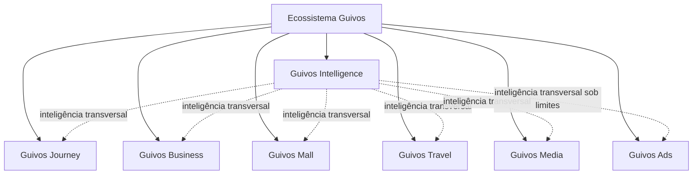

Princípio:

> **Intelligence conecta autoridades. Não as absorve.**

Transversalidade significa que o Intelligence pode compreender e relacionar contextos que atravessam produtos. Não significa governo transversal absoluto.

## 5. Duas frentes superiores de geração de valor

Guivos Intelligence possui **um único núcleo de inteligência** e duas frentes superiores.

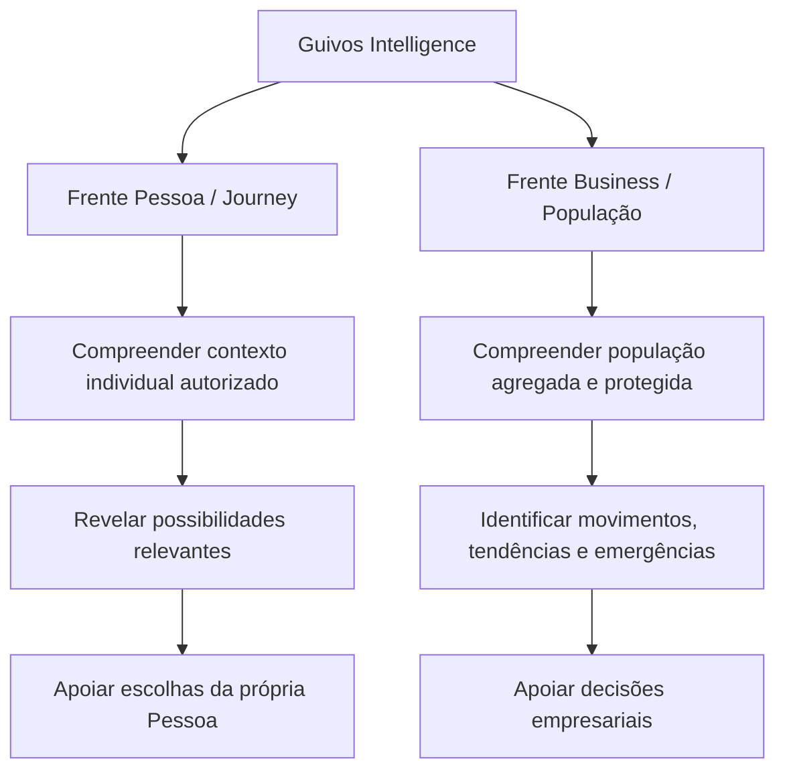

### 5.1 Frente Pessoa / Journey

Pergunta funcional superior:

> **O que pode ser relevante para esta Pessoa, neste momento, considerando sua própria Journey?**

A Intelligence pode apoiar a Journey por meio de compreensão contextual, descoberta de possibilidades, avaliação de relevância, relações multidomínio, recomendações explicáveis, reflexão e aprendizado governado.

O beneficiário principal do uso de contexto individual é a própria Pessoa.

### 5.2 Frente Business / População

Pergunta funcional superior:

> **O que está emergindo nesta população e o que a Empresa pode compreender a partir disso?**

A Intelligence pode transformar sinais legitimamente utilizáveis em leitura agregada, protegida e contextualizada de populações vinculadas à relação Business.

A Empresa recebe compreensão populacional; não recebe a intimidade individual da Journey.

## 6. Assimetria fundamental entre compreender e expor

A arquitetura reconhece uma assimetria intencional:

```text
PROFUNDIDADE DE COMPREENSÃO
≠
PROFUNDIDADE DE EXPOSIÇÃO

AUTORIDADE PARA PERSONALIZAR
≠
AUTORIDADE PARA COMPARTILHAR
```

O Intelligence pode saber mais para servir a própria Pessoa do que pode revelar a uma Empresa.

> **Compreender profundamente não significa expor profundamente.**

Mais capacidade comercial, plano superior, relação contratual, custeio de Journey ou capacidade técnica não criam autorização adicional sobre a vida individual.

```text
ENTERPRISE
≠ ACESSO MAIS PROFUNDO À JOURNEY INDIVIDUAL
```

## 7. Arquitetura funcional do produto

Guivos Intelligence é organizado pelas responsabilidades necessárias para transformar contexto, conhecimento, relações e evidências em compreensão útil.

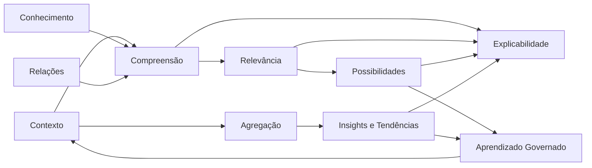

As dez responsabilidades funcionais consolidadas são:

1. **Contexto** — organizar sinais autorizados em contexto interpretável, vivo e temporal;
2. **Conhecimento** — relacionar contexto a fontes, evidências e conhecimento governado;
3. **Relações** — compreender conexões legítimas entre participantes, objetivos, possibilidades, experiências, conteúdos, conhecimento e produtos;
4. **Compreensão** — transformar dados, contexto, relações, conhecimento e temporalidade em leitura útil;
5. **Relevância** — avaliar pertinência contextual sem transformar relevância em obrigação ou prioridade comercial;
6. **Descoberta de Possibilidades** — identificar caminhos, recursos e experiências potencialmente relevantes;
7. **Agregação** — transformar sinais legitimamente utilizáveis em leituras populacionais protegidas;
8. **Insights e Tendências** — identificar padrões, mudanças, sinais, movimentos emergentes e interpretações úteis;
9. **Explicabilidade** — explicar bases, motivos, limitações, incerteza e o que uma leitura não significa;
10. **Aprendizado Governado** — atualizar compreensão ao longo do tempo dentro de finalidade, autoridade, retenção, correção e revogação aplicáveis.

Essas responsabilidades são de produto.

```text
RESPONSABILIDADE FUNCIONAL
≠
MICROSSERVIÇO
```

A decomposição técnica permanece autoridade da Intelligence Architecture e da Engenharia.

## 8. Contexto Vivo e temporalidade

O Intelligence deve trabalhar com contexto vivo, temporal e revisável, não com perfil humano rígido.

```text
PERFIL FIXO
✕

CONTEXTO VIVO
✓
```

Uma informação contextual pode estar:

- atual;
- possivelmente desatualizada;
- substituída;
- retirada;
- expirada;
- contestada;
- incerta.

Objetivos, interesses, preferências, disponibilidade, localização, restrições e significados podem mudar ao longo do tempo.

A Pessoa deve poder, quando aplicável, corrigir, rejeitar, atualizar ou retirar interpretações sobre intenção, preferência, objetivo e significado pessoal.

## 9. Taxonomia de inputs

Toda informação materialmente utilizada deve preservar sua natureza.

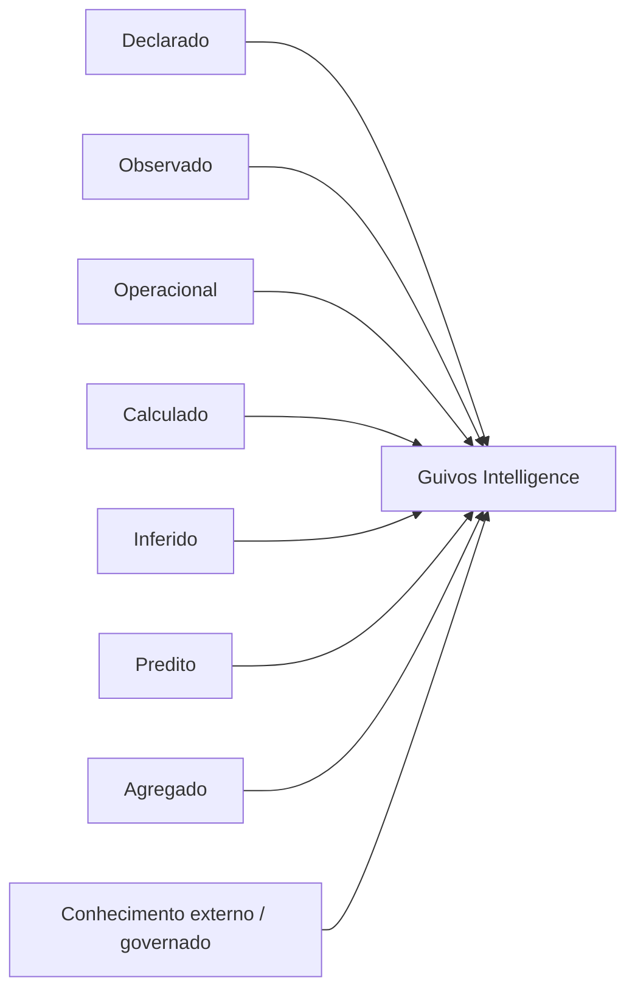

### 9.1 Declarado

Informação explicitamente fornecida por uma autoridade legítima.

Em questões de intenção, preferência, objetivo e significado pessoal, a declaração legítima da Pessoa possui autoridade superior a uma inferência incompatível quando essa autoridade pertence à própria Pessoa.

### 9.2 Observado

Evento efetivamente registrado em contexto autorizado.

```text
EVENTO OBSERVADO
≠
INTERPRETAÇÃO DA INTENÇÃO
```

### 9.3 Operacional

Informação necessária à viabilidade e funcionamento, como disponibilidade, elegibilidade, idioma, país, moeda, plano, programa, permissões, território e status.

### 9.4 Calculado

Transformação reproduzível conhecida, como percentual, média, recorrência, distribuição, taxa, variação ou crescimento.

### 9.5 Inferido

Interpretação de algo não diretamente declarado ou observado.

```text
INFERIDO
≠ DECLARADO
≠ FATO
≠ DIAGNÓSTICO
```

### 9.6 Predito

Estimativa sobre estado futuro.

```text
PREVISÃO
≠ FUTURO DETERMINADO
```

### 9.7 Agregado

Leitura produzida pela combinação protegida de múltiplos sinais ou eventos, podendo alimentar análises posteriores quando a finalidade permitir.

### 9.8 Conhecimento externo ou governado

Conhecimento proveniente de pesquisas, universidades, instituições, especialistas, literatura, normas, bases públicas, conteúdo governado ou Canon da Guivos.

```text
FONTE PUBLICADA
≠ VERDADE AUTOMÁTICA
```

Tipo, autoridade, data, evidência, contexto, conflitos e aplicabilidade devem permanecer preserváveis.

## 10. Proveniência, finalidade e autoridade de uso

O fato de a Guivos conhecer uma informação não significa que o Intelligence possa utilizá-la para qualquer finalidade ou compartilhá-la com qualquer consumidor.

```text
CONHECER
≠
UTILIZAR
≠
COMPARTILHAR
```

Informações relevantes devem preservar, conforme aplicável:

- origem;
- natureza;
- autoridade;
- contexto;
- temporalidade;
- finalidade;
- confiabilidade;
- proveniência;
- versão;
- possibilidade de correção ou contestação;
- restrições de uso;
- restrições de compartilhamento.

Fluxo obrigatório:

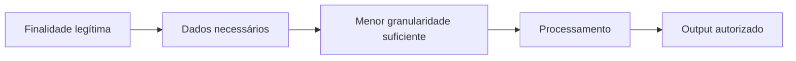

Não se parte de “quais dados temos?”, mas de “qual finalidade legítima precisamos cumprir?”.

## 11. Proveniência e cadeia de derivação

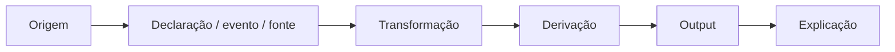

O Intelligence deve evoluir para conseguir reconstruir, quando materialmente necessário, a cadeia entre fonte, transformação, modelo/regra, versão, output e entrega.

## 12. Taxonomia de outputs

Os outputs são organizados em seis famílias.

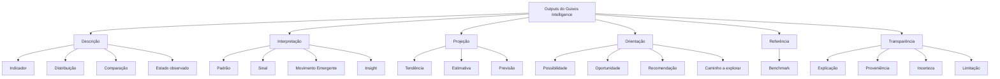

### 12.1 Descrição

- **Indicador** — medida calculada sobre fenômeno observável;
- **Distribuição** — forma como determinado fenômeno se reparte;
- **Comparação** — diferença entre períodos, populações ou recortes comparáveis e autorizados;
- **Estado observado** — declaração ou evento apresentado preservando sua natureza.

### 12.2 Interpretação

- **Padrão** — regularidade observada;
- **Sinal** — ocorrência ou mudança que merece atenção, ainda com evidência limitada;
- **Movimento Emergente** — mudança relevante que começa a ganhar consistência dentro de uma população ao longo do tempo;
- **Insight** — interpretação contextual relevante produzida a partir de indicadores, relações, padrões, conhecimento ou mudanças observadas.

### 12.3 Projeção

- **Tendência** — direção consistente observada ao longo do tempo;
- **Estimativa** — valor aproximado ou esperado;
- **Previsão** — estimativa de estado futuro com horizonte, base e incerteza adequados.

### 12.4 Orientação

- **Possibilidade** — caminho, recurso, experiência ou conexão que pode ser considerado;
- **Oportunidade** — possibilidade concreta disponível em determinado contexto;
- **Recomendação** — sugestão contextual, não decisão;
- **Caminho a explorar** — direção possível para investigação ou reflexão.

### 12.5 Referência

- **Benchmark** — comparação autorizada com histórico, grupos comparáveis, ecossistema ou referência externa, com metodologia e limites adequados.

### 12.6 Transparência

- explicação;
- proveniência;
- incerteza;
- limitação;
- o que determinada leitura não significa.

Princípio superior:

> **Todo output deve preservar a diferença entre o que foi observado, calculado, interpretado, estimado e sugerido.**

## 13. Escada epistemológica

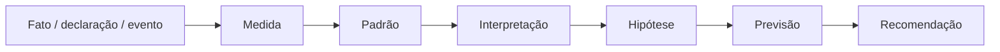

Quanto maior a distância do fato original:

```text
↑ necessidade de explicação
↑ representação de incerteza
↑ cuidado de autoridade
↑ necessidade de governança
```

## 14. Movimento Emergente

Movimento Emergente é uma leitura especialmente relevante para a frente Business.

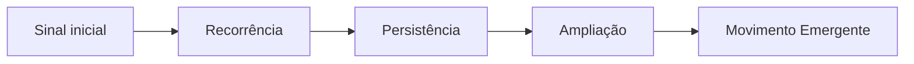

```text
MOVIMENTO EMERGENTE
≠ DIAGNÓSTICO
≠ PROBLEMA
≠ CAUSA
```

A função é permitir perceber **o que está começando a acontecer** sem apresentar sinal inicial como tendência consolidada ou condição humana.

## 15. Causalidade

Contratos permanentes:

```text
CORRELAÇÃO ≠ CAUSALIDADE
ASSOCIAÇÃO ≠ CAUSALIDADE
SEQUÊNCIA TEMPORAL ≠ CAUSALIDADE
PADRÃO ≠ CAUSALIDADE
```

Guivos Intelligence não deve atribuir causalidade empresarial ou humana sem evidência e desenho adequados.

## 16. Frente Pessoa — personalização e autonomia

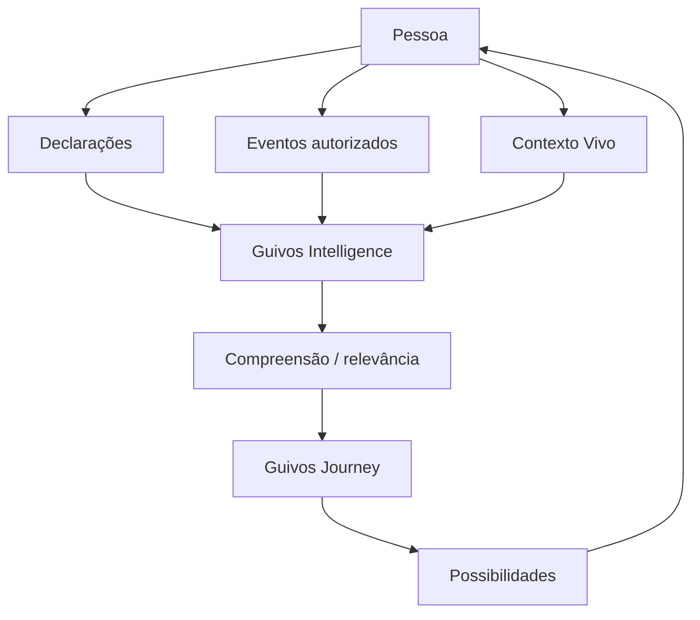

A Pessoa pode, conforme a situação:

- explorar;
- aceitar;
- ignorar;
- rejeitar;
- corrigir;
- contestar;
- mudar de direção;
- retirar contexto quando aplicável.

A Intelligence não deve exigir que a Pessoa “administre o algoritmo”. O controle precisa ser compreensível, proporcional e não burocrático.

Princípio:

> **Intelligence ajuda a Journey a revelar caminhos. Não determina qual caminho a Pessoa deve seguir.**

## 17. Frente Business — população agregada e protegida

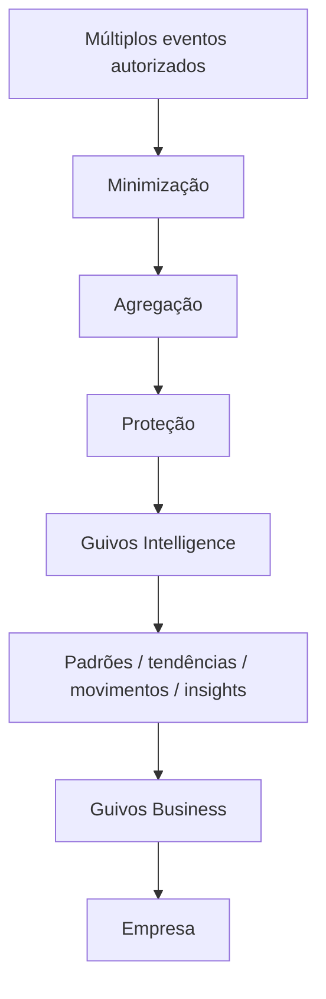

A unidade principal de análise Business é a população autorizada, não o indivíduo identificável.

Famílias candidatas de leitura incluem:

- participação;
- adesão;
- recorrência;
- utilização;
- alcance;
- distribuições;
- interesses agregados;
- movimentos temporais;
- sinais;
- Movimentos Emergentes;
- tendências;
- comparações;
- aderência entre interesse e oferta;
- lacunas aparentes;
- benchmarks autorizados;
- previsões adequadamente limitadas;
- insights explicáveis.

A Empresa não recebe:

- Journey individual;
- objetivos pessoais identificáveis;
- Próximo Passo individual;
- intenções privadas;
- explicações individuais de pertinência;
- score de evolução;
- perfil psicológico;
- diagnóstico;
- ranking humano;
- inferência individual de vulnerabilidade.

```text
COMPREENDER A POPULAÇÃO
≠
VIGIAR INDIVÍDUOS
```

## 18. Granularidade e proteção populacional

Três níveis conceituais:

```text
NÍVEL 1 — INDIVIDUAL
→ serve prioritariamente à própria Pessoa

NÍVEL 2 — GRUPO / SEGMENTO PROTEGIDO
→ pode servir à análise quando houver proteção suficiente

NÍVEL 3 — POPULAÇÃO AGREGADA
→ serve ao Business dentro da finalidade autorizada
```

Contratos:

```text
SEM NOME
≠
ANÔNIMO

AGREGADO
≠
AUTOMATICAMENTE SEGURO
```

A proteção deve considerar reidentificação contextual, sensibilidade e capacidade de cruzamento.

Mecanismos conceituais possíveis incluem:

- supressão;
- agregação;
- generalização;
- limitação de cruzamentos.

Thresholds e políticas operacionais permanecem abertos para autoridade própria.

## 19. Sensibilidade

Sensibilidade depende de conteúdo, contexto, finalidade e risco de inferência.

Temas de saúde, condição emocional, finanças, emprego, família, espiritualidade/religião, sexualidade, violência, vulnerabilidade e outros contextos sensíveis exigem proteção reforçada.

```text
APOIAR A PESSOA
≠
EXPOR O TEMA À EMPRESA
```

O fato de algo ser tecnicamente agregável não significa que seja legitimamente útil para Business.

## 20. Contratos com os Produtos Especializados

Guivos Intelligence pode conectar produtos sem fundi-los.

| Produto | Intelligence apoia | Autoridade final permanece com |
|---|---|---|
| **Journey** | contexto, compreensão, relevância, possibilidades, explicação | Journey + Pessoa |
| **Business** | análise populacional, tendências, movimentos, insights | Business + Empresa |
| **Mall** | descoberta e pertinência comercial legítima | Mall + Pessoa |
| **Travel** | descoberta e contextualização de experiências | Travel + Pessoa |
| **Media** | descoberta, relações temáticas e relevância editorial contextual | Media |
| **Ads** | mensuração e contexto publicitário permitido | Ads + superfície anfitriã |

### 20.1 Journey

```text
INTELLIGENCE
→ compreende / relaciona / sugere / explica

JOURNEY
→ governa experiência, pertinência e apresentação

PESSOA
→ escolhe o próprio caminho
```

### 20.2 Business

```text
INTELLIGENCE
→ produz compreensão populacional

BUSINESS
→ governa a entrega B2B

EMPRESA
→ toma a decisão empresarial
```

### 20.3 Mall

Intelligence pode apoiar descoberta e pertinência, mas Mall governa catálogo, fornecedor, disponibilidade, preço e transação.

```text
MAIOR COMISSÃO
≠ MAIOR RELEVÂNCIA
```

### 20.4 Travel

Intelligence pode contextualizar possibilidades de viagem; Travel governa disponibilidade, fornecedores, reservas, condições e operação.

### 20.5 Media

Intelligence pode apoiar descoberta, relação entre temas e relevância contextual. Media preserva autoridade editorial.

```text
POPULARIDADE
≠ QUALIDADE EDITORIAL
```

### 20.6 Ads

Ads governa publicidade e exposição comercial paga. Intelligence pode apoiar apenas mensuração e contexto permitido.

```text
CONTEXTO PESSOAL PROTEGIDO DA JOURNEY
≠
MATÉRIA-PRIMA PUBLICITÁRIA AUTOMÁTICA
```

```text
PATROCÍNIO ≠ RECOMENDAÇÃO
PAGAMENTO ≠ PERTINÊNCIA
```

## 21. Handoff inteligente e minimização interproduto

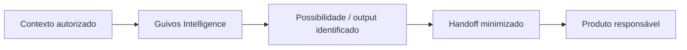

Regra:

> **Transferir um resultado não implica transferir todo o contexto que produziu esse resultado.**

```text
OUTPUT AUTORIZADO
≠
DATASET DE ORIGEM
```

Quando Intelligence media uma relação entre produtos, deve transferir a menor quantidade de contexto suficiente para realizar legitimamente o handoff.

## 22. Neutralidade comercial transversal

A remuneração econômica de um produto, parceiro ou patrocinador não altera silenciosamente a autoridade do Intelligence sobre relevância.

```text
COMISSÃO
PATROCÍNIO
MARGEM
ESTOQUE
CONTRATO COMERCIAL
≠
RELEVÂNCIA PESSOAL
```

Relações comerciais legítimas devem permanecer identificáveis quando materialmente relevantes.

## 23. Produto, arquiteturas, mecanismos e tecnologias

A arquitetura deve ser lida de cima para baixo.

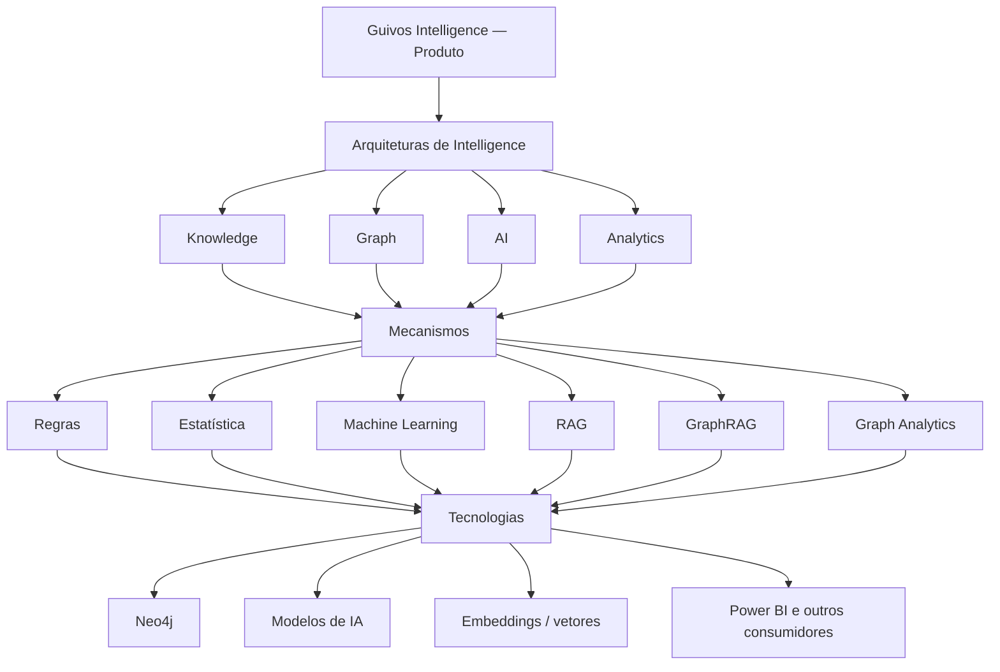

```text
PRODUTO
↓
CAPACIDADES
↓
ARQUITETURAS
↓
MECANISMOS
↓
TECNOLOGIAS
```

A tecnologia realiza capacidades. Não define a identidade nem amplia a autoridade do produto.

## 24. Grafo Global, Neo4j e Graph Analytics

Separação obrigatória:

```text
GRAFO GLOBAL DA GUIVOS
= modelo/capacidade de relações governadas

GUIVOS INTELLIGENCE
= produto que pode interpretar essas relações

NEO4J
= tecnologia primária de referência para a camada de grafo
```

```text
Grafo Global
≠ Guivos Intelligence
≠ Neo4j
```

Neo4j permanece `reference_selected` e não comprova POC, Aura/cluster provisionado, modelo físico, dados reais, GDS ou produção.

Métricas estruturais de grafo não representam automaticamente valor humano.

```text
CENTRALIDADE ≠ IMPORTÂNCIA HUMANA
SIMILARIDADE ≠ IDENTIDADE
COMUNIDADE DE GRAFO ≠ GRUPO HUMANO REAL
```

## 25. Knowledge Architecture

O Intelligence pode utilizar conhecimento governado, mas deve preservar tipo de fonte, autoridade, temporalidade, evidência, conflitos e aplicabilidade.

```text
ENTREVISTA
≠ ARTIGO CIENTÍFICO

ARTIGO CIENTÍFICO
≠ CONSENSO

CONSENSO
≠ RECOMENDAÇÃO INDIVIDUAL AUTOMÁTICA
```

Knowledge e Graph são complementares: relação não substitui evidência; evidência não elimina contexto relacional.

## 26. Inteligência Artificial

Guivos Intelligence não é sinônimo de IA.

IA pode apoiar:

- linguagem natural;
- classificação;
- extração;
- síntese;
- recomendação;
- raciocínio;
- interação.

Mas:

```text
CAPACIDADE DO MODELO
≠
AUTORIDADE PARA UTILIZAR
```

Uma inferência gerada por IA permanece inferência.

```text
FLUÊNCIA TEXTUAL
≠
CERTEZA EPISTEMOLÓGICA
```

Dado autorizado para personalização ou analytics não está automaticamente autorizado para treinamento de modelo.

```text
DADO AUTORIZADO PARA USO OPERACIONAL
≠
AUTORIZADO PARA TREINAMENTO
```

Modelos de terceiros não transferem responsabilidade para o fornecedor do modelo.

## 27. RAG e GraphRAG

RAG e GraphRAG permanecem mecanismos candidatos de recuperação de conhecimento/contexto.

```text
CONTEXTO
→ ENTIDADES / RELAÇÕES
→ GRAFO
→ CONHECIMENTO RELACIONADO
→ RECUPERAÇÃO
→ MODELO
→ SÍNTESE / EXPLICAÇÃO
```

Uma relação plausível gerada por modelo não deve ser materializada automaticamente como relação factual.

```text
RELAÇÃO INFERIDA
≠
RELAÇÃO CONFIRMADA
```

GraphRAG não substitui Knowledge Architecture, Canon, proveniência, autoridade ou governança.

## 28. Analytics

Analytics pode apoiar diferentes níveis de leitura:

```text
DESCRITIVO
→ o que aconteceu?

INVESTIGATIVO
→ com o que está associado?

PREDITIVO
→ o que pode acontecer?

ORIENTATIVO / PRESCRITIVO DE APOIO
→ o que pode ser considerado?
```

O nível prescritivo não transfere a decisão ao sistema.

## 29. Power BI

Power BI é consumidor/superfície possível de analytics, não fonte de verdade do Intelligence.

Pode futuramente existir:

```text
GUIVOS INTELLIGENCE
→ dataset/API autorizada
→ POWER BI GUIVOS
```

ou:

```text
GUIVOS INTELLIGENCE
→ exportação autorizada
→ ambiente analítico da Empresa
```

Exportar output não implica exportar o contexto individual que o originou.

## 30. Guivos.ai

Guivos.ai pode futuramente constituir superfície conversacional ou agente que consome Guivos Intelligence.

```text
GUIVOS.AI
= possível interface / agente

GUIVOS INTELLIGENCE
= Produto Especializado e Intelligence Layer
```

Uma interface conversacional herda as mesmas políticas de autoridade de dashboard, API, relatório ou qualquer outra superfície.

## 31. Arquitetura híbrida

A realização futura do Intelligence pode combinar:

```text
REGRAS
+
DADOS ESTRUTURADOS
+
ANALYTICS
+
GRAFO
+
KNOWLEDGE
+
IA
+
REVISÃO HUMANA QUANDO NECESSÁRIA
```

Uso de IA não é objetivo em si. Regras, estatística ou cálculo simples devem ser preferíveis quando forem suficientes, mais precisos, auditáveis ou eficientes.

## 32. Modos de entrega

Guivos Intelligence pode possuir seis modos principais de entrega.

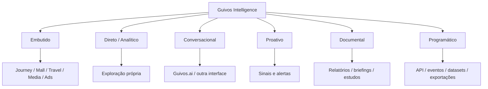

### 32.1 Intelligence Embutido

Quando o valor principal da interação pertence a outro produto, Intelligence tende a permanecer embutido.

### 32.2 Intelligence Direto

Quando compreender, analisar, investigar, comparar ou perguntar é a própria finalidade, Intelligence pode assumir presença própria.

```text
“Quero continuar minha Journey” → Journey
“Quero reservar uma viagem” → Travel
“Quero comprar” → Mall
“Quero entender o que está mudando” → Intelligence
```

> **Guivos Intelligence pode ser a origem da compreensão sem precisar ser o destino da experiência.**

## 33. Intelligence Serving

Responsabilidade funcional consolidada:

> **Intelligence Serving é a responsabilidade de entregar o output correto ao consumidor autorizado, na granularidade, momento, canal e forma adequados, preservando significado, explicabilidade, finalidade e autoridade.**

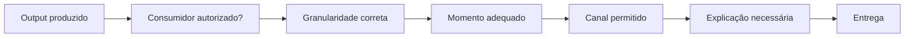

```text
OUTPUT PRODUZIDO
≠
OUTPUT QUE PRECISA SER ENTREGUE
```

Ausência de evidência suficiente pode produzir ausência legítima de insight.

```text
SEM EVIDÊNCIA SUFICIENTE
→ AUSÊNCIA LEGÍTIMA DE CONCLUSÃO

NÃO
→ FABRICAR INTELLIGENCE
```

## 34. Experiência da Pessoa

Princípio:

> **Intelligence deve tornar a Journey mais relevante sem transformar a Journey em um painel analítico sobre a própria vida.**

A experiência deve preservar explicação, correção, contestação, silêncio legítimo e capacidade de mudança.

## 35. Experiência Business

Princípio:

> **Intelligence deve tornar a população compreensível sem transformar Pessoas em perfis empresariais individuais.**

Uma experiência Business pode combinar:

- visão geral do que merece atenção;
- indicadores;
- comparações;
- tendências;
- Movimentos Emergentes;
- insights;
- aderência entre interesse e oferta;
- benchmarks autorizados;
- explicações;
- possibilidades empresariais a considerar.

O objetivo não é entregar dezenas de gráficos sem contexto, mas ajudar a Empresa a compreender **o que mudou, o que está emergindo, por que isso pode importar e o que pode ser investigado**.

## 36. Direção comercial — Pessoa

Guivos Intelligence é Produto Especializado próprio, mas produto próprio não implica cobrança autônoma obrigatória.

```text
PRODUTO PRÓPRIO
≠
ASSINATURA PRÓPRIA OBRIGATÓRIA

SUPERFÍCIE PRÓPRIA
≠
CHECKOUT PRÓPRIO OBRIGATÓRIO
```

A direção vigente é que Intelligence voltado à própria Pessoa seja predominantemente incorporado à experiência e aos planos pessoais vigentes:

```text
FREE
PLUS
PRO
```

A profundidade de capacidade pode variar entre planos, mas recursos necessários a transparência, contestação, segurança, correção e preservação de autoridade não devem ser artificialmente degradados apenas para monetização.

## 37. Direção comercial — Business

Guivos Intelligence não é módulo do Business, mas os planos Business podem conceder entitlements de capacidades do Intelligence.

Planos vigentes:

```text
START
→ operar

GROWTH
→ acompanhar e compreender

SCALE
→ interpretar e integrar

ENTERPRISE
→ governar em alta complexidade e escala
```

A progressão comercial pode ampliar:

- profundidade analítica;
- histórico;
- comparações;
- tendências;
- Movimentos Emergentes;
- benchmarks;
- alertas;
- exportações;
- API;
- integração;
- governança;
- escala;
- serviço.

Não pode ampliar:

- acesso à Journey privada;
- exposição de vulnerabilidade individual;
- score humano;
- perfil psicológico individual;
- vigilância.

## 38. Entitlement e autoridade

```text
ENTITLEMENT
= direito contratual de utilizar determinada capacidade

AUTORIDADE
= legitimidade para utilizar determinado dado ou receber determinado output
```

```text
ENTITLEMENT
≠
AUTORIDADE
```

Um plano superior não vence políticas de finalidade, granularidade, proteção ou privacidade.

## 39. Business e suas ofertas

As duas ofertas principais do Guivos Business permanecem:

```text
GUIVOS BUSINESS
├── PROGRAMAS DE INCENTIVO
└── GUIVOS JOURNEY CUSTEADO PELA EMPRESA
```

Intelligence pode apoiar ambas.

A Empresa que financia a Journey não adquire propriedade, controle ou acesso ao contexto individual protegido.

```text
EMPRESA PAGA JOURNEY
≠ EMPRESA POSSUI JOURNEY

EMPRESA CONTRATA INTELLIGENCE
≠ EMPRESA POSSUI DADOS PESSOAIS
```

## 40. Oferta B2B autônoma do Intelligence

Uma oferta B2B autônoma do Guivos Intelligence permanece **possibilidade futura**, não oferta estabelecida.

```text
OFERTA B2B AUTÔNOMA DO INTELLIGENCE
→ CANDIDATO FUTURO
→ NÃO ESTABELECIDA
```

Até existir proposta de valor claramente distinta, Business permanece a principal porta comercial B2B para Intelligence ligado à população da Empresa.

## 41. O ativo econômico do Intelligence

Guivos Intelligence deve comercializar capacidade de compreensão, não intimidade dos participantes.

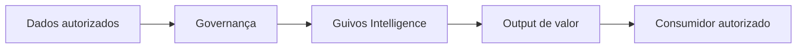

Não:

```text
DADOS DAS PESSOAS
→ CLIENTE
```

A vantagem econômica pode vir da combinação de conhecimento, relações, modelos, contexto, aprendizado governado, capacidade analítica e confiança.

## 42. Gate comercial de entrega

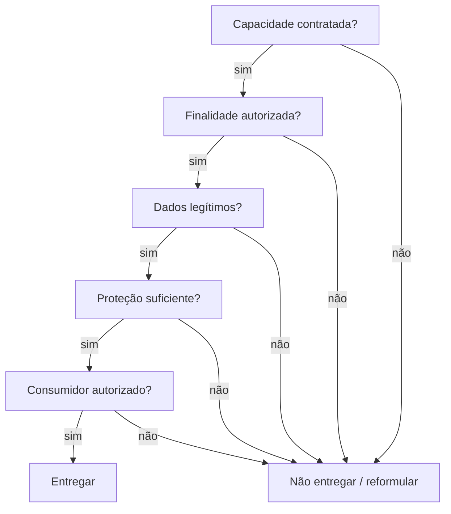

Commercial Policy, Data/Authority Policy e Serving Policy precisam ser compatíveis antes da entrega.

## 43. Governança do produto

Quatro autoridades precisam permanecer distintas.

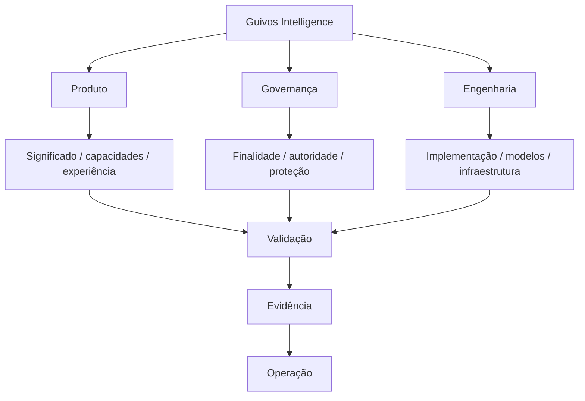

### Produto

Define identidade, valor, capacidades, outputs, experiência e fronteiras funcionais.

### Governança

Define finalidade, autoridade, proteção, privacidade, retenção, sensibilidade, auditoria e limites de compartilhamento.

### Engenharia

Define implementação física, modelos, serviços, dados, infraestrutura, observabilidade e operação técnica.

### Evidência operacional

Determina o que pode ser legitimamente declarado como implementado, validado ou em produção.

## 44. Maturidade

Três níveis superiores devem permanecer distintos:

```text
CONCEITUAL
→ sabemos o que deve existir

ARQUITETURAL
→ sabemos como as responsabilidades se organizam

OPERACIONAL
→ existe implementação e evidência de funcionamento
```

Progressão de realização candidata:

```text
CONCEITUAL
↓
ARQUITETURA APROVADA
↓
ESPECIFICAÇÃO
↓
POC
↓
VALIDAÇÃO
↓
PILOTO CONTROLADO
↓
PRODUÇÃO LIMITADA
↓
PRODUÇÃO ESCALÁVEL
```

Documentado não significa implementado.

## 45. Estado atual de maturidade

| Dimensão | Estado |
|---|---|
| Identidade e papel | **convergido** |
| Duas frentes superiores | **convergido** |
| Capacidades funcionais | **convergido conceitualmente** |
| Inputs e proveniência | **convergido conceitualmente** |
| Outputs | **convergido conceitualmente** |
| Personalização e agregação | **convergido conceitualmente** |
| Contratos interproduto | **convergido conceitualmente** |
| Arquitetura tecnológica | **convergida em alto nível** |
| Modos de entrega / Serving | **convergido conceitualmente** |
| Direção comercial | **convergida em alto nível** |
| Governança e guardrails | **convergidos em alto nível** |
| Modelo físico de dados | **não iniciado** |
| Ontologia lógica completa | **pendente** |
| Ontologia física | **não iniciada** |
| Neo4j operacional | **não evidenciado** |
| GraphRAG operacional | **não implementado** |
| IA operacional | **não definida** |
| Power BI | **integração não implementada** |
| APIs físicas | **não especificadas** |
| Pricing final | **não definido** |
| Privacidade operacional | **não comprovada** |
| Home Pública do Intelligence | **não iniciada** |

## 46. Gaps formais

Continuam abertos, sob autoridades próprias:

- modelo físico de dados;
- ontologia lógica completa;
- ontologia física;
- modelo operacional de proveniência;
- contrato operacional de inferência, confiança e expiração;
- thresholds de proteção populacional;
- contrato operacional de explicabilidade;
- governança de benchmarks;
- níveis de evidência causal;
- aprendizado operacional;
- políticas para treinamento de modelos;
- stack de IA;
- arquitetura física;
- serving técnico;
- MLOps;
- APIs;
- integrações BI;
- pricing, limites e SLAs definitivos;
- evidência de operação e compliance.

## 47. Gates para novas capacidades

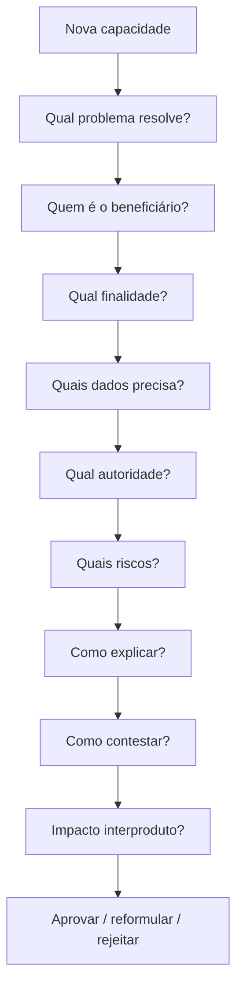

Novo uso de dado, nova inferência, novo modelo, nova automação ou nova finalidade podem exigir novo gate mesmo quando o dado já exista.

## 48. Principais riscos governados

O produto deve permanecer protegido contra:

1. vigilância organizacional;
2. score universal de valor ou evolução humana;
3. inferência tratada como verdade;
4. monetização capturando relevância;
5. grafo tratado como autoridade humana;
6. fonte isolada tratada como verdade universal;
7. proatividade excessiva;
8. perfil eterno;
9. reidentificação populacional;
10. interface contornando autoridade;
11. vendor lock-in;
12. uso de IA onde não adiciona valor legítimo.

Princípio operacional:

```text
PODE DIZER ALGO
≠
DEVE DIZER ALGO
```

Silêncio ou ausência de intervenção podem ser decisões legítimas.

## 49. Constituição do Guivos Intelligence

Os seguintes princípios são normativos para a evolução do produto:

1. **Servir à compreensão, não ao controle.**
2. **Preservar a autonomia humana.**
3. **Distinguir fato, interpretação e previsão.**
4. **Usar dados somente com finalidade e autoridade.**
5. **Compreender profundamente sem expor profundamente.**
6. **Não vender intimidade.**
7. **Não criar score universal de valor ou evolução humana.**
8. **Não confundir correlação com causalidade.**
9. **Explicar proporcionalmente à complexidade e ao impacto.**
10. **Permitir correção, contestação e mudança.**
11. **Tecnologia não cria autoridade.**
12. **Quando não houver evidência suficiente, não inventar certeza.**

## 50. Guardrails superiores consolidados

```text
COMPREENDER ≠ DECIDIR

CONHECER ≠ UTILIZAR ≠ COMPARTILHAR

DECLARADO ≠ OBSERVADO ≠ INFERIDO ≠ PREDITO

PERSONALIZAR ≠ EXPOR

INDIVIDUAL → serve prioritariamente à Pessoa

POPULACIONAL → pode servir ao Business

SEM NOME ≠ ANÔNIMO

AGREGADO ≠ AUTOMATICAMENTE SEGURO

CORRELAÇÃO ≠ CAUSALIDADE

INTERESSE ≠ CONDIÇÃO

POSSIBILIDADE ≠ ITEM PARA VENDA

PAGAMENTO ≠ PERTINÊNCIA

ENTITLEMENT ≠ AUTORIDADE

MAIOR PLANO ≠ MENOR PRIVACIDADE

GRAFO ≠ VERDADE

INFERÊNCIA DA IA ≠ FATO

RESPONSABILIDADE FUNCIONAL ≠ MICROSSERVIÇO

TECNOLOGIA ≠ PRODUTO
```

## 51. Formulações institucionais

### Formulação principal

> **Guivos Intelligence transforma dados autorizados, conhecimento, evidências, contextos e relações do ecossistema em compreensão, insights, análises e recomendações explicáveis, ajudando Pessoas, Organizações e produtos a perceber melhor o que está acontecendo, o que está mudando e quais possibilidades podem ser relevantes.**

### Formulação curta

> **Transformar dados, conhecimento e relações em compreensão que amplia possibilidades.**

### Tese pública candidata

> **Mais contexto. Mais compreensão. Melhores possibilidades — sem retirar a autonomia de quem decide.**

As formulações públicas permanecem sujeitas à futura arquitetura da Home e ao Source Lock correspondente.

## 52. Arquitetura resumida

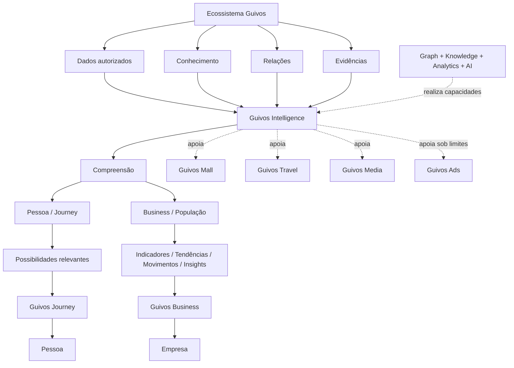

## 53. Limites desta versão

`GPA-006 2.0.0` autoriza como autoridade de produto:

- identidade e papel do Guivos Intelligence;
- duas frentes superiores;
- arquitetura funcional;
- taxonomia de inputs;
- taxonomia de outputs;
- Contexto Vivo e temporalidade;
- modelo de autoridade;
- personalização, agregação e proteção;
- contratos interproduto;
- handoff minimizado;
- neutralidade comercial;
- papel subordinado de Graph, Knowledge, Analytics e AI;
- modos de entrega;
- Intelligence Serving;
- direção comercial de alto nível;
- governança;
- riscos;
- guardrails;
- maturidade e gaps.

Esta versão **não autoriza nem comprova**:

- Home Pública do Guivos Intelligence;
- Source Lock da Home;
- wireframe, UI, protótipo ou Design;
- implementação Neo4j;
- GraphRAG ou GDS em produção;
- modelo de IA selecionado;
- ontologia física;
- API operacional;
- Power BI operacional;
- benchmark real;
- pricing final;
- controles de privacidade operacionais comprovados;
- compliance operacional comprovado;
- impacto humano ou empresarial comprovado.

## 54. Sequência posterior governada

A sequência posterior é obrigatória:

```mermaid
flowchart TD
    A[GPA-006 2.0.0 convergido]
    B[Integração governada no GKR]
    C[Validação + PR]
    D[Merge autorizado]
    E[Source Lock do Produto]
    F[Home Guivos Intelligence]

    A --> B --> C --> D --> E --> F
```

A Home Pública do Guivos Intelligence somente deve ser iniciada após a integração governada desta autoridade e a criação do Source Lock de Produto correspondente.

## 55. Fechamento

> **Guivos Intelligence é a capacidade do Ecossistema Guivos de transformar dados autorizados, conhecimento, evidências, relações e contexto em compreensão útil. Ele apoia a própria Pessoa a perceber e explorar possibilidades relevantes em sua Journey e permite às Empresas compreender movimentos populacionais de forma agregada e protegida. Sua inteligência pode atravessar produtos, mas sua autoridade não: cada produto preserva sua responsabilidade e cada participante preserva aquilo que legitimamente lhe pertence. Tecnologia amplia a capacidade do Intelligence; não amplia sua autoridade.**
