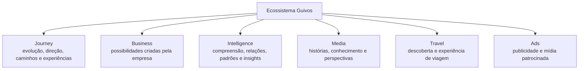
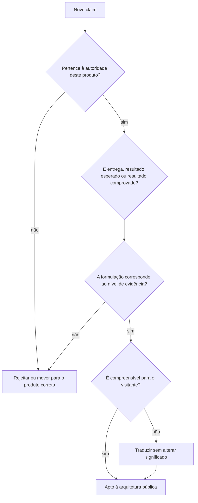

# Homes Públicas — Princípio de Valor, Entrega e Resultado Esperado

## 1. Finalidade

Este documento estabelece uma regra transversal para as Homes Públicas da Guivos.

Uma Home não deve limitar sua comunicação a explicar **o que o produto é**, **como funciona** ou **quais capacidades possui**. Ela deve tornar compreensível **o que essas capacidades entregam**, **por que isso importa** e **o que pode mudar ou se tornar possível para quem utiliza o produto**.

Princípio superior:

> **Pessoas não escolhem um produto apenas por suas funcionalidades; escolhem o valor, as entregas e os resultados que esperam obter a partir dele.**

Essa regra se aplica às Homes institucionais, de participantes e de Produtos Especializados da Guivos, respeitando a autoridade e a intenção própria de cada superfície.

## 2. Arquitetura de comunicação

A progressão preferencial é:


Forma resumida:

```text
O QUE É
↓
POR QUE IMPORTA
↓
O QUE FAZ
↓
O QUE ENTREGA
↓
O QUE MUDA OU SE TORNA POSSÍVEL PARA QUEM USA
```

Portanto:

```text
FEATURE ≠ VALOR
CAPACIDADE ≠ RESULTADO
MECANISMO ≠ BENEFÍCIO
```

Uma feature pode realizar uma capacidade; uma capacidade pode produzir uma entrega; uma entrega pode gerar um benefício; um benefício pode contribuir para um resultado esperado.

## 3. Regra das três perguntas

Toda capacidade apresentada em uma Home deve conseguir responder, em linguagem pública:

1. **O que isso faz?**
2. **O que isso entrega?**
3. **O que a Pessoa, Organização, Coletivo ou Empresa consegue compreender, fazer, escolher ou realizar melhor a partir disso?**

Se a seção responde apenas à primeira pergunta, ela está documentando o produto, não comunicando seu valor público.

## 4. Resultado esperado não é resultado comprovado

A Home deve distinguir claramente:

```text
RESULTADO ESPERADO
= benefício ou consequência legitimamente pretendida pela capacidade

RESULTADO COMPROVADO
= efeito sustentado por evidência operacional ou de mercado suficiente
```

Regra:

> **A ausência de evidência não autoriza transformar expectativa em prova.**

Não declarar, sem autoridade e evidência adequadas:

- percentuais de melhoria;
- redução garantida de custo, churn, turnover ou risco;
- aumento garantido de produtividade, engajamento, bem-estar ou conversão;
- impacto causal comprovado;
- performance técnica não evidenciada;
- promessa de transformação humana garantida.

É legítimo comunicar resultados esperados como:

- mais clareza;
- mais contexto;
- acesso ampliado;
- descoberta de possibilidades;
- menor fricção;
- capacidade de comparar;
- capacidade de compreender;
- maior visibilidade sobre mudanças;
- melhor condição para escolher ou decidir;
- outras consequências coerentes com a autoridade do produto.

## 5. Falar diretamente com quem visita

Sempre que possível, a Home deve traduzir abstrações institucionais em consequências compreensíveis para o visitante.

Evitar como linguagem principal:

```text
“o sistema identifica relevância”
“a plataforma gera compreensão”
“o produto produz inteligência”
“determinados sinais podem merecer atenção”
```

Preferir, quando semanticamente correto:

```text
“entenda por que isso aparece para você”
“veja como as informações estão relacionadas”
“compare o que mudou”
“descubra o que antes poderia passar despercebido”
“saiba o que está por trás desta leitura”
```

Isso não significa tornar toda copy imperativa ou informal. Significa preservar a perspectiva de quem recebe o valor.

## 6. Cada Home preserva sua intenção

Uma Home pode mostrar relações com outros produtos da Guivos, mas não deve assumir a proposta de valor central deles.



Regra:

> **Relacionar produtos ≠ fundir suas intenções.**

Exemplo:

- a Home Intelligence pode explicar que sua compreensão apoia Journey ou Business;
- não pode, por isso, transformar-se em uma segunda Home Journey ou Business;
- a Home Business pode mostrar Intelligence como capacidade utilizada;
- não pode absorver a identidade do Intelligence.

## 7. Visual como evidência de entendimento

Elementos visuais devem ajudar a tornar **entrega, relação, sequência, comparação ou resultado esperado** mais compreensíveis.

Podem ser utilizados, quando fizerem sentido:

- KPIs e indicadores conceituais;
- gráficos de tendência e comparação;
- cards analíticos;
- organogramas;
- diagramas de relação;
- fluxos sequenciais;
- árvores de decomposição;
- matrizes e comparações;
- ciclos;
- representações de antes/depois;
- exemplos de leitura explicada.

Princípio:

> **Não adicionar representação apenas por estética. Cada visual deve esclarecer uma relação, processo, hierarquia, comparação, fronteira, entrega ou resultado que seria mais difícil de compreender somente por texto.**

## 8. Resultado antes do mecanismo, quando possível

Quando a compreensão pública não exigir que o mecanismo seja apresentado primeiro, a Home deve preferir:

```text
RESULTADO / BENEFÍCIO
↓
COMO O PRODUTO TORNA ISSO POSSÍVEL
```

em vez de:

```text
TECNOLOGIA / FEATURE
↓
CAPACIDADE
↓
ESPERAR QUE O VISITANTE DEDUZA O VALOR
```

Exemplo:

```text
“Entenda o que mudou e como isso se relaciona com outros sinais.”
↓
Depois: “Para isso, o Intelligence conecta contexto, conhecimento, evidências e relações.”
```

## 9. Contrato de claim

Antes de inserir uma afirmação de resultado em uma Home, aplicar:



## 10. Critério de aceite de uma seção

Uma seção pública está semanticamente forte quando o visitante consegue responder:

- por que aquilo importa;
- o que recebe ou percebe;
- o que consegue fazer, compreender ou escolher melhor;
- qual é o papel do produto nesse resultado;
- quais limites precisam permanecer claros.

Uma seção deve ser revista quando:

- lista features sem consequência;
- usa tecnologia como sinônimo de valor;
- usa abstrações que não chegam ao visitante;
- promete resultado não evidenciado;
- invade a proposta de valor de outro produto;
- usa visual apenas como decoração;
- exige que o visitante traduza sozinho a capacidade em benefício.

## 11. Aplicação nas Homes existentes e futuras

Este princípio passa a orientar novas consolidações, revisões, Source Locks, handoffs e futuras materializações das Homes.

Ele não reabre automaticamente decisões já congeladas nas Homes existentes. Quando uma Home já possui Documento Mestre e Source Lock, a incorporação explícita deste princípio deve ocorrer em revisão governada, sem alteração silenciosa de sua autoridade própria.

Para Homes ainda em construção, este princípio deve ser aplicado desde a arquitetura conceitual.

## 12. Síntese

```text
SIGNIFICADO
+
CAPACIDADE
+
ENTREGA
+
BENEFÍCIO
+
RESULTADO ESPERADO
=
COMUNICAÇÃO PÚBLICA MAIS COMPREENSÍVEL
```

> **A Home deve ajudar a pessoa a entender não apenas o produto, mas o que pode se tornar melhor, mais claro, mais acessível ou mais possível a partir dele.**
