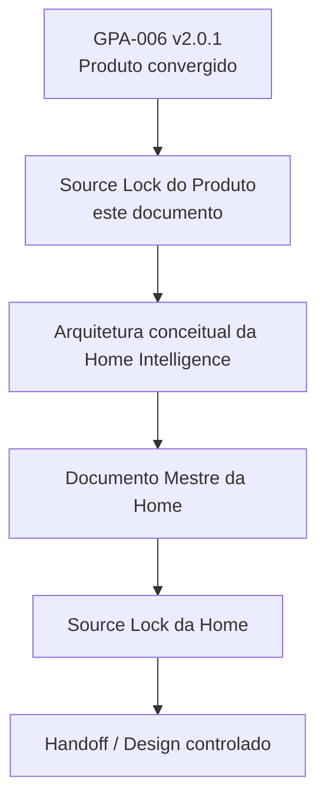
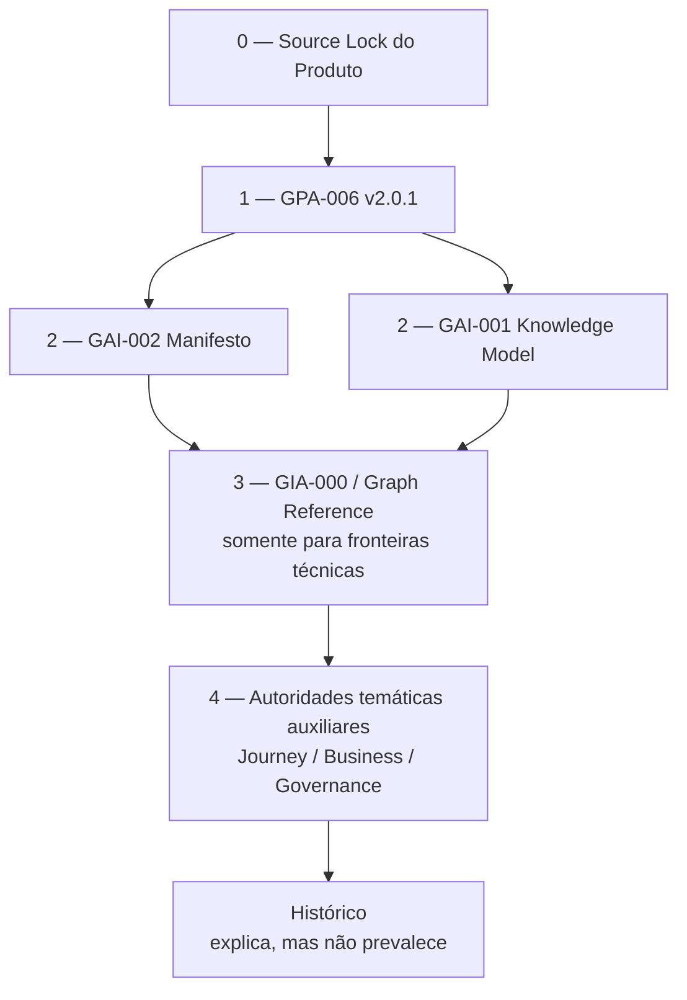
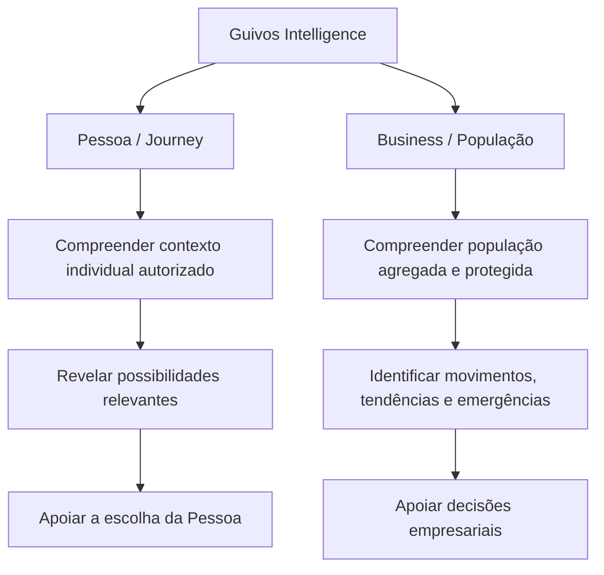
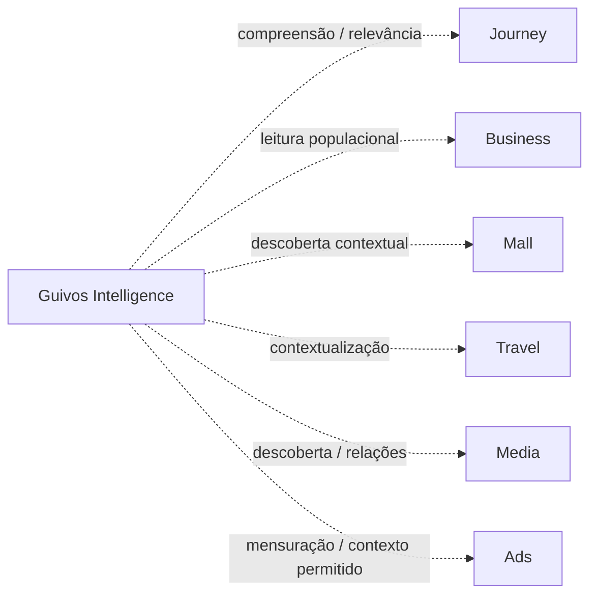
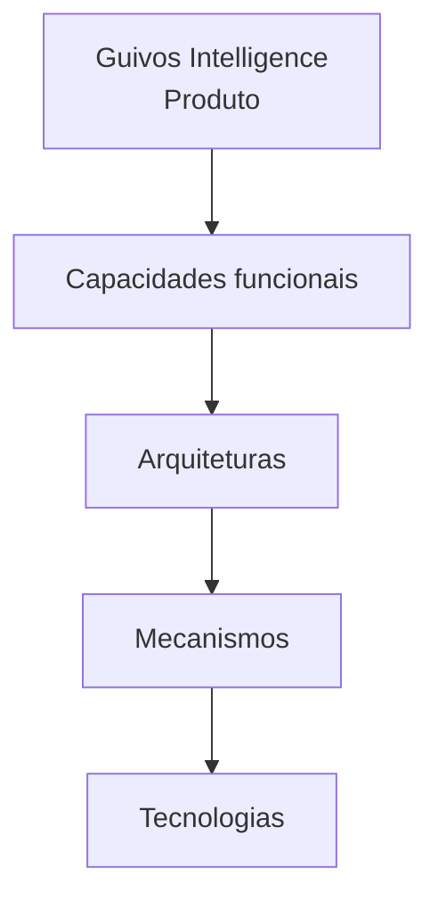
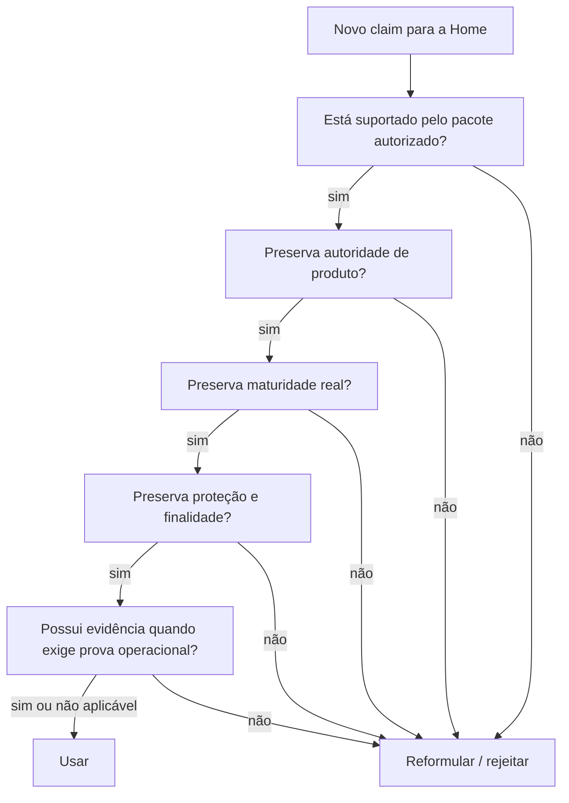
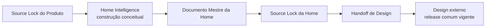

# Source Lock do Produto — Guivos Intelligence

## 1. Finalidade

Este documento consolida o **Source Lock do Produto Guivos Intelligence** após a promoção de `GPA-006` para `2.0.1` e reconcilia seu estado temporal com as autoridades posteriores já existentes da Home Pública.

Seu papel é:

- congelar a base canônica de produto que governa o significado consumido pela Home Pública do Guivos Intelligence;
- estabelecer a ordem de autoridade entre produto, manifesto, modelo de conhecimento, arquitetura de Intelligence, grafo e autoridades temáticas auxiliares;
- separar afirmações públicas permitidas de implementação, operação, pricing, infraestrutura ou desempenho ainda não comprovados;
- impedir que tecnologias, mecanismos ou interfaces substituam silenciosamente a identidade e a proposta de valor do produto;
- impedir que a Home Pública transforme personalização em vigilância, Intelligence populacional em perfil individual ou relevância em prioridade comercial;
- registrar o que continua aberto e não pode ser preenchido por inferência durante a construção da Home.

Este Source Lock **não é**:

- Documento Mestre da Home;
- arquitetura narrativa da Home;
- pergunta-mãe pública;
- hero, headline, CTA ou copy final;
- wireframe;
- UI;
- protótipo;
- Design;
- Source Lock de Design;
- prompt generativo;
- especificação técnica;
- contrato de API;
- pricing;
- autorização de implementação ou operação.

Regra:

> **O Source Lock congela a autoridade do produto que a Home poderá traduzir. Ele não escreve a Home antecipadamente.**

## 2. Checkpoint congelado

```text
PRODUTO
Guivos Intelligence

ORIGIN PHASE
Source Lock do Produto — pré-Home
→ HISTORICAL PROVENANCE

CURRENT HOME STATE
DOCUMENTO MESTRE = EXISTS
HOME SOURCE LOCK = EXISTS / ACTIVE
DESIGN HANDOFF = EXISTS / ACTIVE
EXTERNAL DESIGN RELEASE = GRANTED
PRODUCT ENGINEERING = NOT RELEASED

BASE CANÔNICA CONGELADA
main @ 67557b1c1503d81a716a1b44d7b1a4ae06ed5646
→ HISTORICAL ORIGIN BASE

AUTORIDADE SUPERIOR DE PRODUTO
GPA-006 v2.0.1

INTELLIGENCE ARCHITECTURE
GIA-000 v1.5.0

KNOWLEDGE MODEL
GAI-001 v1.1.0

MANIFESTO
GAI-002 v1.0.0

GRAPH REFERENCE
GEA-GRAPH-REFERENCE-001 v0.1.2
```

O objetivo do lock é preservar uma base única, coerente e auditável de autoridade de produto para a Home vigente, sem reabrir a arquitetura do produto nem competir com as autoridades posteriores de Home e Design.

## 3. Sequência governada — proveniência e estado corrente



Historicamente, a integração deste Source Lock habilitou a estruturação conceitual da Home. Essa progressão já foi concluída documentalmente: Documento Mestre, Home Source Lock e Design Handoff existem, e o release comum vigente concede produção externa de Design à designer. Este documento continua sem autorizar implementação ou Product Engineering.

## 4. Pacote primário autorizado

A Home foi estruturada a partir de um pacote de autoridade deliberadamente pequeno; para consumo corrente, esse pacote deve ser lido em conjunto com as autoridades posteriores da Home.

### Nível 0 — este Source Lock

`GKR-INTELLIGENCE-PRODUCT-SOURCELOCK-001`

Governa:

- quais fontes podem ser usadas;
- como resolver divergências;
- o que pode ou não ser traduzido publicamente;
- quais claims continuam proibidos;
- quais lacunas não podem ser preenchidas por inferência.

### Nível 1 — autoridade superior do produto

`GPA-006 v2.0.1 — Guivos Intelligence`

Governa:

- identidade;
- proposta de valor;
- duas frentes superiores;
- capacidades;
- inputs;
- outputs;
- autoridade;
- personalização e agregação;
- contratos interproduto;
- modos de entrega;
- direção comercial de alto nível;
- governança;
- maturidade;
- guardrails.

### Nível 2 — princípios de Intelligence

`GAI-002 v1.0.0 — Manifesto da Inteligência do Ecossistema Guivos`

Governa os princípios superiores de autonomia, relações, contexto, conhecimento, Grafo Global e inteligência como meio subordinado ao propósito da Guivos.

`GAI-001 v1.1.0 — Guivos Artificial Intelligence Knowledge Model`

Governa a relação entre conhecimento, evidência, aprendizado, contexto e recomendação.

## 5. Pacote secundário — somente para resolver dúvidas específicas

As fontes abaixo **não devem ser despejadas automaticamente na construção da Home**. Devem ser consultadas apenas quando uma dúvida concreta exigir precisão adicional.

### 5.1 Intelligence Architecture

`GIA-000 v1.5.0`

Uso permitido:

- confirmar separação Produto × Arquitetura × Engenharia;
- confirmar responsabilidades funcionais versus candidatos técnicos;
- impedir que engines candidatos sejam tratados como componentes implementados.

Não usar para transformar a Home em documentação técnica.

### 5.2 Graph Reference

`GEA-GRAPH-REFERENCE-001 v0.1.2`

Uso permitido:

- confirmar papel do Grafo Global;
- confirmar Neo4j como tecnologia de referência;
- confirmar limites de Graph Analytics e GraphRAG;
- confirmar maturidade não operacional.

Não usar como base para afirmar implantação, volume, performance ou disponibilidade.

### 5.3 Journey / Domínios de Evolução

`PAS-001-DOMAIN-MODEL-001 v1.0.0`

Uso permitido:

- resolver dúvidas sobre Domínios de Evolução;
- sensibilidade;
- classificação candidata;
- diferença entre domínio, identidade, diagnóstico, score e prova de evolução.

A Home Pública do Intelligence não deve se transformar em uma Home dos Domínios do Journey.

### 5.4 Business

`GPA-004 v1.6.0`

Uso permitido:

- resolver fronteiras da frente Business / População;
- confirmar que Intelligence não é módulo do Business;
- confirmar que a empresa recebe leitura populacional protegida e não a Journey individual.

A Home Pública do Intelligence não deve se transformar em uma Home Business.

## 6. Fontes excluídas por padrão

Não adicionar automaticamente ao contexto inicial da Home:

- conversas e rascunhos não promovidos ao GKR;
- versões anteriores de `GPA-006`;
- checkpoints intermediários já consolidados por `GPA-006 v2.0.1`;
- documentos de uma Home específica;
- Source Locks das outras Homes;
- wireframes ou SVGs internos do Journey;
- documentos de pricing não congelados;
- estudos externos usados apenas como referência não promovida;
- ferramentas, páginas comerciais ou benchmarks de concorrentes;
- documentação de fornecedores como Neo4j, Power BI ou modelos de IA;
- qualquer output futuro de Design ainda não validado.

Quando uma fonte excluída for necessária para responder a uma dúvida concreta, sua entrada no contexto deve ser deliberada e não altera automaticamente o Source Lock.

## 7. Ordem de autoridade



Regra de precedência:

> **Em qualquer conflito sobre identidade, valor, autoridade ou limites do Guivos Intelligence, prevalece `GPA-006 v2.0.1`, limitado pelo presente Source Lock quanto ao uso na Home Pública.**

Arquiteturas e tecnologias não podem reescrever autoridade de produto.

## 8. Centro semântico congelado

A Home Pública deve preservar estes elementos, ainda que sua expressão pública final seja refinada durante a arquitetura narrativa.

### 8.1 Natureza

> **Guivos Intelligence é o Produto Especializado transversal da Guivos e a Intelligence Layer do ecossistema.**

### 8.2 Unidade superior de valor

> **compreensão útil e contextualizada.**

### 8.3 Tese

> **Guivos Intelligence não existe para acumular dados ou decidir pelas pessoas. Existe para transformar conhecimento, contexto, evidências e relações em compreensão útil, tornando melhores decisões e novas possibilidades mais acessíveis.**

### 8.4 Princípio de autoridade

```text
COMPREENDER
≠
DECIDIR
```

### 8.5 Formulação curta autorizada

> **Transformar dados, conhecimento e relações em compreensão que amplia possibilidades.**

Esses elementos podem ser traduzidos editorialmente, mas não substituídos por uma identidade centrada em chatbot, dashboard, analytics, IA generativa, Neo4j ou BI.

## 9. Duas frentes obrigatórias

A Home Pública deve reconhecer que existe **um único produto com duas frentes superiores de valor**.



Não criar:

```text
Intelligence Pessoa
+
Intelligence Business
=
dois produtos independentes
```

As duas frentes possuem diferentes finalidade, autoridade e granularidade sobre um núcleo compartilhado.

## 10. Contratos humanos que não podem ser enfraquecidos

```text
CONHECER ≠ UTILIZAR ≠ COMPARTILHAR

DECLARADO ≠ OBSERVADO ≠ INFERIDO ≠ PREDITO

PERSONALIZAR ≠ EXPOR

INDIVIDUAL → serve prioritariamente à própria Pessoa

POPULACIONAL → pode servir ao Business de forma protegida

SEM NOME ≠ ANÔNIMO

AGREGADO ≠ AUTOMATICAMENTE SEGURO

CORRELAÇÃO ≠ CAUSALIDADE

INTERESSE ≠ CONDIÇÃO

ENTITLEMENT ≠ AUTORIDADE

PAGAMENTO ≠ PERTINÊNCIA

MAIOR PLANO ≠ MENOR PRIVACIDADE
```

Esses contratos são semânticos e arquiteturais. A Home Pública não pode removê-los do significado mesmo quando não aparecerem literalmente em copy pública.

## 11. Tradução pública permitida — Pessoa / Journey

A Home Pública pode comunicar que o Intelligence:

- considera contexto autorizado para tornar a própria experiência da Pessoa mais relevante;
- relaciona conhecimento, evidências, experiências e possibilidades;
- pode ajudar a revelar caminhos e possibilidades que façam sentido naquele momento;
- pode explicar por que determinada possibilidade ou recomendação apareceu;
- aprende com novos sinais autorizados sem transformar a Pessoa em perfil permanente;
- preserva escolha, correção, contestação e mudança.

Não pode comunicar que o Intelligence:

- sabe quem a Pessoa realmente é;
- conhece a verdade sobre sua vida;
- define o melhor caminho universal;
- mede seu valor ou evolução por um score;
- diagnostica saúde, condição emocional, fé, propósito ou situação financeira;
- prevê de forma determinística o futuro individual;
- substitui profissionais, instituições responsáveis ou decisão humana.

## 12. Tradução pública permitida — Business / População

A Home Pública pode comunicar que o Intelligence ajuda empresas a compreender:

- participação;
- utilização;
- movimentos ao longo do tempo;
- interesses agregados;
- tendências;
- sinais e Movimentos Emergentes;
- possíveis lacunas entre o que a população busca e o que a empresa oferece;
- comparações e benchmarks quando autorizados e metodologicamente adequados.

A unidade pública deve ser **população**, não perfil individual de funcionário.

Não pode comunicar que o Intelligence:

- monitora cada funcionário;
- identifica quem está com dívida, doença, sofrimento, baixa motivação ou qualquer vulnerabilidade privada;
- mede produtividade, valor humano ou evolução individual para a empresa;
- entrega Journey individual ao empregador;
- comprova causalidade entre iniciativa Guivos e KPI interno da empresa;
- importa obrigatoriamente bases completas de RH, folha, performance, CRM ou ERP para funcionar.

## 13. Relação com os demais Produtos Especializados

A Home Pública pode demonstrar transversalidade, desde que preserve:



Contrato:

> **Intelligence conecta autoridades. Não as absorve.**

A Home não pode sugerir que Guivos Intelligence controla, substitui ou contém os demais produtos.

## 14. Handoffs e minimização

Quando a comunicação abordar relações entre produtos, preservar:

```text
OUTPUT AUTORIZADO
≠
DATASET DE ORIGEM
```

E:

> **Transferir uma possibilidade ou resultado não implica transferir todo o contexto que o produziu.**

Exemplo conceitual permitido:


## 15. Tecnologia — posição pública permitida

A Home Pública pode comunicar que o Guivos Intelligence combina, conforme finalidade e autoridade:

- conhecimento;
- relações;
- analytics;
- regras;
- estatística;
- grafos;
- inteligência artificial.

Mas deve preservar a hierarquia:



Não inverter essa cadeia.

## 16. Tecnologia — claims proibidos no estado atual

Sem nova evidência canônica, a Home Pública não pode afirmar:

- Neo4j em produção;
- Grafo Global populado em produção;
- GraphRAG operacional;
- Graph Analytics operacional;
- GDS operacional;
- Power BI integrado ao produto;
- Guivos.ai operacional como interface do Intelligence;
- API pública disponível;
- processamento em tempo real;
- número de nós, relações, modelos, fontes ou eventos reais;
- precisão ou performance de modelos;
- modelo de IA específico em produção;
- MLOps operacional;
- infraestrutura, cloud, cluster ou topologia implantada.

A formulação correta, quando tecnologia precisar ser mencionada, deve distinguir:

```text
REFERÊNCIA / CAPACIDADE / PADRÃO CANDIDATO
≠
IMPLEMENTAÇÃO / PRODUÇÃO / DISPONIBILIDADE
```

## 17. Grafo Global

A Home pode apresentar o Grafo Global como capacidade estrutural para compreender relações, se isso ajudar a narrativa.

Deve preservar:

```text
GRAFO GLOBAL
= capacidade/modelo de relações governadas

GUIVOS INTELLIGENCE
= produto que pode interpretar relações

NEO4J
= tecnologia primária de referência para realização da camada de grafo
```

Não pode transformar:

```text
centralidade → importância humana
similaridade → identidade
comunidade de grafo → grupo humano verdadeiro
relação inferida → fato
```

## 18. IA

A Home pode comunicar inteligência artificial como mecanismo subordinado ao produto.

Não pode comunicar:

```text
GUIVOS INTELLIGENCE = IA
GUIVOS INTELLIGENCE = LLM
GUIVOS INTELLIGENCE = GUIVOS.AI
```

Contrato:

> **A tecnologia amplia a capacidade do Intelligence. Não amplia sua autoridade.**

E:

```text
CAPACIDADE DO MODELO
≠
AUTORIDADE PARA USAR OU EXPOR
```

## 19. Outputs que podem ser expressos publicamente

As famílias canônicas são:

```text
DESCRIÇÃO
→ indicadores, distribuições, comparações, estados observados

INTERPRETAÇÃO
→ padrões, sinais, Movimentos Emergentes, insights

PROJEÇÃO
→ tendências, estimativas, previsões autorizadas

ORIENTAÇÃO
→ possibilidades, oportunidades, recomendações, caminhos a explorar

REFERÊNCIA
→ benchmarks autorizados

TRANSPARÊNCIA
→ explicação, proveniência, incerteza, limitações
```

A Home não precisa listar todas as famílias. Se as utilizar, não pode colapsar suas diferenças.

Especialmente:

```text
INDICADOR ≠ INSIGHT
TENDÊNCIA ≠ PREVISÃO
PREVISÃO ≠ CERTEZA
RECOMENDAÇÃO ≠ DECISÃO
```

## 20. Explicabilidade

É permitido comunicar que o Intelligence busca tornar suas leituras e recomendações explicáveis.

A ideia pública correta é que, quando relevante, o participante possa compreender:

- por que algo apareceu;
- que tipo de contexto foi considerado;
- quais limitações existem;
- o que aquela leitura não significa.

Explicabilidade não significa revelar dados privados de outras pessoas, cadeia de pensamento interna de modelos ou toda a implementação técnica.

## 21. Modos de entrega

O produto reconhece seis modos conceituais:

- embutido;
- direto/analítico;
- conversacional;
- proativo;
- documental;
- programático.

A Home Pública pode comunicar que Intelligence pode aparecer **dentro de outros produtos ou como experiência direta**.

Não deve transformar a existência conceitual desses modos em claim de disponibilidade operacional atual.

Contrato:

> **Guivos Intelligence pode ser a origem da compreensão sem precisar ser o destino da experiência.**

## 22. Direção comercial congelada

### Pessoa

O Intelligence é predominantemente incorporado à Journey e aos planos pessoais.

```text
PRODUTO PRÓPRIO
≠
ASSINATURA PRÓPRIA OBRIGATÓRIA
```

A Home Pública não deve inventar checkout, plano ou preço próprio de Intelligence para Pessoa.

### Business

Capacidades de Intelligence podem compor progressivamente os entitlements de Start / Growth / Scale / Enterprise sem transformar Intelligence em módulo do Business.

```text
MAIOR PLANO
→ pode ampliar capacidade, escala, histórico, integração e serviço

MAIOR PLANO
≠ maior acesso à intimidade individual
```

### Oferta autônoma

Uma oferta B2B autônoma do Guivos Intelligence permanece **possibilidade futura**.

A Home Pública não pode tratá-la como oferta vigente, plano contratado ou checkout disponível sem nova autoridade.

## 23. Privacy e proteção como parte do significado do produto

A Home Pública pode comunicar confiança, proteção e responsabilidade como propriedades arquiteturais do produto.

Não pode afirmar, sem evidência operacional própria:

- compliance integral comprovado;
- certificações inexistentes;
- segurança absoluta;
- anonimização perfeita;
- impossibilidade de incidente;
- conformidade jurídica universal em todos os países.

Formulação arquitetural correta:

> **O Intelligence é concebido para usar finalidade, minimização, proteção, agregação e autoridade como parte de sua arquitetura.**

Isso não equivale a declarar controles operacionais já auditados.

## 24. Matriz de interpretação pública

| Conceito canônico | Tradução pública permitida | Distorção proibida |
|---|---|---|
| compreensão útil | transformar contexto e conhecimento em compreensão | decidir pela Pessoa |
| Contexto Vivo | considerar que contexto muda ao longo do tempo | perfil humano permanente |
| relevância | revelar possibilidades potencialmente pertinentes | obrigação ou prioridade comercial |
| frente Pessoa | inteligência para servir a própria Journey | exposição para empregador |
| frente Business | compreensão populacional protegida | perfil individual do funcionário |
| Movimento Emergente | mudança que começa a ganhar consistência | diagnóstico ou causa comprovada |
| Grafo Global | compreender relações governadas | grafo em produção ou verdade humana |
| IA | mecanismo que pode ampliar capacidades | identidade do produto ou autoridade autônoma |
| explicabilidade | tornar motivos e limites compreensíveis | revelar dados privados ou raciocínio interno integral |
| benchmark | comparação governada quando adequada | ranking universal ou prova de superioridade |
| previsão | estimativa futura com incerteza | futuro determinado |
| Enterprise | maior capacidade e governança | menor privacidade |

## 25. O que permanece aberto para a Home

Este Source Lock **não congela**:

- pergunta-mãe da Home;
- tese pública final da página;
- headline;
- supporting copy;
- CTA;
- quantidade de movimentos narrativos;
- ordem final da narrativa pública;
- nível de destaque entre Pessoa e Business;
- exemplos públicos finais;
- metáforas;
- visualização conceitual;
- conversão;
- formulário;
- navegação;
- direção visual;
- imagens;
- motion;
- layout;
- UI.

Essas decisões pertencem à futura estruturação da Home e precisarão permanecer compatíveis com este lock.

## 26. Lacunas que a Home não pode preencher

A ausência de decisão operacional não autoriza Design ou narrativa a inventar:

- pricing;
- limites quantitativos dos planos;
- thresholds mínimos de coorte/agregação;
- SLAs;
- disponibilidade de API;
- integração Power BI;
- modelos de IA;
- modelo físico de dados;
- ontologia física;
- GraphRAG implementado;
- benchmarks reais;
- números de usuários, empresas, eventos, relações ou fontes;
- resultados humanos ou empresariais comprovados;
- eficácia preditiva;
- latência ou operação em tempo real;
- certificações ou compliance comprovado.

## 27. Claims proibidos de alto risco

Até nova autoridade explícita, não usar formulações equivalentes a:

> “A IA que conhece você melhor do que você mesmo.”

> “Descubra exatamente o que seus funcionários precisam.”

> “Preveja quem vai evoluir.”

> “Meça a evolução de cada funcionário.”

> “Identifique colaboradores em risco.”

> “Entenda tudo sobre sua população.”

> “Decisões automáticas baseadas em IA.”

> “Grafo Global em tempo real.”

> “Transforme dados em resultados comprovados.”

Essas formulações ultrapassam autoridade, maturidade, evidência ou guardrails atuais.

## 28. Ausência legítima de claim

Se uma capacidade relevante ainda não possui evidência operacional, a Home deve preferir não afirmar disponibilidade em vez de converter arquitetura em promessa.

```text
CAPACIDADE CONCEITUAL
≠
FEATURE DISPONÍVEL
```

E:

```text
DOCUMENTADO
≠
IMPLEMENTADO
≠
OPERACIONAL
≠
COMPROVADO
```

## 29. Gate para qualquer claim novo



## 30. Gate para ampliação de fontes

Antes de adicionar uma nova fonte ao contexto de construção da Home:

```text
QUAL DÚVIDA A FONTE RESOLVE?
↓
A DÚVIDA NÃO ESTÁ RESOLVIDA PELO PACOTE PRIMÁRIO?
↓
A FONTE É CANÔNICA E VIGENTE?
↓
QUAL AUTORIDADE ELA POSSUIRÁ?
↓
ELA CONTRADIZ OU AMPLIA O SOURCE LOCK?
↓
CONSULTAR / NÃO CONSULTAR / REABRIR GOVERNANÇA
```

Uma fonte consultada pontualmente não se torna automaticamente parte permanente do lock.

## 31. Checklist de integridade da Home

Este checklist nasceu no estágio pré-Home e permanece apenas como verificação de integridade da autoridade de produto. No estado corrente, **não antecede, não bloqueia e não reabre** o Documento Mestre, o Home Source Lock, o Design Handoff ou o release externo de Design já existentes.

Ao reutilizar este Source Lock no contexto vigente da Home Intelligence, confirmar:

- `GPA-006 v2.0.1` permanece vigente;
- este Source Lock permanece vigente;
- nenhuma autoridade posterior alterou as duas frentes superiores;
- nenhuma autoridade posterior alterou os contratos de privacidade, relevância ou comercialização;
- tecnologias continuam na maturidade declarada;
- oferta B2B autônoma continua candidata ou foi formalmente promovida por autoridade posterior;
- qualquer novo fato operacional foi incorporado ao GKR antes de virar claim público.

## 32. Estado congelado

```text
GUIVOS INTELLIGENCE
= Produto Especializado transversal
= Intelligence Layer

UNIDADE DE VALOR
= compreensão útil e contextualizada

FRENTES SUPERIORES
= Pessoa / Journey
+ Business / População

AUTORIDADE
= compreender, relacionar, interpretar, recomendar e explicar
≠ decidir por quem possui autoridade legítima

TECNOLOGIA
= subordinada ao produto
≠ identidade do produto

PERSONALIZAÇÃO
= pode servir profundamente à própria Pessoa
≠ autorização para expor profundamente

BUSINESS
= compreensão populacional agregada e protegida
≠ Intelligence individual por funcionário

COMERCIAL
= capacidade pode variar por entitlement
≠ pagamento compra autoridade ou relevância

MATURIDADE
= produto conceitual e arquiteturalmente convergido
≠ implementação ou operação comprovada
```

## 33. Progressão histórica e estado corrente

A progressão histórica iniciada por este Source Lock foi concluída documentalmente até o handoff da Home:



Estado corrente:

```text
GPA-006 v2.0.1
→ AUTORIDADE SUPERIOR DE PRODUTO

HOME MASTER
→ EXISTS / CURRENT

HOME SOURCE LOCK
→ EXISTS / ACTIVE

DESIGN HANDOFF
→ EXISTS / ACTIVE

EXTERNAL DESIGN
→ GRANTED BY COMMON RELEASE
→ DESIGNER = CREATIVE AUTHOR
→ AI = OPTIONAL / DESIGNER-CONTROLLED

PRODUCT ENGINEERING
→ NOT RELEASED
```

A proveniência pré-Home permanece histórica. Ela não funciona como gate corrente para a designer e não reabre etapas já concluídas.