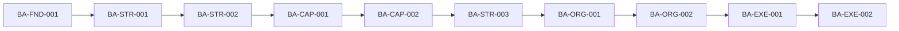

# ADR-004 — Architectural Dependency Order

## Contexto

A evolução da GEA não deve ocorrer apenas por uma sequência editorial de documentos. Cada unidade arquitetural depende de conceitos, modelos e decisões anteriores. Consolidar uma unidade antes de suas dependências aumenta risco de retrabalho, inconsistência e dependências circulares.

## Decisão

Uma unidade arquitetural somente pode ser consolidada quando todos os conceitos dos quais depende estiverem, no mínimo, em estado `validated`.

O roadmap da GEA deve ser organizado por dependências arquiteturais, e não apenas por ordem temática ou documental.

## Regras

1. Toda unidade deve declarar suas dependências explícitas.
2. Dependências devem apontar para ativos oficiais do GKR.
3. Unidades dependentes não podem redefinir conceitos de suas dependências.
4. Dependências circulares devem ser eliminadas antes da consolidação.
5. Alterações em uma unidade exigem análise de impacto sobre suas dependentes.
6. O estado `stable` exige que todas as dependências estejam, no mínimo, `validated`.
7. Exceções exigem justificativa e ADR específico.

## Aplicação inicial na Business Architecture

## Consequências positivas

- reduz retrabalho;
- evita consolidação prematura;
- melhora rastreabilidade;
- permite análise de impacto;
- organiza o roadmap por lógica arquitetural;
- prepara a GEA para representação futura em grafo de conhecimento.

## Custos e limitações

- pode impedir o avanço de unidades enquanto dependências não forem validadas;
- exige manutenção de metadados de dependência;
- torna revisões transversais obrigatórias após alterações estruturais.

## Alternativas rejeitadas

### Evolução apenas por ordem de documentos

Rejeitada porque não representa as relações reais entre os ativos.

### Consolidação paralela sem dependências explícitas

Rejeitada porque aumenta risco de conflito e duplicidade.

## Estado

Decisão aceita e aplicável a todas as arquiteturas da GEA.
