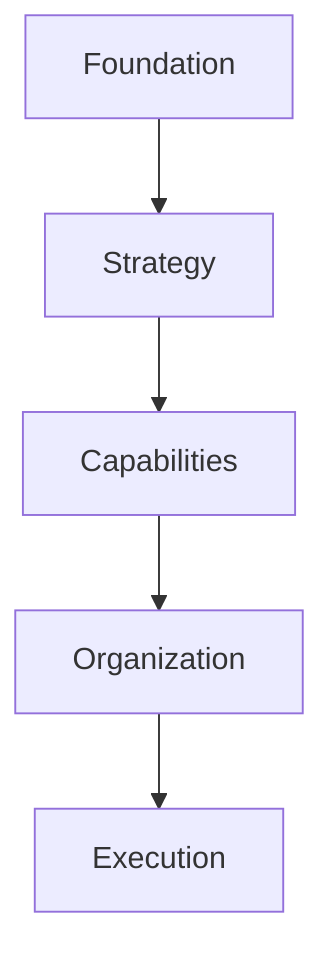

# Business Architecture Foundations

## Objetivo

Estabelecer o contrato arquitetural da Business Architecture dentro da Guivos Enterprise Architecture (GEA).

## Definição

A Business Architecture define como o negócio da Guivos transforma necessidades em valor sustentável e como a organização se estrutura para gerar, entregar, capturar e reinvestir esse valor no fortalecimento contínuo do Ecossistema Guivos.

Ela é orientada pelo negócio, por valor e por capacidades. Não é orientada por organogramas, departamentos, produtos isolados ou tecnologias específicas.

## Propósito

Orientar a construção e a evolução do negócio da Guivos de forma coerente com sua Foundation Architecture, com o Guivos Ecosystem Blueprint e com a Product Architecture.

A Business Architecture deve permitir compreender:

- quais necessidades o negócio atende;
- quais resultados pretende produzir;
- quais capacidades são necessárias;
- como o valor é gerado, entregue, capturado e reinvestido;
- como a organização se estrutura para sustentar o negócio;
- como produtos, serviços, processos e indicadores se relacionam.

## Escopo

Pertencem à Business Architecture:

- Business Transformation Model;
- Business Outcomes;
- cadeias e fluxos de valor;
- capacidades de negócio;
- mapa de capacidades;
- modelo organizacional;
- modelo operacional;
- funções e processos de negócio;
- papéis e responsabilidades organizacionais;
- indicadores e métricas de negócio;
- modelos de geração, captura e reinvestimento de valor;
- relação entre necessidades, capacidades, produtos, serviços e resultados.

## Responsabilidades

A Business Architecture é responsável por:

1. traduzir necessidades do ecossistema em resultados de negócio;
2. definir as capacidades permanentes necessárias para produzir esses resultados;
3. organizar como o valor percorre o negócio;
4. relacionar capacidades, produtos, serviços, áreas e processos;
5. orientar o desenho organizacional sem depender de um organograma específico;
6. apoiar sustentabilidade econômica, organizacional, relacional, intelectual, social e de transformação;
7. estabelecer critérios para avaliar iniciativas e modelos de negócio;
8. manter alinhamento entre estratégia e execução.

## Limites

A Business Architecture não redefine:

- essência, propósito, missão, visão, constituição ou princípios institucionais, pertencentes à Foundation Architecture;
- participante, jornada, oportunidade, experiência ou conhecimento do ecossistema, pertencentes à Ecosystem Architecture;
- identidade, escopo e responsabilidade dos produtos, pertencentes à Product Architecture;
- modelos de dados, conhecimento computacional, analytics ou inteligência artificial, pertencentes à Data & Intelligence Architecture;
- aplicações, APIs, infraestrutura, segurança ou implementação técnica, pertencentes à Technology Architecture;
- políticas, riscos, conformidade e processo decisório arquitetural, pertencentes à Governance Architecture;
- ciclo de vida, classificação e preservação dos ativos de conhecimento, pertencentes à Knowledge Architecture.

A Business Architecture pode utilizar conceitos dessas arquiteturas, mas não redefini-los.

## Princípios permanentes

### O negócio precede a organização

Primeiro são definidos valor, resultados e capacidades. Depois são definidos áreas, papéis, processos e estruturas organizacionais.

### Necessidade precede valor

Toda iniciativa deve responder a uma necessidade real de Pessoa, Organização ou Coletivo.

### Valor precede capacidade, produto e funcionalidade

A sequência de referência é:

```text
Necessidade -> Valor -> Capacidade -> Produto ou Serviço -> Funcionalidade
```

### Orientação por capacidades

Capacidades representam o que a Guivos precisa ser capaz de fazer. Elas devem permanecer válidas mesmo quando equipes, processos, produtos ou tecnologias mudarem.

### Independência de organograma

A arquitetura não deve depender de departamentos ou cargos específicos.

### Independência tecnológica

A definição do negócio deve permanecer válida diante da substituição de sistemas, fornecedores, linguagens ou infraestrutura.

### Valor compartilhado e sustentável

A Guivos deve considerar valor econômico, organizacional, relacional, intelectual, social e de transformação.

### Geração, captura e reinvestimento

A sustentabilidade do ecossistema exige equilíbrio entre:

- valor gerado para participantes;
- valor capturado pela Guivos;
- valor reinvestido no fortalecimento do ecossistema.

### Produtos são meios

Produtos materializam combinações de capacidades, mas não definem isoladamente o negócio da Guivos.

### Responsabilidade conceitual

Todo conceito e ativo canônico deve possuir uma arquitetura proprietária. A Business Architecture utiliza conceitos de outras arquiteturas sem redefini-los.

### Abstrações não devem ser misturadas

Capacidade, função, processo, produto, serviço e tecnologia representam níveis diferentes e devem permanecer distintos.

## Organização interna

A Business Architecture será desenvolvida em cinco camadas:



### Foundation

Define propósito, escopo, limites e princípios da arquitetura.

### Strategy

Define o Business Transformation Model, Business Outcomes e cadeias de valor.

### Capabilities

Define Core Business Capabilities e o Capability Map.

### Organization

Define os modelos organizacional e operacional.

### Execution

Define processos, indicadores e métricas.

## Relações com outras arquiteturas

| Arquitetura | Relação com a Business Architecture |
|---|---|
| Foundation Architecture | Fornece direção institucional e princípios fundamentais |
| Ecosystem Architecture | Fornece participantes, jornadas, oportunidades, experiências e evidências |
| Product Architecture | Materializa capacidades e propostas de valor por meio de produtos |
| Data & Intelligence Architecture | Mede, interpreta e amplia a geração de valor |
| Technology Architecture | Implementa tecnicamente as capacidades e processos |
| Governance Architecture | Controla decisões, riscos e evolução arquitetural |
| Knowledge Architecture | Preserva conceitos, modelos, decisões e aprendizados |

## Critérios de validação

Esta unidade é considerada validada quando:

- possui escopo distinto das demais arquiteturas;
- estabelece responsabilidades e limites sem duplicidade;
- permanece independente de organograma e tecnologia;
- orienta a sequência das próximas unidades da Business Architecture;
- é consistente com a Foundation, o GEB e a Product Architecture;
- permite classificar novos conteúdos como pertencentes ou não à Business Architecture.

## Decisões arquiteturais tomadas

1. A Business Architecture é orientada pelo negócio, pelo valor e por capacidades.
2. O negócio precede a organização.
3. Necessidade, valor, capacidade, produto e funcionalidade são níveis distintos.
4. Produtos são meios para materializar capacidades e gerar resultados.
5. A Business Architecture não redefine conceitos pertencentes a outras arquiteturas.
6. A estrutura interna será Foundation, Strategy, Capabilities, Organization e Execution.
7. A unidade permanece em versão `0.9.0` e estado `validated` até a validação de seus modelos e capacidades dependentes.

## Evolução prevista

A próxima unidade é `BA-STR-001 — Business Transformation Model`.
