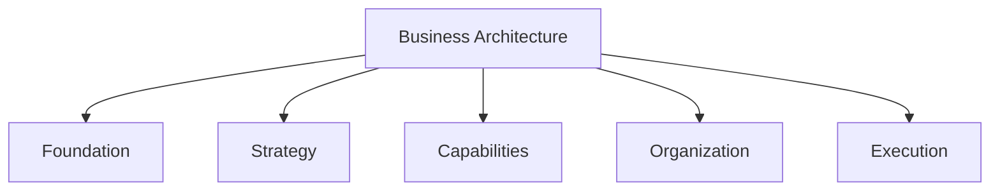
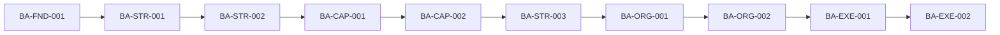

# Guivos Business Architecture

## Definição

A Guivos Business Architecture define como o negócio da Guivos transforma necessidades em valor sustentável e como a organização se estrutura para gerar, entregar, capturar e reinvestir esse valor no fortalecimento contínuo do Ecossistema Guivos.

Ela integra a Guivos Enterprise Architecture e não substitui a Foundation, a Ecosystem Architecture, a Product Architecture ou as arquiteturas especializadas de dados, tecnologia, governança e conhecimento.

## Unidades validadas

- [BA-FND-001 — Business Architecture Foundations](foundations/index.md)
- [BA-STR-001 — Business Transformation Model](strategy/business-transformation-model.md)

## Unidade ativa

- [BA-STR-002 — Business Outcomes](strategy/business-outcomes.md) — checkpoint conceitual consolidado; catálogo canônico pendente.

## Organização interna



| Camada | Pergunta principal | Ativos previstos |
|---|---|---|
| Foundation | O que é a Business Architecture na Guivos? | Propósito, escopo, limites e princípios |
| Strategy | Como o negócio transforma necessidades em resultados? | Business Transformation Model, Outcomes e Value Chains |
| Capabilities | Do que a Guivos precisa ser capaz? | Core Business Capabilities e Capability Map |
| Organization | Como a organização sustenta as capacidades? | Organizational Model e Operating Model |
| Execution | Como o negócio funciona e é medido? | Processos, KPIs e métricas |

## Sequência arquitetural

```text
Contexto
-> Necessidade
-> Priorização Estratégica
-> Capacidade
-> Produto ou Serviço
-> Experiência
-> Ecosystem Outcome
-> Business Outcome
-> Valor Gerado
-> Valor Capturado
-> Reinvestimento
-> Novo Contexto
```

Cada nível possui responsabilidade própria e não deve ser confundido com os demais.

## Ordem por dependências



A ordem de construção é determinada pelas dependências arquiteturais, conforme o ADR-004.

## Roadmap de unidades

1. `BA-FND-001` — Business Architecture Foundations — **Validated**
2. `BA-STR-001` — Business Transformation Model — **Validated**
3. `BA-STR-002` — Business Outcomes — **Draft com checkpoint conceitual consolidado**
4. `BA-CAP-001` — Core Business Capabilities
5. `BA-CAP-002` — Capability Map
6. `BA-STR-003` — Value Chains
7. `BA-ORG-001` — Organizational Model
8. `BA-ORG-002` — Operating Model
9. `BA-EXE-001` — Business Processes
10. `BA-EXE-002` — KPIs & Metrics

## Estado de maturidade

A Business Architecture está em estado **Validated em seus fundamentos e em seu modelo de transformação**.

O BA-STR-002 possui definição, propriedades, limites e governança conceitual consolidados, mas permanece `draft` até a conclusão de seus catálogos e matriz de alinhamento.
