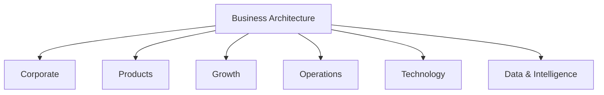
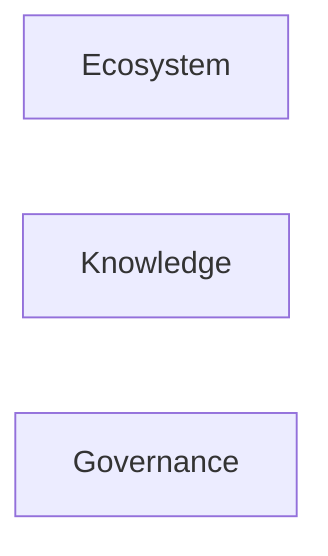

# Guivos Business Architecture

## Definição

A Guivos Business Architecture descreve como a empresa cria, entrega, sustenta e expande valor para o Ecossistema Guivos.

Ela não representa a totalidade da Enterprise Architecture. É uma de suas arquiteturas integrantes.

## Objetivo

Organizar a empresa por capacidades e cadeias de valor, preservando estabilidade mesmo quando departamentos, equipes ou cargos forem alterados.

## Áreas organizacionais iniciais

| Área | Responsabilidade principal |
|---|---|
| Corporate | Estratégia, finanças, jurídico, marca e direção institucional |
| Products | Gestão do portfólio e evolução funcional dos produtos |
| Growth | Marketing, comercial, parcerias e expansão |
| Operations | Operação diária, atendimento, qualidade e sucesso dos clientes e participantes |
| Technology | Engenharia, infraestrutura, APIs, segurança e operação tecnológica |
| Data & Intelligence | Dados, IA, analytics, modelos e inteligência do ecossistema |

## Capacidades transversais

| Capacidade | Papel |
|---|---|
| Ecosystem | Desenvolver e fortalecer participantes, organizações, coletivos e parceiros |
| Knowledge | Preservar e evoluir o patrimônio intelectual da Guivos |
| Governance | Garantir consistência, conformidade, rastreabilidade e evolução controlada |

Essas capacidades não precisam existir como departamentos independentes desde o início. Elas atravessam toda a organização e podem ser exercidas por diferentes áreas conforme a maturidade da empresa.

## Cadeia de valor de referência

A cadeia de valor é circular. Experiências geram conhecimento; conhecimento alimenta inteligência; inteligência melhora novas descobertas e decisões.

## Princípios iniciais

1. A Business Architecture será orientada por cadeias de valor e capacidades, não apenas por organogramas.
2. Produtos e áreas organizacionais são estruturas diferentes.
3. Departamentos podem mudar sem alterar as capacidades permanentes da empresa.
4. A tecnologia implementa capacidades, mas não define o negócio.
5. Conhecimento, governança e desenvolvimento do ecossistema são capacidades transversais.

## Próximos ativos arquiteturais

- mapa detalhado de cadeias de valor;
- mapa de capacidades de negócio;
- relação entre produtos e áreas responsáveis;
- modelo operacional nacional e internacional;
- parceiros, representantes e canais;
- papéis e responsabilidades;
- processos e indicadores principais.
