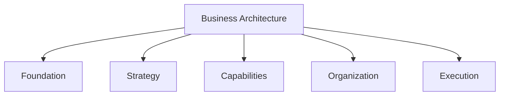

# Guivos Business Architecture

## Definição

A Guivos Business Architecture define como o negócio da Guivos transforma necessidades em valor sustentável e como a organização se estrutura para gerar, entregar, capturar e reinvestir esse valor no fortalecimento contínuo do Ecossistema Guivos.

Ela integra a Guivos Enterprise Architecture e não substitui a Foundation, a Ecosystem Architecture, a Product Architecture ou as arquiteturas especializadas de dados, tecnologia, governança e conhecimento.

## Fundamentos

A unidade oficial de fundamentos é:

- [BA-FND-001 — Business Architecture Foundations](foundations/index.md)

## Organização interna



| Camada | Pergunta principal | Ativos previstos |
|---|---|---|
| Foundation | O que é a Business Architecture na Guivos? | Propósito, escopo, limites e princípios |
| Strategy | Como o negócio transforma necessidades em resultados? | Business Transformation Model, Outcomes e Value Chains |
| Capabilities | Do que a Guivos precisa ser capaz? | Core Business Capabilities e Capability Map |
| Organization | Como a organização sustenta as capacidades? | Organizational Model e Operating Model |
| Execution | Como o negócio funciona e é medido? | Processos, KPIs e métricas |

## Sequência arquitetural

```text
Necessidade
-> Valor
-> Capacidade
-> Produto ou Serviço
-> Funcionalidade
-> Experiência
-> Resultado
```

Cada nível possui responsabilidade própria e não deve ser confundido com os demais.

## Roadmap de unidades

### Foundation

- `BA-FND-001` — Business Architecture Foundations — **Validated**

### Strategy

- `BA-STR-001` — Business Transformation Model — **Próxima unidade**
- `BA-STR-002` — Business Outcomes
- `BA-STR-003` — Value Chains

### Capabilities

- `BA-CAP-001` — Core Business Capabilities
- `BA-CAP-002` — Capability Map

### Organization

- `BA-ORG-001` — Organizational Model
- `BA-ORG-002` — Operating Model

### Execution

- `BA-EXE-001` — Business Processes
- `BA-EXE-002` — KPIs & Metrics

## Estado de maturidade

A Business Architecture está em estado **Validated em seus fundamentos**.

Ela somente poderá ser promovida a `stable` após a validação das unidades estratégicas, de capacidades, organização e execução das quais depende.
