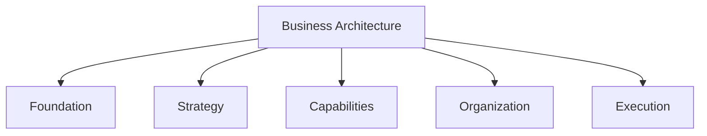
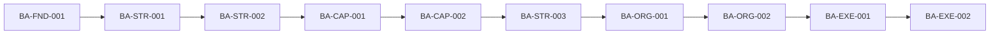

# Guivos Business Architecture

## Definição

A Guivos Business Architecture define como o negócio da Guivos transforma necessidades em valor sustentável e como a organização se estrutura para gerar, entregar, capturar e reinvestir esse valor no fortalecimento contínuo do Ecossistema Guivos.

Ela integra a Guivos Enterprise Architecture e não substitui a Foundation, a Ecosystem Architecture, a Product Architecture ou as arquiteturas especializadas de dados, tecnologia, governança e conhecimento.

## Unidades validadas

- [BA-FND-001 — Business Architecture Foundations](foundations/index.md)
- [BA-STR-001 — Business Transformation Model](strategy/business-transformation-model.md)

## Unidade ativa

- [BA-STR-002 — Business Outcomes](strategy/business-outcomes.md) — checkpoint 0.20.0; validação externa, COEM inicial e 18 decisões humanas concluídas; catálogo canônico pendente.
- [BA-STR-002-COR-001 — Candidate Outcome Register](strategy/candidate-outcome-register.md) — 18 candidatos; 9 em `Under Validation`, 3 `Merged` e 6 `Rejected`; nenhum aprovado.
- [BA-STR-002-EOVP-001 — External Outcome Validation Protocol](strategy/external-outcome-validation-protocol.md) — execução concluída com seis lotes e 60 evidências.
- [BA-STR-002-COEM-001 — Candidate Outcome Evaluation Matrix](strategy/candidate-outcome-evaluation-matrix.md) — cobertura inicial concluída para 18 candidatos e seis clusters.
- [BA-STR-002-CODR-001 — Candidate Outcome Decision Register](strategy/candidate-outcome-decision-register.md) — concluído; 18 de 18 decisões humanas registradas.
- [Human Decision Resolution — BUS-CAND-010](strategy/candidate-outcome-decision-submission-bus-cand-010.md) — `COD-018`; fusão em `BUS-CAND-005` registrada.

## Resultado da fase decisória

```text
Human decisions: 18 of 18
Under Validation: 9
Merged: 3
Rejected: 6
Approved Outcomes: 0
Canonical codes: 0
```

A última decisão aceitou `Merge into BUS-CAND-005` para `BUS-CAND-010 — Capacidade de reinvestimento responsável`.

A fusão preserva reinvestimento como decisão governada de financiamento e alocação dentro de Continuidade Econômica Sustentável. Ela não aprova o candidato-alvo e não transforma retenção ou gasto em prova de responsabilidade.

## Organização interna


```mermaid
graph TD
    BA[Business Architecture]
    BA --> F[Foundation]
    BA --> S[Strategy]
    BA --> C[Capabilities]
    BA --> O[Organization]
    BA --> E[Execution]
```

| Camada | Pergunta principal | Ativos previstos |
|---|---|---|
| Foundation | O que é a Business Architecture na Guivos? | Propósito, escopo, limites e princípios |
| Strategy | Como o negócio transforma necessidades em resultados? | Business Transformation Model, Outcomes e Value Chains |
| Capabilities | Do que a Guivos precisa ser capaz? | Core Business Capabilities e Capability Map |
| Organization | Como a organização sustenta as capacidades? | Organizational Model e Operating Model |
| Execution | Como o negócio funciona e é medido? | Processos, KPIs e métricas |

## Sequência arquitetural

```text
Contexto
→ Necessidade
→ Priorização Estratégica
→ Outcome
→ Capacidade
→ Produto ou Serviço
→ Experiência
→ Evidência
→ Aprendizado
→ Nova decisão
```

A geração, captura, financiamento e reinvestimento de valor permanecem meios e decisões governadas que sustentam Outcomes; não constituem automaticamente Outcomes independentes.

## Ordem por dependências


```mermaid
graph LR
    FND[BA-FND-001] --> STR1[BA-STR-001]
    STR1 --> STR2[BA-STR-002]
    STR2 --> CAP1[BA-CAP-001]
    CAP1 --> CAP2[BA-CAP-002]
    CAP2 --> STR3[BA-STR-003]
    STR3 --> ORG1[BA-ORG-001]
    ORG1 --> ORG2[BA-ORG-002]
    ORG2 --> EXE1[BA-EXE-001]
    EXE1 --> EXE2[BA-EXE-002]
```

A ordem de construção é determinada pelas dependências arquiteturais, conforme o ADR-004.

## Roadmap de unidades

1. `BA-FND-001` — Business Architecture Foundations — **Validated**
2. `BA-STR-001` — Business Transformation Model — **Validated**
3. `BA-STR-002` — Business Outcomes — **Draft 0.20.0; 18 decisões concluídas; reavaliação e Canon pendentes**
4. `BA-CAP-001` — Core Business Capabilities — **não iniciado**
5. `BA-CAP-002` — Capability Map
6. `BA-STR-003` — Value Chains
7. `BA-ORG-001` — Organizational Model
8. `BA-ORG-002` — Operating Model
9. `BA-EXE-001` — Business Processes
10. `BA-EXE-002` — KPIs & Metrics

## Estado de maturidade

A Business Architecture está **validada em seus fundamentos e em seu modelo de transformação**.

O BA-STR-002 concluiu Discovery, registro de candidatos, validação externa, cobertura inicial da COEM e 18 decisões humanas. Permanece `draft` porque nove formulações revisadas ou combinadas ainda precisam retornar aos quatro testes, o AQS-O01 não foi ajustado na prática, os catálogos canônicos não foram definidos e a matriz de sustentação não foi consolidada.

## Próximo incremento candidato

Após integração e nova autorização, reaplicar os quatro testes às nove formulações ativas. O incremento não poderá aprovar candidatos automaticamente, criar códigos canônicos, iniciar `BA-CAP-001` ou retomar Engenharia de Produto.