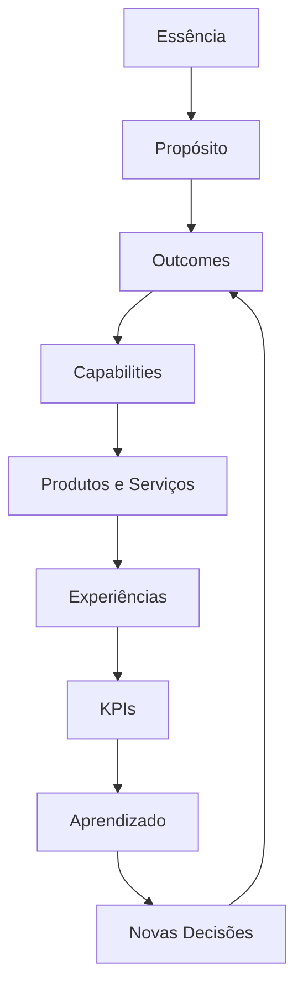
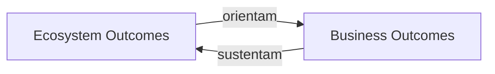

# BA-STR-002 — Business Outcomes

## Estado do ativo

Este documento registra o checkpoint conceitual do BA-STR-002.

O conceito de Outcome, suas propriedades, limites e função decisória estão consolidados para continuidade do trabalho. O catálogo canônico de Ecosystem Outcomes e Business Outcomes ainda não foi definido.

## Pergunta arquitetural

> Quais resultados definem o sucesso sustentável da Guivos?

## Objetivo

Definir como a Guivos expressa, organiza e governa os resultados permanentes que orientam sua estratégia, conectam seu propósito à execução e demonstram equilíbrio entre impacto no ecossistema e sustentabilidade do negócio.

## Definição canônica de Outcome

Outcome é um estado permanente de resultado desejado, derivado do propósito da Guivos, que orienta decisões estratégicas e pode ser observado por indicadores, independentemente dos produtos, processos, estruturas organizacionais ou tecnologias utilizados para alcançá-lo.

## Função arquitetural

Outcomes não existem apenas para medição. Eles funcionam como referências permanentes para tomada de decisão.

Um Outcome deve permitir responder:

- qual mudança permanente a Guivos pretende produzir;
- quais decisões devem ser priorizadas;
- quais capacidades são necessárias;
- quais produtos, serviços e experiências contribuem para essa mudança;
- como o progresso poderá ser observado.

## Separação conceitual

| Conceito | Função |
|---|---|
| Essência | Identidade fundamental da Guivos |
| Propósito | Razão de existir |
| Outcome | Estado permanente de resultado desejado |
| Capability | Aptidão necessária para produzir Outcomes |
| Produto ou serviço | Instrumento que materializa capacidades |
| Experiência | Momento em que o participante realiza valor |
| Resultado observado | Evidência concreta produzida em determinado período |
| KPI | Indicador utilizado para observar a evolução de um Outcome |
| Meta | Valor esperado para um KPI em um horizonte definido |

Outcome, resultado observado, KPI e meta não são equivalentes.

## Cadeia de rastreabilidade

A cadeia estabelece que:

1. Outcomes derivam da Foundation Architecture;
2. capacidades existem para produzir Outcomes;
3. produtos e serviços materializam capacidades;
4. experiências produzem evidências;
5. KPIs observam a evolução dos Outcomes;
6. aprendizado retroalimenta decisões.

## Dois níveis de Outcomes

### Ecosystem Outcomes

Representam mudanças permanentes desejadas no ecossistema e na capacidade de evolução de Pessoas, Organizações e Coletivos.

Sua definição conceitual depende da Ecosystem Architecture. A Business Architecture os referencia, mas não redefine os conceitos de participante, evolução, oportunidade ou experiência.

### Business Outcomes

Representam estados permanentes necessários para que a Guivos sustente, amplie e aperfeiçoe continuamente sua capacidade de produzir Ecosystem Outcomes.

Eles pertencem à Business Architecture.

## Relação entre os dois níveis

Regras:

1. Todo Business Outcome deve contribuir direta ou indiretamente para pelo menos um Ecosystem Outcome.
2. Todo Ecosystem Outcome deve possuir sustentação por um ou mais Business Outcomes.
3. Impacto sem sustentabilidade e sustentabilidade sem impacto são arquiteturalmente incompletos.
4. Resultados financeiros são legítimos quando conectados à continuidade e ampliação do impacto produzido.

## Propriedades obrigatórias

Todo Outcome candidato deve ser:

| Propriedade | Critério |
|---|---|
| Permanente | Expressa um estado de longo prazo, não uma ação temporária |
| Orientado ao propósito | Deriva diretamente da Foundation Architecture |
| Independente | Não depende de produto, processo, organograma ou tecnologia específica |
| Decisório | Orienta priorização, investimento ou desenho de capacidades |
| Observável | Pode ser avaliado por diferentes indicadores ao longo do tempo |
| Sustentável | Pode ser mantido ou ampliado continuamente |
| Rastreável | Relaciona-se com capacidades, produtos, experiências e KPIs |
| Estratégico | Representa uma escolha permanente, não uma iniciativa ou meta anual |

## Teste de admissibilidade

Um Outcome somente poderá integrar o catálogo canônico quando responder positivamente às seguintes perguntas:

1. Deriva diretamente do propósito da Guivos?
2. Continua válido em uma visão de longo prazo?
3. Independe dos produtos e tecnologias atuais?
4. Justifica capacidades e investimentos permanentes?
5. Orienta decisões estratégicas concretas?
6. Pode ser observado por diferentes indicadores?
7. É distinto de atividade, projeto, resultado pontual, KPI ou meta?
8. Pode ser rastreado até a execução sem ser redefinido por ela?

## Regras de governança

1. Outcomes não devem ser organizados por produto ou departamento.
2. Um novo produto, funcionalidade, processo ou tecnologia não cria automaticamente um novo Outcome.
3. A alteração de KPI ou meta não altera o Outcome correspondente.
4. Outcomes somente devem ser alterados quando houver mudança relevante no propósito ou na estratégia permanente da Guivos.
5. Toda iniciativa estratégica deve declarar quais Outcomes canônicos pretende influenciar.
6. Nenhuma Capability deve ser consolidada sem indicar quais Outcomes pretende produzir.
7. O catálogo deve permanecer reduzido, estável e livre de duplicidades.

## Uso na tomada de decisão

### Usuários do ativo

- direção e liderança estratégica;
- Business Architecture;
- Product Architecture;
- equipes de produto, operações e crescimento;
- Data & Intelligence Architecture;
- Governance Architecture.

### Decisões apoiadas

- priorização de iniciativas;
- avaliação de novos produtos e serviços;
- definição de capacidades de negócio;
- alocação de investimentos;
- seleção futura de KPIs;
- identificação de iniciativas desalinhadas ao propósito;
- análise de sobreposição entre produtos e projetos.

### Decisões fora do escopo

- escolha de tecnologias;
- desenho detalhado de processos;
- definição de organograma;
- estabelecimento de metas periódicas;
- implementação técnica de indicadores.

## Decisões arquiteturais consolidadas neste checkpoint

1. Outcome é um estado permanente de resultado desejado.
2. Outcomes derivam do propósito e orientam decisões.
3. KPIs observam Outcomes, mas não os definem.
4. Capabilities existem para produzir um ou mais Outcomes.
5. Ecosystem Outcomes e Business Outcomes são níveis distintos e interdependentes.
6. Toda iniciativa estratégica deve ser justificável por Outcomes canônicos.
7. O catálogo canônico ainda não está consolidado.

## Hipóteses preservadas fora da Canon

As seguintes hipóteses permanecem em investigação e não alteram a arquitetura oficial:

- existência de Capacidades Fundamentais do Ecossistema acima dos Outcomes;
- Discovery, Connection, Development e Prosperity como possíveis dimensões, dinâmicas ou etapas;
- propriedades emergentes como conectividade, confiança, inteligência coletiva e resiliência;
- GEA como arquitetura de capacidades em múltiplos níveis;
- Architectural Intent como possível camada intermediária entre propósito e Outcomes;
- taxonomia funcional dos produtos;
- Core Model da GEA;
- GEM e GDS como futuros ativos da Knowledge Architecture.

## Questão de pesquisa para retomada

> Quais são as propriedades ou capacidades fundamentais de um ecossistema humano capaz de promover evolução contínua?

Essa investigação deverá validar se existe uma camada anterior aos Outcomes. Até sua conclusão, nenhuma mudança será feita na estrutura oficial da GEA.

## Critérios para conclusão do BA-STR-002

O ativo somente poderá ser promovido a `validated` quando:

- o catálogo canônico de Ecosystem Outcomes estiver definido;
- o catálogo canônico de Business Outcomes estiver definido;
- a matriz de sustentação entre os dois níveis estiver concluída;
- cada Outcome passar pelo teste de admissibilidade;
- a hipótese de uma camada anterior aos Outcomes for confirmada ou rejeitada;
- a relação com BA-CAP-001 estiver suficientemente clara.

## Próxima etapa

Validar a questão de pesquisa sobre propriedades ou capacidades fundamentais do ecossistema antes de concluir o catálogo canônico de Outcomes.
