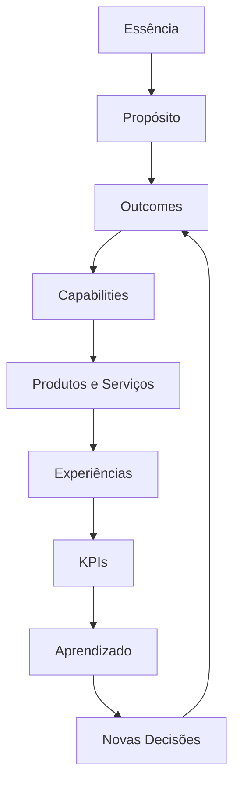
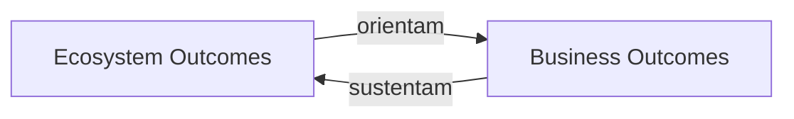

# BA-STR-002 — Business Outcomes

## Estado do ativo

Este documento registra o checkpoint conceitual, metodológico e de execução cumulativa da validação externa do BA-STR-002.

O conceito de Outcome, suas propriedades, limites, função decisória e método de governança estão definidos. O primeiro [Candidate Outcome Register](candidate-outcome-register.md) possui 18 hipóteses rastreáveis, e o [External Outcome Validation Protocol](external-outcome-validation-protocol.md) está em execução governada. O [primeiro lote](outcome-validation-batch-01-agency-evolution.md) cobriu agência e evolução; o [segundo lote](outcome-validation-batch-02-trust.md) cobriu confiança e a fronteira Ecosystem–Business; o [terceiro lote](outcome-validation-batch-03-value-continuity.md) cobriu valor e continuidade; o [quarto lote](outcome-validation-batch-04-resilience.md) cobriu resiliência e aprofundou continuidade sem recontagem; o [quinto lote](outcome-validation-batch-05-adaptation.md) cobriu adaptação. Há 45 evidências registradas e 13 candidatos em `Under Validation`. Os catálogos canônicos ainda não foram consolidados.

## Pergunta arquitetural

> Quais resultados definem o sucesso sustentável da Guivos?

## Objetivo

Definir como a Guivos expressa, organiza e governa os resultados permanentes que orientam sua estratégia, conectam seu propósito à execução e demonstram equilíbrio entre impacto no ecossistema e sustentabilidade do negócio.

## Definição canônica de Outcome

Outcome é um estado permanente de resultado desejado, derivado do propósito da Guivos, que orienta decisões estratégicas e pode ser observado por indicadores, independentemente dos produtos, processos, estruturas organizacionais ou tecnologias utilizados para alcançá-lo.

## Função arquitetural

Outcomes não existem apenas para medição. Eles funcionam como referências permanentes para tomada de decisão.

Um Outcome deve permitir responder:

- qual mudança permanente a Guivos pretende produzir;
- quais decisões devem ser priorizadas;
- quais capacidades são necessárias;
- quais produtos, serviços e experiências contribuem para essa mudança;
- como o progresso poderá ser observado.

## Separação conceitual

| Conceito | Função |
|---|---|
| Essência | Identidade fundamental da Guivos |
| Propósito | Razão de existir |
| Outcome | Estado permanente de resultado desejado |
| Capability | Aptidão necessária para produzir Outcomes |
| Produto ou serviço | Instrumento que materializa capacidades |
| Experiência | Momento em que o participante realiza valor |
| Resultado observado | Evidência concreta produzida em determinado período |
| KPI | Indicador utilizado para observar a evolução de um Outcome |
| Meta | Valor esperado para um KPI em um horizonte definido |

Outcome, resultado observado, KPI e meta não são equivalentes.

## Cadeia de rastreabilidade

A cadeia estabelece que:

1. Outcomes derivam da Foundation Architecture;
2. capacidades existem para produzir Outcomes;
3. produtos e serviços materializam capacidades;
4. experiências produzem evidências;
5. KPIs observam a evolução dos Outcomes;
6. aprendizado retroalimenta decisões.

## Dois níveis de Outcomes

### Ecosystem Outcomes

Representam condições permanentes desejadas do ecossistema que aumentam a probabilidade de transformação positiva de Pessoas, Organizações e Coletivos.

Sua definição conceitual depende da Ecosystem Architecture. A Business Architecture os referencia, mas não redefine os conceitos de participante, evolução, oportunidade ou experiência.

### Business Outcomes

Representam estados permanentes necessários para que a Guivos sustente, amplie e aperfeiçoe continuamente sua capacidade de produzir Ecosystem Outcomes.

Eles pertencem à Business Architecture.

## Princípio de responsabilidade

A Guivos não controla a transformação dos participantes.

Ela projeta, opera e evolui um ecossistema que amplia as condições para que Pessoas, Organizações e Coletivos realizem sua própria transformação.

Portanto, um Ecosystem Outcome:

- descreve uma condição do ecossistema;
- respeita a autonomia dos participantes;
- não promete resultados individuais determinísticos;
- não atribui à Guivos controle sobre decisões pessoais ou organizacionais.

## Relação entre os dois níveis

Regras:

1. Todo Business Outcome deve contribuir direta ou indiretamente para pelo menos um Ecosystem Outcome.
2. Todo Ecosystem Outcome deve possuir sustentação por um ou mais Business Outcomes.
3. Impacto sem sustentabilidade e sustentabilidade sem impacto são arquiteturalmente incompletos.
4. Resultados financeiros são legítimos quando conectados à continuidade e ampliação do impacto produzido.

## Propriedades obrigatórias

Todo Outcome candidato deve ser:

| Propriedade | Critério |
|---|---|
| Permanente | Expressa um estado de longo prazo, não uma ação temporária |
| Orientado ao propósito | Deriva diretamente da Foundation Architecture |
| Ecossistêmico ou empresarial | Pertence claramente ao nível de Outcome correspondente |
| Independente | Não depende de produto, processo, organograma ou tecnologia específica |
| Decisório | Orienta priorização, investimento ou desenho de capacidades |
| Observável | Pode ser avaliado por diferentes indicadores ao longo do tempo |
| Sustentável | Pode ser mantido ou ampliado continuamente |
| Rastreável | Relaciona-se com capacidades, produtos, experiências e KPIs |
| Estratégico | Representa uma escolha permanente, não uma iniciativa ou meta anual |
| Não redundante | Não duplica outro Outcome canônico |

## Teste de admissibilidade

Um Outcome somente poderá integrar o catálogo canônico quando responder positivamente às seguintes perguntas:

1. Deriva diretamente do propósito da Guivos?
2. Continua válido em uma visão de longo prazo?
3. Independe dos produtos e tecnologias atuais?
4. Justifica capacidades e investimentos permanentes?
5. Orienta decisões estratégicas concretas?
6. Pode ser observado por diferentes indicadores?
7. É distinto de atividade, projeto, resultado pontual, KPI ou meta?
8. Pode ser rastreado até a execução sem ser redefinido por ela?
9. Respeita a fronteira de responsabilidade entre ecossistema e participante?
10. É distinto dos demais Outcomes aprovados?

## Método de governança dos Outcomes

O processo oficial está definido em [Outcome Governance Method](../../governance-framework/outcome-governance-method.md).

### Candidate Outcome Register — COR

O COR registra todos os candidatos antes de qualquer aprovação. Ele preserva hipóteses, sobreposições, rejeições, incorporações e adiamentos.

### External Validation

A validação externa confronta os grupos de candidatos com referências diretamente relevantes, buscando confirmação, ampliação, contradição ou omissões.

### Candidate Outcome Evaluation Matrix — COEM

A COEM aplica, no mínimo:

| Teste | Pergunta |
|---|---|
| Essential Test | Sem essa condição, o propósito continua alcançável de forma sustentável? |
| Decision Test | Sua degradação contínua exigiria revisão estratégica? |
| Replacement Test | Continua válida após substituição dos produtos e tecnologias atuais? |
| Outcome Quality Test | Atende às propriedades e ao teste de admissibilidade? |

### Estados de avaliação

- Candidate;
- Under Validation;
- Approved;
- Rejected;
- Merged;
- Deferred.

## Outcome Quality Standard — AQS-O01

O AQS-O01 permanece em validação prática. Ele somente será promovido a padrão estável após aplicação aos primeiros candidatos.

Além dos critérios de qualidade, ele define que cada Outcome consolidado deverá possuir:

- código;
- nome;
- definição canônica;
- justificativa;
- rastreabilidade;
- indicadores de evidência possíveis;
- produtos contribuintes.

### Padrão de redação

- descrever um estado, não uma ação;
- não citar produtos, canais, tecnologias ou metas;
- manter uma ideia principal por Outcome;
- utilizar formulação afirmativa;
- evitar substantivos isolados como definição;
- usar o ecossistema como sujeito quando isso aumentar a precisão.

## Limites metodológicos

1. Ecosystem Outcomes não representam etapas de uma jornada do participante.
2. Um ciclo de descoberta, conexão, participação, contribuição e evolução pode ser investigado futuramente na arquitetura adequada, mas não organiza o catálogo atual.
3. Taxonomias de fenômenos do ecossistema não bloqueiam o BA-STR-002.
4. Dimensões, propriedades emergentes e novas camadas permanecem fora da Canon enquanto não forem dependências comprovadas.
5. Nenhum refinamento conceitual deve bloquear a evolução da arquitetura quando a estrutura atual já permitir decisões corretas.
6. Nenhum conceito canônico nasce diretamente na Canon.

## Regras de governança

1. Outcomes não devem ser organizados por produto ou departamento.
2. Um novo produto, funcionalidade, processo ou tecnologia não cria automaticamente um novo Outcome.
3. A alteração de KPI ou meta não altera o Outcome correspondente.
4. Outcomes somente devem ser alterados quando houver mudança relevante no propósito ou na estratégia permanente da Guivos.
5. Toda iniciativa estratégica deve declarar quais Outcomes canônicos pretende influenciar.
6. Nenhuma Capability deve ser consolidada sem indicar quais Outcomes pretende produzir.
7. O catálogo deve permanecer reduzido, estável e livre de duplicidades.
8. Candidatos rejeitados, incorporados ou adiados devem permanecer rastreáveis no COR e na COEM.

## Uso na tomada de decisão

### Usuários do ativo

- direção e liderança estratégica;
- Business Architecture;
- Product Architecture;
- equipes de produto, operações e crescimento;
- Data & Intelligence Architecture;
- Governance Architecture.

### Decisões apoiadas

- priorização de iniciativas;
- avaliação de novos produtos e serviços;
- definição de capacidades de negócio;
- alocação de investimentos;
- seleção futura de KPIs;
- identificação de iniciativas desalinhadas ao propósito;
- análise de sobreposição entre produtos e projetos.

### Decisões fora do escopo

- escolha de tecnologias;
- desenho detalhado de processos;
- definição de organograma;
- estabelecimento de metas periódicas;
- implementação técnica de indicadores.

## Decisões arquiteturais consolidadas neste checkpoint

1. Outcome é um estado permanente de resultado desejado.
2. Outcomes derivam do propósito e orientam decisões.
3. KPIs observam Outcomes, mas não os definem.
4. Capabilities existem para produzir um ou mais Outcomes.
5. Ecosystem Outcomes e Business Outcomes são níveis distintos e interdependentes.
6. Ecosystem Outcomes descrevem condições do ecossistema, não transformações controladas pela Guivos.
7. Todo candidato deve percorrer Discovery, COR, External Validation e COEM antes da Canon.
8. O AQS-O01 será validado na prática antes de estabilização.
9. O COR inicial contém oito candidatos de ecossistema e dez candidatos empresariais, todos em estado `Candidate`.
10. O catálogo canônico ainda não está consolidado.
11. A validação externa possui protocolo próprio, cobrindo individualmente os 18 candidatos, os seis clusters de sobreposição, contradições e omissões materiais.
12. A existência do protocolo não altera o estado dos candidatos nem autoriza a COEM.

## Hipóteses preservadas fora da Canon

As seguintes hipóteses permanecem registradas, mas não bloqueiam o BA-STR-002:

- existência de Capacidades Fundamentais do Ecossistema acima dos Outcomes;
- Discovery, Connection, Development e Prosperity como possíveis dimensões, dinâmicas ou etapas;
- propriedades emergentes como conectividade, confiança, inteligência coletiva e resiliência;
- taxonomia dos fenômenos do ecossistema;
- ciclo de geração de valor do participante;
- GEA como arquitetura de capacidades em múltiplos níveis;
- Architectural Intent como possível camada intermediária entre propósito e Outcomes;
- taxonomia funcional dos produtos;
- Core Model da GEA;
- GEM e GDS como futuros ativos da Knowledge Architecture.

## Critérios para conclusão do BA-STR-002

O ativo somente poderá ser promovido a `validated` quando:

- o Candidate Outcome Register estiver concluído;
- a validação externa dos candidatos estiver registrada;
- a COEM estiver concluída;
- o AQS-O01 tiver sido testado e ajustado;
- o catálogo canônico de Ecosystem Outcomes estiver definido;
- o catálogo canônico de Business Outcomes estiver definido;
- a matriz de sustentação entre os dois níveis estiver concluída;
- cada Outcome passar pelo teste de admissibilidade;
- a relação com BA-CAP-001 estiver suficientemente clara.

## Estado dos critérios de conclusão

| Critério | Estado |
|---|---|
| Candidate Outcome Register concluído | atendido no primeiro passe interno |
| protocolo de validação externa | atendido; execução não iniciada |
| validação externa registrada | pendente |
| COEM concluída | pendente |
| AQS-O01 testado e ajustado | pendente |
| catálogo canônico de Ecosystem Outcomes | pendente |
| catálogo canônico de Business Outcomes | pendente |
| matriz canônica de sustentação | pendente |
| relação suficiente com BA-CAP-001 | pendente |

## Próxima etapa

Preparar e submeter para aprovação separada a execução do **External Outcome Validation Protocol**. A coleta deverá registrar evidências no `RP-001-EVIDENCE`, e nenhum candidato receberá código canônico `EO-###` ou `BO-###` antes de passar pela validação externa e pela COEM.
