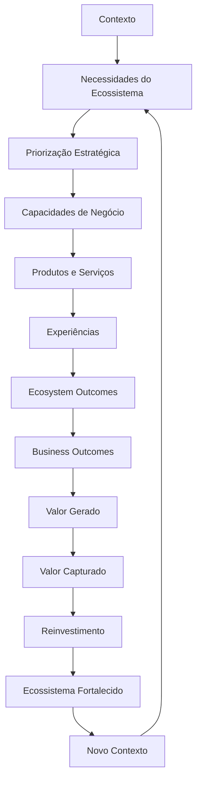

# BA-STR-001 — Business Transformation Model

## Objetivo

Definir o modelo canônico que explica como o negócio da Guivos transforma necessidades do ecossistema em valor sustentável.

## Definição

O Business Transformation Model representa o ciclo contínuo pelo qual a Guivos identifica necessidades originadas no ecossistema, prioriza respostas, mobiliza capacidades, viabiliza produtos, serviços e experiências, produz resultados, gera e captura valor e reinveste parte desse valor no fortalecimento do próprio ecossistema.

O modelo descreve a lógica permanente do negócio. Ele não descreve produtos específicos, processos, departamentos ou tecnologias.

## Fronteira entre ecossistema e negócio

A Ecosystem Architecture é responsável por explicar participantes, contextos, necessidades, jornadas, oportunidades, experiências e evolução.

A Business Architecture começa quando a Guivos decide responder a uma necessidade do ecossistema por meio de capacidades organizadas e sustentáveis.

A necessidade funciona como interface entre a Ecosystem Architecture e a Business Architecture.

## Modelo canônico

## Elementos do modelo

| Elemento | Definição |
|---|---|
| Contexto | Condições atuais de uma Pessoa, Organização ou Coletivo |
| Necessidade | Demanda, lacuna, intenção ou oportunidade relevante identificada no ecossistema |
| Priorização Estratégica | Decisão sobre quais necessidades a Guivos responderá, considerando propósito, impacto, recursos e sustentabilidade |
| Capacidades de Negócio | Aptidões permanentes necessárias para produzir resultados |
| Produtos e Serviços | Instrumentos que materializam combinações de capacidades |
| Experiências | Interações nas quais o participante percebe e realiza valor |
| Ecosystem Outcomes | Resultados de evolução produzidos para Pessoas, Organizações e Coletivos |
| Business Outcomes | Resultados necessários para sustentar e ampliar a capacidade da Guivos de produzir Ecosystem Outcomes |
| Valor Gerado | Benefícios efetivamente produzidos e percebidos no ecossistema |
| Valor Capturado | Parcela de valor apropriada legitimamente pela Guivos para sustentar sua operação e evolução |
| Reinvestimento | Aplicação de valor capturado em capacidades, produtos, conhecimento, tecnologia e fortalecimento do ecossistema |
| Ecossistema Fortalecido | Condição resultante de maior capacidade de conexão, oportunidade, experiência e evolução |
| Novo Contexto | Estado resultante que origina novas necessidades e reinicia o ciclo |

## Dupla geração de valor

A Guivos mede resultados em dois níveis complementares:

### Ecosystem Outcomes

Representam a transformação gerada para Pessoas, Organizações e Coletivos.

### Business Outcomes

Representam a capacidade da Guivos de sustentar e ampliar essa transformação.

Regras:

1. Todo Business Outcome deve contribuir direta ou indiretamente para pelo menos um Ecosystem Outcome.
2. Todo Ecosystem Outcome deve possuir um ou mais Business Outcomes capazes de sustentar sua continuidade.
3. Resultados financeiros são legítimos quando conectados à sustentabilidade do impacto gerado.
4. Impacto sem sustentabilidade e sustentabilidade sem impacto são arquiteturalmente incompletos.

## Princípios permanentes

1. O negócio responde ao ecossistema.
2. Contexto e necessidade antecedem a resposta empresarial.
3. Capacidades antecedem produtos, serviços e processos.
4. Produtos e serviços são meios, não o centro do modelo.
5. Experiências são o ponto de realização do valor para o participante.
6. Outcomes antecedem a medição por indicadores.
7. Valor gerado, valor capturado e reinvestimento devem permanecer equilibrados.
8. Todo resultado produz um novo contexto; o modelo é cíclico.
9. O modelo deve permanecer válido independentemente de produtos, países, organogramas e tecnologias.
10. Nenhuma unidade dependente deve ser consolidada antes dos conceitos dos quais depende.

## Papéis funcionais dos produtos

O modelo canônico não depende de produtos específicos. Entretanto, os produtos podem ser testados contra três papéis funcionais de trabalho:

| Papel | Função no modelo |
|---|---|
| Execução | Materializa capacidades e viabiliza experiências |
| Ativação | Influencia contexto, percepção, descoberta e surgimento de necessidades |
| Inteligência | Observa, mede, aprende e otimiza o ciclo |

Essa classificação permanece como hipótese de trabalho da Product Architecture e não altera a estrutura canônica deste modelo.

## Relações com outras arquiteturas

| Arquitetura | Relação |
|---|---|
| Foundation Architecture | Define propósito, princípios e limites institucionais |
| Ecosystem Architecture | Define participantes, contextos, necessidades, experiências e evolução |
| Product Architecture | Materializa capacidades em produtos e serviços |
| Data & Intelligence Architecture | Mede outcomes, valor, padrões e aprendizado do ciclo |
| Technology Architecture | Implementa capacidades e operações |
| Governance Architecture | Controla decisões, riscos e evolução do modelo |
| Knowledge Architecture | Preserva conceitos, decisões, evidências e aprendizados |

## Dependências arquiteturais

## Critérios de validação

Esta unidade é considerada validada quando:

- explica o funcionamento do negócio sem depender de produtos específicos;
- mantém fronteira clara entre Ecosystem e Business Architecture;
- diferencia Ecosystem Outcomes de Business Outcomes;
- suporta a inclusão de produtos atuais e futuros sem exceções estruturais;
- permanece independente de tecnologia, processo e organograma;
- permite construir Outcomes, Capabilities, Value Chains, Organization, Processes e KPIs por dependência explícita.

## Decisões arquiteturais tomadas

1. A necessidade é a principal interface entre Ecosystem Architecture e Business Architecture.
2. O Business Transformation Model é cíclico e orientado por estados permanentes do negócio.
3. O participante e o ecossistema são origem e destino do ciclo.
4. A Guivos atua como facilitadora e orquestradora da transformação, não como centro do sistema.
5. Ecosystem Outcomes e Business Outcomes são níveis distintos e interdependentes.
6. Capacidades são definidas antes de Value Chains, organização e processos.
7. A próxima unidade é `BA-STR-002 — Business Outcomes`.

## Evolução prevista

A versão `1.0.0` será avaliada após a validação de `BA-STR-002`, `BA-CAP-001` e `BA-CAP-002`, que testarão a estabilidade do modelo sem alterar sua estrutura principal.
