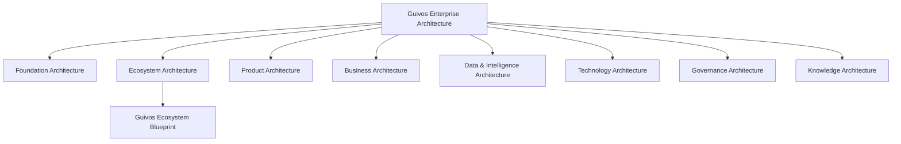

# Guivos Enterprise Architecture

## Definição

A Guivos Enterprise Architecture (GEA) é o sistema de arquiteturas que organiza, conecta e governa a evolução da Guivos como ecossistema, empresa e plataforma de produtos.

A GEA não é uma arquitetura isolada. Ela é o guarda-chuva que integra todas as arquiteturas oficiais da Guivos.

O Guivos Knowledge Repository (GKR) é a fonte oficial em que a GEA é documentada, versionada, publicada e governada.

## Missão

Projetar, preservar e evoluir uma arquitetura empresarial de classe mundial, baseada em fundamentos sólidos, validada por evidências e orientada à tomada de decisões estratégicas de longo prazo.

## Estrutura oficial

## Arquiteturas integrantes

| Arquitetura | Pergunta principal | Situação |
|---|---|---|
| Foundation Architecture | Por que a Guivos existe e quais são seus princípios fundamentais? | Consolidada em sua base |
| Ecosystem Architecture | Como ocorre a transformação dos participantes? | Em consolidação por meio do GEB |
| Product Architecture | Quais produtos materializam capacidades e propostas de valor? | Consolidada em sua estrutura inicial |
| Business Architecture | Como a Guivos gera, entrega, captura e reinveste valor para sustentar o ecossistema? | Fundamentos validados |
| Data & Intelligence Architecture | Como dados e conhecimento se tornam inteligência aplicada? | Planejada |
| Technology Architecture | Como as capacidades são implementadas tecnicamente? | Planejada |
| Governance Architecture | Como decisões, riscos e mudanças são controlados? | Parcialmente iniciada |
| Knowledge Architecture | Como o patrimônio intelectual é criado, consolidado e preservado? | Parcialmente iniciada pelo GKR |

## Relação entre GEA, GKR e GEB

- **GEA** é o conjunto integrado das arquiteturas da Guivos.
- **GKR** é o repositório oficial e a fonte única da verdade.
- **GEB** é o blueprint principal da Ecosystem Architecture.

## Responsabilidade conceitual

Todo conceito, modelo, capacidade, ativo arquitetural ou decisão canônica deve possuir uma única arquitetura proprietária.

Arquiteturas consumidoras podem utilizar e referenciar esses ativos, mas não redefini-los.

A decisão completa está registrada no [ADR-003 — Architectural Ownership](../adr/ADR-003-architectural-ownership.md).

## Princípios permanentes

### A arquitetura precede a implementação

Decisões estruturais devem ser definidas antes da implementação de software, processos ou produtos.

### O conhecimento precede a arquitetura

Arquiteturas devem utilizar conceitos consolidados e rastreáveis no GKR.

### Uma decisão, uma fonte da verdade

Cada decisão arquitetural deve possuir um único registro oficial, evitando documentos paralelos e versões concorrentes.

### Propriedade arquitetural única

Cada ativo canônico deve possuir uma única arquitetura proprietária responsável por sua definição, evolução e governança.

### Separação entre arquiteturas

Negócio, produto, dados, tecnologia, governança e conhecimento são domínios relacionados, mas não intercambiáveis.

### Independência tecnológica

Conceitos e capacidades de negócio devem permanecer válidos mesmo quando linguagens, fornecedores, frameworks ou infraestrutura forem substituídos.

### Evolução controlada

Alterações estruturais devem ser registradas por meio da governança do GKR e, quando necessário, por Architecture Decision Records.

### Estabilidade como ativo

A arquitetura deve evoluir por aumento de clareza, consistência e completude, evitando mudanças estruturais sem necessidade comprovada.

### Orientação à decisão

Todo ativo arquitetural deve apoiar decisões reais e declarar quais decisões orienta e quais não orienta.

### Evidência arquitetural

Nenhuma decisão estrutural deve ser tomada apenas por preferência. Alterações relevantes devem combinar fundamentos externos, necessidade interna, simplicidade e escalabilidade.

### Simplicidade estrutural

A GEA deve crescer em profundidade, clareza e integração, evitando novas camadas quando a arquitetura existente já comportar o conceito.

## Fluxo oficial de decisão

## Tipos de ativos de governança

| Ativo | Pergunta respondida |
|---|---|
| Canon | Como a Guivos funciona? |
| ADR | Por que uma decisão arquitetural foi tomada? |
| AV | Como a decisão ou estrutura foi validada? |

A primeira validação formal está registrada em [AV-001 — GEA Structure Validation](../validation/AV-001-gea-structure-validation.md).

## Padrão das arquiteturas

Cada arquitetura da GEA deve, progressivamente, documentar:

1. objetivo e definição;
2. propósito;
3. escopo e limites;
4. princípios;
5. modelos canônicos;
6. capacidades ou componentes;
7. relações com outras arquiteturas;
8. uso na tomada de decisão;
9. critérios de validação;
10. decisões arquiteturais tomadas;
11. evolução prevista.

## Regra de maturidade

Os estados de maturidade são:

| Estado | Significado |
|---|---|
| Draft | Em construção inicial |
| Validated | Conceitualmente validado e utilizável |
| Canonical | Integrante da versão canônica vigente |
| Stable | Improvável de sofrer alterações estruturais |

Nenhuma unidade deve ser considerada `stable` antes que suas dependências estejam, no mínimo, `validated`.

## Regra de estabilidade

A estrutura principal da GEA constitui a base da versão Canon 1.0 e está estruturalmente congelada.

Refinamentos e novos ativos podem ocorrer dentro das arquiteturas sem alterar essa estrutura. Mudanças no conjunto principal de arquiteturas exigem justificativa formal, evidência arquitetural e ADR.
