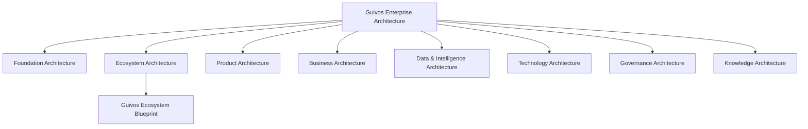

# Guivos Enterprise Architecture

## Definição

A Guivos Enterprise Architecture (GEA) é o sistema de arquiteturas que organiza, conecta e governa a evolução da Guivos como ecossistema, empresa e plataforma de produtos.

A GEA não é uma arquitetura isolada. Ela é o guarda-chuva que integra todas as arquiteturas oficiais da Guivos.

O Guivos Knowledge Repository (GKR) é a fonte oficial em que a GEA é documentada, versionada, publicada e governada.

## Estrutura oficial

## Arquiteturas integrantes

| Arquitetura | Pergunta principal | Situação |
|---|---|---|
| Foundation Architecture | Por que a Guivos existe? | Consolidada em sua base |
| Ecosystem Architecture | Como o ecossistema funciona? | Em consolidação por meio do GEB |
| Product Architecture | Como a Guivos entrega valor por produtos? | Consolidada em sua estrutura inicial |
| Business Architecture | Como a empresa cria, entrega e sustenta valor? | Iniciada |
| Data & Intelligence Architecture | Como dados e conhecimento se tornam inteligência aplicada? | Planejada |
| Technology Architecture | Como as capacidades são implementadas tecnicamente? | Planejada |
| Governance Architecture | Como decisões, riscos e mudanças são controlados? | Parcialmente iniciada |
| Knowledge Architecture | Como o patrimônio intelectual é criado, consolidado e preservado? | Parcialmente iniciada pelo GKR |

## Relação entre GEA, GKR e GEB

- **GEA** é o conjunto integrado das arquiteturas da Guivos.
- **GKR** é o repositório oficial e a fonte única da verdade.
- **GEB** é o blueprint principal da Ecosystem Architecture.

## Princípios permanentes

### A arquitetura precede a implementação

Decisões estruturais devem ser definidas antes da implementação de software, processos ou produtos.

### O conhecimento precede a arquitetura

Arquiteturas devem utilizar conceitos consolidados e rastreáveis no GKR.

### Uma decisão, uma fonte da verdade

Cada decisão arquitetural deve possuir um único registro oficial, evitando documentos paralelos e versões concorrentes.

### Separação entre arquiteturas

Negócio, produto, dados, tecnologia, governança e conhecimento são domínios relacionados, mas não intercambiáveis.

### Independência tecnológica

Conceitos e capacidades de negócio devem permanecer válidos mesmo quando linguagens, fornecedores, frameworks ou infraestrutura forem substituídos.

### Evolução controlada

Alterações estruturais devem ser registradas por meio da governança do GKR e, quando necessário, por Architecture Decision Records.

## Fluxo oficial de decisão

## Padrão das arquiteturas

Cada arquitetura da GEA deve, progressivamente, documentar:

1. propósito;
2. escopo;
3. princípios;
4. modelo conceitual;
5. cadeias de valor ou fluxos relevantes;
6. capacidades;
7. componentes;
8. integrações;
9. governança e ADRs;
10. roadmap.

## Regra de estabilidade

A estrutura principal da GEA constitui a base da versão Canon 1.0.

Refinamentos e novos artefatos podem ocorrer dentro das arquiteturas sem alterar essa estrutura. Mudanças no conjunto principal de arquiteturas exigem revisão arquitetural formal.
