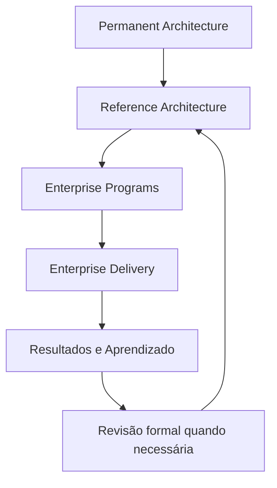
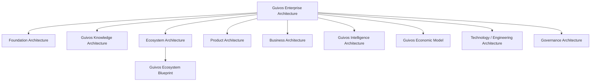
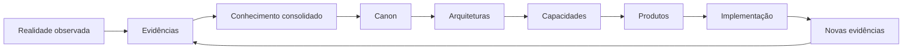

# Guivos Enterprise Architecture

## Definição

A Guivos Enterprise Architecture (GEA) é o sistema de arquiteturas que organiza, conecta e governa a evolução da Guivos como ecossistema, empresa e plataforma de produtos.

A GEA não é uma arquitetura isolada. Ela é o guarda-chuva que integra todas as arquiteturas oficiais da Guivos.

O Guivos Knowledge Repository (GKR) é a fonte oficial em que a GEA é documentada, versionada, publicada e governada.

## Missão

Projetar, preservar e evoluir uma arquitetura empresarial de classe mundial, baseada em fundamentos sólidos, conhecimento consolidado, validação por evidências e decisões estratégicas de longo prazo.

## Arquitetura de maturidade

A GEA representa a Guivos em sua capacidade institucional máxima. Ela não deve ser limitada pelo estágio atual da implementação.

A execução ocorre progressivamente por meio de arquiteturas de referência, programas corporativos e entregas, sem reduzir a visão permanente da organização.

> A Guivos é concebida em sua capacidade máxima. A implementação realiza progressivamente essa visão.

## Dois eixos de organização

A GEA classifica seus ativos por dois eixos complementares:

1. **Domínio arquitetural:** Foundation, Knowledge, Ecosystem, Product, Business, Data & Intelligence, Technology e Governance.
2. **Permanência:** Permanent Architecture, Reference Architecture, Enterprise Programs e Enterprise Delivery.

O domínio define a responsabilidade conceitual. A camada de permanência define horizonte, velocidade de mudança e governança.

Consulte o [GEA-PLM-001 — Permanence Layer Model](permanence-layer-model.md).

## Modelo de camadas de permanência

| Camada | Horizonte | Pergunta principal |
|---|---|---|
| Permanent Architecture | Décadas | O que continuará verdadeiro na maturidade da Guivos? |
| Reference Architecture | Anos | Qual é a melhor forma arquitetural conhecida de realizar a visão? |
| Enterprise Programs | Meses e ciclos plurianuais | Quais programas transformarão a arquitetura em realidade? |
| Enterprise Delivery | Dias, semanas e releases | O que será entregue agora e como será implementado? |

## Estrutura oficial

## Arquiteturas integrantes

| Arquitetura | Pergunta principal | Situação |
|---|---|---|
| Foundation Architecture | Quem é a Guivos e por que ela existe? | Frozen em A2-B3 |
| Guivos Knowledge Architecture | Como a Guivos descobre, valida, consolida e evolui conhecimento institucional? | Reconhecida por ADR-006; documentação interna pendente |
| Ecosystem Architecture | Como ocorre a transformação dos participantes? | Em consolidação por meio do GEB |
| Product Architecture | Quais produtos materializam capacidades e propostas de valor? | Consolidada em sua estrutura superior |
| Business Architecture | Como a Guivos gera, entrega, captura e reinveste valor para sustentar o ecossistema? | A2-R03 ativa; BA-STR-002 com COR e protocolo de validação concluídos, execução externa pendente |
| Guivos Intelligence Architecture | Como conhecimento, dados, contexto e conexões se tornam inteligência aplicada? | Conceitos superiores consolidados |
| Guivos Economic Model | Como a Guivos sustenta economicamente o ecossistema sem contrariar seu propósito? | Arquitetura documental inicial concluída; validação empírica e especializada pendente |
| Technology / Engineering Architecture | Como as capacidades são implementadas tecnicamente? | Planejada |
| Governance Architecture | Como decisões, riscos e mudanças são controlados? | Parcialmente iniciada |

## Relação entre GEA, GKR, GKA e GEB

- **GEA** é o conjunto integrado das arquiteturas da Guivos.
- **GKR** preserva a representação canônica da Guivos em seu estado de maturidade e as justificativas que sustentam sua arquitetura.
- **GKA** governa como o conhecimento institucional é descoberto, validado, consolidado, promovido à Canon e evoluído.
- **GEB** é o blueprint principal da Ecosystem Architecture.

## Responsabilidade conceitual

Todo conceito, modelo, capacidade, ativo arquitetural ou decisão canônica deve possuir uma única arquitetura proprietária.

Arquiteturas consumidoras podem utilizar e referenciar esses ativos, mas não redefini-los.

A decisão de ownership está registrada no [ADR-003 — Architectural Ownership](../adr/ADR-003-architectural-ownership.md).

O reconhecimento da Guivos Knowledge Architecture está registrado no [ADR-006 — Guivos Knowledge Architecture as a First-Class Architecture](../adr/ADR-006-guivos-knowledge-architecture.md).

## Princípios permanentes

### A arquitetura precede a implementação

Decisões estruturais devem ser definidas antes da implementação de software, processos ou produtos.

### O conhecimento precede a arquitetura

Arquiteturas permanentes devem derivar de conhecimento consolidado e rastreável.

### A realidade precede o conhecimento

O conhecimento institucional deve permanecer aderente à realidade observada. Quando evidências consistentes demonstrarem inadequação, o conhecimento deverá ser revisado pelos processos formais da GKA.

### Uma decisão, uma fonte da verdade

Cada decisão arquitetural deve possuir um único registro oficial, evitando documentos paralelos e versões concorrentes.

### Propriedade arquitetural única

Cada ativo canônico deve possuir uma única arquitetura proprietária responsável por sua definição, evolução e governança.

### Separação entre arquiteturas

Negócio, produto, dados, inteligência, tecnologia, governança e conhecimento são domínios relacionados, mas não intercambiáveis.

### Independência tecnológica

Conceitos e capacidades de negócio devem permanecer válidos mesmo quando linguagens, fornecedores, frameworks ou infraestrutura forem substituídos.

### Evolução controlada

Alterações estruturais devem ser registradas por meio da governança do GKR e, quando necessário, por Architecture Decision Records.

### Estabilidade como ativo

A arquitetura deve evoluir por aumento de clareza, consistência e completude, evitando mudanças estruturais sem necessidade comprovada.

### Orientação à decisão

Todo ativo arquitetural deve apoiar decisões reais e declarar quais decisões orienta e quais não orienta.

### Evidência arquitetural

Nenhuma decisão estrutural deve ser tomada apenas por preferência. Alterações relevantes devem combinar fundamentos externos, necessidade interna, simplicidade e escalabilidade.

### Simplicidade estrutural

A GEA deve crescer em profundidade, clareza e integração, evitando novas camadas quando a arquitetura existente já comportar o conceito.

### Institutional Permanence

Todo conteúdo canônico deve representar a Guivos em seu estado de maturidade institucional, e não apenas seu estágio atual de implementação.

### Vision First

A implementação aproxima a realidade da visão. Restrições temporárias não redefinem automaticamente a arquitetura de maturidade.

### Architectural Gravity

Quanto maior a permanência de um ativo, menor deve ser sua velocidade de mudança e maior deve ser o rigor aplicado à sua evolução.

### Progressive Realization

A Guivos é concebida em sua capacidade máxima e realizada progressivamente por programas, entregas e ciclos de implementação.

### Layer Integrity

Todo ativo relevante deve declarar domínio, camada de permanência, owner, horizonte e processo autorizado de mudança.

## Fluxo oficial de fundamentação

## Tipos de ativos de governança

| Ativo | Pergunta respondida |
|---|---|
| Canon | O que é o conhecimento institucional vigente mais confiável? |
| ADR | Por que uma decisão arquitetural ou epistemológica foi tomada? |
| AV | Como a decisão ou estrutura foi validada? |
| GEF | Em qual estágio de maturidade institucional a Guivos se encontra? |

A primeira validação formal está registrada em [AV-001 — GEA Structure Validation](../validation/AV-001-gea-structure-validation.md).

## Padrão das arquiteturas

Cada arquitetura da GEA deve, progressivamente, documentar:

1. objetivo e definição;
2. propósito;
3. escopo e limites;
4. princípios;
5. modelos canônicos;
6. capacidades ou componentes;
7. relações com outras arquiteturas;
8. uso na tomada de decisão;
9. critérios de validação;
10. decisões arquiteturais tomadas;
11. evolução prevista;
12. camada de permanência predominante;
13. owner e processo autorizado de mudança.

## Regra de maturidade

Os estados de maturidade são:

| Estado | Significado |
|---|---|
| Draft | Em construção inicial |
| Validated | Conceitualmente validado e utilizável |
| Canonical | Integrante da versão canônica vigente |
| Stable | Improvável de sofrer alterações estruturais |

Nenhuma unidade deve ser considerada `stable` antes que suas dependências estejam, no mínimo, `validated`.

## Regra de estabilidade

A estrutura principal da GEA permanece estável.

Refinamentos e novos ativos podem ocorrer dentro das arquiteturas sem alterar desnecessariamente a estrutura superior. Mudanças no conjunto principal de arquiteturas exigem justificativa formal, evidência arquitetural e ADR.
