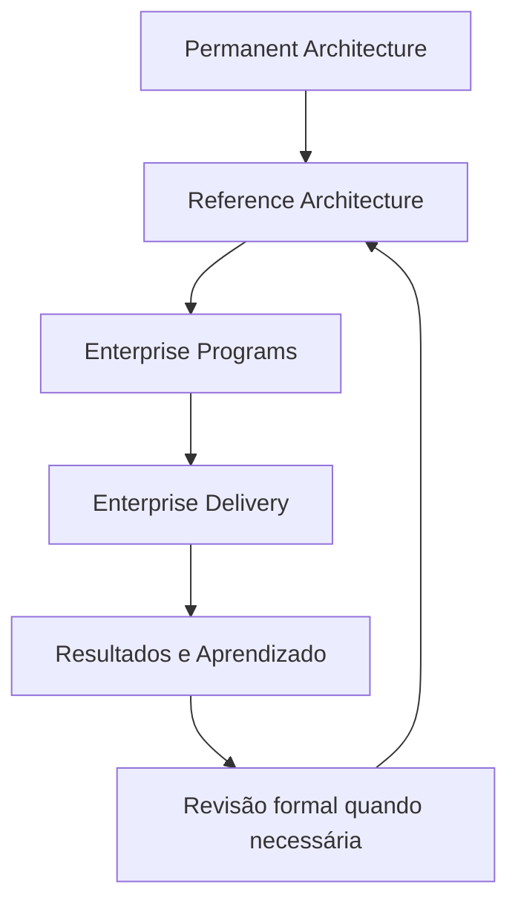
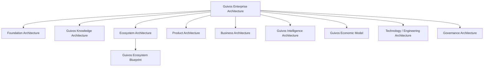
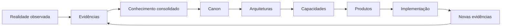

# Guivos Enterprise Architecture

## Definição

A Guivos Enterprise Architecture (GEA) é o sistema de arquiteturas que organiza, conecta e governa a evolução da Guivos como ecossistema, empresa e plataforma de produtos.

A GEA não é uma arquitetura isolada. Ela integra todas as arquiteturas oficiais, preservando ownership único, dependências explícitas e evolução governada.

O Guivos Knowledge Repository é a fonte oficial em que a GEA é documentada, versionada e publicada.

## Estado transversal

O estado global vigente não é mantido de forma independente nesta página. Ele é declarado pelo [GKR-STATE-001 — Current State Register](../project/current-state-register.md).

No estado atual:

- Guivos Journey está publicado em `PAS-001 1.0.0`, com nove capacidades funcionalmente concluídas;
- Guivos Economic Model possui arquitetura documental inicial concluída em `GEM-001` a `GEM-010`;
- `A2-R03 — Business Architecture Review` permanece como frente arquitetural correta;
- a execução da A2-R03 está temporariamente pausada durante a remediação documental do GKR;
- Product Engineering permanece pausado antes do `W0-01`.

## Missão

Projetar, preservar e evoluir uma arquitetura empresarial de classe mundial, baseada em fundamentos sólidos, conhecimento consolidado, validação por evidências e decisões estratégicas de longo prazo.

## Arquitetura de maturidade

A GEA representa a Guivos em sua capacidade institucional máxima. Ela não deve ser limitada pelo estágio atual da implementação.

> A Guivos é concebida em sua capacidade máxima. A implementação realiza progressivamente essa visão.

## Dois eixos de organização

A GEA classifica seus ativos por dois eixos complementares:

1. **Domínio arquitetural:** Foundation, Knowledge, Ecosystem, Product, Business, Data & Intelligence, Economic, Technology e Governance.
2. **Permanência:** Permanent Architecture, Reference Architecture, Enterprise Programs e Enterprise Delivery.

O domínio define responsabilidade conceitual. A camada de permanência define horizonte, velocidade de mudança e rigor de governança.

Consulte o [GEA-PLM-001 — Permanence Layer Model](permanence-layer-model.md).

## Modelo de camadas de permanência

```mermaid
graph TD
    PA[Permanent Architecture] --> RA[Reference Architecture]
    RA --> EP[Enterprise Programs]
    EP --> ED[Enterprise Delivery]
    ED --> L[Resultados e Aprendizado]
    L --> R[Revisão formal quando necessária]
    R --> RA
```

| Camada | Horizonte | Pergunta principal |
|---|---|---|
| Permanent Architecture | Décadas | O que continuará verdadeiro na maturidade da Guivos? |
| Reference Architecture | Anos | Qual é a melhor forma arquitetural conhecida de realizar a visão? |
| Enterprise Programs | Meses e ciclos plurianuais | Quais programas transformarão a arquitetura em realidade? |
| Enterprise Delivery | Dias, semanas e releases | O que será entregue agora e como será implementado? |

## Estrutura oficial

```mermaid
graph TD
    GEA[Guivos Enterprise Architecture]
    GEA --> FA[Foundation Architecture]
    GEA --> GKA[Guivos Knowledge Architecture]
    GEA --> EA[Ecosystem Architecture]
    GEA --> PA[Product Architecture]
    GEA --> BA[Business Architecture]
    GEA --> GIA[Guivos Intelligence Architecture]
    GEA --> EM[Guivos Economic Model]
    GEA --> TA[Technology / Engineering Architecture]
    GEA --> GA[Governance Architecture]
    EA --> GEB[Guivos Ecosystem Blueprint]
```

## Arquiteturas integrantes

| Arquitetura | Pergunta principal | Situação vigente |
|---|---|---|
| Foundation Architecture | Quem é a Guivos e por que ela existe? | Frozen em `A2-B3` |
| Guivos Knowledge Architecture | Como a Guivos descobre, valida, consolida e evolui conhecimento institucional? | Reconhecida por `ADR-006`; documentação interna pendente |
| Ecosystem Architecture | Como ocorre a transformação dos participantes? | Em consolidação por meio do GEB |
| Product Architecture | Quais produtos materializam capacidades e propostas de valor? | Estrutura superior consolidada; Journey publicado; portfólio especializado pendente de rebaseline |
| Business Architecture | Como a Guivos organiza transformação, Outcomes, capacidades e execução do negócio? | `A2-R03` preservada; COEM concluída; decisão humana `1 de 18`; pausa temporária de remediação |
| Guivos Intelligence Architecture | Como conhecimento, dados, contexto e conexões se tornam inteligência aplicada? | Conceitos superiores consolidados; produto especializado ainda não rebaselineado |
| Guivos Economic Model | Como a Guivos sustenta economicamente o ecossistema sem contrariar seu propósito? | Arquitetura documental inicial concluída; validação empírica e especializada pendente |
| Technology / Engineering Architecture | Como as capacidades são implementadas tecnicamente? | Planejada e pausada antes do `W0-01` |
| Governance Architecture | Como decisões, riscos e mudanças são controlados? | Ativa por métodos, auditorias, decisões e remediação do GKR |

## Relação entre GEA, GKR, GKA e GEB

- **GEA** é o conjunto integrado das arquiteturas da Guivos.
- **GKR** preserva a representação canônica, decisões, evidências e histórico.
- **GKA** governa como o conhecimento é descoberto, validado, promovido e evoluído.
- **GEB** é o blueprint principal da Ecosystem Architecture.
- **GKR-STATE-001** declara o estado transversal vigente sem redefinir as arquiteturas.

## Responsabilidade conceitual

Todo conceito, modelo, capacidade, ativo arquitetural ou decisão canônica deve possuir uma única arquitetura proprietária.

Arquiteturas consumidoras podem utilizar e referenciar esses ativos, mas não redefini-los.

A decisão de ownership está registrada no [ADR-003 — Architectural Ownership](../adr/ADR-003-architectural-ownership.md).

## Princípios permanentes

### A arquitetura precede a implementação

Decisões estruturais devem ser definidas antes da implementação de software, processos ou produtos.

### O conhecimento precede a arquitetura

Arquiteturas permanentes devem derivar de conhecimento consolidado e rastreável.

### A realidade precede o conhecimento

Quando evidências consistentes demonstrarem inadequação, o conhecimento deverá ser revisado pelos processos formais da GKA.

### Uma decisão, uma fonte da verdade

Cada decisão arquitetural possui registro oficial. Resumos, roadmaps e boards não criam decisões paralelas.

### Propriedade arquitetural única

Cada ativo canônico possui uma única arquitetura proprietária responsável por sua definição, evolução e governança.

### Separação entre arquiteturas

Negócio, produto, dados, inteligência, economia, tecnologia, governança e conhecimento são domínios relacionados, mas não intercambiáveis.

### Independência tecnológica

Conceitos e capacidades devem permanecer válidos mesmo quando linguagens, fornecedores, frameworks ou infraestrutura forem substituídos.

### Evolução controlada

Alterações estruturais devem ser registradas por governança formal e, quando necessário, por Architecture Decision Records.

### Estabilidade como ativo

A arquitetura deve evoluir por aumento de clareza, consistência e completude, evitando mudanças sem necessidade comprovada.

### Orientação à decisão

Todo ativo arquitetural deve declarar quais decisões orienta e quais não orienta.

### Evidência arquitetural

Nenhuma decisão estrutural deve ser tomada apenas por preferência.

### Progressive Realization

A Guivos é concebida em sua capacidade máxima e realizada progressivamente por programas, entregas e ciclos de implementação.

## Fluxo oficial de fundamentação

```mermaid
graph LR
    R[Realidade observada] --> E[Evidências]
    E --> K[Conhecimento consolidado]
    K --> C[Canon]
    C --> A[Arquiteturas]
    A --> CAP[Capacidades]
    CAP --> P[Produtos]
    P --> I[Implementação]
    I --> NE[Novas evidências]
    NE --> E
```

## Padrão das arquiteturas

Cada arquitetura deverá documentar progressivamente objetivo, propósito, escopo, limites, princípios, modelos, capacidades, relações, decisões orientadas, critérios de validação, evolução, permanência, owner e processo autorizado de mudança.

## Regra de maturidade

| Estado | Significado |
|---|---|
| Draft | Em construção inicial |
| Validated | Conceitualmente validado e utilizável |
| Canonical | Integrante da versão canônica vigente |
| Stable | Improvável de sofrer alterações estruturais |

Nenhuma unidade deve ser considerada `stable` antes que suas dependências estejam, no mínimo, `validated`.

## Regra de estabilidade

A estrutura principal da GEA permanece estável. Refinamentos dentro das arquiteturas não devem alterar desnecessariamente a estrutura superior. Mudanças no conjunto principal exigem justificativa formal, evidência e ADR.
