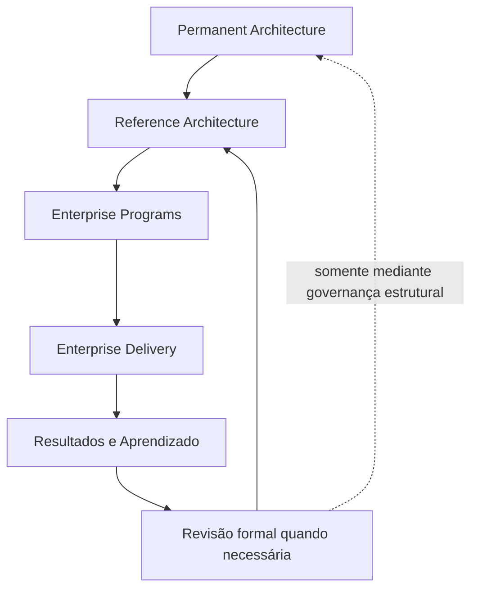

# GEA-PLM-001 — Permanence Layer Model

## Finalidade

Organizar os ativos institucionais da Guivos de acordo com sua permanência, horizonte de mudança, responsabilidade e relação com a execução.

O modelo não substitui as arquiteturas oficiais da GEA. Ele adiciona um segundo eixo de classificação: além do domínio arquitetural, cada ativo deve declarar em qual camada de permanência se encontra.

## Princípio central

> A Guivos é concebida em sua capacidade máxima. A implementação realiza progressivamente essa visão, sem reduzi-la às limitações do estágio atual.

## Camadas

### 1. Permanent Architecture

**Horizonte:** décadas.

**Pergunta:** o que deverá continuar verdadeiro quando a Guivos atingir e preservar sua maturidade institucional?

Inclui, quando aplicável:

- Foundation;
- propósito, missão, visão e constituição;
- princípios permanentes;
- macroestrutura da GEA;
- modelos fundamentais do ecossistema;
- Canon;
- governança estrutural;
- definições institucionais independentes de tecnologia.

Características:

- muda raramente;
- possui o maior nível de proteção e revisão;
- não deve depender de fornecedores, frameworks ou tecnologias específicas;
- orienta todas as camadas inferiores.

### 2. Reference Architecture

**Horizonte:** anos.

**Pergunta:** qual é a melhor forma arquitetural conhecida de materializar a visão de maturidade?

Inclui, quando aplicável:

- Business Architecture;
- Product Architecture;
- Data & Intelligence Architecture;
- Technology Architecture;
- Governance Architecture;
- Knowledge Architecture;
- arquitetura da plataforma;
- arquitetura de IA;
- arquitetura de dados e grafos;
- segurança, integração e escalabilidade;
- modelos de referência para produtos e operações.

Características:

- evolui conforme evidências, tecnologia e estratégia;
- preserva a intenção definida pela Permanent Architecture;
- orienta programas e decisões de implementação;
- não deve ser confundida com escolhas tecnológicas transitórias.

### 3. Enterprise Programs

**Horizonte:** meses e ciclos plurianuais.

**Pergunta:** quais programas transformam a arquitetura de referência em realidade organizacional?

Inclui:

- programas de engenharia;
- portfólio de produtos;
- programas comerciais e de marketing;
- operações;
- expansão global;
- transformação organizacional;
- roadmaps executivos;
- objetivos, marcos, dependências e indicadores de programa.

Características:

- conecta visão e execução;
- possui objetivos e critérios de sucesso;
- pode ser iniciado, reordenado, concluído ou encerrado;
- não redefine automaticamente as camadas superiores.

### 4. Enterprise Delivery

**Horizonte:** dias, semanas e releases.

**Pergunta:** o que será entregue agora e como será implementado?

Inclui:

- backlog;
- sprints;
- código;
- configurações;
- infraestrutura;
- pipelines;
- releases;
- tarefas operacionais;
- escolhas tecnológicas específicas;
- planos de implantação.

Características:

- muda continuamente;
- otimiza entrega, qualidade, custo e velocidade;
- pode substituir tecnologias sem alterar a identidade institucional;
- deve permanecer rastreável às camadas superiores.

## Fluxo de influência

## Princípios do modelo

### Institutional Permanence

Todo conteúdo canônico do GKR deve representar a Guivos em seu estado de maturidade institucional, e não apenas seu estágio atual de implementação.

### Vision First

A implementação aproxima a realidade da visão. Restrições temporárias de equipe, orçamento, tecnologia ou prazo não redefinem automaticamente a visão institucional.

### Architectural Gravity

Quanto maior a permanência de um ativo, menor deve ser sua velocidade de mudança e maior deve ser o rigor de governança aplicado.

### Progressive Realization

A Guivos é concebida em sua capacidade máxima e realizada progressivamente por programas, entregas e ciclos de implementação.

### Downward Influence

As camadas superiores orientam as inferiores. Uma decisão de Delivery não altera uma arquitetura superior sem revisão formal e análise de impacto.

### Layer Integrity

Todo ativo relevante deve declarar sua camada, seu owner, seu horizonte e o processo autorizado para sua alteração.

## Matriz inicial de classificação

| Ativo | Domínio | Camada predominante |
|---|---|---|
| Foundation | Foundation Architecture | Permanent Architecture |
| Macroestrutura da GEA | Enterprise Architecture | Permanent Architecture |
| Modelos fundamentais do GEB | Ecosystem Architecture | Permanent Architecture |
| Business Architecture | Business Architecture | Reference Architecture |
| Product Architecture | Product Architecture | Reference Architecture |
| Data & Intelligence Architecture | Data & Intelligence Architecture | Reference Architecture |
| Technology Architecture | Technology Architecture | Reference Architecture |
| Governance e Knowledge Architecture | Governance / Knowledge | Permanent ou Reference, conforme o ativo |
| Programas estratégicos | Enterprise Programs | Enterprise Programs |
| Backlogs, releases e infraestrutura corrente | Engenharia e Operações | Enterprise Delivery |

A classificação predominante não impede que uma arquitetura contenha ativos em camadas diferentes. A classificação deve ocorrer no nível do ativo quando necessário.

## Critério de admissão no GKR

Um ativo pertence ao núcleo canônico do GKR quando:

1. representa a Guivos em seu estado de maturidade;
2. possui valor institucional além do ciclo atual de implementação;
3. declara owner, versão, dependências e status;
4. é coerente com a Foundation e a GEA;
5. possui justificativa e rastreabilidade suficientes.

Backlogs, sprints, tarefas e configurações operacionais pertencem aos sistemas de execução, podendo ser referenciados pelo GKR sem integrar sua Canon.

## Governança de mudança

| Camada | Mudança típica | Governança mínima |
|---|---|---|
| Permanent Architecture | alteração de princípio, propósito ou macroestrutura | ADR, revisão arquitetural e análise de impacto no baseline |
| Reference Architecture | revisão de modelo ou arquitetura de referência | ADR quando estrutural e validação técnica ou arquitetural |
| Enterprise Programs | alteração de programa, prioridade ou roadmap | governança executiva e registro de dependências |
| Enterprise Delivery | alteração de implementação ou release | governança de engenharia e produto |

## Relação com o GKR

O GKR preserva prioritariamente a Permanent Architecture, a Reference Architecture, as decisões, evidências e justificativas que definem a Guivos em sua capacidade máxima.

Enterprise Programs e Enterprise Delivery podem possuir ferramentas e repositórios próprios. O GKR registra sua relação com a visão institucional, não substitui a gestão operacional da execução.

## Regra de aplicação

Antes de criar ou alterar qualquer ativo relevante, responder:

1. a qual domínio arquitetural ele pertence;
2. a qual camada de permanência ele pertence;
3. qual é seu horizonte esperado;
4. quem possui ownership;
5. qual mudança nas camadas superiores ele pressupõe;
6. qual processo pode alterá-lo.
