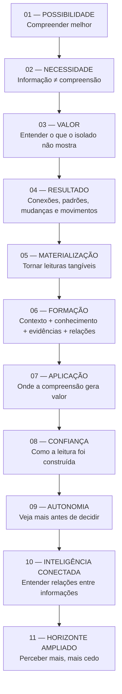
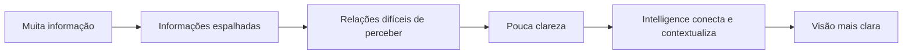
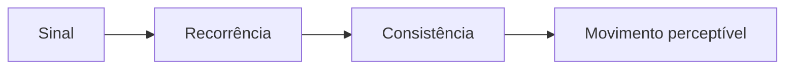
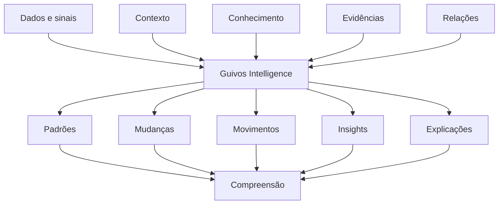
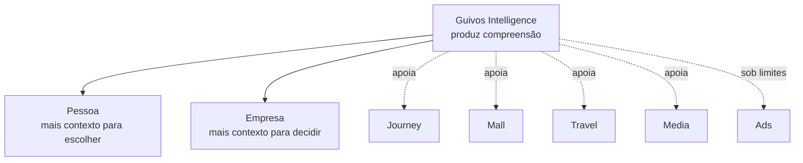
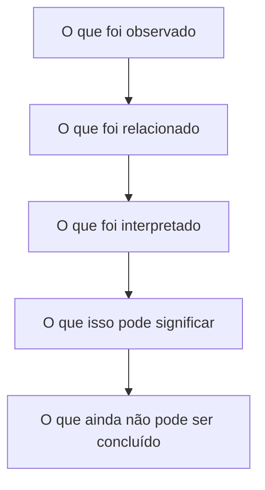
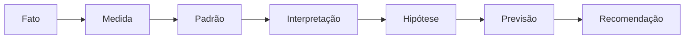
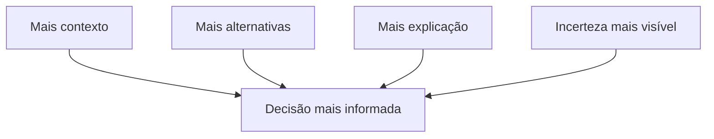
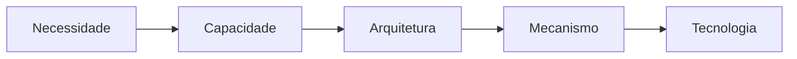
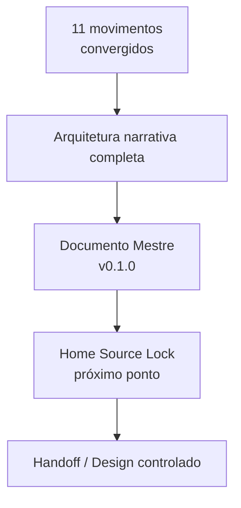

# Home Pública — Guivos Intelligence v1 — Arquitetura Conceitual — Movimentos 1–11

## 1. Finalidade

Este documento preserva a **arquitetura conceitual completa da Home Pública do Guivos Intelligence v1** após a integração de `GPA-006 2.0.0`, do `GKR-INTELLIGENCE-PRODUCT-SOURCELOCK-001 1.0.0`, do princípio transversal `GKR-UX-HOMES-OUTCOME-001 1.0.0` e da convergência em conversa dos **Movimentos 01–11**.

A versão `0.2.0` substitui a convergência parcial dos Movimentos 01–10 registrada em `0.1.0` e incorpora o **Movimento 11 — Horizonte ampliado** como fechamento da arquitetura narrativa.

Este documento **não é**:

- Source Lock da Home;
- Source Lock para Design;
- wireframe;
- UI;
- protótipo;
- prompt generativo;
- especificação técnica;
- prova de implementação;
- prova de performance;
- copy final imutável.

As formulações textuais preservadas aqui são **copy de referência convergida**. Sua função é manter significado, intenção, progressão, fronteiras e guardrails até a próxima etapa governada.

## 2. Estado da frente

```text
GPA-006 v2.0.0
→ INTEGRADO

SOURCE LOCK DO PRODUTO
→ GKR-INTELLIGENCE-PRODUCT-SOURCELOCK-001 v1.0.0
→ INTEGRADO

HOME INTELLIGENCE v1
→ ARQUITETURA CONCEITUAL COMPLETA
→ 11 MOVIMENTOS CONVERGIDOS

DOCUMENTO MESTRE DA HOME
→ GKR-UX-HOME-INTELLIGENCE-MASTER-001 v0.1.0
→ CRIADO NO MESMO PACOTE GOVERNADO

SOURCE LOCK DA HOME
→ NÃO CRIADO

DESIGN / UI / PROTÓTIPO
→ NÃO INICIADOS NESTE FLUXO
```

## 3. Intenção própria da Home Intelligence

A Home do Guivos Intelligence não pode funcionar como uma segunda Home do Journey, do Business ou de qualquer outro produto.

Sua intenção própria é tornar compreensível que a Guivos pode:

> **transformar informações, contexto, conhecimento, evidências e relações em compreensão capaz de revelar conexões, padrões, mudanças, movimentos, insights, explicações e novas possibilidades de leitura.**

A unidade de valor permanece:

> **compreensão útil e contextualizada.**

A Home deve fazer o visitante perceber o valor de **entender melhor aquilo que informações isoladas não conseguem mostrar**.

### 3.1 Fronteira com Journey

```text
JOURNEY
→ evolução
→ direção
→ caminhos
→ experiências
→ contexto da própria jornada

INTELLIGENCE
→ compreensão
→ relações
→ padrões
→ mudanças
→ movimentos
→ insights
→ explicações
```

O Intelligence pode produzir compreensão utilizada pelo Journey. Sua Home não assume a promessa central de evolução, caminho pessoal ou próxima etapa da Journey.

### 3.2 Fronteira com Business

```text
BUSINESS
→ relação B2B
→ programas e ofertas
→ possibilidades criadas pela Empresa
→ contratação e operação Business

INTELLIGENCE
→ leitura populacional autorizada
→ padrões
→ mudanças
→ tendências
→ movimentos emergentes
→ lacunas
→ insights explicáveis
```

O Intelligence pode produzir compreensão consumida pelo Business. Sua Home não se torna página de benefícios, programas, RH ou contratação empresarial.

### 3.3 Contrato inter-Home

> **Uma Home pode explicar como seu produto se relaciona com outros produtos da Guivos, mas não pode assumir a proposta de valor central deles.**

## 4. Princípio de resultado aplicado ao Intelligence

A Home segue `GKR-UX-HOMES-OUTCOME-001`:

```text
SIGNIFICADO
→ CAPACIDADE
→ ENTREGA
→ BENEFÍCIO
→ RESULTADO ESPERADO
```

No Intelligence, isso significa não parar em:

```text
“tem analytics”
“usa IA”
“conecta dados”
“gera insights”
```

A narrativa deve chegar a consequências compreensíveis:

```text
ENXERGAR CONEXÕES
IDENTIFICAR PADRÕES
ENTENDER MUDANÇAS
PERCEBER MOVIMENTOS
IR ALÉM DO NÚMERO
ENTENDER DE ONDE VEIO UMA LEITURA
VER MAIS ANTES DE DECIDIR
PERCEBER MAIS CEDO O QUE COMEÇA A TOMAR FORMA
```

Guardrail transversal:

```text
RESULTADO ESPERADO
≠
RESULTADO COMPROVADO
```

A Home não promete causalidade, melhoria percentual, redução de risco, performance ou previsão não evidenciada.

## 5. Linguagem pública

Regra consolidada:

> **Não apenas descrever o resultado. Fazer o visitante se enxergar recebendo esse resultado.**

Preferir, quando semanticamente correto:

- **entenda**;
- **veja**;
- **compare**;
- **descubra**;
- **identifique**;
- **perceba**;
- **saiba por quê**.

Evitar abstração quando uma consequência legítima puder ser expressa de forma simples.

## 6. Mapa final dos 11 movimentos



Os movimentos são **funções semânticas**. Não representam obrigação de onze blocos visuais equivalentes.

---

# Movimento 01 — Possibilidade

## 7. Função

Abrir a Home pela consequência da compreensão, e não pela tecnologia.

> **Ter informação não é o mesmo que entender o que ela significa — e entender melhor ajuda a enxergar novas possibilidades.**

### Pergunta-mãe de referência

> **O que se torna possível quando você compreende melhor o que está acontecendo?**

### Expressão de referência

> **Transforme contexto em compreensão. E compreensão em novas possibilidades.**

A primeira dobra não deve tentar explicar toda a arquitetura funcional do produto.

Evitar como abertura dominante: IA, LLM, Neo4j, GraphRAG, Power BI, dashboard, APIs ou listas de features.

---

# Movimento 02 — Necessidade

## 8. Ideia central

> **Ter mais informação não significa entender melhor.**

A Home cria necessidade a partir de uma realidade simples: dados, sinais, acontecimentos e conteúdos podem existir em abundância sem produzir clareza.

### Supporting copy de referência

> **O que faz diferença é conseguir conectar o que está acontecendo, perceber relações e transformar informações dispersas em uma visão mais clara.**



```text
MAIS INFORMAÇÃO
≠
MAIS COMPREENSÃO
```

---

# Movimento 03 — Valor próprio do Intelligence

## 9. Função

Fixar o território próprio do produto e impedir que a Home seja absorvida pela narrativa de Journey.

### Headline de referência

> **Entenda o que suas informações, isoladamente, não conseguem mostrar.**

### Supporting copy de referência

> **Guivos Intelligence conecta dados, contexto, conhecimento, evidências e relações para revelar padrões, mudanças e conexões que ajudam você a compreender melhor o que está acontecendo.**

### Expressão funcional

> **Veja conexões. Identifique padrões. Entenda mudanças. Transforme informação em compreensão.**

Resultado antes do mecanismo.

---

# Movimento 04 — Resultados da inteligência

## 10. Função

Apresentar o que o Intelligence permite perceber antes de detalhar como isso acontece.

```text
VEJA CONEXÕES
↓
IDENTIFIQUE PADRÕES
↓
ENTENDA MUDANÇAS
↓
PERCEBA MOVIMENTOS
↓
TRANSFORME INFORMAÇÃO EM COMPREENSÃO
```

O visitante deve entender que o Intelligence ajuda a enxergar **relações e mudanças que informações isoladas não mostram com facilidade**.

---

# Movimento 05 — Tornar os resultados tangíveis

## 11. Headline de referência

> **Veja o que você não enxergaria olhando cada informação separadamente.**

## 12. Entregas públicas

### Perceba conexões

> **Perceba como informações diferentes podem estar relacionadas.**

### Identifique padrões

> **Identifique o que está se repetindo — e o que começa a fugir do padrão.**

### Entenda mudanças

> **Entenda não apenas como as coisas estão, mas como estão mudando.**

### Reconheça movimentos

> **Perceba quando pequenos sinais começam a formar um movimento maior.**



### Vá além dos números

> **Vá além do número. Entenda o que ele pode estar mostrando.**

### Saiba por quê

> **Entenda de onde uma conclusão veio — e até onde ela pode ir.**

## 13. Papel visual

São adequados, quando ajudam a explicar o tipo de leitura:

- cards de KPI/indicadores conceituais;
- mini gráficos de tendência;
- comparações entre períodos;
- distribuições agregadas;
- destaques de mudança;
- exemplos de Movimento Emergente;
- insights acompanhados de contexto e explicação.

Quando não houver dados reais, esses elementos são **representações conceituais**, não evidência operacional.

---

# Movimento 06 — Como a compreensão se forma

## 14. Headline de referência

> **Transformar informação em compreensão exige mais do que reunir dados.**

### Supporting copy de referência

> **Guivos Intelligence conecta informações, contexto, conhecimento, evidências e relações para revelar leituras que seriam mais difíceis de perceber olhando tudo de forma isolada.**



Papéis públicos simples:

- **Informações** — sinais, dados, acontecimentos e registros;
- **Contexto** — onde, quando e em qual situação a informação existe;
- **Relações** — como diferentes elementos podem estar conectados;
- **Conhecimento e evidências** — referências que ajudam a interpretar;
- **Análise** — transformação desses elementos em leitura;
- **Compreensão** — significado útil produzido dentro dos limites de autoridade.

---

# Movimento 07 — Onde essa compreensão gera valor

## 15. Função

Responder:

> **Onde isso pode ser útil na prática?**

Sem transformar Journey, Business, Mall, Travel, Media ou Ads em módulos do Intelligence.

## 16. Situações públicas de valor

### Entender uma recomendação

> **Saiba por que algo está sendo apresentado a você.**

### Comparar cenários

> **Compare cenários com mais contexto.**

### Identificar movimentos

> **Perceba mudanças antes que elas se percam no volume de informações.**

Isso não significa prever o futuro nem declarar causalidade.

### Descobrir relações

> **Encontre conexões entre informações que pareciam separadas.**

### Enxergar lacunas

> **Veja o que existe — e também o que pode estar faltando.**

```text
INTERESSE
≠
NECESSIDADE COMPROVADA
```

### Tornar a análise compreensível

> **Não receba apenas números. Entenda o que eles podem estar mostrando.**

## 17. Duas frentes superiores

### Pessoa

> **Mais contexto para entender o que está sendo apresentado e escolher com mais clareza.**

O Intelligence pode explicar relações, bases, alternativas e incertezas. Journey preserva a autoridade sobre a experiência pessoal.

### Empresa / população

> **Mais contexto para compreender movimentos agregados e decidir com uma visão mais completa.**

O Intelligence pode produzir indicadores agregados, padrões, mudanças, tendências, movimentos emergentes, lacunas, benchmarks autorizados e insights explicáveis. Business preserva a relação B2B.



> **Intelligence pode ser origem da compreensão sem ser destino da experiência.**

---

# Movimento 08 — Confiança, explicabilidade e limites

## 18. Headline de referência

> **Não receba apenas uma conclusão. Entenda como ela foi construída.**

### Supporting copy de referência

> **Guivos Intelligence busca mostrar as informações, relações e evidências que sustentam uma leitura — além de deixar claro quando algo é observado, interpretado ou ainda incerto.**

Resultados de confiança:

- **Fato ≠ interpretação** — saiba o que aconteceu e o que foi interpretado a partir disso;
- **Proveniência** — veja quais informações sustentam uma leitura;
- **Limites** — saiba também o que ainda não pode ser concluído;
- **Incerteza** — entenda quando uma leitura é forte e quando precisa de mais evidências;
- **Correção e contestação** — novos dados ou contestação legítima podem alterar uma leitura.





> **Inteligência não deve apenas dizer algo. Deve ajudar você a entender por que aquilo está sendo dito.**

---

# Movimento 09 — Autonomia e decisão

## 19. Função

Traduzir o contrato arquitetural `COMPREENDER ≠ DECIDIR` em benefício compreensível.

### Headline de referência

> **Veja mais antes de decidir.**

### Supporting copy de referência

> **Entenda relações, compare mudanças, considere diferentes sinais e conheça os limites de uma leitura antes de escolher o que fazer.**

### Princípio

> **Inteligência para ampliar sua visão — não para substituir sua decisão.**

Resultados esperados:

- melhores perguntas;
- comparação antes da conclusão;
- incerteza visível antes da ação;
- recomendação como contexto, não ordem;
- alternativas preservadas quando aplicável.

```text
SINAL FRACO
≠
CONCLUSÃO FORTE
```



A Home não promete que o Intelligence encontra “a decisão certa”.

---

# Movimento 10 — Inteligência conectada

## 20. Função

Explicar por que o Intelligence consegue construir leituras mais completas sem usar IA, Graph, Neo4j ou GraphRAG como proposta de valor central.

### Headline de referência

> **Entenda não apenas cada informação, mas como elas podem estar relacionadas.**

### Supporting copy de referência

> **Guivos Intelligence pode conectar informações, contextos, conhecimentos, acontecimentos e relações do ecossistema para construir uma visão mais completa daquilo que está sendo analisado.**

Resultado:

> **Descubra conexões, padrões e mudanças que poderiam passar despercebidos quando cada informação é analisada separadamente.**

```text
MAIS DADOS
≠
MELHOR INTELLIGENCE
```

```text
INFORMAÇÃO ADEQUADA
+
CONTEXTO ADEQUADO
+
RELAÇÕES ADEQUADAS
+
CONHECIMENTO ADEQUADO
↓
MELHOR COMPREENSÃO
```

Guardrail:

```text
RELAÇÃO
≠
CAUSA
```

### Papel subordinado de Graph e IA

IA, análise de dados, conhecimento e estruturas relacionais podem ampliar capacidades do Intelligence. Não definem sua identidade nem sua autoridade.



> **A tecnologia amplia a capacidade do Intelligence. Não amplia sua autoridade.**

---

# Movimento 11 — Horizonte ampliado

## 21. Função narrativa

Fechar a arquitetura levando o visitante da compreensão para aquilo que uma compreensão mais ampla pode tornar perceptível.

Pergunta funcional:

> **O que essa compreensão mais ampla permite enxergar que antes não estava visível?**

O movimento deve elevar a narrativa sem converter Intelligence em previsão do futuro.

## 22. Ideia central

> **Compreender melhor não muda apenas o que você sabe. Pode mudar o que você consegue perceber.**

Quando informações deixam de ser observadas isoladamente e passam a ser relacionadas com contexto, conhecimento, evidências e temporalidade, podem se tornar mais visíveis:

- sinais;
- mudanças;
- padrões em formação;
- movimentos;
- relações menos evidentes;
- possibilidades que merecem consideração.

A diferença não é “saber o futuro”. É **conseguir ver mais antes de tudo se tornar óbvio**.

## 23. Headline de referência

> **Perceba antes o que começa a mudar. Enxergue além do que já está evidente.**

## 24. Supporting copy de referência

> **Guivos Intelligence conecta sinais, contexto, conhecimento e relações para tornar padrões, movimentos e novas possibilidades mais visíveis — ajudando você a compreender mais antes de decidir.**

## 25. Progressão de resultado

```text
COMPREENDER MAIS
→ PERCEBER MAIS
→ ENXERGAR MAIS CEDO
→ AMPLIAR O QUE PODE SER CONSIDERADO
```

Outra leitura pública possível:

```text
O QUE ESTÁ ACONTECENDO
→ O QUE ESTÁ MUDANDO
→ O QUE COMEÇA A TOMAR FORMA
→ O QUE AGORA PODE SER PERCEBIDO
```

O contrato de linguagem é:

> **Não afirmar “isto vai acontecer”. Mostrar “agora existe algo que pode ser enxergado e considerado que antes não estava visível”.**

## 26. Guardrails do horizonte ampliado

```text
PERCEBER ANTES ≠ PREVER O FUTURO
ENXERGAR MAIS LONGE ≠ SABER O QUE VAI ACONTECER
SINAL ≠ CERTEZA
TENDÊNCIA ≠ DESTINO
PADRÃO EM FORMAÇÃO ≠ RESULTADO FUTURO GARANTIDO
POSSIBILIDADE ≠ RECOMENDAÇÃO OBRIGATÓRIA
```

Fronteira interproduto:

```text
INTELLIGENCE
→ torna possibilidades mais visíveis

JOURNEY
→ governa caminhos e experiência da Pessoa

BUSINESS
→ governa aplicação empresarial e relação B2B
```

Portanto, “novas possibilidades” é permitido nesta Home apenas como **aquilo que a compreensão torna perceptível**, e não como apropriação do caminho pessoal da Journey ou da oferta/comercialização do Business.

## 27. Síntese de fechamento

> **Perceba antes o que começa a mudar. Enxergue além do que já está evidente.**

> **Guivos Intelligence conecta sinais, contexto, conhecimento e relações para tornar padrões, movimentos e novas possibilidades mais visíveis — ajudando você a compreender mais antes de decidir.**

Resposta narrativa à pergunta-mãe do Movimento 01:

> **Você passa a perceber mais, mais cedo — e a enxergar possibilidades que informações isoladas ainda não conseguiam mostrar.**

O Movimento 11 encerra a progressão conceitual sem prometer previsão, certeza, causalidade ou decisão automática.

---

# Diretriz visual consolidada

## 28. Papel dos recursos visuais

A Home Intelligence pode usar representações de KPIs, indicadores, gráficos, fluxos, organogramas e redes conceituais quando tornarem concreto **o tipo de leitura, relação ou resultado que o produto entrega**.

Exemplos adequados:

- variação entre períodos;
- tendência;
- distribuição;
- comparação agregada;
- concentração;
- mudança de padrão;
- movimento emergente;
- lacuna;
- insight acompanhado de contexto;
- leitura com explicação e limitação;
- relação entre sinais;
- progressão temporal de uma leitura.

Regra:

> **Visual explicativo ≠ wireframe da Home.**

O GKR governa significado, função e relações. A materialização visual pertence à fase posterior autorizada.

## 29. Matriz de uso visual por movimento

| Movimento | Visual conceitual recomendado | O que deve esclarecer |
|---|---|---|
| 01 | composição semântica simples | compreensão → possibilidade |
| 02 | fluxo de dispersão para clareza | informação ≠ compreensão |
| 03 | antes/depois conceitual | isolado → leitura conectada |
| 04 | sequência de entregas | conexões, padrões, mudanças, movimentos |
| 05 | KPIs, mini gráficos, cards analíticos | tornar resultados tangíveis |
| 06 | organograma/fluxo | como a compreensão se forma |
| 07 | exemplos de leitura e comparação | onde a compreensão gera valor |
| 08 | escada/fluxo epistêmico | origem, interpretação, incerteza e limite |
| 09 | fluxo de decisão | mais contexto sem perda de autonomia |
| 10 | rede/organograma de relações | informação conectada e inteligência de ecossistema |
| 11 | progressão temporal / sinais em formação | perceber mais cedo sem prever o futuro |

---

# Guardrails consolidados

## 30. Identidade

```text
INTELLIGENCE ≠ JOURNEY
INTELLIGENCE ≠ BUSINESS
INTELLIGENCE ≠ DASHBOARD
INTELLIGENCE ≠ IA
INTELLIGENCE ≠ LLM
INTELLIGENCE ≠ GUIVOS.AI
INTELLIGENCE ≠ NEO4J
INTELLIGENCE ≠ GRAPHRAG
INTELLIGENCE ≠ GRAFO GLOBAL
```

## 31. Resultado e epistemologia

```text
RESULTADO ESPERADO ≠ RESULTADO COMPROVADO
PADRÃO ≠ CAUSA
RELAÇÃO ≠ CAUSA
MOVIMENTO ≠ DIAGNÓSTICO
INTERESSE ≠ NECESSIDADE
RECOMENDAÇÃO ≠ ORDEM
COMPREENDER ≠ DECIDIR
SINAL ≠ CERTEZA
TENDÊNCIA ≠ DESTINO
POSSIBILIDADE ≠ OBRIGAÇÃO
```

## 32. Privacidade e autoridade

Permanecem vinculantes os princípios superiores do produto:

```text
CONHECER ≠ UTILIZAR ≠ COMPARTILHAR
DECLARADO ≠ OBSERVADO ≠ INFERIDO ≠ PREDITO
PERSONALIZAR ≠ EXPOR
```

O contexto individual serve prioritariamente à Pessoa. Leitura Business deve permanecer populacional, autorizada e protegida.

Mais plano, pagamento ou capacidade técnica não criam autoridade adicional sobre a intimidade individual.

## 33. Linguagem e visual

- falar diretamente com quem recebe o valor;
- evitar abstração quando uma consequência concreta puder ser dita;
- não reduzir a Home a features;
- não transformar a Home em documentação técnica;
- não prometer certeza onde há interpretação;
- não criar previsão determinística do futuro;
- KPI conceitual não pode parecer evidência operacional real sem identificação adequada;
- dashboard não é sinônimo de Intelligence;
- organograma conceitual não é arquitetura física;
- rede conceitual não comprova Grafo Global operacional.

---

# Fechamento da arquitetura

## 34. Quantidade final

A arquitetura narrativa da Home Pública Guivos Intelligence v1 está encerrada em **11 movimentos**.

Não há Movimento 12 previsto neste checkpoint.

O Movimento 11 cumpre a função de fechamento aspiracional da narrativa sem introduzir nova autoridade de produto.

## 35. Relação com o Documento Mestre

A síntese governada desta arquitetura é consolidada em:

`GKR-UX-HOME-INTELLIGENCE-MASTER-001 v0.1.0`

O Documento Mestre não substitui `GPA-006` nem o Product Source Lock. Ele organiza a tradução da autoridade do produto para a Home Pública.

## 36. Próximo ponto exato

Após a integração desta arquitetura e do Documento Mestre, o próximo artefato elegível é o **Source Lock da Home Pública Guivos Intelligence v1**.

Ainda permanecem fora desta versão:

- Home Source Lock;
- copy final imutável;
- CTA principal e secundário congelados;
- wireframe;
- UI;
- protótipo;
- Design Handoff;
- prova de operação;
- promoção global silenciosa.



Nenhuma etapa autoriza automaticamente a seguinte.
