# Home Pública — Guivos Intelligence v1 — Arquitetura Conceitual — Movimentos 1–10

## 1. Finalidade

Este documento preserva a **convergência conceitual parcial da Home Pública do Guivos Intelligence v1** após a integração de `GPA-006 2.0.0` e do `GKR-INTELLIGENCE-PRODUCT-SOURCELOCK-001 1.0.0`.

Ele consolida os **Movimentos 01–10** aprovados em conversa e registra as correções de fronteira realizadas durante a construção.

Este documento **não é**:

- Documento Mestre final da Home;
- Source Lock da Home;
- Source Lock para Design;
- wireframe;
- UI;
- protótipo;
- prompt generativo;
- especificação técnica;
- prova de implementação;
- copy final imutável.

As formulações textuais aqui preservadas são **copy de referência convergida até este checkpoint**. A copy final poderá ser refinada quando a arquitetura narrativa completa for consolidada, desde que não altere significado, autoridade ou intenção.

## 2. Estado da frente

```text
GPA-006 v2.0.0
→ INTEGRADO

SOURCE LOCK DO PRODUTO
→ GKR-INTELLIGENCE-PRODUCT-SOURCELOCK-001 v1.0.0
→ INTEGRADO

HOME INTELLIGENCE v1
→ ARQUITETURA CONCEITUAL INICIADA
→ MOVIMENTOS 01–10 CONVERGIDOS
→ MOVIMENTO 11 E SEQUÊNCIA POSTERIOR AINDA NÃO CONVERGIDOS

DOCUMENTO MESTRE DA HOME
→ NÃO CRIADO

SOURCE LOCK DA HOME
→ NÃO CRIADO

DESIGN / UI / PROTÓTIPO
→ NÃO INICIADOS NESTE FLUXO
```

## 3. Intenção própria da Home Intelligence

A Home do Guivos Intelligence não pode funcionar como uma segunda Home do Journey, do Business ou de qualquer outro produto.

Sua intenção própria é tornar compreensível que a Guivos pode:

> **transformar informações, contexto, conhecimento, evidências e relações em compreensão capaz de revelar conexões, padrões, mudanças, movimentos, insights e explicações úteis.**

A Home deve fazer o visitante perceber o valor de **entender melhor aquilo que informações isoladas não conseguem mostrar**.

### 3.1 Fronteira com Journey

```text
JOURNEY
→ evolução
→ direção
→ caminhos
→ experiências
→ contexto da própria jornada

INTELLIGENCE
→ compreensão
→ relações
→ padrões
→ mudanças
→ movimentos
→ insights
→ explicações
```

O Intelligence pode produzir compreensão utilizada pelo Journey. Sua Home não deve assumir a promessa central de evolução, caminho pessoal ou próxima etapa da Journey.

### 3.2 Fronteira com Business

```text
BUSINESS
→ relação B2B
→ programas e ofertas
→ possibilidades criadas pela Empresa
→ contratação e operação Business

INTELLIGENCE
→ leitura populacional autorizada
→ padrões
→ mudanças
→ tendências
→ movimentos emergentes
→ lacunas
→ insights explicáveis
```

O Intelligence pode produzir compreensão consumida pelo Business. Sua Home não deve se tornar uma Home de benefícios, programas, RH ou contratação empresarial.

### 3.3 Contrato inter-Home

> **Uma Home pode explicar como seu produto se relaciona com outros produtos da Guivos, mas não pode assumir a proposta de valor central deles.**

## 4. Princípio de resultado aplicado ao Intelligence

A Home segue `GKR-UX-HOMES-OUTCOME-001`.

No Intelligence, isso significa não parar em:

```text
“tem analytics”
“usa IA”
“conecta dados”
“gera insights”
```

A narrativa deve chegar a consequências como:

```text
ENXERGAR CONEXÕES
IDENTIFICAR PADRÕES
ENTENDER MUDANÇAS
PERCEBER MOVIMENTOS
IR ALÉM DO NÚMERO
ENTENDER DE ONDE VEIO UMA LEITURA
VER MAIS ANTES DE DECIDIR
```

Resultado esperado não equivale a resultado comprovado. A Home não pode prometer causalidade, melhoria percentual, redução de risco ou performance não evidenciada.

## 5. Linguagem: falar com o visitante

A construção identificou uma regra específica de linguagem:

> **Não apenas descrever o resultado. Fazer o visitante se enxergar recebendo esse resultado.**

Evitar formulações excessivamente abstratas como:

- “isso pode merecer atenção”;
- “a inteligência produz compreensão” como mensagem isolada;
- “o sistema identifica relevância”;
- “gera inteligência aplicada” sem consequência compreensível.

Preferir, quando correto:

- **entenda**;
- **veja**;
- **compare**;
- **descubra**;
- **identifique**;
- **perceba**;
- **saiba por quê**.

## 6. Mapa parcial dos movimentos

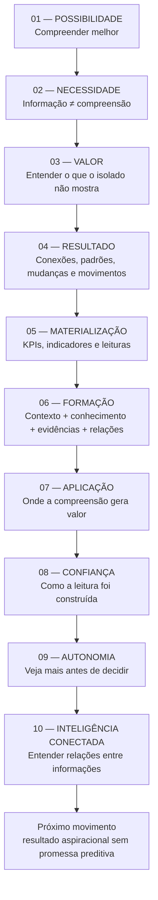

Os movimentos são **funções semânticas**, não obrigação de dez blocos visuais equivalentes.

---

# Movimento 01 — Possibilidade

## 7. Função

Abrir a Home pela consequência da compreensão, e não pela tecnologia.

A ideia deve ser simples:

> **Ter informação não é o mesmo que entender o que ela significa — e entender melhor ajuda a enxergar novas possibilidades.**

## 8. Pergunta-mãe candidata vigente

> **O que se torna possível quando você compreende melhor o que está acontecendo?**

A pergunta desloca a Home de “qual tecnologia existe?” para “qual diferença compreender melhor pode produzir?”.

## 9. Expressão de referência

> **Transforme contexto em compreensão. E compreensão em novas possibilidades.**

A primeira dobra não deve tentar explicar toda a arquitetura funcional do produto.

Evitar como abertura dominante:

- IA;
- LLM;
- Neo4j;
- GraphRAG;
- Power BI;
- dashboard;
- APIs;
- lista de features.

---

# Movimento 02 — Necessidade

## 10. Ideia central

> **Ter mais informação não significa entender melhor.**

A Home cria necessidade a partir de uma realidade simples: dados, sinais, acontecimentos e conteúdos podem existir em abundância sem produzir clareza.

## 11. Supporting copy de referência

> **O que faz diferença é conseguir conectar o que está acontecendo, perceber relações e transformar informações dispersas em uma visão mais clara.**

Progressão:

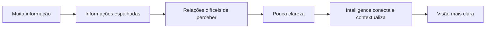

Contrato:

```text
MAIS INFORMAÇÃO
≠
MAIS COMPREENSÃO
```

---

# Movimento 03 — Valor próprio do Intelligence

## 12. Correção de fronteira

Foi rejeitada a direção que aproximava a Home do Journey por frases como “entenda melhor o seu momento” e “descubra possibilidades que fazem sentido para você” quando usadas como centro da página.

Essas formulações pertencem predominantemente à experiência Journey.

A Home Intelligence deve permanecer no território de **compreender informação, contexto, relações, padrões e mudanças**.

## 13. Headline de referência

> **Entenda o que suas informações, isoladamente, não conseguem mostrar.**

## 14. Supporting copy de referência

> **Guivos Intelligence conecta dados, contexto, conhecimento, evidências e relações para revelar padrões, mudanças e conexões que ajudam você a compreender melhor o que está acontecendo.**

## 15. Expressão funcional

> **Veja conexões. Identifique padrões. Entenda mudanças. Transforme informação em compreensão.**

O resultado deve aparecer antes da tecnologia que o realiza.

---

# Movimento 04 — Resultados da inteligência

## 16. Função

Apresentar o que o Intelligence permite perceber antes de detalhar mecanismos.

Direção:

```text
VEJA CONEXÕES
↓
IDENTIFIQUE PADRÕES
↓
ENTENDA MUDANÇAS
↓
PERCEBA MOVIMENTOS
↓
TRANSFORME INFORMAÇÃO EM COMPREENSÃO
```

O movimento não deve ser apresentado como catálogo de engines ou funcionalidades técnicas.

## 17. Resultado superior

O visitante deve entender que o Intelligence ajuda a enxergar **relações e mudanças que informações isoladas não mostram com facilidade**.

---

# Movimento 05 — Tornar os resultados tangíveis

## 18. Headline de referência

> **Veja o que você não enxergaria olhando cada informação separadamente.**

## 19. Seis entregas públicas

### 19.1 Perceba conexões

> **Perceba como informações diferentes podem estar relacionadas.**

Resultado:

```text
ANTES
informações separadas

DEPOIS
relações que antes não estavam visíveis
```

### 19.2 Identifique padrões

> **Identifique o que está se repetindo — e o que começa a fugir do padrão.**

### 19.3 Entenda mudanças

> **Entenda não apenas como as coisas estão, mas como estão mudando.**

```text
COMO ESTAVA
↓
O QUE MUDOU
↓
COMO ESTÁ EVOLUINDO
```

### 19.4 Reconheça movimentos

> **Perceba quando pequenos sinais começam a formar um movimento maior.**

Tradução pública de Movimento Emergente:

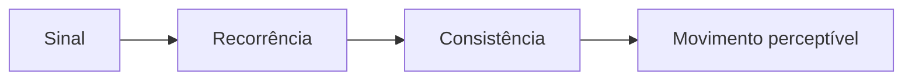

Guardrail:

```text
MOVIMENTO
≠ DIAGNÓSTICO
≠ CAUSA
≠ PROBLEMA AUTOMÁTICO
```

### 19.5 Vá além dos números

> **Vá além do número. Entenda o que ele pode estar mostrando.**

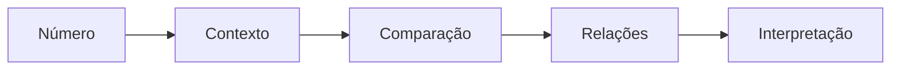

### 19.6 Saiba por quê

> **Entenda de onde uma conclusão veio — e até onde ela pode ir.**

Essa entrega prepara o movimento de confiança e explicabilidade.

## 20. Papel visual do Movimento 05

Esta Home deve usar recursos visuais quando ajudarem a tornar resultados tangíveis.

São particularmente adequados neste movimento:

- cards de KPI/indicadores conceituais;
- mini gráficos de tendência;
- comparações entre períodos;
- distribuição agregada;
- destaque de mudança;
- exemplo de Movimento Emergente;
- insight acompanhado de contexto e explicação.

Esses elementos não comprovam operação ou performance real. Até haver evidência, devem ser entendidos como **representações conceituais de tipo de leitura**.

---

# Movimento 06 — Como a compreensão se forma

## 21. Headline de referência

> **Transformar informação em compreensão exige mais do que reunir dados.**

## 22. Supporting copy de referência

> **Guivos Intelligence conecta informações, contexto, conhecimento, evidências e relações para revelar leituras que seriam mais difíceis de perceber olhando tudo de forma isolada.**

## 23. Formação pública da inteligência

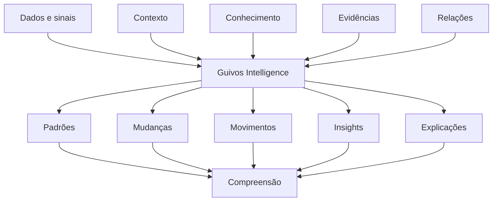

O visual deve explicar o mecanismo em linguagem pública sem sugerir decomposição física de serviços.

## 24. Papéis públicos simples

- **Informações** — sinais, dados, acontecimentos e registros;
- **Contexto** — onde, quando e em qual situação a informação existe;
- **Relações** — como diferentes elementos podem estar conectados;
- **Conhecimento e evidências** — referências que ajudam a interpretar;
- **Análise** — transformação dos elementos em leitura;
- **Compreensão** — significado útil produzido dentro dos limites de autoridade.

---

# Movimento 07 — Onde essa compreensão gera valor

## 25. Função

Responder:

> **Onde isso pode ser útil na prática?**

Sem transformar Journey, Business, Mall, Travel, Media ou Ads em módulos do Intelligence.

A ordem preferencial é mostrar **situações de uso da inteligência** e, somente depois, revelar as duas frentes superiores.

## 26. Situações públicas de valor

### 26.1 Entender uma recomendação

> **Saiba por que algo está sendo apresentado a você.**

Intelligence explica a leitura; Journey governa a experiência e a Pessoa escolhe.

### 26.2 Comparar cenários

> **Compare cenários com mais contexto.**

```text
PERÍODO A
32%

PERÍODO B
41%

NÃO APENAS
+9 p.p.

MAS TAMBÉM
onde mudou
quando mudou
em qual contexto
com quais outros sinais
```

### 26.3 Identificar movimentos

> **Perceba mudanças antes que elas se percam no volume de informações.**

Não significa prever o futuro nem declarar causalidade.

### 26.4 Descobrir relações

> **Encontre conexões entre informações que pareciam separadas.**

### 26.5 Enxergar lacunas

> **Veja o que existe — e também o que pode estar faltando.**

Guardrail:

```text
INTERESSE
≠ NECESSIDADE COMPROVADA
```

### 26.6 Tornar a análise compreensível

> **Não receba apenas números. Entenda o que eles podem estar mostrando.**

## 27. Duas frentes superiores — somente após o valor próprio

### Pessoa

Direção pública:

> **Mais contexto para entender o que está sendo apresentado e escolher com mais clareza.**

O Intelligence pode explicar relações, bases, alternativas e incertezas. O Journey preserva a autoridade sobre a experiência pessoal.

### Empresa / população

Direção pública:

> **Mais contexto para compreender movimentos agregados e decidir com uma visão mais completa.**

O Intelligence pode produzir indicadores agregados, padrões, mudanças, tendências, movimentos emergentes, lacunas, benchmarks autorizados e insights explicáveis. Business preserva a relação B2B.

## 28. Relação com o ecossistema

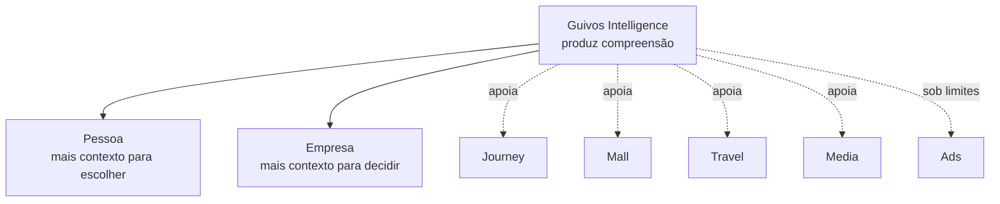

Intelligence pode ser origem da compreensão sem ser destino da experiência.

---

# Movimento 08 — Confiança, explicabilidade e limites

## 29. Headline de referência

> **Não receba apenas uma conclusão. Entenda como ela foi construída.**

## 30. Supporting copy de referência

> **Guivos Intelligence busca mostrar as informações, relações e evidências que sustentam uma leitura — além de deixar claro quando algo é observado, interpretado ou ainda incerto.**

## 31. Resultados de confiança

### 31.1 Fato ≠ interpretação

> **Saiba o que aconteceu e o que foi interpretado a partir disso.**

### 31.2 Proveniência

> **Veja quais informações sustentam uma leitura.**

### 31.3 Limites

> **Saiba também o que ainda não pode ser concluído.**

Exemplo conceitual:

```text
O QUE SABEMOS
✓ houve uma mudança

O QUE PODEMOS INTERPRETAR
~ há sinais de um novo padrão

O QUE AINDA NÃO SABEMOS
? por que isso aconteceu
```

### 31.4 Incerteza

> **Entenda quando uma leitura é forte — e quando ainda precisa de mais evidências.**

### 31.5 Correção e contestação

```text
LEITURA
≠ VERDADE IMUTÁVEL
```

Novos dados, correções ou contestação legítima podem alterar uma leitura.

## 32. Sequência explicativa recomendada

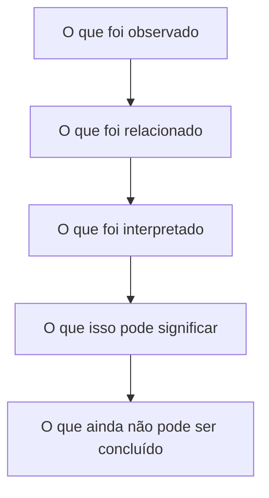

## 33. Escada epistêmica pública

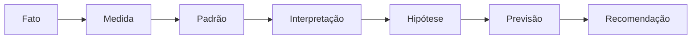

Quanto maior a distância do fato, maior a necessidade de explicação, evidência, cautela e governança.

Frase de referência:

> **Inteligência não deve apenas dizer algo. Deve ajudar você a entender por que aquilo está sendo dito.**

---

# Movimento 09 — Autonomia e decisão

## 34. Função

Transformar o contrato arquitetural `COMPREENDER ≠ DECIDIR` em benefício compreensível para quem usa.

## 35. Headline de referência

> **Veja mais antes de decidir.**

## 36. Supporting copy de referência

> **Entenda relações, compare mudanças, considere diferentes sinais e conheça os limites de uma leitura antes de escolher o que fazer.**

## 37. Princípio

> **Inteligência para ampliar sua visão — não para substituir sua decisão.**

## 38. Resultados esperados

### Melhores perguntas

A inteligência pode ajudar a reformular a pergunta quando o contexto revela que uma leitura inicial é insuficiente.

### Comparação antes da conclusão

> **Veja mais de um lado antes de chegar a uma conclusão.**

### Incerteza antes da ação

```text
SINAL FRACO
≠
CONCLUSÃO FORTE
```

### Recomendação ≠ ordem

> **Use recomendações como mais uma fonte de contexto para sua escolha.**

### Alternativas

Quando aplicável, preservar alternativas e explicar por que cada uma pode fazer sentido.

## 39. Resultado superior

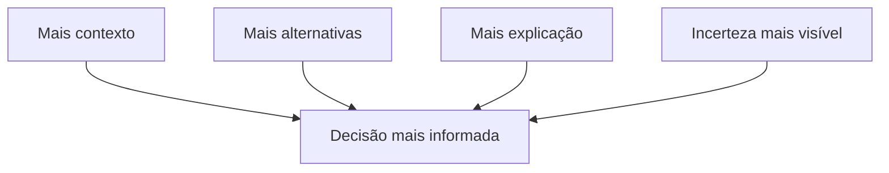

A Home não deve prometer que o Intelligence encontra “a decisão certa”.

---

# Movimento 10 — Inteligência conectada

## 40. Função

Explicar por que o Intelligence consegue construir leituras mais completas sem usar IA, Graph, Neo4j ou GraphRAG como proposta de valor central.

## 41. Headline de referência

> **Entenda não apenas cada informação, mas como elas podem estar relacionadas.**

## 42. Supporting copy de referência

> **Guivos Intelligence pode conectar informações, contextos, conhecimentos, acontecimentos e relações do ecossistema para construir uma visão mais completa daquilo que está sendo analisado.**

Resultado:

> **Descubra conexões, padrões e mudanças que poderiam passar despercebidos quando cada informação é analisada separadamente.**

## 43. Mais dados não é o diferencial

```text
MAIS DADOS
≠
MELHOR INTELLIGENCE
```

Direção correta:

```text
INFORMAÇÃO ADEQUADA
+
CONTEXTO ADEQUADO
+
RELAÇÕES ADEQUADAS
+
CONHECIMENTO ADEQUADO
↓
MELHOR COMPREENSÃO
```

## 44. Exemplo conceitual — sinais relacionados

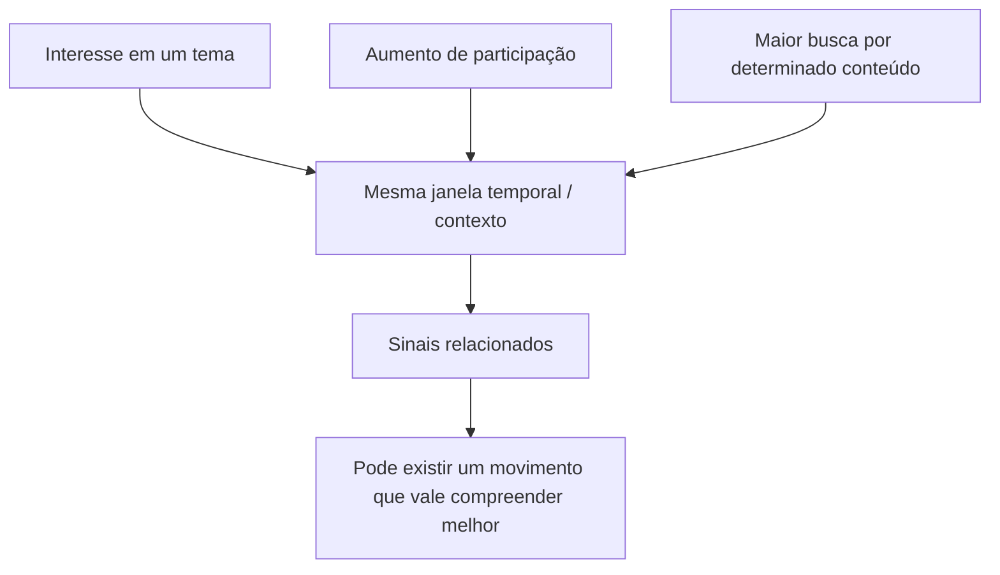

Guardrail:

```text
RELAÇÃO
≠ CAUSA
```

## 45. Exemplo conceitual — indicador isolado versus contexto

```text
UTILIZAÇÃO ↓ 12%

ISOLADO
→ pode sugerir menor interesse

RELACIONADO COM
DISPONIBILIDADE ↓
INTERESSE ESTÁVEL

→ surge uma hipótese alternativa a investigar
```

A Home deve deixar claro que isso é interpretação contextual, não causalidade comprovada.

## 46. Representação de relações

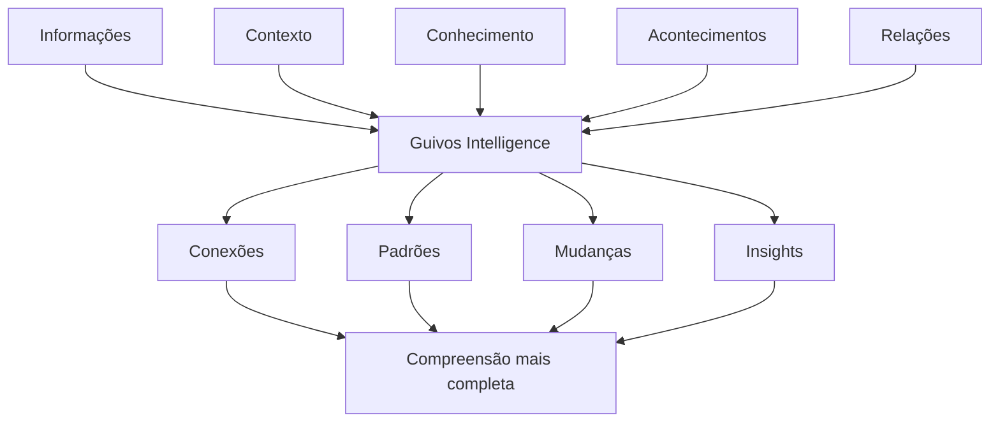

## 47. Papel subordinado de Graph e IA

A Home pode, em movimento posterior ou aprofundamento adequado, explicar que IA, análise de dados, conhecimento e estruturas relacionais podem trabalhar juntas para ampliar a compreensão.

Não usar como definição central:

```text
“powered by Neo4j”
“GraphRAG é o produto”
“IA é o Intelligence”
“Grafo Global operacional”
```

A ordem permanece:

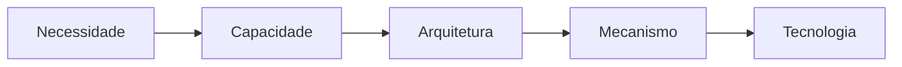

> **A tecnologia amplia a capacidade do Intelligence. Não amplia sua autoridade.**

---

# Diretriz visual consolidada

## 48. KPIs, indicadores e gráficos

A Home Intelligence pode e deve usar representações de KPIs, indicadores e gráficos quando elas tornarem concreto **o tipo de leitura que o produto entrega**.

Exemplos adequados:

- variação entre períodos;
- tendência;
- distribuição;
- comparação agregada;
- concentração;
- mudança de padrão;
- movimento emergente;
- lacuna;
- insight acompanhado de contexto;
- leitura com explicação e limitação.

Essas representações não devem criar evidência operacional inexistente. Quando não forem dados reais, devem ser tratadas como **exemplos conceituais**.

## 49. Organogramas, fluxos e sequências

São especialmente adequados para explicar:

- informação → contexto → compreensão;
- sinal → recorrência → movimento;
- observado → relacionado → interpretado → limite;
- mais contexto → decisão mais informada;
- informações isoladas → relações → leitura mais completa;
- produto → capacidade → arquitetura → tecnologia.

Regra:

> **Visual explicativo ≠ wireframe da Home.**

O GKR governa significado, função e relações dessas representações. A materialização visual pertence à fase posterior autorizada.

## 50. Matriz de uso visual por movimento

| Movimento | Visual conceitual recomendado | O que deve esclarecer |
|---|---|---|
| 01 | composição semântica simples | compreensão → possibilidade |
| 02 | fluxo de dispersão para clareza | informação ≠ compreensão |
| 03 | antes/depois conceitual | isolado → leitura conectada |
| 04 | sequência de entregas | conexões, padrões, mudanças, movimentos |
| 05 | KPIs, mini gráficos, cards analíticos | tornar resultados tangíveis |
| 06 | organograma/fluxo | como a compreensão se forma |
| 07 | exemplos de leitura e comparação | onde a compreensão gera valor |
| 08 | escada/fluxo epistêmico | origem, interpretação, incerteza e limite |
| 09 | fluxo de decisão | mais contexto sem perda de autonomia |
| 10 | rede/organograma de relações | informação conectada e inteligência de ecossistema |

---

# Guardrails consolidados deste checkpoint

## 51. Guardrails de identidade

```text
INTELLIGENCE ≠ JOURNEY
INTELLIGENCE ≠ BUSINESS
INTELLIGENCE ≠ DASHBOARD
INTELLIGENCE ≠ IA
INTELLIGENCE ≠ NEO4J
INTELLIGENCE ≠ GRAPHRAG
```

## 52. Guardrails de resultado

```text
RESULTADO ESPERADO ≠ RESULTADO COMPROVADO
PADRÃO ≠ CAUSA
MOVIMENTO ≠ DIAGNÓSTICO
INTERESSE ≠ NECESSIDADE
RECOMENDAÇÃO ≠ ORDEM
COMPREENDER ≠ DECIDIR
```

## 53. Guardrails de linguagem

- falar diretamente com quem recebe o valor;
- evitar abstração quando uma consequência concreta puder ser dita;
- não reduzir a Home a features;
- não transformar a Home em documentação técnica;
- não prometer certeza onde há interpretação;
- não criar linguagem de previsão do futuro sem autoridade e evidência.

## 54. Guardrails visuais

- KPI conceitual não pode parecer evidência operacional real sem identificação adequada;
- diagrama deve explicar relação, processo, hierarquia ou entrega;
- card não é arquitetura;
- dashboard não é sinônimo de Intelligence;
- organograma conceitual não é arquitetura física;
- rede conceitual não comprova Grafo Global operacional.

---

# 55. Próximo ponto exato

A construção deve continuar a partir do **Movimento 11**.

Direção já identificada, mas ainda não desenvolvida/convergida:

> **traduzir a compreensão em uma visão mais aspiracional de resultado — perceber antes, enxergar mais longe e descobrir possibilidades que antes não estavam visíveis — sem transformar essa narrativa em promessa de previsão do futuro.**

Isso é apenas o **brief do próximo movimento**, não sua formulação aprovada.

## 56. Sequência preservada

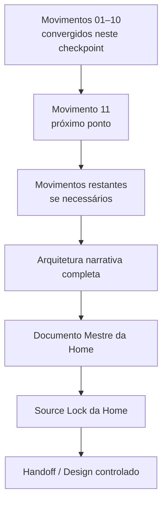

Nenhuma dessas etapas autoriza automaticamente a seguinte.
