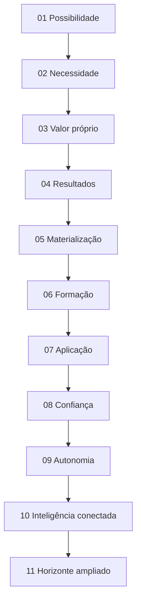

# Home Pública — Guivos Intelligence v1 — Documento Mestre

## 1. Finalidade

Este documento consolida a **fonte mestre de referência da Home Pública Guivos Intelligence v1** depois da convergência dos onze movimentos da arquitetura narrativa.

A versão `1.0.0` consolida a arquitetura em 11 movimentos, a copy pública de referência e a camada de prontidão documental para Designer e IA, sem alterar o significado do produto, as autoridades superiores, as fronteiras interproduto ou os guardrails vigentes.

Sua função é reunir, em uma única leitura, o significado do produto que pode ser comunicado publicamente, a proposta de valor da Home, a progressão narrativa, a copy de referência, as fronteiras interproduto, os resultados esperados, os elementos visuais admissíveis e os guardrails que devem permanecer preservados na próxima etapa.

Este Documento Mestre deriva de autoridades superiores e **não as substitui**.

Ordem de autoridade:

```text
GPA-006 v2.0.0
→ autoridade superior do produto

GKR-INTELLIGENCE-PRODUCT-SOURCELOCK-001 v1.0.0
→ porta de entrada normativa para a Home

GKR-UX-HOMES-OUTCOME-001 v1.0.0
→ princípio transversal de resultado das Homes

GKR-UX-HOME-INTELLIGENCE-NARRATIVE-001 v0.2.1
→ arquitetura narrativa convergida em 11 movimentos

GKR-UX-HOME-INTELLIGENCE-MASTER-001 v0.1.1
→ consolidação mestre desta Home
```

Este documento ainda **não é o Home Source Lock**.

## 2. Estado governado

```text
PRODUTO GUIVOS INTELLIGENCE
→ CONSOLIDADO EM GPA-006 v2.0.0

PRODUCT SOURCE LOCK
→ INTEGRADO

HOME PÚBLICA INTELLIGENCE v1
→ ARQUITETURA CONCEITUAL COMPLETA
→ 11 MOVIMENTOS CONVERGIDOS

ARQUITETURA NARRATIVA
→ v0.2.1
→ COPY DE REFERÊNCIA CORRIGIDA

DOCUMENTO MESTRE
→ ESTE ARTEFATO
→ v0.1.1

HOME SOURCE LOCK
→ NÃO CRIADO

WIREFRAME / UI / PROTÓTIPO / DESIGN HANDOFF
→ NÃO INICIADOS NESTE FLUXO
```

## 3. Definição superior preservada

A autoridade de produto permanece em `GPA-006 2.0.0`:

> **Guivos Intelligence é o Produto Especializado transversal da Guivos e a Intelligence Layer do ecossistema, responsável por transformar dados autorizados, conhecimento, evidências, contextos e relações em compreensão útil, insights, análises, possibilidades e recomendações explicáveis, ampliando a capacidade de Pessoas, Organizações e produtos tomarem melhores decisões dentro de suas próprias autoridades.**

Unidade superior de valor:

> **compreensão útil e contextualizada.**

Tese pública que a Home deve conseguir tornar intuitiva:

> **Ter informação não é o mesmo que compreender. O valor do Guivos Intelligence está em ajudar a perceber o que informações isoladas não conseguem mostrar com clareza.**

Contrato superior:

```text
COMPREENDER
≠
DECIDIR
```

## 4. O que a Home deve fazer o visitante perceber

A Home precisa comunicar que Guivos Intelligence pode ajudar a:

- ver como informações se conectam;
- perceber o que se repete;
- entender o que está mudando;
- reconhecer quando algo começa a ganhar força;
- ir além do número isolado;
- compreender de onde uma leitura veio;
- conhecer limites e incertezas;
- comparar situações com mais contexto;
- ampliar o que pode ser considerado antes de decidir;
- reconhecer sinais mais cedo sem prometer prever o futuro.

A Home não deve se organizar como catálogo de engines, tecnologias, dashboards ou componentes internos.

## 5. Regra editorial superior

A Home deve obedecer:

> **Primeiro mostre o que a pessoa consegue enxergar. Depois explique como o Intelligence torna isso possível.**

Consequentemente:

```text
RESULTADO
ANTES DO
MECANISMO
```

```text
LINGUAGEM COMPREENSÍVEL
ANTES DA
TERMINOLOGIA ANALÍTICA
```

Termos como contexto, evidência, padrão, tendência, movimento, inferência e relação podem aparecer quando úteis, mas não devem ser requisito para que o visitante compreenda o benefício.

## 6. Posicionamento narrativo

A ideia-mãe é:

> **Compreender melhor amplia o que você consegue perceber.**

Pergunta-mãe de referência:

> **O que se torna possível quando você compreende melhor o que está acontecendo?**

Expressão de apoio de referência:

> **Entenda melhor o que está acontecendo. Amplie o que você consegue perceber.**

Expressão funcional de referência:

> **Veja como as informações se conectam. Perceba o que se repete. Entenda o que está mudando.**

Expressão de autonomia:

> **Veja mais antes de decidir.**

Expressão de fechamento:

> **Perceba antes o que começa a mudar. Enxergue além do que já está evidente.**

A pergunta-mãe, CTAs e microcopy podem ser refinados no Home Source Lock desde que não alterem significado, autoridade ou fronteira de produto.

## 7. Princípio de valor e resultado

A Home aplica:

```text
SIGNIFICADO
→ POR QUE IMPORTA
→ CAPACIDADE
→ ENTREGA
→ BENEFÍCIO
→ RESULTADO ESPERADO
```

Contratos obrigatórios:

```text
FEATURE ≠ VALOR
CAPACIDADE ≠ RESULTADO
RESULTADO ESPERADO ≠ RESULTADO COMPROVADO
```

A Home pode demonstrar que o Intelligence **permite compreender melhor**. Não pode transformar esse benefício em promessa não comprovada de redução de risco, aumento de performance, melhoria percentual, acurácia causal ou previsão determinística.

## 8. Arquitetura narrativa final

A Home está consolidada em **11 movimentos**.



### Movimento 01 — Possibilidade

Função: abrir pela consequência da compreensão, sem antecipar o fechamento do Movimento 11.

> **O que se torna possível quando você compreende melhor o que está acontecendo?**

> **Entenda melhor o que está acontecendo. Amplie o que você consegue perceber.**

### Movimento 02 — Necessidade

Função: tornar evidente que informação abundante não produz clareza automaticamente.

> **Ter mais informação não significa entender melhor.**

Supporting copy de referência:

> **O que faz diferença é conseguir juntar informações que estão espalhadas e entender o que elas mostram quando vistas em conjunto.**

### Movimento 03 — Valor próprio do Intelligence

Função: responder por que o Intelligence existe, sem absorver Journey ou Business.

> **Entenda o que informações isoladas não conseguem mostrar.**

Supporting copy de referência:

> **Guivos Intelligence conecta informações que, separadas, mostram apenas parte da história — ajudando você a perceber relações, padrões e mudanças que antes poderiam passar despercebidos.**

Expressão funcional:

> **Veja como as informações se conectam. Perceba o que se repete. Entenda o que está mudando.**

### Movimento 04 — Resultados da inteligência

Função: apresentar o que o Intelligence permite perceber.

> **Veja o que está conectado.**

> **Perceba o que se repete.**

> **Entenda o que está mudando.**

> **Veja o que começa a ganhar força.**

Contrato de separação:

```text
MOVIMENTO 04
→ MOSTRA OS RESULTADOS

MOVIMENTO 05
→ DEMONSTRA OS RESULTADOS
```

### Movimento 05 — Tornar resultados tangíveis

Função: materializar o valor em leituras compreensíveis por meio de KPIs, comparações, contexto, relações e exemplos conceituais.

> **Veja o que você não enxergaria olhando cada informação separadamente.**

Entregas demonstráveis:

- perceber como informações diferentes podem estar relacionadas;
- ver o que se repete ou foge do habitual;
- entender como algo está mudando;
- perceber quando algo que parecia isolado começa a se repetir e ganhar força;
- ir além do número;
- entender de onde uma conclusão veio e até onde ela pode ir.

Exemplo conceitual:

```text
UTILIZAÇÃO
72% → 64%

ISOLADAMENTE
“houve queda”

EM CONTEXTO
→ quando começou?
→ em quais grupos?
→ ocorreu junto com quais outras mudanças?
→ é recorrente ou pontual?
```

### Movimento 06 — Como a compreensão se forma

Função: explicar o mecanismo conceitual em linguagem pública sem transformar tecnologia em produto.

> **Informações fazem mais sentido quando você consegue enxergar o contexto ao redor delas.**

Supporting copy:

> **Guivos Intelligence observa informações em conjunto, considera o contexto em que elas existem e busca relações que ajudem você a interpretá-las melhor.**

```text
INFORMAÇÕES
+
CONTEXTO
+
RELAÇÕES
+
CONHECIMENTO E EVIDÊNCIAS
↓
COMPREENSÃO
```

### Movimento 07 — Onde essa compreensão gera valor

Função: mostrar situações de uso sem transformar produtos do ecossistema em módulos do Intelligence.

Situações de referência:

- entender uma recomendação;
- comparar situações com mais contexto;
- perceber mudanças;
- descobrir relações;
- enxergar lacunas;
- tornar análises compreensíveis.

### Movimento 08 — Confiança, explicabilidade e limites

Função: mostrar que uma leitura deve ser compreensível, limitada e contestável.

> **Não veja apenas a conclusão. Entenda de onde ela veio.**

Sequência pública de referência:

```text
O que foi observado?
O que mudou?
Quais informações foram consideradas?
Como elas podem estar relacionadas?
O que é fato?
O que é interpretação?
Até onde essa leitura pode ir?
```

### Movimento 09 — Autonomia e decisão

Função: traduzir `COMPREENDER ≠ DECIDIR` em valor público.

> **Veja mais antes de decidir.**

Supporting copy:

> **Guivos Intelligence pode mostrar relações, comparar informações e explicar leituras. A decisão continua com você — ou com quem tem autoridade para tomá-la.**

Princípio:

> **Inteligência para ampliar sua visão — não para substituir sua decisão.**

### Movimento 10 — Inteligência conectada

Função: aprofundar o valor específico das relações, sem repetir o Movimento 03.

> **Uma informação pode mostrar mais quando você entende com o que ela se relaciona.**

Supporting copy:

> **Guivos Intelligence não olha apenas informações isoladas. Ele considera como acontecimentos, contextos e informações podem estar relacionados para construir uma leitura mais completa.**

```text
MAIS DADOS
≠
MELHOR INTELLIGENCE

RELAÇÃO
≠
CAUSA
```

### Movimento 11 — Horizonte ampliado

Função: encerrar a narrativa mostrando o que uma compreensão mais ampla torna perceptível.

> **Compreender melhor não muda apenas o que você sabe. Pode mudar o que você consegue perceber.**

Headline de referência:

> **Perceba antes o que começa a mudar. Enxergue além do que já está evidente.**

Supporting copy de referência:

> **Ao perceber relações, repetições e mudanças com mais contexto, você pode reconhecer sinais mais cedo e ampliar o que consegue considerar.**

Fechamento complementar:

> **Novas possibilidades podem se tornar mais visíveis.**

Progressão:

```text
COMPREENDER MAIS
→ PERCEBER MAIS
→ RECONHECER SINAIS MAIS CEDO
→ AMPLIAR O QUE PODE SER CONSIDERADO
```

Não há Movimento 12 previsto nesta arquitetura.

## 9. Copy de referência v1 corrigida

As seguintes formulações compõem a base semântica da Home v1. Não são ainda copy final imutável.

```text
01 — O que se torna possível quando você compreende melhor o que está acontecendo?
     Entenda melhor o que está acontecendo. Amplie o que você consegue perceber.

02 — Ter mais informação não significa entender melhor.
     O que faz diferença é conseguir juntar informações que estão espalhadas e entender o que elas mostram quando vistas em conjunto.

03 — Entenda o que informações isoladas não conseguem mostrar.
     Veja como as informações se conectam. Perceba o que se repete. Entenda o que está mudando.

04 — Veja o que está conectado. Perceba o que se repete. Entenda o que está mudando. Veja o que começa a ganhar força.

05 — Veja o que você não enxergaria olhando cada informação separadamente.

06 — Informações fazem mais sentido quando você consegue enxergar o contexto ao redor delas.

07 — Onde essa compreensão pode ser útil na prática?

08 — Não veja apenas a conclusão. Entenda de onde ela veio.

09 — Veja mais antes de decidir.

10 — Uma informação pode mostrar mais quando você entende com o que ela se relaciona.

11 — Perceba antes o que começa a mudar. Enxergue além do que já está evidente.
     Novas possibilidades podem se tornar mais visíveis.
```

Síntese funcional:

> **Veja como as informações se conectam. Perceba o que se repete. Entenda o que está mudando. Veja mais antes de decidir.**

Síntese aspiracional:

> **Perceba antes o que começa a mudar. Enxergue além do que já está evidente.**

## 10. Duas frentes, um único produto

Guivos Intelligence possui um único núcleo e duas frentes superiores de geração de valor.

### 10.1 Pessoa / Journey

Direção pública:

> **Entenda melhor por que determinadas informações, recomendações ou possibilidades podem aparecer em determinado contexto.**

```text
INTELLIGENCE
→ produz compreensão

JOURNEY
→ governa a experiência

PESSOA
→ escolhe
```

O Intelligence pode compreender contexto individual autorizado, explicar relações, bases, alternativas e incertezas e apoiar escolhas.

Não governa a Journey.

### 10.2 Business / população

Direção pública:

> **Compreenda padrões, mudanças e movimentos em populações de forma agregada e protegida.**

```text
INTELLIGENCE
→ produz leitura populacional

BUSINESS
→ governa a relação empresarial

EMPRESA
→ decide
```

O Intelligence pode produzir leitura populacional autorizada e protegida, incluindo indicadores, padrões, mudanças, tendências, movimentos emergentes, lacunas, benchmarks autorizados e insights explicáveis.

A Empresa não recebe “Intelligence por funcionário” nem acesso à intimidade individual da Journey.

## 11. Assimetria de compreensão e exposição

Permanecem obrigatórios:

```text
PROFUNDIDADE DE COMPREENSÃO
≠
PROFUNDIDADE DE EXPOSIÇÃO

AUTORIDADE PARA PERSONALIZAR
≠
AUTORIDADE PARA COMPARTILHAR
```

O Intelligence pode saber mais para servir a própria Pessoa do que pode revelar a uma Organização.

> **Compreender profundamente não significa expor profundamente.**

## 12. Explicabilidade e escada epistêmica

A Home pode mostrar que diferentes tipos de leitura possuem diferentes graus de certeza e exigem diferentes níveis de evidência.

```text
FATO
→ MEDIDA
→ PADRÃO
→ INTERPRETAÇÃO
→ HIPÓTESE
→ PREVISÃO
→ RECOMENDAÇÃO
```

Quanto maior a distância do fato, maior a necessidade de explicação, evidência, cautela e governança.

Contratos:

```text
DECLARADO ≠ OBSERVADO ≠ INFERIDO ≠ PREDITO
INFERÊNCIA ≠ FATO
CORRELAÇÃO ≠ CAUSALIDADE
```

## 13. Horizonte ampliado sem previsão

O valor aspiracional permitido é **tornar mais visíveis sinais, padrões, mudanças, movimentos e possibilidades**.

Não é permitido transformar esse valor em conhecimento determinístico do futuro.

```text
PERCEBER ANTES ≠ PREVER O FUTURO
ENXERGAR MAIS LONGE ≠ SABER O QUE VAI ACONTECER
SINAL ≠ CERTEZA
TENDÊNCIA ≠ DESTINO
PADRÃO EM FORMAÇÃO ≠ RESULTADO FUTURO GARANTIDO
POSSIBILIDADE ≠ RECOMENDAÇÃO OBRIGATÓRIA
```

A formulação pública deve permanecer no território de:

> **“há algo que agora pode ser enxergado e considerado”**

não de:

> **“sabemos o que vai acontecer”.**

## 14. Papel da tecnologia

A Home pode explicar, em profundidade adequada, que IA, análise de dados, conhecimento e estruturas relacionais podem trabalhar juntas para ampliar a compreensão.

Mas não pode definir Intelligence por esses meios.

```text
GUIVOS INTELLIGENCE
≠ IA
≠ LLM
≠ GUIVOS.AI
≠ DASHBOARD
≠ POWER BI
≠ GRAFO GLOBAL
≠ NEO4J
≠ GRAPHRAG
≠ API
≠ RELATÓRIO
```

Ordem correta:

```text
NECESSIDADE
→ CAPACIDADE
→ ARQUITETURA
→ MECANISMO
→ TECNOLOGIA
```

> **A tecnologia amplia a capacidade do Intelligence. Não amplia sua autoridade.**

## 15. Papel dos elementos visuais

A Home pode usar recursos visuais quando eles ajudam a explicar entrega, relação, sequência, comparação ou resultado.

São admissíveis conceitualmente:

- KPIs e indicadores;
- mini gráficos;
- variação entre períodos;
- tendência;
- distribuição;
- comparação agregada;
- concentração;
- mudança de padrão;
- movimento emergente;
- lacunas;
- cards de insight;
- organogramas;
- fluxos;
- sequências;
- redes conceituais;
- escadas de interpretação.

Guardrail:

> **Visual explicativo ≠ wireframe.**

Quando os dados não forem reais, precisam permanecer claramente como **representações conceituais de tipo de leitura**, nunca como prova de operação ou performance.

## 16. Guardrails mestres

### 16.1 Identidade

```text
INTELLIGENCE ≠ JOURNEY
INTELLIGENCE ≠ BUSINESS
INTELLIGENCE ≠ IA
INTELLIGENCE ≠ DASHBOARD
INTELLIGENCE ≠ GRAFO
```

### 16.2 Autoridade e privacidade

```text
CONHECER ≠ UTILIZAR ≠ COMPARTILHAR
PERSONALIZAR ≠ EXPOR
PAGAMENTO ≠ RELEVÂNCIA
ENTITLEMENT ≠ AUTORIDADE
PLANO SUPERIOR ≠ MENOS PRIVACIDADE
```

### 16.3 Resultado

```text
RESULTADO ESPERADO ≠ RESULTADO COMPROVADO
COMPREENDER ≠ DECIDIR
RECOMENDAÇÃO ≠ ORDEM
INTERESSE ≠ NECESSIDADE COMPROVADA
```

### 16.4 Epistemologia

```text
PADRÃO ≠ CAUSA
RELAÇÃO ≠ CAUSA
MOVIMENTO ≠ DIAGNÓSTICO
SINAL ≠ CERTEZA
TENDÊNCIA ≠ DESTINO
INFERÊNCIA ≠ FATO
```

### 16.5 Interproduto

```text
INTELLIGENCE
→ produz compreensão

JOURNEY
→ governa experiência, direção e caminhos da Pessoa

BUSINESS
→ governa relação B2B, programas, ofertas e aplicação empresarial
```

> **Intelligence conecta autoridades. Não as absorve.**

## 17. Limites desta Home e da frente de Design

Este Documento Mestre governa significado público da Home, não implementação.

Ele não autoriza automaticamente:

- implementação front-end ou back-end;
- integração técnica;
- publicação comercial;
- pricing;
- disponibilidade comercial;
- promessa de operação de Neo4j, GraphRAG, GDS, Power BI, Guivos.ai ou Grafo Global;
- uso de dados fora das autoridades previstas;
- exposição individual para Empresa;
- promoção silenciosa de maturidade técnica.

A designer possui liberdade sobre expressão visual. IA é opcional.

```text
GKR
→ SIGNIFICADO / AUTORIDADE / LIMITES / VERDADE

DESIGNER
→ EXPRESSÃO VISUAL / CRIATIVA

AI
→ OPTIONAL SUPPORT

TECHNOLOGY
→ NOT THE PRODUCT IDENTITY
```

## 18. Itens deliberadamente abertos

Permanecem abertos sem reabrir a arquitetura:

- pergunta-mãe final;
- CTA principal;
- CTA secundário;
- microcopy;
- ordem visual;
- quantidade e forma dos exemplos visuais;
- escolha entre exemplos reais e conceituais;
- profundidade pública de Graph/IA;
- composição das duas frentes;
- direção de arte;
- tipografia;
- paleta;
- imagens;
- motion;
- componentes;
- layout;
- breakpoints;
- eventual pricing/oferta pública futura;
- demonstrações reais disponíveis no lançamento.

Esses itens são `CONTENT_CANDIDATE`, `DESIGN_CREATIVE`, `DESIGN_HYPOTHESIS`, `REAL_DATA_REQUIRED` ou `OPEN_QUESTION` conforme o caso.

## 19. Critério de passagem

A arquitetura narrativa está completa em 11 movimentos e o Home Source Lock já existe.

O gate corrente deixa de ser “criar Source Lock” e passa a ser demonstrar suficiência documental dentro da frente das oito Homes.

```text
PRODUCT AUTHORITY
→ PRODUCT SOURCE LOCK
→ HOME NARRATIVE
→ HOME MASTER
→ HOME SOURCE LOCK
→ SOURCE_READY AUDIT
→ GLOBAL 8 / 8 RECONCILIATION
→ HUMAN RELEASE
→ EXTERNAL DESIGN
```

Nenhuma etapa autoriza Product Engineering automaticamente.

---

## 20. Prontidão documental para Designer e IA

### 20.1 Resultado da auditoria

```text
HOME INTELLIGENCE
→ SOURCE_READY = PASS

MASTER
→ GKR-UX-HOME-INTELLIGENCE-MASTER-001 v1.0.0

HOME SOURCE LOCK
→ GKR-UX-HOME-INTELLIGENCE-SOURCELOCK-001 v1.1.0

PRODUCT AUTHORITY
→ GPA-006 v2.0.0

PRODUCT SOURCE LOCK
→ GKR-INTELLIGENCE-PRODUCT-SOURCELOCK-001 v1.0.0

MATERIAL DOCUMENT GAPS
→ 0

UNRESOLVED SEMANTIC CONFLICTS
→ 0

VISUAL IDENTITY PRE-IMPOSED
→ 0
```

### 20.2 Condições e estados que a solução deve tolerar

#### Sem dados reais para demonstração

- exemplos analíticos podem ser conceituais;
- rótulo deve deixar claro que não são operação real;
- números não podem parecer KPI vigente;
- compreensão do produto não depende de um dashboard funcional.

#### Dado observado

- distinguir do declarado, calculado, inferido, predito e agregado;
- proveniência e contexto importam;
- observação não equivale a interpretação.

#### Inferência

- deve permanecer inferência;
- não vira fato;
- incerteza e limitações devem ser representáveis;
- inferência incompatível com declaração legítima da Pessoa não ganha autoridade superior sobre significado pessoal.

#### Sinal / tendência / movimento emergente

- sinal ≠ certeza;
- tendência ≠ destino;
- movimento emergente ≠ previsão;
- percepção antecipada não é promessa de futuro.

#### Relação / correlação

- relação ≠ causa;
- correlação ≠ causalidade;
- visual de conexão não deve insinuar causalidade automaticamente.

#### Frente Pessoa / Journey

- compreensão individual somente dentro de contexto autorizado;
- personalização ≠ exposição;
- Journey preserva autoridade sobre experiência e Próximo Passo;
- Intelligence não decide pela Pessoa.

#### Frente Business / população

- compreensão populacional deve preservar agregação, proteção e finalidade;
- Empresa não recebe Intelligence individual por funcionário;
- entitlement não amplia autoridade;
- plano superior não reduz privacidade.

#### Intelligence direto

- quando compreender/investigar é a finalidade, o produto pode ter presença própria;
- isso não transforma tecnologia ou interface em identidade superior do produto.

#### Intelligence embutido

- output pode aparecer em outros produtos;
- produto anfitrião preserva autoridade funcional;
- Intelligence não absorve Journey, Business, Mall, Travel, Media ou Ads.

#### Tecnologia não operacional comprovada

- Graph, Neo4j, GraphRAG, GDS, Power BI, Guivos.ai e outras tecnologias não devem parecer implantadas sem evidência;
- podem ser explicadas apenas dentro da maturidade autorizada.

#### Erro / baixa confiança / evidência insuficiente

- solução deve conseguir representar incerteza, ausência de evidência, conflito ou limite;
- não forçar uma conclusão visual;
- `não sabemos` é estado legítimo.

#### Dado sensível / não autorizado

- não deve ser exposto;
- ausência de autoridade deve limitar uso e visualização;
- interface não contorna política.

#### Mobile

- explicação, comparação, proveniência, incerteza e autonomia permanecem legíveis;
- não reduzir a experiência a cards analíticos;
- visualização deve adaptar-se sem perder contexto.

#### Reduced motion / baixa conectividade

- relações, sequências e sinais permanecem compreensíveis sem animação;
- visualização dinâmica possui alternativa estática/textual;
- mídia rica não é requisito para explicar valor.

### 20.3 Acessibilidade e robustez

A solução deve prever:

- teclado;
- foco visível;
- leitores de tela;
- contraste;
- texto ampliado;
- alternativas textuais para gráficos;
- descrições de relações e tendências;
- não depender exclusivamente de cor, posição ou animação;
- reduced motion;
- tabelas/gráficos com estrutura acessível;
- estados de erro, incerteza e ausência;
- conteúdo robusto a valores, labels e descrições longas;
- internacionalização;
- explicabilidade acessível sem exigir interação complexa.

### 20.4 Matriz operacional específica do Intelligence

#### CANONICAL

- Intelligence é Produto Especializado transversal e Intelligence Layer;
- unidade de valor: **compreensão útil e contextualizada**;
- `COMPREENDER ≠ DECIDIR`;
- Intelligence ≠ IA ≠ LLM ≠ dashboard ≠ grafo ≠ tecnologia;
- 11 movimentos;
- necessidade → capacidade → arquitetura → mecanismo → tecnologia;
- duas frentes superiores: Pessoa/Journey e Business/população;
- compreender profundamente ≠ expor profundamente;
- conhecer ≠ utilizar ≠ compartilhar;
- declarado ≠ observado ≠ calculado ≠ inferido ≠ predito ≠ agregado;
- relação/correlação ≠ causa;
- sinal ≠ certeza;
- tendência ≠ destino;
- recomendação ≠ ordem;
- resultado esperado ≠ comprovado;
- explicabilidade, proveniência, contexto, incerteza e limite fazem parte do valor;
- Intelligence conecta autoridades, não as absorve.

#### DESIGN_CREATIVE

- identidade visual;
- tipografia;
- paleta;
- ilustração;
- fotografia;
- vídeo;
- iconografia;
- composição;
- grid;
- ritmo;
- cards;
- gráficos;
- diagramas;
- redes;
- fluxos;
- microinterações;
- motion;
- visualização de dados;
- representação das duas frentes;
- tratamento da explicabilidade;
- desktop/mobile;
- linguagem gráfica;
- direção de arte.

Nenhuma dessas escolhas pode transformar tecnologia em identidade do produto.

#### CONTENT_CANDIDATE

- pergunta-mãe final;
- CTAs;
- supporting copy;
- microcopy;
- labels;
- exemplos explicativos;
- títulos de leituras;
- textos de incerteza e proveniência.

#### DESIGN_HYPOTHESIS

- formas de materializar resultados;
- visualização de relações;
- séries temporais;
- distribuição;
- comparação;
- cards analíticos;
- redes;
- escadas epistemológicas;
- before/after;
- exemplos de explicabilidade;
- formas de separar Pessoa/Business;
- exposição de tecnologia subordinada;
- responsividade.

#### PROTOTYPE_PLACEHOLDER

- KPI;
- métrica;
- gráfico;
- dado;
- pessoa;
- população;
- insight;
- recomendação;
- relação;
- tendência;
- sinal;
- evidência;
- fonte;
- tecnologia;
- resultado.

Placeholder analítico deve ser explicitamente conceitual.

#### REAL_DATA_REQUIRED

- KPI real;
- dado real;
- métrica;
- benchmark;
- case;
- cliente;
- população;
- resultado;
- causalidade;
- acurácia;
- tecnologia implantada;
- integração;
- performance;
- modelo de IA;
- disponibilidade comercial;
- pricing;
- Graph/Neo4j/GraphRAG/GDS/Power BI/Guivos.ai em produção.

#### OPEN_QUESTION

- copy final;
- CTAs finais;
- profundidade técnica pública;
- exemplos reais de lançamento;
- pricing;
- oferta B2B autônoma;
- modelo de IA selecionado;
- infraestrutura;
- tecnologias implantadas;
- thresholds;
- políticas operacionais;
- métricas e cases.

Não bloqueiam Design quando representados como ausência ou hipótese.

#### PROHIBITED_INFERENCE

Não criar ou insinuar:

- previsão certa do futuro;
- decisão correta garantida;
- causalidade automática;
- diagnóstico humano;
- score de evolução;
- acesso individual de Empresa;
- vigilância;
- exposição de Journey;
- mais dados = melhor Intelligence;
- dashboard = Intelligence;
- IA = Intelligence;
- Neo4j/GraphRAG/Power BI/Guivos.ai em produção sem prova;
- KPI fictício como real;
- case fictício;
- melhoria percentual;
- redução de risco comprovada;
- produtividade comprovada;
- relevância comprável;
- plano superior = mais autoridade;
- tecnologia aumentando autoridade.

### 20.5 Brief mínimo para a designer

A designer deve conseguir responder:

1. o que é Intelligence e o que ele não é;
2. qual é sua unidade de valor;
3. quais são os 11 movimentos;
4. como M03 difere de M10;
5. como M04 difere de M05;
6. quais são as duas frentes;
7. como compreender e expor se diferenciam;
8. como dado, inferência, sinal, tendência e causalidade se distinguem;
9. como explicabilidade/proveniência aparecem no valor;
10. qual é o papel subordinado de Graph/IA/tecnologia;
11. quais dados/claims exigem prova real;
12. como representar `não sabemos`, incerteza ou evidência insuficiente;
13. o que é livre para criação;
14. o que é proibido inferir;
15. como a experiência funciona em mobile e sem motion.

### 20.6 Uso opcional de IA no Design

Se a designer usar IA para criar a Home, o sistema deve receber:

1. autoridades comuns vigentes;
2. `GPA-006 v2.0.0`;
3. Product Source Lock;
4. este Master;
5. Home Source Lock;
6. matriz operacional desta seção;
7. objetivo explícito.

A IA usada **para Design** não ganha acesso ou autoridade sobre dados reais de participantes por causa dessa função. Source material documental é suficiente para exploração visual.

### 20.7 Fechamento

```text
HOME INTELLIGENCE
→ SOURCE_READY = PASS

DESIGNER
→ CAN START FROM DOCUMENTATION AFTER GLOBAL PACKAGE RELEASE

AI FOR DESIGN
→ OPTIONAL

FIGMA MAKE
→ NOT REQUIRED

VISUAL DIRECTION
→ DESIGN-OWNED

TECHNOLOGY
→ SUBORDINATE / REAL DATA REQUIRED FOR OPERATIONAL CLAIMS

MATERIAL SEMANTIC GAP
→ 0
```

Este `PASS` não declara implementação, modelo de IA escolhido, Graph/Neo4j/GraphRAG em produção, pricing, performance ou disponibilidade comercial.
