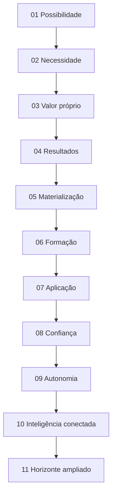
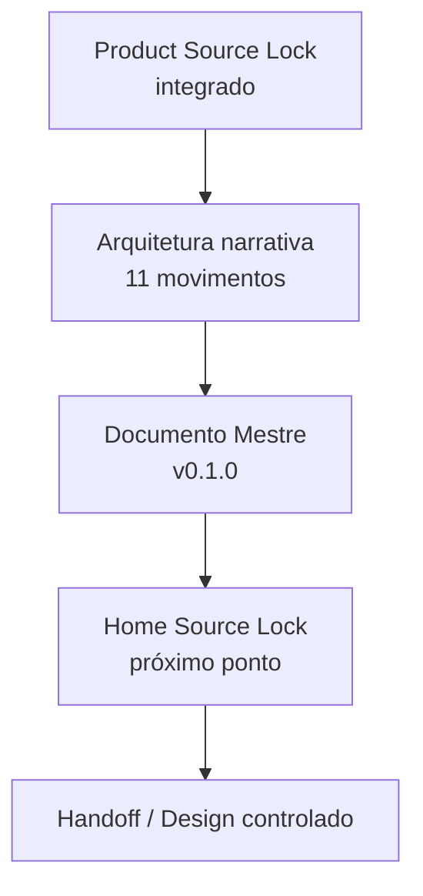

# Home Pública — Guivos Intelligence v1 — Documento Mestre

## 1. Finalidade

Este documento consolida a **fonte mestre de referência da Home Pública Guivos Intelligence v1** depois da convergência dos onze movimentos da arquitetura narrativa.

Sua função é reunir, em uma única leitura, o significado do produto que pode ser comunicado publicamente, a proposta de valor da Home, a progressão narrativa, a copy de referência, as fronteiras interproduto, os resultados esperados, os elementos visuais admissíveis e os guardrails que devem permanecer preservados na próxima etapa.

Este Documento Mestre deriva de autoridades superiores e **não as substitui**.

Ordem de autoridade:

```text
GPA-006 v2.0.0
→ autoridade superior do produto

GKR-INTELLIGENCE-PRODUCT-SOURCELOCK-001 v1.0.0
→ porta de entrada normativa para a Home

GKR-UX-HOMES-OUTCOME-001 v1.0.0
→ princípio transversal de resultado das Homes

GKR-UX-HOME-INTELLIGENCE-NARRATIVE-001 v0.2.0
→ arquitetura narrativa convergida em 11 movimentos

GKR-UX-HOME-INTELLIGENCE-MASTER-001 v0.1.0
→ consolidação mestre desta Home
```

Este documento ainda **não é o Home Source Lock**.

## 2. Estado governado

```text
PRODUTO GUIVOS INTELLIGENCE
→ CONSOLIDADO EM GPA-006 v2.0.0

PRODUCT SOURCE LOCK
→ INTEGRADO

HOME PÚBLICA INTELLIGENCE v1
→ ARQUITETURA CONCEITUAL COMPLETA
→ 11 MOVIMENTOS CONVERGIDOS

DOCUMENTO MESTRE
→ ESTE ARTEFATO
→ v0.1.0

HOME SOURCE LOCK
→ NÃO CRIADO

WIREFRAME / UI / PROTÓTIPO / DESIGN HANDOFF
→ NÃO INICIADOS NESTE FLUXO
```

## 3. Definição superior preservada

A autoridade de produto permanece em `GPA-006 2.0.0`:

> **Guivos Intelligence é o Produto Especializado transversal da Guivos e a Intelligence Layer do ecossistema, responsável por transformar dados autorizados, conhecimento, evidências, contextos e relações em compreensão útil, insights, análises, possibilidades e recomendações explicáveis, ampliando a capacidade de Pessoas, Organizações e produtos tomarem melhores decisões dentro de suas próprias autoridades.**

Unidade superior de valor:

> **compreensão útil e contextualizada.**

Tese pública que a Home deve conseguir tornar intuitiva:

> **Ter informação não é o mesmo que compreender. Guivos Intelligence existe para transformar contexto, conhecimento, evidências e relações em uma visão mais útil do que está acontecendo e do que começa a se tornar perceptível.**

Contrato superior:

```text
COMPREENDER
≠
DECIDIR
```

## 4. O que a Home deve fazer o visitante perceber

A Home precisa comunicar que Guivos Intelligence pode ajudar a:

- enxergar conexões entre informações antes separadas;
- identificar padrões e mudanças;
- perceber movimentos;
- ir além do número isolado;
- compreender de onde uma leitura veio;
- conhecer limites e incertezas;
- comparar cenários com mais contexto;
- ampliar o que pode ser considerado antes de decidir;
- perceber mais cedo sinais e padrões em formação sem prometer prever o futuro.

A Home não deve se organizar como catálogo de engines, tecnologias, dashboards ou componentes internos.

## 5. Posicionamento narrativo

A ideia-mãe é:

> **Compreender melhor amplia o que você consegue perceber.**

Pergunta-mãe de referência:

> **O que se torna possível quando você compreende melhor o que está acontecendo?**

Expressão de abertura de referência:

> **Transforme contexto em compreensão. E compreensão em novas possibilidades.**

Expressão funcional de referência:

> **Veja conexões. Identifique padrões. Entenda mudanças. Transforme informação em compreensão.**

Expressão de autonomia:

> **Veja mais antes de decidir.**

Expressão de fechamento:

> **Perceba antes o que começa a mudar. Enxergue além do que já está evidente.**

A pergunta-mãe, CTAs e microcopy podem ser refinados no Home Source Lock desde que não alterem significado, autoridade ou fronteira de produto.

## 6. Princípio de valor e resultado

A Home aplica:

```text
SIGNIFICADO
→ POR QUE IMPORTA
→ CAPACIDADE
→ ENTREGA
→ BENEFÍCIO
→ RESULTADO ESPERADO
```

Contratos obrigatórios:

```text
FEATURE ≠ VALOR
CAPACIDADE ≠ RESULTADO
RESULTADO ESPERADO ≠ RESULTADO COMPROVADO
```

A Home pode demonstrar que o Intelligence **permite compreender melhor**. Não pode transformar esse benefício em promessa não comprovada de redução de risco, aumento de performance, melhoria percentual, acurácia causal ou previsão determinística.

## 7. Arquitetura narrativa final

A Home está consolidada em **11 movimentos**.



### Movimento 01 — Possibilidade

Função: abrir pela consequência da compreensão.

> **O que se torna possível quando você compreende melhor o que está acontecendo?**

> **Transforme contexto em compreensão. E compreensão em novas possibilidades.**

### Movimento 02 — Necessidade

Função: tornar evidente que informação abundante não produz clareza automaticamente.

> **Ter mais informação não significa entender melhor.**

### Movimento 03 — Valor próprio do Intelligence

Função: fixar a proposta de valor própria, sem absorver Journey ou Business.

> **Entenda o que suas informações, isoladamente, não conseguem mostrar.**

### Movimento 04 — Resultados da inteligência

Função: tornar visíveis as primeiras consequências da inteligência.

```text
VEJA CONEXÕES
→ IDENTIFIQUE PADRÕES
→ ENTENDA MUDANÇAS
→ PERCEBA MOVIMENTOS
→ TRANSFORME INFORMAÇÃO EM COMPREENSÃO
```

### Movimento 05 — Tornar resultados tangíveis

Função: materializar o valor em leituras compreensíveis.

> **Veja o que você não enxergaria olhando cada informação separadamente.**

Entregas públicas:

- perceba conexões;
- identifique padrões;
- entenda mudanças;
- reconheça movimentos;
- vá além dos números;
- saiba por quê.

### Movimento 06 — Como a compreensão se forma

Função: explicar o mecanismo conceitual sem transformar tecnologia em produto.

> **Transformar informação em compreensão exige mais do que reunir dados.**

```text
DADOS E SINAIS
+
CONTEXTO
+
CONHECIMENTO
+
EVIDÊNCIAS
+
RELAÇÕES
↓
GUIVOS INTELLIGENCE
↓
PADRÕES + MUDANÇAS + MOVIMENTOS + INSIGHTS + EXPLICAÇÕES
↓
COMPREENSÃO
```

### Movimento 07 — Onde essa compreensão gera valor

Função: mostrar situações de uso sem transformar produtos do ecossistema em módulos do Intelligence.

Situações de referência:

- entender uma recomendação;
- comparar cenários;
- identificar movimentos;
- descobrir relações;
- enxergar lacunas;
- tornar análise compreensível.

### Movimento 08 — Confiança, explicabilidade e limites

Função: mostrar que uma leitura deve ser compreensível e contestável.

> **Não receba apenas uma conclusão. Entenda como ela foi construída.**

```text
O QUE FOI OBSERVADO
→ O QUE FOI RELACIONADO
→ O QUE FOI INTERPRETADO
→ O QUE ISSO PODE SIGNIFICAR
→ O QUE AINDA NÃO PODE SER CONCLUÍDO
```

### Movimento 09 — Autonomia e decisão

Função: traduzir `COMPREENDER ≠ DECIDIR` em valor público.

> **Veja mais antes de decidir.**

> **Inteligência para ampliar sua visão — não para substituir sua decisão.**

### Movimento 10 — Inteligência conectada

Função: explicar por que relações e contexto ampliam a leitura sem centralizar tecnologia.

> **Entenda não apenas cada informação, mas como elas podem estar relacionadas.**

```text
MAIS DADOS
≠
MELHOR INTELLIGENCE
```

### Movimento 11 — Horizonte ampliado

Função: encerrar a narrativa mostrando o que uma compreensão mais ampla torna perceptível.

> **Compreender melhor não muda apenas o que você sabe. Pode mudar o que você consegue perceber.**

Headline de referência:

> **Perceba antes o que começa a mudar. Enxergue além do que já está evidente.**

Supporting copy de referência:

> **Guivos Intelligence conecta sinais, contexto, conhecimento e relações para tornar padrões, movimentos e novas possibilidades mais visíveis — ajudando você a compreender mais antes de decidir.**

Progressão:

```text
COMPREENDER MAIS
→ PERCEBER MAIS
→ ENXERGAR MAIS CEDO
→ AMPLIAR O QUE PODE SER CONSIDERADO
```

Resposta de fechamento à pergunta-mãe:

> **Você passa a perceber mais, mais cedo — e a enxergar possibilidades que informações isoladas ainda não conseguiam mostrar.**

Não há Movimento 12 previsto nesta arquitetura.

## 8. Copy de referência v1

As seguintes formulações compõem a base semântica da Home v1. Não são ainda copy final imutável.

```text
01 — O que se torna possível quando você compreende melhor o que está acontecendo?

02 — Ter mais informação não significa entender melhor.

03 — Entenda o que suas informações, isoladamente, não conseguem mostrar.

04 — Veja conexões. Identifique padrões. Entenda mudanças. Perceba movimentos.

05 — Veja o que você não enxergaria olhando cada informação separadamente.

06 — Transformar informação em compreensão exige mais do que reunir dados.

07 — Onde essa compreensão gera valor.

08 — Não receba apenas uma conclusão. Entenda como ela foi construída.

09 — Veja mais antes de decidir.

10 — Entenda não apenas cada informação, mas como elas podem estar relacionadas.

11 — Perceba antes o que começa a mudar. Enxergue além do que já está evidente.
```

Síntese funcional:

> **Veja conexões. Identifique padrões. Entenda mudanças. Perceba movimentos. Saiba por quê. Veja mais antes de decidir.**

Síntese aspiracional:

> **Perceba mais, mais cedo — sem confundir inteligência com previsão do futuro.**

## 9. Duas frentes, um único produto

Guivos Intelligence possui um único núcleo e duas frentes superiores de geração de valor.

### 9.1 Pessoa / Journey

Direção pública:

> **Mais contexto para entender o que está sendo apresentado e escolher com mais clareza.**

O Intelligence pode compreender contexto individual autorizado, explicar relações, bases, alternativas e incertezas e apoiar escolhas.

Não governa a Journey.

### 9.2 Business / população

Direção pública:

> **Mais contexto para compreender movimentos agregados e decidir com uma visão mais completa.**

O Intelligence pode produzir leitura populacional autorizada e protegida, incluindo indicadores, padrões, mudanças, tendências, movimentos emergentes, lacunas, benchmarks autorizados e insights explicáveis.

A Empresa não recebe “Intelligence por funcionário” nem acesso à intimidade individual da Journey.

## 10. Assimetria de compreensão e exposição

Permanecem obrigatórios:

```text
PROFUNDIDADE DE COMPREENSÃO
≠
PROFUNDIDADE DE EXPOSIÇÃO

AUTORIDADE PARA PERSONALIZAR
≠
AUTORIDADE PARA COMPARTILHAR
```

O Intelligence pode saber mais para servir a própria Pessoa do que pode revelar a uma Organização.

> **Compreender profundamente não significa expor profundamente.**

## 11. Explicabilidade e escada epistêmica

A Home pode mostrar que diferentes tipos de leitura possuem diferentes graus de certeza e exigem diferentes níveis de evidência.

```text
FATO
→ MEDIDA
→ PADRÃO
→ INTERPRETAÇÃO
→ HIPÓTESE
→ PREVISÃO
→ RECOMENDAÇÃO
```

Quanto maior a distância do fato, maior a necessidade de explicação, evidência, cautela e governança.

Contratos:

```text
DECLARADO ≠ OBSERVADO ≠ INFERIDO ≠ PREDITO
INFERÊNCIA ≠ FATO
CORRELAÇÃO ≠ CAUSALIDADE
```

## 12. Horizonte ampliado sem previsão

O valor aspiracional permitido é **tornar mais visíveis sinais, padrões, mudanças, movimentos e possibilidades**.

Não é permitido transformar esse valor em conhecimento determinístico do futuro.

```text
PERCEBER ANTES ≠ PREVER O FUTURO
ENXERGAR MAIS LONGE ≠ SABER O QUE VAI ACONTECER
SINAL ≠ CERTEZA
TENDÊNCIA ≠ DESTINO
PADRÃO EM FORMAÇÃO ≠ RESULTADO FUTURO GARANTIDO
POSSIBILIDADE ≠ RECOMENDAÇÃO OBRIGATÓRIA
```

A formulação pública deve permanecer no território de:

> **“há algo que agora pode ser enxergado e considerado”**

não de:

> **“sabemos o que vai acontecer”.**

## 13. Papel da tecnologia

A Home pode explicar, em profundidade adequada, que IA, análise de dados, conhecimento e estruturas relacionais podem trabalhar juntas para ampliar a compreensão.

Mas não pode definir Intelligence por esses meios.

```text
GUIVOS INTELLIGENCE
≠ IA
≠ LLM
≠ GUIVOS.AI
≠ DASHBOARD
≠ POWER BI
≠ GRAFO GLOBAL
≠ NEO4J
≠ GRAPHRAG
≠ API
≠ RELATÓRIO
```

Ordem correta:

```text
NECESSIDADE
→ CAPACIDADE
→ ARQUITETURA
→ MECANISMO
→ TECNOLOGIA
```

> **A tecnologia amplia a capacidade do Intelligence. Não amplia sua autoridade.**

## 14. Papel dos elementos visuais

A Home pode usar recursos visuais quando eles ajudam a explicar entrega, relação, sequência, comparação ou resultado.

São admissíveis conceitualmente:

- KPIs e indicadores;
- mini gráficos;
- variação entre períodos;
- tendência;
- distribuição;
- comparação agregada;
- concentração;
- mudança de padrão;
- movimento emergente;
- lacunas;
- cards de insight;
- organogramas;
- fluxos;
- sequências;
- redes conceituais;
- escadas de interpretação.

Guardrail:

> **Visual explicativo ≠ wireframe.**

Quando os dados não forem reais, precisam permanecer claramente como **representações conceituais de tipo de leitura**, nunca como prova de operação ou performance.

## 15. Guardrails mestres

### 15.1 Identidade

```text
INTELLIGENCE ≠ JOURNEY
INTELLIGENCE ≠ BUSINESS
INTELLIGENCE ≠ IA
INTELLIGENCE ≠ DASHBOARD
INTELLIGENCE ≠ GRAFO
```

### 15.2 Autoridade e privacidade

```text
CONHECER ≠ UTILIZAR ≠ COMPARTILHAR
PERSONALIZAR ≠ EXPOR
PAGAMENTO ≠ RELEVÂNCIA
ENTITLEMENT ≠ AUTORIDADE
PLANO SUPERIOR ≠ MENOS PRIVACIDADE
```

### 15.3 Resultado

```text
RESULTADO ESPERADO ≠ RESULTADO COMPROVADO
COMPREENDER ≠ DECIDIR
RECOMENDAÇÃO ≠ ORDEM
INTERESSE ≠ NECESSIDADE COMPROVADA
```

### 15.4 Epistemologia

```text
PADRÃO ≠ CAUSA
RELAÇÃO ≠ CAUSA
MOVIMENTO ≠ DIAGNÓSTICO
SINAL ≠ CERTEZA
TENDÊNCIA ≠ DESTINO
INFERÊNCIA ≠ FATO
```

### 15.5 Interproduto

```text
INTELLIGENCE
→ produz compreensão

JOURNEY
→ governa experiência, direção e caminhos da Pessoa

BUSINESS
→ governa relação B2B, programas, ofertas e aplicação empresarial
```

> **Intelligence conecta autoridades. Não as absorve.**

## 16. O que este Documento Mestre não autoriza

A criação deste documento não autoriza automaticamente:

- Home Source Lock;
- wireframe;
- UI;
- protótipo;
- Figma;
- prompt generativo de Design;
- implementação front-end;
- integração técnica;
- publicação comercial;
- pricing;
- promessa de operação de Neo4j, GraphRAG, GDS, Power BI, Guivos.ai ou Grafo Global;
- uso de dados individuais fora das autoridades previstas;
- promoção silenciosa de estado global.

## 17. Itens ainda não congelados

Até o Home Source Lock, permanecem refináveis sem alterar a arquitetura:

- formulação final da pergunta-mãe;
- CTA principal;
- CTA secundário;
- microcopy;
- ordem visual final;
- quantidade final de exemplos visuais;
- quais exemplos usarão dados reais ou conceituais;
- profundidade pública de Graph/AI;
- composição visual das duas frentes.

Esses itens não reabrem a identidade nem os onze movimentos já convergidos.

## 18. Critério de passagem

Este Documento Mestre considera a arquitetura narrativa **conceitualmente completa em 11 movimentos** e fornece base suficiente para a próxima etapa governada: elaboração do **Home Source Lock da Home Pública Guivos Intelligence v1**.

Isso não significa que o Source Lock tenha sido criado ou autorizado por este artefato.



Nenhuma etapa autoriza automaticamente a seguinte.
