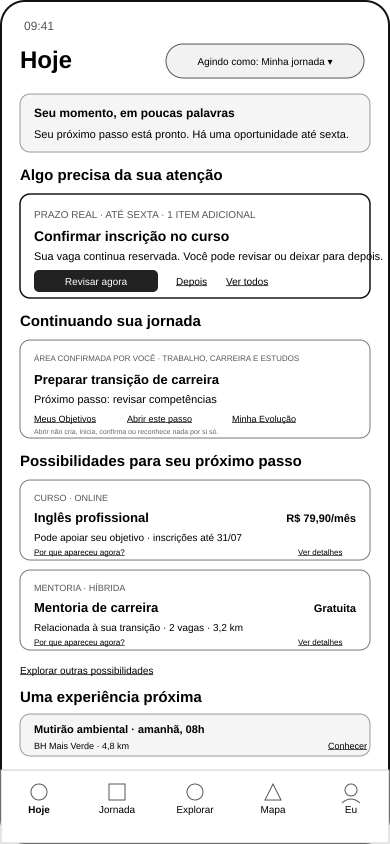

# Wireframe de Baixa Fidelidade da Tela Hoje (identificador UXA-006)

O identificador técnico `UXA-006` serve somente para rastreabilidade. O nome de leitura desta superfície é **Tela Hoje**.

## 1. Pergunta da superfície

> **O que mudou, o que merece minha atenção e quais possibilidades podem apoiar meu momento agora?**

A Tela Hoje é a hipótese de porta de entrada pessoal. Ela deverá reduzir esforço de decisão sem transformar a Guivos em feed, catálogo infinito ou painel de produtividade.

## 2. Wireframe

[Visualizar o arquivo gráfico vetorial escalável (SVG)](../assets/wireframes/uxa-006-hoje-mobile.svg)

## 3. Hierarquia proposta

| Ordem | Bloco | Responsabilidade |
|---:|---|---|
| 1 | cabeçalho contextual | indicar tela, contexto de atuação, atenção e privacidade |
| 2 | síntese do momento | explicar em linguagem breve o que existe de material |
| 3 | atenção principal | apresentar no máximo uma decisão ou ação prioritária |
| 4 | movimento atual | manter continuidade com o Próximo Passo relevante |
| 5 | oportunidades para considerar | mostrar recorte pequeno, diverso e justificável |
| 6 | Coletivos e atividades | apresentar somente acontecimentos com utilidade temporal |
| 7 | navegação global | permitir acesso a Hoje, Jornada, Explorar, Mapa e Eu |

## 4. Cabeçalho contextual

O cabeçalho deverá indicar:

- que a pessoa está na Tela Hoje;
- em qual contexto atua: jornada pessoal, Organização ou Coletivo;
- acesso à Central de Intervenções;
- modo discreto ou proteção visual, quando aplicável.

A troca de contexto deverá ser explícita e não poderá executar uma ação institucional como se fosse pessoal.

## 5. Síntese do momento

A síntese deverá reunir somente fatos ou avaliações suficientemente relevantes.

Exemplo representado:

> 1 passo pronto, 1 oportunidade até sexta e 1 atividade amanhã.

Estado vazio esperado:

> Nada precisa da sua atenção agora. Sua jornada permanece disponível quando você quiser revisar ou explorar algo.

A síntese não deverá utilizar:

- culpa por ausência;
- comparação com outros participantes;
- contagem de dias consecutivos;
- volume de oportunidades como prova de qualidade;
- mensagens publicitárias disfarçadas.

## 6. Atenção principal

O wireframe reserva a maior hierarquia para um único item.

Critérios de seleção:

1. segurança e direitos;
2. prazo ou risco material;
3. confirmação solicitada;
4. processo já iniciado;
5. dependência ou bloqueio real;
6. prioridade declarada pelo participante.

Ações mínimas:

- ação principal;
- adiar, quando legítimo;
- abrir explicação;
- recusar ou silenciar, quando aplicável.

## 7. Movimento atual

O bloco deverá mostrar:

- formulação do Próximo Passo;
- objetivo relacionado;
- estado real;
- bloqueio ou dependência;
- ação possível.

A ausência de Próximo Passo será válida. A interface não deverá exigir que a pessoa crie um movimento apenas para preencher a tela.

## 8. Oportunidades para considerar

O wireframe mostra duas oportunidades lado a lado para testar diversidade e comparação rápida.

Conteúdo mínimo:

- tipo;
- título;
- preço ou gratuidade;
- prazo ou disponibilidade;
- localização ou modalidade;
- razão resumida de relevância;
- acesso à explicação.

Regras:

- o recorte deverá ser pequeno;
- patrocínio não poderá elevar relevância funcional;
- a tela deverá evitar oportunidades repetitivas;
- o catálogo completo pertence a Explorar ou Minhas Oportunidades;
- uma oportunidade poderá ser relevante e ainda assim não aparecer hoje.

## 9. Coletivos e atividades

O bloco deverá privilegiar:

- atividade próxima;
- convite ou solicitação pendente;
- alteração material de regra ou local;
- ação de causa ou voluntariado;
- decisão necessária de líder ou moderador.

Publicações sociais sem finalidade não deverão ocupar a Tela Hoje.

## 10. Estados alternativos que ainda exigem wireframe

- nenhuma atenção e nenhuma oportunidade;
- informação sensível em modo discreto;
- múltiplos itens críticos;
- falha ao carregar uma fonte externa;
- oportunidade expirada após apresentação;
- alteração de preço em processo iniciado;
- contexto de Organização;
- contexto de Coletivo;
- acessibilidade com texto ampliado;
- baixa conectividade.

## 11. Perguntas para validação humana

1. A síntese do momento é útil ou redundante?
2. Um único item principal reduz ou aumenta a ansiedade?
3. O Próximo Passo deve aparecer antes das oportunidades?
4. Duas oportunidades são suficientes no primeiro recorte?
5. O bloco de Coletivos deve permanecer na tela inicial?
6. O seletor de contexto está suficientemente visível?
7. A navegação Hoje, Jornada, Explorar, Mapa e Eu é compreensível?
8. Quais informações precisam permanecer ocultas na tela bloqueada?

## 12. Critérios de aceite do wireframe

O wireframe poderá avançar quando demonstrar que:

- a finalidade da tela é compreendida sem explicação externa;
- a atenção principal é identificada rapidamente;
- sugestão, decisão e compromisso permanecem distintos;
- preço e prazo aparecem sem pressão comercial;
- controle de relevância é encontrável;
- ausência de itens não é tratada como falha;
- a tela conduz a ações reais sem exigir permanência prolongada;
- a leitura não depende do conhecimento do identificador técnico.
