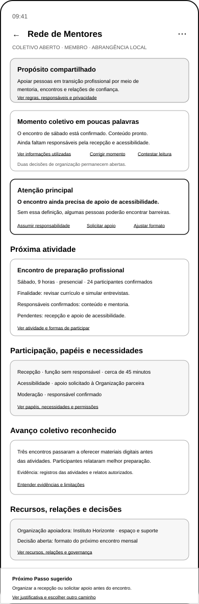

# Wireframe de Baixa Fidelidade do Início do Coletivo

## 1. Pergunta da superfície

> **Por que este Coletivo existe, qual é seu momento, o que precisa ser cuidado e como posso participar sem pressão ou perda de autonomia?**

O Início do Coletivo é a superfície principal para compreender propósito, pertencimento, momento coletivo, necessidades materiais, ações compartilhadas, participação voluntária, governança, recursos, relações e avanço.

A superfície não deverá funcionar como feed infinito, mural genérico, ranking de membros, agenda isolada, sistema de cobrança ou mecanismo de pressão por participação.

## 2. Wireframe reformulado



[Visualizar o arquivo gráfico vetorial escalável](../assets/wireframes/uxa-016-collective-home-mobile.svg)

O wireframe permanece estrutural e monocromático. Ele não define identidade visual final, componentes técnicos ou comportamento implementado.

## 3. Hierarquia funcional

| Ordem | Bloco | Responsabilidade |
|---:|---|---|
| 1 | propósito, identidade e participação | mostrar Coletivo, propósito, papel, visibilidade, pertencimento, disponibilidade e regras essenciais |
| 2 | momento coletivo | explicar mudanças, necessidades, decisões, fontes e incertezas relacionadas ao propósito |
| 3 | necessidade ou decisão que precisa de cuidado | apresentar um item material sem culpa, exposição ou pressão |
| 4 | ação compartilhada | mostrar atividade ou ação relacionada ao propósito, com condições e alternativas |
| 5 | formas voluntárias de participar | diferenciar convite, disponibilidade, papel aceito, recusa, pausa e saída |
| 6 | decisões, papéis e governança | separar consulta, autoridade, decisão, execução, moderação e revisão |
| 7 | recursos, relações e autonomia | apresentar apoios, dependências, dados, patrocínios e limites de autoridade |
| 8 | avanço coletivo e evidências | reconhecer mudança relevante relacionada ao propósito, com limites |
| 9 | escolhas e Próximos Passos | justificar possibilidades sem impor ritmo ou atribuir pessoas automaticamente |
| 10 | navegação do Coletivo | permitir acesso às demais áreas do Coletivo |

## 4. Propósito, identidade e participação

O cabeçalho deverá apresentar:

- nome do Coletivo;
- propósito compartilhado;
- tipo e abrangência;
- visibilidade;
- papel da pessoa autenticada;
- estado de participação;
- disponibilidade atual;
- responsáveis ou moderadores;
- acesso a regras, privacidade, ajuda, denúncia, pausa e saída.

Exemplo:

> **Rede de Mentores**
>
> Propósito: apoiar pessoas em transição profissional por meio de mentoria, encontros e relações de confiança.
>
> Você participa como membro e informou que ainda não decidiu se poderá colaborar nesta semana.

Pertencimento, disponibilidade, responsabilidade e autoridade deverão permanecer distintos.

## 5. Como compreendemos este momento

A síntese deverá começar pelo propósito, por mudanças e necessidades materiais.

Exemplo:

> O encontro de sábado está confirmado e o conteúdo está preparado. A recepção ainda não possui responsável aceito, e o apoio de acessibilidade depende de confirmação. Uma decisão sobre o formato do encontro seguinte continua aberta, sem prazo para hoje.

A superfície deverá distinguir:

- informação confirmada pelo Coletivo;
- atividade observada;
- informação de Organização apoiadora;
- inferência da Guivos;
- informação desconhecida;
- informação contestada.

Controles:

- `Ver informações, fontes e incertezas`;
- `Corrigir o momento do Coletivo`;
- `Informar uma mudança`;
- `Contestar esta leitura`.

Contagens de membros, mensagens ou atividades poderão aparecer como contexto secundário, nunca como definição principal do momento.

## 6. O que precisa de cuidado agora

Somente uma necessidade ou decisão material deverá receber prioridade principal quando existir.

Exemplo:

> **Definir uma forma acessível de recepção para o encontro.**
>
> Essa necessidade afeta a participação de algumas pessoas. Ninguém aceitou a função até o momento. O Coletivo pode simplificar a recepção, solicitar apoio, ajustar o formato ou adiar a atividade.

O bloco deverá mostrar:

- relação com o propósito;
- motivo;
- consequência real;
- prazo legítimo, quando houver;
- quem pode decidir;
- quem pode colaborar;
- alternativas;
- possibilidade de recusa e contestação.

A ausência de voluntários não deverá gerar culpa, exposição pública ou pressão emocional.

## 7. Ação compartilhada

A próxima atividade continuará visível quando for material, mas será subordinada ao propósito.

O bloco deverá mostrar:

- título;
- finalidade;
- resultado esperado sem promessa;
- data e horário;
- modalidade ou local;
- condições de participação;
- capacidade;
- acessibilidade;
- responsáveis confirmados;
- necessidades ainda abertas;
- riscos ou alterações;
- alternativas em caso de insuficiência;
- formas de participar, observar, apoiar ou não participar.

Exemplo:

> **Encontro de preparação profissional**
>
> Sábado, às 9 horas. A atividade apoia pessoas que desejam revisar currículo e simular entrevistas. Conteúdo e mentoria possuem responsáveis confirmados. Recepção e acessibilidade ainda dependem de solução aceita.

## 8. Formas voluntárias de participar

A superfície deverá diferenciar:

- membro;
- observador;
- participante de atividade;
- colaborador ocasional;
- responsável por função aceita;
- moderador;
- pessoa com autoridade de decisão.

Estados de disponibilidade:

- disponível;
- indisponível;
- ainda não decidiu;
- deseja apenas acompanhar;
- participação pausada;
- saiu do Coletivo.

Cada convite ou necessidade deverá explicar:

- finalidade;
- esforço estimado;
- prazo real;
- informações acessadas;
- autoridade necessária;
- como aceitar;
- como recusar;
- como desistir;
- alternativa caso ninguém aceite.

Nenhum papel será atribuído automaticamente. Recusa, silêncio, ausência ou pausa não reduzirão pertencimento nem reputação.

## 9. Decisões, papéis e governança

A superfície deverá separar:

- consulta;
- recomendação;
- decisão formal;
- execução;
- moderação;
- revisão e contestação.

Cada decisão deverá mostrar:

- natureza;
- quem pode propor;
- quem pode contribuir;
- quem possui autoridade para decidir;
- prazo;
- alternativas;
- impactos esperados;
- conflitos declarados;
- fundamento e registro;
- possibilidade de revisão;
- responsável pela execução, quando houver aceitação.

Votação não será o padrão universal. Popularidade, competição, maioria simples ou volume de reações não substituirão regras legítimas de governança.

## 10. Recursos, relações e autonomia

O bloco poderá reunir:

- recursos disponíveis;
- necessidades de apoio;
- locais e equipamentos;
- conteúdos e documentos;
- Organizações apoiadoras;
- Coletivos parceiros;
- especialistas;
- patrocínios identificados;
- dados compartilhados;
- dependências materiais;
- limites de autoridade;
- possibilidade de encerramento.

Exemplo:

> O Instituto Horizonte fornece espaço e suporte administrativo. O Coletivo mantém sua governança. Nenhum dado pessoal é compartilhado fora das finalidades informadas.

O detalhamento completo das relações entre Organizações e Coletivos permanece para a etapa 3.

## 11. Avanço coletivo e evidências

Avanço somente aparecerá quando houver evidência suficiente de mudança relevante para o propósito.

Exemplo:

> **Avanço coletivo reconhecido:** os materiais passaram a ser disponibilizados antes dos encontros e em formato digital acessível. Participantes autorizados relataram melhor preparação. A evidência ainda não permite concluir resultado profissional individual.

A interface deverá mostrar:

- mudança observada;
- propósito relacionado;
- evidência utilizada;
- período;
- contribuição demonstrável;
- fontes autorizadas;
- limitações e incertezas;
- possibilidade de correção.

Quando não houver evidência suficiente:

> **Nenhum avanço coletivo foi confirmado neste período.**

Número de membros, publicações, reações, mensagens, atividades ou dias ativos não será apresentado isoladamente como evolução coletiva.

## 12. Escolhas e Próximos Passos

A superfície deverá apresentar escolhas sem determinar quem deve agir.

A explicação seguirá:

```text
momento coletivo compreendido
→ propósito relacionado
→ necessidade, decisão ou possibilidade atual
→ evidências e incertezas
→ escolha ou Próximo Passo
→ contribuição esperada
→ alternativas e limites
→ responsáveis somente após aceitação
```

Exemplo:

> **Escolher como garantir a recepção do encontro.**
>
> Faz sentido resolver essa necessidade porque a atividade está confirmada e a chegada dos participantes precisa ser compreensível. O Coletivo pode simplificar o processo, convidar pessoas, solicitar apoio, ajustar o formato ou adiar. Ninguém será atribuído automaticamente.

## 13. Navegação do Coletivo

A navegação inicial deverá incluir:

- Início;
- Propósito e Sobre o Coletivo;
- Atividades e Ações;
- Participação e Papéis;
- Decisões e Governança;
- Recursos;
- Relações e Apoios;
- Avanços e Aprendizados;
- Privacidade, Proteção e Moderação.

Os nomes poderão ser refinados posteriormente, mas deverão comunicar responsabilidades completas.

## 14. Estados alternativos preservados

Exigirão detalhamento separado:

- Coletivo recém-criado;
- pessoa observando antes de participar;
- solicitação de participação pendente;
- participação pausada;
- ausência de atividade próxima;
- operação regular sem necessidade material;
- nenhuma pessoa disponível para uma função;
- atividade ajustada, adiada ou cancelada;
- conflito de governança;
- moderação ou proteção urgente;
- saída de responsável;
- recurso insuficiente;
- relação com Organização contestada;
- informação sensível protegida;
- nenhuma evidência de avanço confirmada;
- baixa conectividade;
- acessibilidade ampliada;
- encerramento do Coletivo.

## 15. Critérios de aceite

A superfície foi considerada funcionalmente válida porque:

1. propósito e pertencimento antecedem atividade;
2. o momento coletivo é compreensível, verificável e corrigível;
3. uma necessidade material recebe cuidado sem pressão;
4. a ação compartilhada permanece subordinada ao propósito;
5. pertencimento, disponibilidade, responsabilidade e autoridade são distintos;
6. papéis dependem de aceitação explícita;
7. ausência, recusa, pausa e saída permanecem legítimas;
8. governança separa consulta, decisão e execução;
9. relações de apoio preservam autonomia;
10. avanço utiliza evidência de mudança relevante;
11. escolhas possuem justificativa e alternativas;
12. a superfície não parece feed, ranking, agenda ou sistema de cobrança;
13. o comportamento permanece alinhado à Fundação da Guivos.

## 16. Situação

O Início do Coletivo está **validado funcionalmente e reformulado em baixa fidelidade**.

Ele continua sendo hipótese estrutural e ainda não constitui protótipo navegável, design visual ou implementação.

## 17. Limites

Esta versão não detalha integralmente as relações entre Organizações e Coletivos, não cria protótipo navegável, design visual final, testes de usabilidade, componentes técnicos, sistema universal de votação, modelo jurídico, regras universais de moderação ou desenvolvimento.

## 18. Próxima etapa da ordem autorizada

Após a integração deste incremento, a próxima etapa será o detalhamento funcional das **relações entre Organizações e Coletivos**, em incremento separado.
