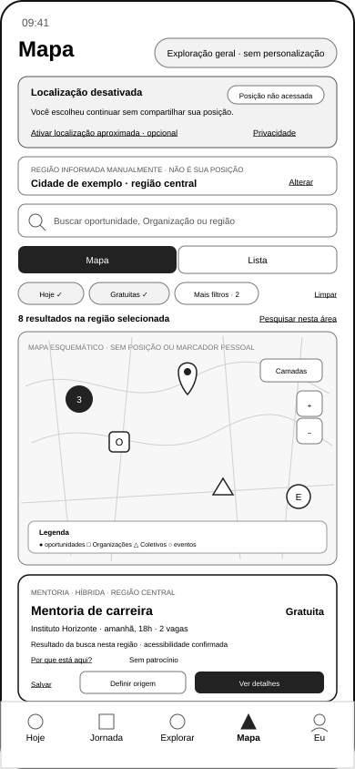

# Wireframe Alternativo do Mapa de Oportunidades — Localização Desativada

## 1. Finalidade

Este documento materializa o estado alternativo do Mapa de Oportunidades para uso com a localização do dispositivo desativada.

A versão 0.2.0 incorpora a reformulação governada pela **UXA-027 — Validação Funcional Especializada e Reformulação do Estado do Mapa sem Localização**.

O estado demonstra que a pessoa pode explorar oportunidades por cidade ou região informada manualmente, preservar busca e filtros, alternar entre Mapa e Lista, abrir detalhes, salvar itens e definir origem para rota sem conceder acesso à posição do dispositivo.

O wireframe não representa mapa real, design visual, tecnologia cartográfica, coordenadas, dados de produção ou implementação.

## 2. Posição na experiência

O estado permanece dentro da superfície recorrente do Mapa:

```text
Hoje | Jornada | Explorar | Mapa | Eu
```

Ele poderá ocorrer quando:

- a pessoa nunca concedeu localização;
- a permissão foi recusada ou retirada;
- o dispositivo não oferece localização;
- a pessoa prefere informar cidade ou região manualmente;
- o gate de personalização ainda não foi atendido;
- a exploração geral foi escolhida conscientemente.

A localização desativada não bloqueia o Mapa, a Lista, a busca, o Detalhe de Oportunidade ou o salvamento.

## 3. Artefato visual reformulado



Arquivo vetorial:

`docs/assets/wireframes/uxa-026-opportunity-map-location-disabled-mobile.svg`

Dimensão de referência:

- canal: aplicativo móvel;
- largura: 390 pixels;
- altura: 844 pixels;
- estado: localização do dispositivo desativada, posição não acessada, região manual selecionada e exploração geral sem personalização.

## 4. Hierarquia funcional validada

```text
nome da superfície e contexto de exploração
→ localização desativada e posição não acessada
→ região manual explicitamente distinta da posição pessoal
→ pesquisa
→ Mapa ou Lista
→ filtros e resultados da região
→ área territorial sem marcador ou posição presumida
→ legenda e controles
→ oportunidade geral selecionada
→ explicação, salvamento, origem manual e detalhe
→ navegação recorrente
```

A hierarquia mantém o aviso de privacidade antes dos resultados e torna a alternativa manual utilizável sem converter localização em requisito oculto.

## 5. Contexto e linguagem

Quando o gate de personalização não estiver atendido, a superfície deverá declarar:

> **Exploração geral · sem personalização**

A interface não deverá utilizar expressões como:

- `para o seu momento`;
- `relacionada à sua transição`;
- `recomendada para você`;
- `perto de você`;
- qualquer afirmação de adequação pessoal.

A origem dos resultados deverá ser explicada por busca, região, categoria, período, fonte ou filtro explícito.

## 6. Localização desativada e confirmação do estado

O aviso reformulado declara:

> **Localização desativada**

> **Posição não acessada**

> Você escolheu continuar sem compartilhar sua posição.

A confirmação explícita evita que a pessoa confunda ausência de marcador com coleta invisível ou inferência territorial.

A pessoa deverá poder:

- continuar sem localização;
- escolher ou alterar cidade ou região;
- ativar localização aproximada posteriormente;
- revisar privacidade antes de ativar;
- retirar uma permissão futura;
- utilizar origem manual para rota quando aplicável.

Ativar localização aproximada é uma ação opcional e secundária. A interface não deverá induzir consentimento por bloqueio, culpa, urgência, destaque desproporcional ou perda artificial de funcionalidade.

## 7. Região manual

A região selecionada manualmente deverá permanecer visível, editável e acompanhada da declaração:

> **Região informada manualmente · não é sua posição**

A alteração de região não poderá apagar silenciosamente:

- busca;
- filtros compatíveis;
- modo Mapa ou Lista;
- item salvo;
- preferências não territoriais.

Filtros estritamente dependentes de distância pessoal deverão ser desativados, reinterpretados ou substituídos por filtros de área, cidade, bairro ou raio a partir de um ponto informado.

## 8. Mapa sem marcador pessoal

O mapa não deverá mostrar:

- ponto de localização da pessoa;
- círculo de precisão;
- posição aproximada presumida;
- histórico de deslocamento;
- residência inferida;
- indicação de que a pessoa está em determinada área.

A área territorial poderá ser centralizada na região informada manualmente e exibir somente oportunidades, Organizações, Coletivos, eventos, atividades, pontos de apoio e locais autorizados.

O wireframe reformulado declara:

> **Mapa esquemático · sem posição ou marcador pessoal**

## 9. Relação com a Lista

Mapa e Lista continuam representando a mesma descoberta.

A alternância deverá preservar:

- região manual;
- busca;
- filtros;
- quantidade de resultados;
- item selecionado;
- explicação da origem dos resultados.

A Lista constitui alternativa integral quando o mapa não estiver disponível, não carregar ou não for adequado à acessibilidade da pessoa.

## 10. Resultados e filtros

A superfície deverá informar que os resultados correspondem à região escolhida e aos filtros aplicados.

Exemplo:

> 8 resultados na região selecionada

A distância pessoal não deverá ser exibida quando não houver origem válida. O cartão poderá apresentar:

- cidade, bairro ou área;
- modalidade presencial, online ou híbrida;
- data, horário ou prazo;
- preço ou gratuidade;
- disponibilidade;
- acessibilidade;
- responsável ou fonte;
- relação comercial.

## 11. Oportunidade selecionada

O cartão reformulado utiliza linguagem geral:

> Resultado da busca nesta região

Ele demonstra diretamente:

- `Por que está aqui?`;
- relação comercial;
- `Salvar`;
- `Definir origem`;
- `Ver detalhes`.

A ação `Por que está aqui?` poderá explicar:

- correspondência com a região manual;
- filtros aplicados;
- busca explícita;
- categoria selecionada;
- origem editorial ou institucional;
- relação comercial identificada.

Ela não deverá simular compreensão do Momento Atual.

## 12. Salvamento

O salvamento deverá permanecer disponível sem localização.

Salvar uma oportunidade não autoriza:

- ativar localização;
- inferir residência;
- registrar deslocamento;
- criar perfil territorial oculto;
- converter o item em recomendação pessoal.

O item salvo deverá preservar sua origem, região e condições conhecidas.

## 13. Rota sem localização

Sem origem disponível, a interface não deverá executar rota automaticamente.

O wireframe apresenta a ação:

> **Definir origem**

As alternativas poderão incluir:

- informar endereço de partida;
- selecionar ponto conhecido;
- utilizar endereço salvo com autorização aplicável;
- ativar localização aproximada;
- copiar endereço, quando permitido;
- ver área aproximada, quando o endereço estiver protegido.

A escolha de origem não autoriza rastreamento contínuo nem retenção posterior. A rota não deverá contornar proteção de residência, endereço sensível ou condição de acesso.

## 14. Privacidade e autonomia

O estado preserva:

- exploração sem localização;
- exploração sem personalização;
- cidade ou região manual como alternativa real;
- confirmação de que a posição não foi acessada;
- ausência de marcador pessoal;
- ativação posterior consciente;
- continuidade pela Lista;
- salvamento sem consentimento territorial;
- origem manual para rota;
- proteção de endereços sensíveis;
- separação entre proximidade, relevância e publicidade.

## 15. Resultado da validação

A validação funcional especializada está registrada em UXA-027.

O estado é considerado **funcionalmente válido após reformulação** porque:

- comunica que o Mapa continua disponível sem localização;
- confirma que a posição não foi acessada;
- distingue região manual de posição pessoal;
- preserva busca, filtros, Mapa e Lista;
- remove marcador e distância pessoal presumida;
- utiliza linguagem geral sem personalização indevida;
- mantém ativação de localização como escolha opcional;
- demonstra salvamento;
- demonstra origem manual para rota;
- preserva continuidade para o Detalhe;
- não inicia design ou implementação.

## 16. Limites

Este incremento não:

- valida o estado com usuários reais;
- cria localização técnica ou geocodificação;
- define fornecedor de mapas;
- cria rotas;
- define cidades ou oportunidades reais;
- conclui acessibilidade;
- cria referência para computador;
- cria protótipo navegável;
- inicia design visual ou Engenharia de Produto.

## 17. Próximos atos governados

Após integração e nova autorização, poderão ocorrer separadamente:

1. criar o estado alternativo em Lista;
2. criar o estado sem resultados;
3. criar referência do Mapa para computador;
4. criar o wireframe gráfico do início protegido;
5. criar a referência móvel da Home;
6. validar a revisão da compreensão inicial;
7. retomar independentemente os testes dos Resultados Empresariais.

Nenhum ato é iniciado automaticamente.
