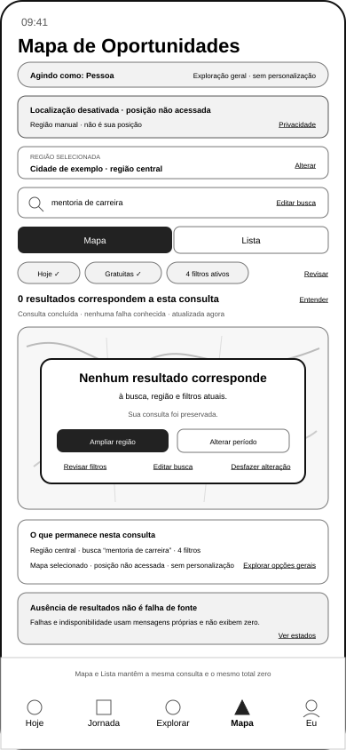

# Wireframe Alternativo do Mapa de Oportunidades — Estado sem Resultados

## 1. Finalidade

Este documento materializa o estado em que uma consulta territorial válida é concluída sem encontrar oportunidades correspondentes à região, busca e filtros vigentes.

O estado não deverá ser utilizado como mensagem genérica para falha de fonte, indisponibilidade temporária, carregamento incompleto ou baixa conectividade. Ausência legítima de correspondências e incapacidade de consultar dados são condições diferentes.

O artefato preserva a consulta da pessoa, explica o que ocorreu e oferece caminhos explícitos de recuperação sem preencher artificialmente o Mapa, apagar filtros ou ativar personalização.

Este documento não representa design visual, tecnologia cartográfica, dados reais, implementação ou teste com usuários.

## 2. Posição na experiência

O estado permanece dentro da superfície recorrente do Mapa:

```text
Hoje | Jornada | Explorar | Mapa | Eu
```

O item `Mapa` continua selecionado. A alternância interna permanece disponível:

```text
Mapa ↔ Lista
```

Mapa e Lista deverão apresentar o mesmo estado sem resultados para a mesma consulta e atualização.

## 3. Condição de entrada no estado

A mensagem de ausência legítima somente poderá aparecer quando:

- a consulta tiver sido executada;
- a região estiver definida;
- busca e filtros vigentes forem conhecidos;
- as fontes necessárias tiverem respondido ou sua cobertura aplicável estiver declarada;
- não houver falha ativa capaz de explicar o resultado vazio;
- não houver carregamento pendente material;
- o total correspondente for realmente zero naquele momento de atualização.

A interface deverá indicar:

> **0 resultados correspondem a esta consulta**

> **Consulta concluída · nenhuma falha conhecida**

A declaração não significa que não existam oportunidades em toda a cidade, no futuro, em outras categorias ou fora das fontes consultadas.

## 4. Artefato visual



Arquivo vetorial:

`docs/assets/wireframes/uxa-030-opportunity-map-no-results-mobile.svg`

Dimensão de referência:

- canal: aplicativo móvel;
- largura: 390 pixels;
- altura: 844 pixels;
- modo: Mapa selecionado;
- condição ilustrada: localização desativada, posição não acessada, região manual e consulta concluída com zero correspondências.

## 5. Hierarquia funcional

```text
nome da superfície e contexto de atuação
→ estado territorial e privacidade
→ região ativa e editável
→ pesquisa preservada
→ alternância Mapa ou Lista
→ filtros ativos e total consolidado
→ quantidade zero e estado da consulta
→ explicação da ausência de correspondências
→ resumo do contexto preservado
→ ações explícitas de recuperação
→ distinção entre ausência, falha e indisponibilidade
→ navegação recorrente
```

A ausência de marcadores no campo territorial não poderá ser o único sinal do estado.

## 6. Contexto preservado

O estado deverá manter visíveis:

- `Agindo como`;
- modalidade geral ou personalizada aplicável;
- região ou área territorial ativa;
- origem da região, como manual ou localização autorizada;
- texto pesquisado;
- filtros ativos;
- total consolidado de filtros;
- modo `Mapa` ou `Lista`;
- momento da última atualização;
- cobertura ou limitação conhecida da consulta.

Nenhum desses elementos poderá ser apagado somente porque o total chegou a zero.

## 7. Mensagem principal

A mensagem deverá informar de forma direta:

> **Nenhum resultado corresponde à busca, região e filtros atuais.**

Ela deverá evitar formulações absolutas como:

- `Não existem oportunidades`;
- `Não há nada nesta cidade`;
- `Você não tem opções`;
- `Nada é adequado para você`;
- `Não encontramos o que você precisa`.

O sistema conhece apenas o resultado da consulta executada, não a totalidade de possibilidades existentes nem as necessidades da pessoa.

## 8. Ações de recuperação

A interface deverá oferecer ações conscientes e independentes, como:

- `Ampliar região`;
- `Alterar período`;
- `Revisar filtros`;
- `Editar busca`;
- `Desfazer última alteração`, quando houver histórico local compatível;
- `Tentar novamente`, somente quando uma nova consulta for materialmente útil;
- `Explorar opções gerais`, como saída separada da consulta territorial.

Cada ação deverá declarar o que será alterado antes de aplicar a mudança.

A superfície não poderá:

- remover filtros automaticamente;
- ampliar a região sem confirmação;
- substituir a busca por termos semelhantes sem aviso;
- mudar período, modalidade ou preço silenciosamente;
- ativar localização;
- inserir resultados patrocinados para evitar a tela vazia;
- iniciar personalização para preencher o estado.

## 9. Preservação e reversibilidade

Quando uma ação de recuperação alterar a consulta, a pessoa deverá poder reconhecer:

- qual dimensão mudou;
- quais dimensões permaneceram;
- o novo total de resultados;
- se a atualização foi concluída;
- como desfazer a última mudança quando tecnicamente possível.

`Limpar filtros` deverá ser uma decisão explícita e não deverá apagar região ou busca.

`Ampliar região` não deverá transformar região manual em posição pessoal nem autorizar rastreamento.

## 10. Mapa e Lista

O estado deverá ser equivalente nos dois modos.

Ao alternar entre Mapa e Lista, deverão permanecer:

- região;
- busca;
- filtros;
- total zero;
- momento da atualização;
- diagnóstico da consulta;
- ações de recuperação;
- contexto `Agindo como`;
- estado de localização.

A Lista deverá funcionar integralmente sem mapa carregado.

O Mapa deverá apresentar informação textual suficiente para leitores de tela e pessoas que não interpretem o campo cartográfico.

## 11. Estado territorial

Quando a localização estiver desativada, deverão permanecer as declarações:

> **Localização desativada · posição não acessada**

> **Região informada manualmente · não é sua posição**

A ausência de resultados não constitui justificativa para solicitar localização de forma bloqueante, insistente ou coerciva.

A pessoa poderá ampliar ou trocar a região manualmente sem compartilhar a posição do dispositivo.

## 12. Personalização e linguagem

Sem o gate de personalização atendido, o estado deverá utilizar linguagem geral baseada somente em:

- região escolhida;
- busca explícita;
- filtros aplicados;
- período;
- fontes e cobertura declaradas.

Não deverá afirmar que uma oportunidade seria melhor, ideal ou adequada ao Momento Atual da pessoa.

Mesmo após o gate, a ausência de resultados deverá ser explicada pela consulta, sem transformar inferências pessoais em certeza.

## 13. Distinção entre estados

| Condição | Mensagem funcional | Comportamento |
|---|---|---|
| consulta concluída com zero correspondências | `0 resultados correspondem a esta consulta` | preservar contexto e oferecer ajustes explícitos |
| falha de uma ou mais fontes materiais | `Não foi possível verificar todas as fontes` | não apresentar zero como conclusão; identificar limitação e permitir nova tentativa |
| indisponibilidade temporária | `Resultados temporariamente indisponíveis` | preservar consulta e permitir tentar novamente ou usar Lista quando aplicável |
| carregamento em andamento | `Atualizando resultados` | manter estrutura, região, busca e filtros |
| baixa conectividade | `Atualização limitada pela conexão` | declarar possível desatualização e evitar conclusão absoluta |
| cobertura parcial conhecida | `Resultados limitados às fontes disponíveis` | informar escopo e não representar cobertura total |

Falha de fonte não é ausência de oportunidades.

## 14. Item anteriormente selecionado

Se a consulta anterior possuía uma oportunidade selecionada e uma alteração produzir zero resultados, a interface não deverá apagar a seleção silenciosamente.

Quando aplicável, deverá informar:

> **A oportunidade selecionada não corresponde mais à consulta atual.**

A pessoa poderá:

- desfazer a alteração;
- abrir o Detalhe se o item continuar disponível;
- remover conscientemente a seleção;
- manter a nova consulta sem resultados.

Seleção anterior não deverá ser reinserida artificialmente no conjunto atual.

## 15. Explicabilidade e cobertura

A pessoa deverá poder abrir `Entender este resultado` para verificar:

- região consultada;
- busca executada;
- filtros aplicados;
- período;
- horário da atualização;
- fontes ou categorias consultadas quando material;
- limitações conhecidas;
- distinção entre zero legítimo e erro.

A explicação não deverá expor lógica proprietária desnecessária nem ocultar limitações materiais.

## 16. Acessibilidade e resiliência

O estado deverá:

- anunciar textualmente o total zero;
- não depender de cor, marcadores ou mapa vazio;
- possuir ordem de foco coerente;
- manter títulos e ações compreensíveis fora do contexto visual;
- permitir operação pela Lista;
- preservar conteúdo durante falhas cartográficas;
- evitar ciclos de tentativa automática;
- manter ações essenciais disponíveis em baixa conectividade quando possível.

A criação deste wireframe não conclui conformidade técnica de acessibilidade.

## 17. Privacidade e autonomia

O estado preserva:

- localização opcional;
- posição não acessada quando verdadeiro;
- região manual distinta da posição pessoal;
- consulta sem personalização;
- ausência legítima sem preenchimento comercial artificial;
- ações de recuperação voluntárias;
- alteração explícita e reversível;
- separação entre falha técnica e ausência de dados;
- proteção de endereços sensíveis;
- continuidade sem rastreamento.

## 18. Critérios de validação posterior

A validação funcional especializada deverá verificar:

- se a pessoa entende que zero corresponde à consulta atual, não à totalidade de oportunidades;
- se ausência, falha de fonte e indisponibilidade temporária são distinguíveis;
- se região, busca e filtros permanecem reconhecíveis;
- se as ações de recuperação são compreensíveis e independentes;
- se nenhuma ação altera a consulta silenciosamente;
- se Mapa e Lista preservam o mesmo estado;
- se localização continua opcional;
- se a linguagem não cria personalização sem gate;
- se a interface funciona sem mapa carregado;
- se uma seleção anterior é tratada de forma explicável.

## 19. Limites

Este incremento não:

- valida o estado com usuários reais;
- define algoritmo de busca;
- define cobertura de fontes de produção;
- cria dados reais;
- conclui acessibilidade técnica;
- define tecnologia cartográfica;
- cria geocodificação ou rotas;
- cria referência para computador;
- cria protótipo navegável;
- inicia design visual;
- inicia Engenharia de Produto.

## 20. Próximos atos governados

Após integração e nova autorização, poderão ocorrer separadamente:

1. validar funcionalmente o estado sem resultados;
2. criar referência do Mapa para computador;
3. criar o wireframe gráfico do início protegido;
4. criar a referência móvel da Home;
5. validar a revisão da compreensão inicial;
6. validar a transição para a primeira Tela Hoje;
7. retomar independentemente os testes dos Resultados Empresariais.

Nenhum ato é iniciado automaticamente.
