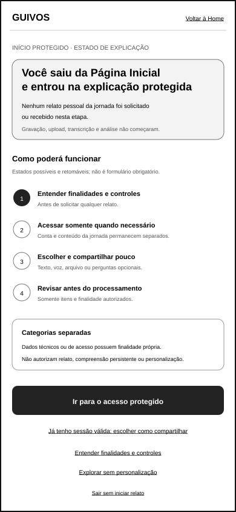
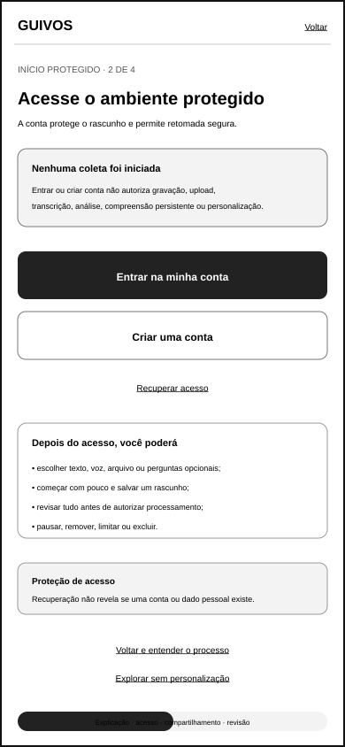
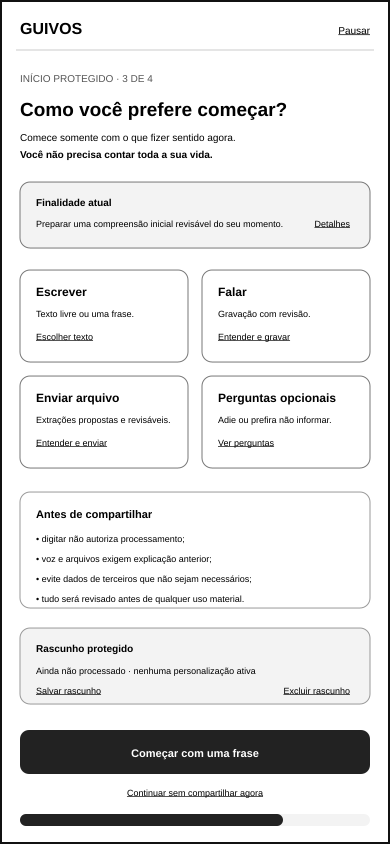
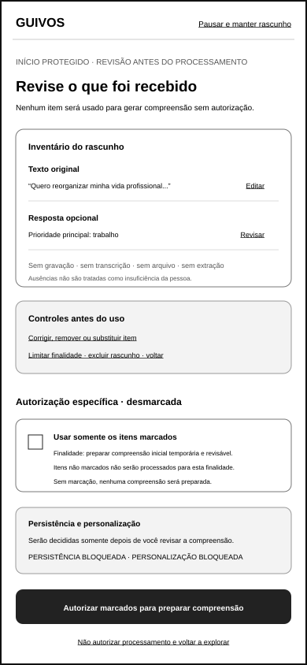

# Wireframe de Baixa Fidelidade do Início Protegido da Jornada

## 1. Finalidade

Este documento materializa a referência gráfica móvel do início protegido da jornada pessoal da Guivos, conforme o contrato funcional da UXA-023 e a validação especializada da UXA-035.

O conjunto demonstra estados possíveis e retomáveis para:

1. explicar o ambiente antes de solicitar relato;
2. acessar a conta somente quando necessário;
3. escolher uma modalidade e formar um rascunho mínimo;
4. revisar o conteúdo e autorizar finalidade específica;
5. preparar uma compreensão inicial temporária e revisável;
6. decidir posteriormente sobre persistência e personalização.

Os quatro artefatos não constituem formulário linear obrigatório. Estados poderão ser omitidos, retomados ou apresentados progressivamente conforme sessão, modalidade escolhida, conteúdo existente e autorizações vigentes.

O conjunto não representa design visual, textos jurídicos finais, autenticação implementada, gravação real, upload real, processamento de IA, protótipo navegável ou desenvolvimento.

## 2. Posição na experiência

```text
Página Inicial pública
→ decisão voluntária de iniciar
→ explicação do ambiente protegido
→ acesso, somente quando necessário
→ escolha e rascunho mínimo
→ revisão e autorização específica
→ compreensão inicial revisável
→ decisão sobre persistência e personalização
→ Tela Hoje, jornada sem personalização ou exploração geral
```

A pessoa chega ao primeiro estado somente após selecionar conscientemente `Iniciar minha jornada` na Home pública.

Nenhum relato pessoal da jornada, gravação, upload, transcrição, extração ou análise começa automaticamente.

Dados técnicos e de acesso, quando necessários, possuem finalidade separada do conteúdo da jornada.

## 3. Artefatos visuais reformulados

### 3.1 Estado de explicação



`docs/assets/wireframes/uxa-034-protected-entry-explanation-mobile.svg`

### 3.2 Estado de acesso, quando necessário



`docs/assets/wireframes/uxa-034-protected-entry-access-mobile.svg`

### 3.3 Estado de escolha e rascunho



`docs/assets/wireframes/uxa-034-protected-entry-sharing-mobile.svg`

### 3.4 Estado de revisão antes do processamento



`docs/assets/wireframes/uxa-034-protected-entry-review-mobile.svg`

Dimensão de referência:

- canal: aplicativo móvel;
- largura: 390 pixels;
- altura: 844 pixels;
- orientação: retrato;
- fidelidade: baixa;
- navegação: estados possíveis, pausáveis e retomáveis.

## 4. Pergunta funcional

> **A pessoa consegue compreender onde está, acessar somente quando necessário, compartilhar pouco, revisar tudo e autorizar uma finalidade específica sem confundir dados de acesso, relato, processamento, persistência e personalização?**

A UXA-035 considera o conjunto funcionalmente válido após reformulação.

## 5. Princípios transversais

Os quatro estados preservam:

- voluntariedade;
- explicação anterior ao relato;
- linguagem precisa sobre dados de acesso e conteúdo da jornada;
- ausência de coleta automática do relato;
- autenticação separada de autorização;
- acesso condicional;
- modalidades equivalentes;
- compartilhamento mínimo e progressivo;
- finalidades visíveis;
- revisão anterior ao processamento material;
- autorizações específicas e inicialmente desmarcadas;
- recusa sem processamento;
- pausa, saída, salvamento e exclusão diferenciados;
- persistência e personalização bloqueadas antes do gate;
- saída para exploração sem personalização.

## 6. Estado de explicação

O primeiro estado declara:

> **Você saiu da Página Inicial e entrou na explicação do ambiente protegido.**

> **Nenhum relato pessoal da jornada foi solicitado ou recebido nesta etapa.**

Também informa que gravação, upload, transcrição e análise não começaram.

A pessoa conhece a sequência funcional de referência:

```text
entender o processo
→ acessar, se necessário
→ escolher como compartilhar
→ revisar o conteúdo
→ autorizar somente a finalidade desejada
→ revisar a compreensão inicial
```

Ações:

- `Ir para o acesso protegido`;
- `Entender finalidades e controles`;
- `Voltar à Página Inicial`;
- `Explorar sem personalização`;
- `Sair sem iniciar relato`.

Quando já existir sessão válida, a ação principal poderá ser `Continuar para escolher como compartilhar`.

## 7. Estado de acesso, quando necessário

O estado declara:

> **Esta etapa aparece somente quando o acesso protegido for necessário.**

> **Dados de acesso são tratados separadamente do conteúdo da jornada.**

A superfície oferece:

- `Entrar na minha conta`;
- `Criar uma conta`;
- `Recuperar acesso`;
- `Voltar à explicação`;
- `Explorar sem personalização`.

Entrar ou criar conta não autoriza relato, gravação, upload, transcrição, análise, compreensão persistente ou personalização.

Uma pessoa com sessão válida poderá seguir sem reapresentar criação ou recuperação de conta.

A recuperação não deverá revelar a existência de conta ou dado pessoal.

## 8. Estado de escolha e rascunho

As modalidades permanecem equivalentes:

- `Escrever`;
- `Falar`;
- `Enviar arquivo`;
- `Responder perguntas opcionais`.

Cada alternativa utiliza `Escolher esta forma`.

Nenhuma modalidade é selecionada por padrão. `Começar com pouco` aparece somente depois da escolha.

O estado declara:

> **Comece somente com o que fizer sentido agora.**

> **Você não precisa contar toda a sua vida.**

Também apresenta:

- finalidade atual;
- estado do rascunho;
- o que ainda não foi processado;
- proteção de informações sensíveis e de terceiros;
- explicação anterior para voz e arquivo;
- opção de combinar modalidades sem obrigação;
- `Pausar e manter rascunho`;
- `Salvar rascunho e sair`;
- `Sair sem salvar alterações`;
- `Excluir rascunho`;
- `Continuar sem compartilhar e sem processamento`.

A implementação futura deverá declarar se o rascunho está somente no dispositivo, associado à conta ou ainda não persistido.

## 9. Texto, voz e arquivos

### 9.1 Texto

Digitar não autoriza processamento.

A pessoa poderá editar, remover trechos, limitar finalidade e revisar antes de autorizar.

### 9.2 Voz

Antes de ativar gravação, a interface deverá explicar:

- finalidade;
- início e fim da gravação;
- transcrição;
- manutenção ou descarte do áudio;
- revisão e correção;
- remoção e regravação;
- risco de informações de terceiros.

Gravação, transcrição e manutenção do original possuem controles separados quando seus efeitos diferirem.

### 9.3 Arquivos

Antes do envio, a pessoa deverá conhecer:

- finalidade;
- extrações propostas;
- limites de leitura;
- retenção;
- tratamento de dados sensíveis ou de terceiros;
- remoção do original e de informações derivadas;
- revisão anterior ao uso material.

Upload não autoriza leitura irrestrita.

## 10. Estado de revisão

Antes do processamento material, a pessoa visualiza inventário que distingue:

- texto original;
- respostas opcionais;
- gravações;
- transcrições;
- arquivos;
- extrações propostas;
- itens removidos;
- finalidades associadas.

Cada item poderá oferecer:

- `Revisar`;
- `Editar`;
- `Corrigir`;
- `Substituir`;
- `Remover`;
- `Limitar uso`;
- `Excluir`.

A ausência de determinada modalidade é declarada, sem ser tratada como insuficiência.

## 11. Autorização específica

As autorizações aparecem desmarcadas e somente depois da revisão.

Nesta etapa, o wireframe ilustra apenas:

> **Usar os itens marcados para preparar uma compreensão inicial temporária e revisável.**

A ação informa qual conteúdo será utilizado e que nenhum item não marcado será processado para essa finalidade.

A pessoa possui duas saídas explícitas:

- `Autorizar os itens marcados para preparar a compreensão inicial`;
- `Não autorizar processamento e voltar a explorar`.

A ausência de autorização não inicia compreensão, persistência ou personalização.

## 12. Persistência e personalização

A persistência da compreensão e a personalização futura não são solicitadas neste wireframe.

Elas permanecem bloqueadas até que a compreensão inicial seja:

- apresentada;
- explicada;
- revisada;
- corrigida ou limitada;
- aceita ou recusada pela pessoa.

O estado declara:

> **Persistência e personalização serão decididas somente depois da revisão da compreensão inicial.**

## 13. Processamento visível e interrompível

Após autorização específica, o estado poderá evoluir por:

```text
rascunho revisado
→ autorizado para finalidade específica
→ em processamento
→ pausado, interrompido ou com falha
→ compreensão inicial disponível
```

A pessoa deverá poder interromper quando aplicável, retirar autorização futura, corrigir origem, excluir itens compatíveis e compreender efeitos de remoções.

## 14. Pausa, saída, rascunho e exclusão

O conjunto diferencia:

- sair sem iniciar relato;
- pausar e manter rascunho;
- salvar rascunho e sair;
- sair sem salvar alterações;
- excluir rascunho;
- remover um item;
- retirar autorização;
- excluir conteúdo original;
- excluir informações derivadas quando aplicável;
- encerrar a jornada.

Ações com perda ou persistência deverão explicar o efeito antes da confirmação.

## 15. Proteção de informações sensíveis e de terceiros

A superfície deverá:

- alertar antes de voz e arquivos;
- permitir remoção de trechos e itens;
- não incentivar exposição excessiva;
- não exigir informação de terceiros;
- não utilizar culpa, urgência artificial ou promessa absoluta de segurança;
- oferecer proteção adicional quando houver risco material;
- orientar ajuda apropriada quando necessário.

O wireframe não define protocolo clínico, jurídico ou emergencial.

## 16. Acessibilidade funcional

A sequência deverá:

- não depender de cor;
- utilizar títulos e estados textuais;
- manter ações principais e saídas reconhecíveis;
- não depender de gestos ocultos;
- anunciar gravação, upload, revisão e processamento;
- preservar foco e progresso ao pausar;
- manter alternativa textual para voz e arquivos;
- declarar consequências de autorizar ou recusar.

A validação não conclui conformidade técnica de acessibilidade.

## 17. Critérios atendidos

A reformulação permite verificar:

- compreensão de que a Home pública foi deixada;
- ausência de relato pessoal antes da explicação;
- separação dos dados de acesso;
- estados não lineares e retomáveis;
- acesso somente quando necessário;
- modalidades equivalentes;
- legitimidade do compartilhamento mínimo;
- efeitos distintos de pausa, salvamento, saída e exclusão;
- inventário antes do processamento;
- autorizações específicas e desmarcadas;
- recusa sem processamento;
- persistência e personalização posteriores ao gate.

## 18. Limites

Este incremento não:

- define textos jurídicos finais;
- cria autenticação real;
- define provedor de identidade;
- implementa armazenamento, gravação, transcrição ou upload;
- define modelo de IA;
- materializa a compreensão inicial;
- cria referência para computador ou tablet;
- cria protótipo navegável;
- executa teste com usuários;
- conclui acessibilidade técnica;
- inicia Engenharia de Produto.

## 19. Próximos atos governados

Após integração e nova autorização, poderão ocorrer separadamente:

1. criar a referência móvel da Página Inicial pública;
2. materializar a revisão da compreensão inicial;
3. validar a transição para a primeira Tela Hoje;
4. criar estados especializados de texto, voz e arquivos;
5. criar referência do início protegido para computador;
6. criar estados de processamento, pausa, falha e retomada;
7. retomar independentemente os testes dos Resultados Empresariais.

Nenhum ato é iniciado automaticamente.
