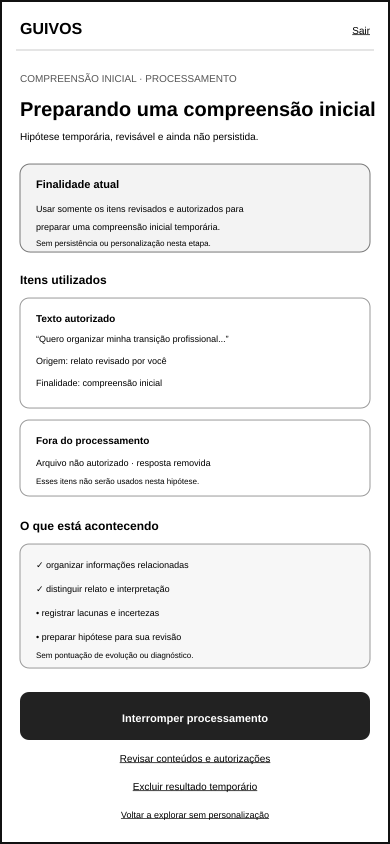
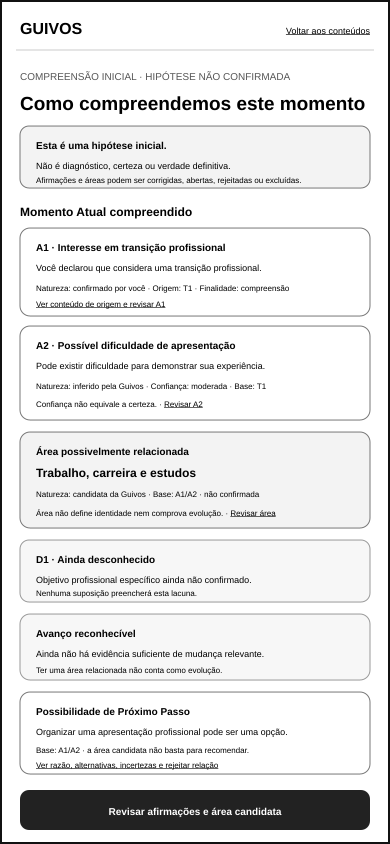
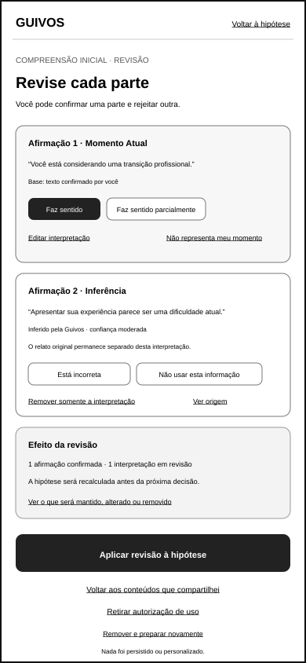
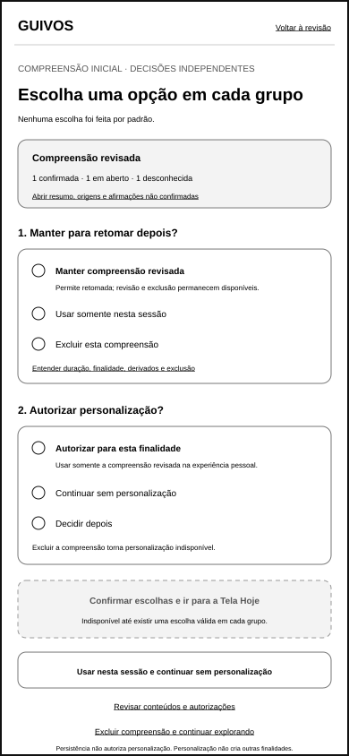

# Wireframe de Baixa Fidelidade da Compreensão Inicial

## 1. Finalidade

Este documento materializa a primeira referência gráfica móvel da compreensão inicial da jornada pessoal da Guivos.

O conjunto demonstra como conteúdos previamente revisados e especificamente autorizados poderão ser utilizados para preparar uma compreensão inicial temporária, verificável e corrigível antes de qualquer decisão sobre persistência ou personalização.

A referência preserva a distinção entre:

- conteúdo recebido;
- processamento autorizado;
- interpretação produzida;
- informação confirmada;
- inferência;
- desconhecido;
- contestação;
- persistência;
- personalização;
- continuidade sem personalização.

O artefato não representa diagnóstico, avaliação profissional, verdade definitiva, design visual, modelo de IA, algoritmo, texto jurídico final, protótipo navegável ou implementação.

## 2. Posição na experiência

```text
Página Inicial pública
→ explicação do ambiente protegido
→ acesso, somente quando necessário
→ escolha e rascunho mínimo
→ revisão do conteúdo recebido
→ autorização específica para preparar compreensão inicial
→ processamento visível e interrompível
→ compreensão inicial apresentada
→ revisão, correção, limitação ou rejeição
→ decisão separada sobre persistência
→ decisão separada sobre personalização
→ Tela Hoje, jornada sem personalização ou exploração geral
```

A compreensão inicial não poderá ser apresentada como concluída, persistida ou personalizada antes da revisão da pessoa.

## 3. Artefatos visuais

### 3.1 Processamento visível



`docs/assets/wireframes/uxa-036-initial-understanding-processing-mobile.svg`

### 3.2 Compreensão inicial apresentada



`docs/assets/wireframes/uxa-036-initial-understanding-presentation-mobile.svg`

### 3.3 Revisão e correção



`docs/assets/wireframes/uxa-036-initial-understanding-review-mobile.svg`

### 3.4 Persistência, personalização e continuidade



`docs/assets/wireframes/uxa-036-initial-understanding-decision-mobile.svg`

Dimensão de referência dos quatro arquivos:

- canal: aplicativo móvel;
- largura: 390 pixels;
- altura: 844 pixels;
- orientação: retrato;
- fidelidade: baixa;
- condição: conteúdos revisados e autorizados somente para preparar uma compreensão inicial temporária.

## 4. Pergunta funcional

> **A pessoa consegue compreender o que está sendo processado, revisar uma hipótese sobre seu momento, corrigir ou rejeitar cada parte e decidir separadamente sobre persistência e personalização sem pressão para aceitar a leitura da Guivos?**

## 5. Estado de processamento visível

O primeiro artefato demonstra:

- finalidade atual: preparar uma compreensão inicial temporária e revisável;
- conteúdos autorizados que estão sendo utilizados;
- conteúdos não autorizados ou removidos que permanecem fora do processamento;
- operações em linguagem compreensível;
- possibilidade de interromper;
- possibilidade de voltar à revisão de conteúdo e autorizações;
- possibilidade de excluir o resultado temporário;
- ausência de persistência e personalização nesta etapa.

A superfície utiliza:

> **Preparando uma compreensão inicial**

> **Somente os itens revisados e autorizados abaixo estão sendo utilizados.**

> **Nada será mantido como compreensão persistente ou usado para personalizar antes da sua revisão.**

Ações:

- `Interromper processamento`;
- `Revisar conteúdos e autorizações`;
- `Excluir resultado temporário`;
- `Voltar a explorar sem personalização`.

Interromper deverá declarar o efeito sobre o resultado parcial. O wireframe ilustra descarte do resultado parcial, preservando o conteúdo original somente conforme os controles já escolhidos no início protegido.

## 6. Conteúdos e operações visíveis

A pessoa deverá poder reconhecer:

- texto autorizado;
- resposta opcional autorizada;
- transcrição autorizada;
- arquivo ou extração autorizada;
- item removido;
- item não autorizado;
- finalidade aplicável;
- estado do processamento.

Operações poderão ser descritas como:

- organizar informações relacionadas;
- distinguir declarações e interpretações;
- identificar temas recorrentes;
- registrar lacunas e incertezas;
- preparar uma hipótese revisável.

A superfície não deverá apresentar raciocínio interno detalhado, pontuação secreta ou inferência não autorizada.

## 7. Compreensão inicial apresentada como hipótese

O segundo artefato apresenta:

> **Esta é uma hipótese inicial, não um diagnóstico nem uma verdade definitiva.**

A compreensão é organizada em três blocos distintos:

1. **Momento Atual compreendido**;
2. **Avanço que pode ser reconhecido**;
3. **Possibilidade de Próximo Passo**.

A apresentação não utiliza o rótulo `recomendado para você` antes da confirmação suficiente.

### 7.1 Momento Atual

O bloco deverá mostrar:

- interpretação em linguagem simples;
- natureza de cada informação;
- origem;
- data ou contexto;
- finalidade;
- confiança quando houver inferência;
- lacunas e desconhecidos;
- ação `Ver informações utilizadas`.

Exemplo ilustrativo:

> **Você relatou interesse em uma transição profissional e dificuldade para apresentar sua experiência.**

Naturezas ilustradas:

- `Confirmado por você`;
- `Inferido pela Guivos · confiança moderada`;
- `Ainda desconhecido`.

### 7.2 Avanço reconhecível

A primeira compreensão poderá declarar que ainda não existe evidência suficiente de mudança relevante.

Ela não considera envio de relato, criação de conta ou uso da plataforma como avanço humano.

Exemplo:

> **Ainda não há evidência suficiente para reconhecer uma mudança na jornada. Organizar sua experiência pode ser um ponto de partida, não um avanço já concluído.**

### 7.3 Próximo Passo como possibilidade

Antes da confirmação da compreensão, somente uma possibilidade geral poderá ser apresentada.

Ela deverá responder:

- por que pode fazer sentido;
- qual base foi utilizada;
- o que não garante;
- quais alternativas existem;
- como rejeitar a relação.

Exemplo:

> **Organizar uma apresentação profissional pode ser uma possibilidade porque você informou dificuldade para demonstrar sua experiência. Isso não garante uma oportunidade e outros caminhos continuam disponíveis.**

## 8. Origem, natureza e confiança

Toda afirmação material deverá utilizar um rótulo compreensível:

| Rótulo | Significado |
|---|---|
| Confirmado por você | informação declarada ou confirmada pela pessoa |
| Observado no ecossistema | ação ou experiência registrada e autorizada |
| Fonte externa autorizada | informação de conexão explicitamente autorizada |
| Inferido pela Guivos | interpretação corrigível, acompanhada de confiança e base |
| Ainda desconhecido | informação indisponível ou não confirmada |
| Contestado por você | informação cuja validade foi questionada |

Confiança não equivale a certeza. Ela deverá ser acompanhada de explicação acessível e não poderá ser usada para pressionar aceitação.

## 9. Estado de revisão e correção

O terceiro artefato permite responder à compreensão por bloco e por afirmação.

Controles principais:

- `Faz sentido`;
- `Faz sentido parcialmente`;
- `Não representa meu momento`;
- `Esta informação está incorreta`;
- `Meu momento mudou`;
- `Não usar esta informação`;
- `Editar interpretação`;
- `Remover interpretação`;
- `Voltar aos conteúdos de origem`;
- `Remover e preparar novamente`.

A pessoa poderá confirmar uma parte e rejeitar outra. Confirmação parcial não eleva inferências rejeitadas a fatos.

Cada alteração deverá mostrar:

- qual afirmação será alterada;
- qual informação de origem será mantida ou removida;
- se o resultado temporário será recalculado;
- quais decisões ainda não foram tomadas.

## 10. Correção sem reescrever o relato original

Corrigir uma interpretação não deverá modificar silenciosamente o conteúdo original.

A interface distingue:

- `corrigir o que a Guivos compreendeu`;
- `editar o conteúdo que você compartilhou`;
- `retirar autorização de uso`;
- `excluir conteúdo e derivados`.

A pessoa deverá poder preservar o conteúdo original e rejeitar somente a interpretação derivada.

## 11. Estado de decisão

O quarto artefato apresenta decisões somente depois da revisão.

### 11.1 Persistência

A pergunta é separada:

> **Você quer manter esta compreensão revisada para retomar sua jornada depois?**

Opções:

- `Manter compreensão revisada`;
- `Usar somente nesta sessão`;
- `Excluir esta compreensão`.

A escolha deverá explicar duração, finalidade, controles de revisão e exclusão.

### 11.2 Personalização

A pergunta seguinte é independente:

> **Você autoriza usar esta compreensão revisada para personalizar sua experiência?**

Opções:

- `Autorizar personalização desta finalidade`;
- `Continuar sem personalização`;
- `Decidir depois`.

Autorizar persistência não autoriza personalização. Autorizar personalização não autoriza publicidade baseada em informações sensíveis, compartilhamento externo ou novas finalidades.

### 11.3 Continuidade

A pessoa poderá:

- `Ir para a Tela Hoje` com a condição escolhida;
- continuar em jornada sem personalização;
- explorar o ecossistema de forma geral;
- voltar à compreensão;
- voltar ao início protegido para revisar conteúdos e autorizações;
- excluir a compreensão e continuar explorando.

## 12. Estado de base insuficiente

Quando a base autorizada for insuficiente, a Guivos deverá declarar:

> **Ainda não há base suficiente para compreender seu momento com segurança.**

A pessoa poderá:

- revisar o que compartilhou;
- acrescentar conteúdo de forma voluntária;
- corrigir ou retirar informações;
- continuar sem personalização;
- explorar o ecossistema;
- encerrar sem persistir compreensão.

A ausência de base não deverá produzir uma hipótese artificial, um Próximo Passo pessoal ou pressão para compartilhar mais.

Este estado é governado pelo contrato textual neste incremento e não recebe um quinto wireframe específico.

## 13. Transição para a Tela Hoje

A Tela Hoje somente poderá utilizar a compreensão quando:

- a hipótese tiver sido apresentada;
- a pessoa tiver oportunidade real de revisão;
- correções e rejeições tiverem sido aplicadas;
- persistência, quando necessária, tiver autorização própria;
- personalização material tiver autorização própria;
- a finalidade ativa estiver identificada.

Sem personalização, a Tela Hoje poderá apresentar jornada geral, controles, histórico voluntário e exploração, sem chamar possibilidades de recomendações pessoais.

## 14. Privacidade e autonomia

A referência preserva:

- processamento limitado aos itens autorizados;
- inventário de conteúdos utilizados;
- interrupção e descarte de resultado temporário;
- revisão anterior à persistência;
- personalização opt-in e separada;
- finalidade específica;
- contestação e exclusão;
- ausência de inferência sensível automática;
- ausência de diagnóstico;
- continuidade sem personalização;
- retorno ao início protegido;
- ausência de culpa, urgência ou recompensa por aceitar a compreensão.

## 15. Acessibilidade e resiliência

A futura implementação deverá:

- anunciar início, estado e conclusão do processamento;
- permitir interrupção por teclado e tecnologia assistiva;
- não depender de animação ou percentual;
- apresentar natureza e confiança também em texto;
- manter ordem de leitura entre hipótese, base, controles e decisões;
- preservar revisão em baixa conectividade quando tecnicamente possível;
- evitar perda silenciosa de correções;
- confirmar exclusões destrutivas;
- distinguir visualmente e semanticamente persistência de personalização.

Este incremento não conclui conformidade técnica de acessibilidade.

## 16. Critérios de validação posterior

A validação funcional especializada deverá verificar:

- se a pessoa entende que o processamento utiliza somente itens autorizados;
- se consegue interromper e conhecer o efeito;
- se a compreensão é percebida como hipótese;
- se Momento Atual, avanço e Próximo Passo não são confundidos;
- se origem, natureza, confiança e desconhecidos são compreensíveis;
- se a pessoa consegue rejeitar uma interpretação sem apagar o relato original;
- se correção, retirada de autorização e exclusão são distintas;
- se persistência e personalização são decisões independentes;
- se continuar sem personalização é uma alternativa real;
- se a transição para a Tela Hoje preserva a condição escolhida;
- se o estado de base insuficiente evita pressão para compartilhar mais.

## 17. Limites

Este incremento não:

- define modelo ou fornecedor de IA;
- revela raciocínio interno;
- define inferências sensíveis permitidas;
- cria diagnóstico psicológico, médico, financeiro ou profissional;
- define política jurídica final;
- implementa processamento, armazenamento ou personalização;
- conclui segurança ou autenticação;
- define design visual ou textos finais;
- cria referência para computador ou tablet;
- cria protótipo navegável;
- executa testes com usuários;
- conclui acessibilidade técnica;
- inicia Engenharia de Produto.

## 18. Próximos atos governados

Após integração e nova autorização, poderão ocorrer separadamente:

1. validar funcionalmente o wireframe móvel da compreensão inicial;
2. criar a referência móvel da Página Inicial pública;
3. validar a transição da compreensão para a primeira Tela Hoje;
4. criar estados especializados de processamento, pausa, falha e retomada;
5. criar referência do início protegido e da compreensão para computador;
6. criar estados especializados de texto, voz e arquivos;
7. retomar independentemente os testes dos Resultados Empresariais.

Nenhum ato é iniciado automaticamente.
