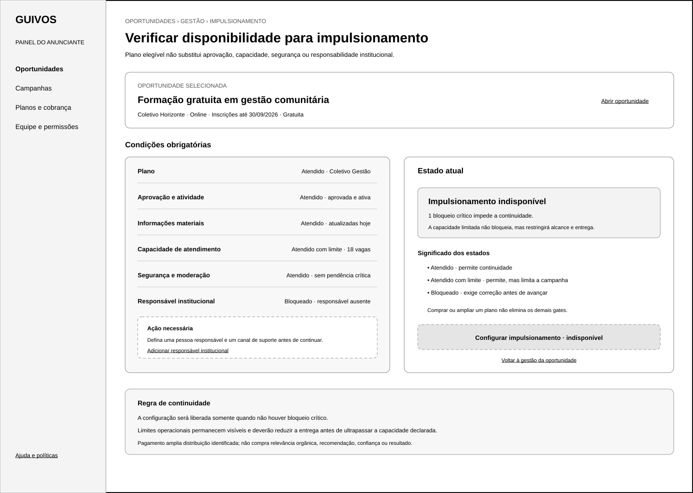
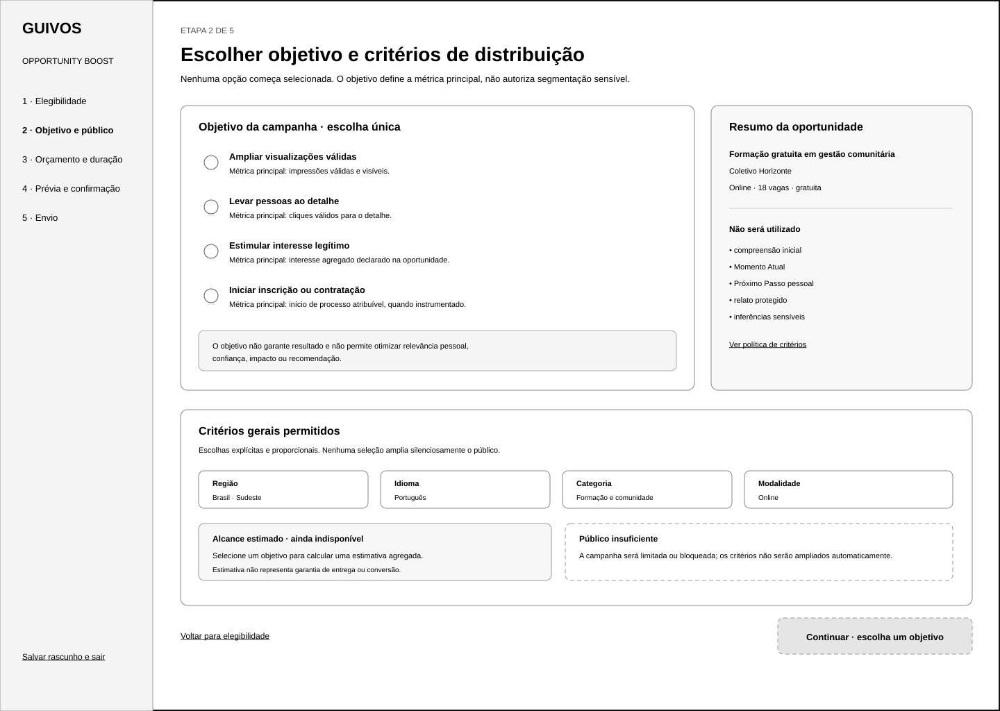
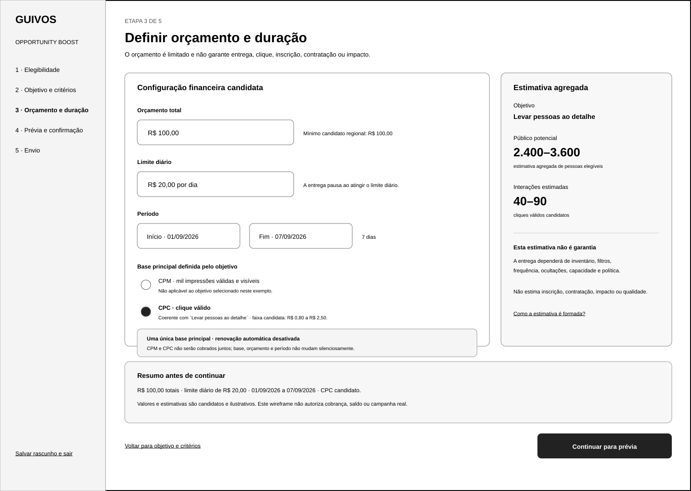
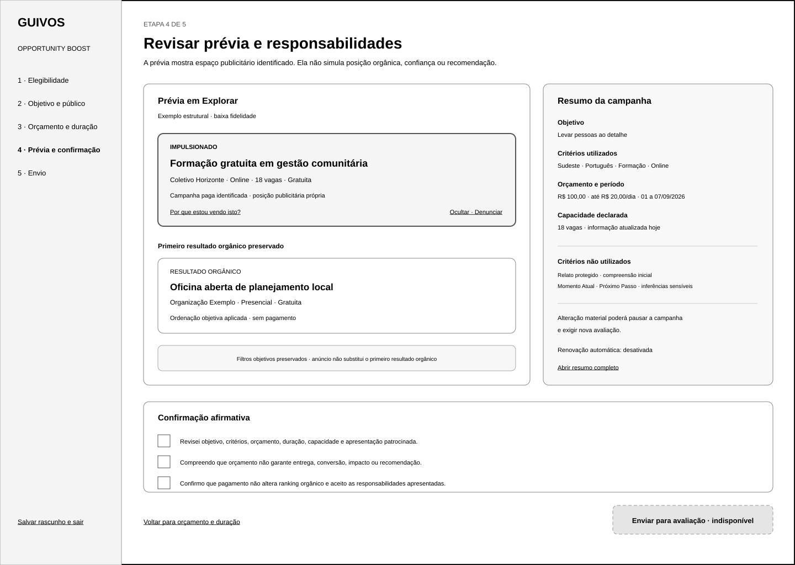
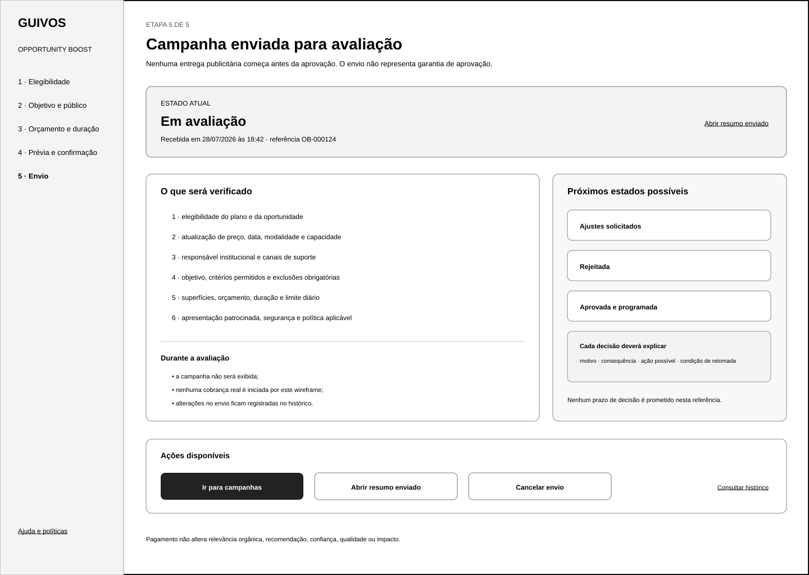

# Wireframes de Baixa Fidelidade do Fluxo do Anunciante do Opportunity Boost

## 1. Finalidade

Este documento materializa a referência gráfica reformulada e funcionalmente validada do fluxo pelo qual uma Organização ou um Coletivo elegível configura e envia uma campanha de Opportunity Boost para avaliação.

O conjunto preserva a distinção entre:

- plano elegível;
- oportunidade elegível;
- condição atendida, limitada ou bloqueada;
- objetivo publicitário;
- critérios escolhidos;
- critérios proibidos;
- orçamento e duração;
- base principal de cobrança candidata;
- alcance estimado;
- primeiro resultado orgânico;
- espaço patrocinado;
- confirmação afirmativa;
- envio e cancelamento da avaliação.

O conjunto não representa design final, campanha real, checkout, cobrança, algoritmo, política publicitária final, protótipo navegável ou Engenharia de Produto.

## 2. Posição na experiência

```text
Gestão da oportunidade
→ verificar disponibilidade para impulsionamento
→ distinguir condições atendidas, limitadas e bloqueadas
→ escolher objetivo único
→ escolher e revisar critérios permitidos
→ revisar critérios proibidos
→ definir orçamento, duração e limite diário
→ confirmar base principal coerente com o objetivo
→ visualizar estimativa sem garantia
→ revisar primeiro resultado orgânico e espaço patrocinado
→ confirmar responsabilidades
→ enviar para avaliação
→ acompanhar, cancelar ou receber decisão
```

O fluxo não altera a posição orgânica da oportunidade e não utiliza compreensão inicial, Momento Atual, Próximo Passo ou inferências sensíveis.

## 3. Canal e dimensão

- canal: web para computador;
- largura: 1.440 pixels;
- altura: 1.024 pixels;
- orientação: paisagem;
- fidelidade: baixa;
- contexto: painel de Organização ou Coletivo.

## 4. Artefatos visuais reformulados

### 4.1 Elegibilidade e gate de entrada



`docs/assets/wireframes/uxa-040-opportunity-boost-eligibility-desktop.svg`

Demonstra:

- oportunidade selecionada;
- plano atual;
- aprovação e atividade;
- atualização das informações materiais;
- capacidade disponível;
- responsável institucional;
- pendências de segurança ou moderação;
- estados `Atendido`, `Atendido com limite` e `Bloqueado`;
- quantidade de bloqueios críticos;
- ação principal disponível somente quando nenhum bloqueio permanecer;
- ações corretivas específicas.

### 4.2 Objetivo e critérios de distribuição



`docs/assets/wireframes/uxa-040-opportunity-boost-objective-audience-desktop.svg`

Demonstra:

- objetivo único sem seleção automática;
- métrica principal associada;
- critérios escolhidos pelo anunciante;
- controles visuais de seleção e revisão;
- critérios expressamente proibidos;
- estimativa indisponível enquanto faltar objetivo;
- regra de público insuficiente separada do estado atual;
- ausência de ampliação automática.

### 4.3 Orçamento, duração e estimativa



`docs/assets/wireframes/uxa-040-opportunity-boost-budget-schedule-desktop.svg`

Demonstra:

- orçamento total;
- limite diário;
- início e término;
- base principal derivada do objetivo;
- CPC coerente com objetivo de clique no exemplo;
- proibição de cobrança simultânea por CPM e CPC;
- ausência de renovação automática;
- estimativa agregada;
- aviso de que estimativa não representa garantia;
- tratamento de orçamento abaixo do mínimo candidato.

### 4.4 Prévia e confirmação



`docs/assets/wireframes/uxa-040-opportunity-boost-preview-confirmation-desktop.svg`

Demonstra:

- primeiro resultado orgânico anterior ao anúncio;
- espaço patrocinado identificado depois do primeiro orgânico;
- ação `Por que estou vendo isto?`;
- controles para ocultar e denunciar;
- resumo de objetivo, base, critérios, orçamento, duração e capacidade;
- critérios proibidos e não utilizados;
- consequências de alteração material;
- renovação automática desativada;
- confirmações afirmativas inicialmente desmarcadas.

### 4.5 Envio para avaliação



`docs/assets/wireframes/uxa-040-opportunity-boost-submission-desktop.svg`

Demonstra:

- campanha recebida para avaliação;
- estado `Em avaliação`;
- itens que serão verificados;
- ausência de entrega antes da aprovação;
- ausência de cobrança real neste artefato;
- possibilidade de cancelar o envio;
- cancelamento com retorno ao rascunho;
- acesso ao histórico e ao resumo enviado;
- próximos estados possíveis sem promessa de aprovação.

## 5. Resultado funcional

A pergunta funcional do conjunto é:

> **O anunciante compreende por que pode ou não impulsionar, escolhe conscientemente objetivo, critérios, orçamento e duração, distingue estimativa de garantia, revisa a apresentação patrocinada e envia a campanha sem acreditar que comprou relevância orgânica, recomendação ou resultado?**

A UXA-041 considera o conjunto **funcionalmente válido após reformulação**.

## 6. Gate de elegibilidade

A superfície diferencia:

```text
Atendido
→ permite continuidade

Atendido com limite
→ permite continuidade, mas limita alcance ou entrega

Bloqueado
→ impede continuidade e exige correção
```

A ação `Configurar impulsionamento` permanece indisponível enquanto existir qualquer bloqueio crítico:

- plano não elegível;
- oportunidade não aprovada;
- oportunidade inativa ou expirada;
- informações materiais desatualizadas;
- capacidade inexistente;
- pendência crítica de segurança ou moderação;
- responsável institucional ausente.

A contratação de plano não elimina exigências de aprovação, capacidade ou segurança.

## 7. Objetivo e critérios

O anunciante deverá escolher uma única finalidade de distribuição. Nenhuma opção começa selecionada.

Os critérios permitidos deverão:

- ser escolhidos ou confirmados explicitamente;
- apresentar origem objetiva;
- permitir revisão e remoção;
- permanecer proporcionais à oportunidade;
- nunca ser ampliados silenciosamente.

Critérios proibidos permanecem fora da seleção:

- relato protegido;
- compreensão inicial;
- Momento Atual;
- Próximo Passo;
- inferências sensíveis.

Público insuficiente será apresentado como exceção própria, com motivo, consequência e revisão manual possível.

## 8. Orçamento, duração e base principal

A superfície evidencia:

- orçamento total limitado;
- limite diário;
- período explícito;
- ausência de renovação automática por padrão;
- uma única base principal;
- coerência entre objetivo e base;
- proibição de CPM e CPC simultâneos;
- orçamento mínimo candidato aplicável;
- estimativa agregada sem garantia.

No exemplo validado:

```text
Objetivo: levar pessoas ao detalhe
→ métrica principal: clique válido
→ base candidata: CPC
```

Valores exibidos são ilustrativos e não constituem cobrança autorizada.

## 9. Prévia e confirmação

A prévia separa visualmente:

1. primeiro resultado orgânico;
2. espaço patrocinado identificado;
3. explicação da distribuição;
4. filtros objetivos;
5. controles da pessoa.

A confirmação final permanece indisponível até que o anunciante:

1. revise o resumo;
2. reconheça que orçamento não garante resultado;
3. reconheça que pagamento não altera ranking orgânico;
4. aceite as responsabilidades aplicáveis por ação afirmativa.

## 10. Estado de envio e cancelamento

Depois do envio:

- a campanha entra em `Em avaliação`;
- nenhuma entrega publicitária começa;
- o anunciante pode abrir o resumo enviado;
- ajustes solicitados, rejeição e aprovação permanecem estados distintos;
- nenhum prazo ou aprovação é prometido.

A ação `Cancelar envio` deverá declarar:

> **Cancelar encerra a avaliação e devolve a campanha ao estado de rascunho. Nenhuma entrega começa e nenhuma cobrança real é iniciada por este artefato.**

O histórico da decisão permanece acessível.

## 11. Acessibilidade e linguagem

- estados não dependem apenas de cor;
- controles possuem rótulos textuais;
- escolhas únicas e múltiplas possuem convenções distintas;
- campos obrigatórios são identificados em linguagem clara;
- bloqueios informam ação corretiva;
- valores utilizam formato monetário pt-BR;
- nenhuma urgência, culpa ou escassez artificial é utilizada;
- termos técnicos aparecem somente como referência secundária.

## 12. Limites

Este incremento não cria:

- cartão patrocinado independente para a pessoa;
- explicação completa `Por que estou vendo isto?`;
- estados patrocinados para Lista ou Mapa;
- gestão de campanha ativa;
- relatório agregado do anunciante;
- teste com usuários;
- design visual;
- protótipo;
- campanha, algoritmo, checkout, cobrança ou Engenharia de Produto.

## 13. Próximos atos governados

Após integração e nova autorização, poderão ocorrer separadamente:

1. criar wireframes do cartão patrocinado e da explicação de distribuição;
2. criar estados patrocinados para Lista e Mapa;
3. criar wireframes de gestão da campanha ativa;
4. criar wireframe do relatório agregado;
5. validar o conjunto completo de wireframes do Opportunity Boost.

Nenhum ato é iniciado automaticamente.
