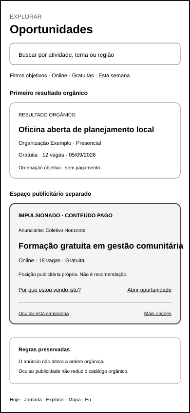
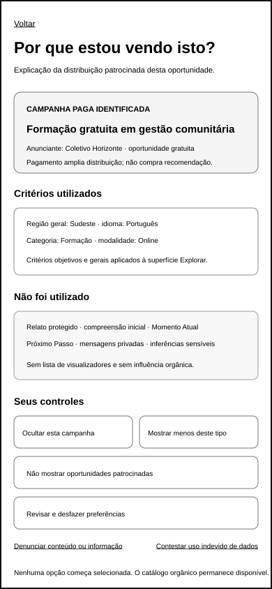
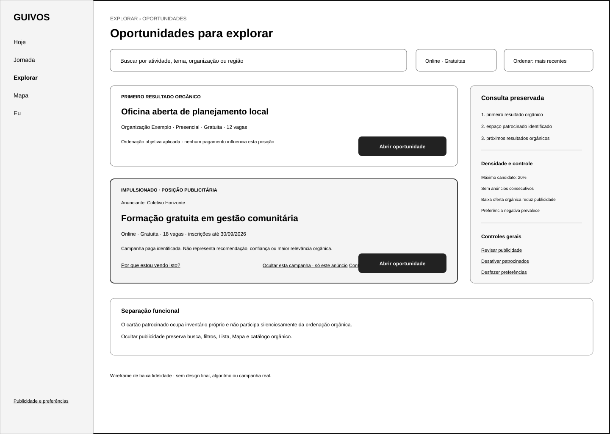
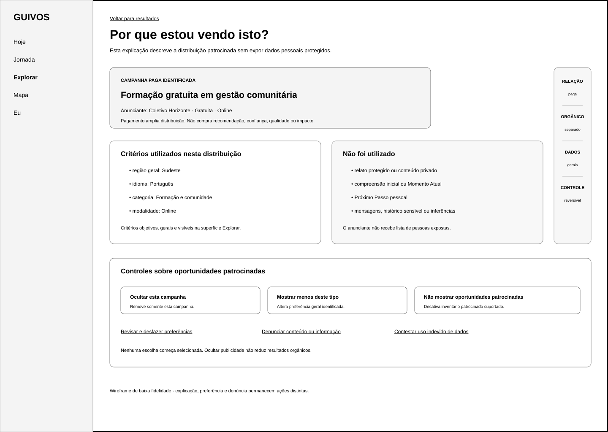
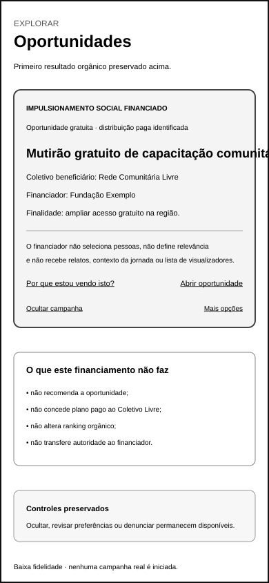
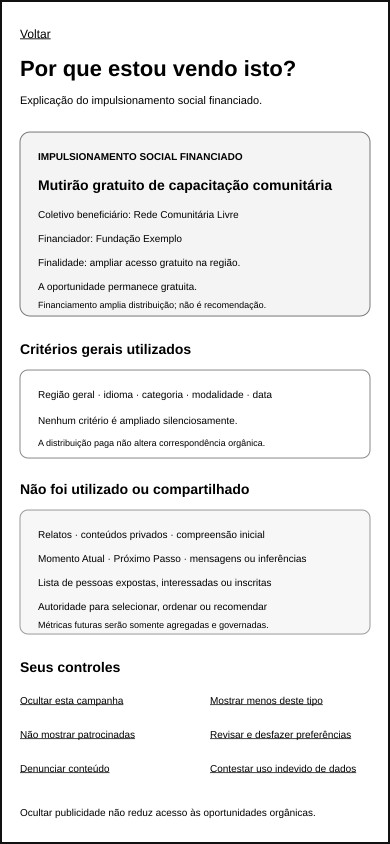

# Wireframes de Baixa Fidelidade do Cartão Patrocinado e da Explicação do Opportunity Boost

## 1. Finalidade

Este documento materializa as referências de baixa fidelidade do cartão patrocinado e da explicação `Por que estou vendo isto?` para o Opportunity Boost.

O conjunto representa a experiência da pessoa diante de uma oportunidade distribuída em inventário patrocinado identificado, preservando:

- primeiro resultado orgânico;
- separação entre posição paga e ordenação orgânica;
- natureza comercial anterior ao conteúdo;
- anunciante ou financiador identificado;
- preço ou gratuidade;
- critérios gerais utilizados;
- critérios protegidos não utilizados;
- controles de ocultação, preferência e denúncia;
- reversibilidade das preferências;
- variação própria para Boost Social Financiado.

O conjunto não representa design final, algoritmo, perfil publicitário, campanha real, política jurídica final, protótipo, teste com usuários ou Engenharia de Produto.

## 2. Pergunta funcional do conjunto

> **A pessoa reconhece antes da interação que o conteúdo é patrocinado, compreende por que foi distribuído, distingue publicidade de recomendação, conhece os critérios utilizados e não utilizados e consegue controlar ou contestar a experiência sem perder o catálogo orgânico?**

A pergunta ainda deverá ser respondida por validação funcional especializada dos wireframes.

## 3. Canal e dimensões

| Artefato | Canal | Dimensão |
|---|---|---:|
| cartão patrocinado padrão | aplicativo móvel | 390 × 844 |
| explicação patrocinada padrão | aplicativo móvel | 390 × 844 |
| cartão patrocinado padrão | web para computador | 1.440 × 1.024 |
| explicação patrocinada padrão | web para computador | 1.440 × 1.024 |
| cartão de Boost Social Financiado | aplicativo móvel | 390 × 844 |
| explicação do Boost Social Financiado | aplicativo móvel | 390 × 844 |

Todos os artefatos utilizam baixa fidelidade e conteúdo ilustrativo.

## 4. Artefatos visuais

### 4.1 Cartão patrocinado móvel



`docs/assets/wireframes/uxa-042-sponsored-card-mobile.svg`

Demonstra:

- primeiro resultado orgânico anterior ao espaço patrocinado;
- selo `Impulsionado · Conteúdo pago` antes do título;
- anunciante identificado;
- gratuidade, modalidade, capacidade e data;
- declaração de que posição paga não é recomendação;
- ação `Por que estou vendo isto?`;
- ocultação da campanha;
- acesso a opções adicionais;
- preservação do catálogo orgânico.

### 4.2 Explicação patrocinada móvel



`docs/assets/wireframes/uxa-042-sponsored-explanation-mobile.svg`

Demonstra:

- campanha paga identificada;
- oportunidade e anunciante;
- critérios gerais utilizados;
- critérios expressamente não utilizados;
- ausência de lista de visualizadores;
- ausência de influência sobre correspondência orgânica;
- ocultação da campanha;
- revisão e reversão de preferências;
- denúncia e contestação como fluxos separados.

### 4.3 Cartão patrocinado para computador



`docs/assets/wireframes/uxa-042-sponsored-card-desktop.svg`

Demonstra:

- consulta e filtros objetivos preservados;
- primeiro resultado orgânico;
- espaço patrocinado posterior e delimitado;
- identificação comercial anterior ao conteúdo;
- densidade, frequência e baixa oferta orgânica como regras separadas;
- controles gerais de publicidade;
- ausência de alteração da ordenação orgânica.

### 4.4 Explicação patrocinada para computador



`docs/assets/wireframes/uxa-042-sponsored-explanation-desktop.svg`

Demonstra:

- relação paga;
- inventário orgânico separado;
- critérios gerais utilizados;
- dados protegidos e contextos pessoais não utilizados;
- ausência de lista de pessoas expostas;
- controles com escopos distintos;
- preferência reversível;
- denúncia e contestação separadas.

### 4.5 Cartão móvel do Boost Social Financiado



`docs/assets/wireframes/uxa-042-social-financed-card-mobile.svg`

Demonstra:

- rótulo `Impulsionamento social financiado`;
- oportunidade gratuita;
- Coletivo beneficiário;
- Organização ou parceiro financiador;
- finalidade declarada do financiamento;
- ausência de autoridade do financiador;
- ausência de transferência de plano pago;
- controles equivalentes aos demais conteúdos patrocinados.

### 4.6 Explicação móvel do Boost Social Financiado



`docs/assets/wireframes/uxa-042-social-financed-explanation-mobile.svg`

Demonstra:

- financiador e beneficiário identificados;
- finalidade e gratuidade;
- critérios gerais utilizados;
- ausência de ampliação silenciosa;
- dados e poderes não concedidos ao financiador;
- métricas futuras somente agregadas;
- ocultação, preferência, desativação e denúncia.

## 5. Ordem orgânica e inventário patrocinado

As referências demonstram a seguinte ordem:

```text
consulta e filtros objetivos
→ primeiro resultado orgânico
→ espaço patrocinado identificado
→ próximos resultados orgânicos
```

O cartão patrocinado:

- não substitui o primeiro resultado orgânico;
- não participa silenciosamente do ranking;
- não recebe selo de recomendação;
- não apresenta aderência pessoal comprada;
- não transforma pagamento em qualidade, confiança ou impacto;
- não aumenta quando houver pouca oferta orgânica.

A densidade candidata máxima permanece em 20%, sem duas unidades patrocinadas consecutivas e com redução da publicidade quando faltar inventário orgânico.

## 6. Identificação anterior ao conteúdo

A natureza comercial deverá ser reconhecível antes do título da oportunidade por:

- rótulo textual;
- posição própria;
- anunciante ou financiador;
- informação de gratuidade ou preço;
- linguagem sem ambiguidade entre anúncio e recomendação.

Cor, ícone ou borda não poderão ser o único meio de identificação.

## 7. Explicação de distribuição

A explicação separa:

```text
Motivo
→ campanha paga identificada

Critérios utilizados
→ região, idioma, categoria, modalidade, data, preço ou preferência geral permitida

Critérios não utilizados
→ relato protegido, compreensão inicial, Momento Atual, Próximo Passo, mensagens e inferências sensíveis

Controles
→ ocultar, mostrar menos, desativar patrocinados, revisar preferências, denunciar ou contestar
```

Quando existir correspondência orgânica legítima para a mesma oportunidade, a interface deverá explicar separadamente:

- razão orgânica;
- condição patrocinada;
- critérios de cada uma;
- ausência de influência do pagamento sobre a correspondência.

## 8. Controles e escopos

- `Ocultar esta campanha` remove somente a campanha específica nas superfícies aplicáveis;
- `Mostrar menos deste tipo` altera preferência geral identificada;
- `Não mostrar oportunidades patrocinadas` desativa inventário patrocinado nas superfícies suportadas;
- `Revisar e desfazer preferências` permite compreender e reverter escolhas anteriores;
- `Denunciar` abre fluxo de conteúdo ou informação e não equivale a preferência;
- `Contestar uso indevido de dados` abre fluxo separado de privacidade ou governança.

Nenhuma opção começa selecionada.

Ocultar publicidade não poderá:

- reduzir acesso ao catálogo orgânico;
- ocultar oportunidades orgânicas da mesma categoria;
- ser interpretado como desinteresse orgânico;
- impedir busca, filtros, Lista ou Mapa;
- ser contornado por outra campanha equivalente.

## 9. Boost Social Financiado

A variação social apresenta:

- Coletivo beneficiário;
- financiador;
- finalidade do financiamento;
- oportunidade gratuita;
- ausência de seleção individual pelo financiador;
- ausência de autoridade sobre relevância, ordem ou resultado;
- ausência de acesso a relato, compreensão, jornada ou lista de pessoas;
- ausência de concessão automática de plano pago ao Coletivo Livre.

O financiamento não constitui recomendação institucional da Guivos nem transfere autoridade ao patrocinador.

## 10. Acessibilidade e linguagem

- leitores de tela deverão anunciar a natureza comercial antes do conteúdo;
- identificação patrocinada não dependerá somente de cor;
- anunciante, financiador e beneficiário terão rótulos textuais;
- preço e gratuidade permanecerão compreensíveis;
- ações terão nome, escopo e consequência;
- preferência e denúncia serão distinguíveis;
- o retorno ao catálogo orgânico permanecerá evidente;
- não serão usados padrões de urgência, culpa ou escassez artificial.

## 11. Limites

Este incremento não cria:

- validação funcional dos seis wireframes;
- estados patrocinados para Lista ou Mapa;
- wireframes de gestão da campanha ativa;
- relatório agregado do anunciante;
- design visual;
- protótipo navegável;
- teste com usuários;
- algoritmo, perfil publicitário ou motor de entrega;
- checkout, cobrança ou Engenharia de Produto.

## 12. Próximos atos governados

Após integração e nova autorização, poderão ocorrer separadamente:

1. validar funcionalmente e reformular os wireframes da UXA-042;
2. criar estados patrocinados para Lista e Mapa;
3. criar wireframes de gestão da campanha ativa;
4. criar wireframe do relatório agregado;
5. validar funcionalmente o conjunto completo de wireframes do Opportunity Boost.

Nenhum ato é iniciado automaticamente.
