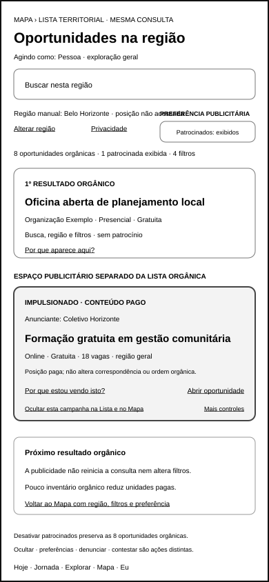
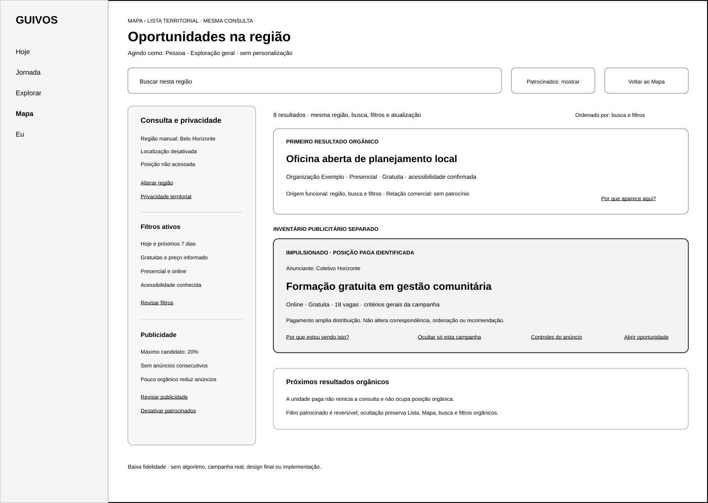
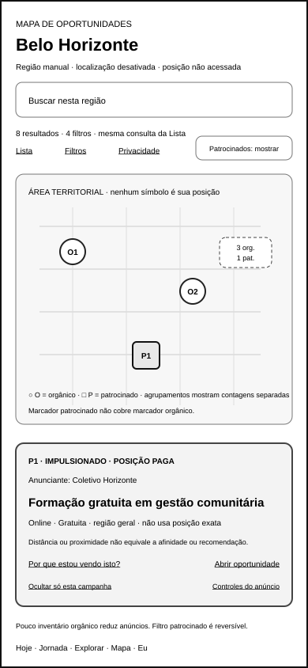
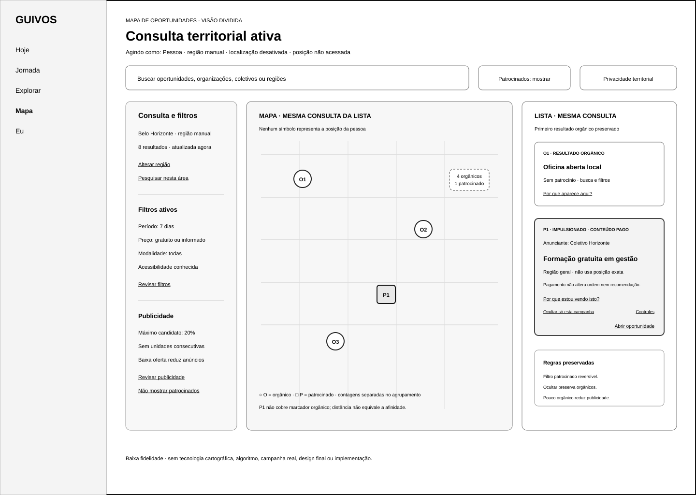

# Wireframes de Baixa Fidelidade dos Estados Patrocinados para Lista e Mapa

## 1. Finalidade

Este documento materializa os estados patrocinados do Opportunity Boost nas superfícies territoriais de Lista e Mapa.

O pacote demonstra como a publicidade identificada poderá coexistir com uma única consulta territorial sem:

- substituir o primeiro resultado orgânico;
- alterar silenciosamente busca, filtros ou ordenação;
- misturar resultados orgânicos e unidades pagas na mesma contagem;
- confundir filtros de oportunidades com preferência publicitária;
- transformar proximidade, seleção ou distância em afinidade;
- utilizar posição exata ou histórico territorial para publicidade;
- sobrepor marcador patrocinado a oportunidade orgânica;
- ampliar densidade quando houver pouca oferta orgânica;
- reduzir o catálogo orgânico quando a publicidade for ocultada;
- executar nova consulta somente porque o Mapa foi movido.

O conjunto não representa design final, tecnologia cartográfica, algoritmo, campanha real, perfil publicitário, cobrança, protótipo, teste com usuários ou Engenharia de Produto.

## 2. Estado de validação

A UXA-045 examinou os quatro artefatos e os considerou:

> **Funcionalmente válidos após reformulação.**

As reformulações principais foram:

- separar contagens orgânicas e pagas;
- distinguir filtros de oportunidades e preferência publicitária;
- remover o percentual interno de densidade da superfície da pessoa;
- declarar o efeito sincronizado da ocultação em Lista e Mapa;
- nomear marcador e cartão patrocinados como seleção vinculada;
- preservar a ordem orgânica da Lista após seleção no Mapa;
- criar o gate explícito `Pesquisar nesta área`.

Validação funcional não equivale a acessibilidade técnica, teste com usuários, protótipo ou implementação.

## 3. Pergunta funcional do conjunto

> **A pessoa distingue oportunidades orgânicas e patrocinadas nos dois modos, compreende o que pertence à consulta e o que pertence à preferência publicitária, mantém região, busca, filtros, seleção e privacidade ao alternar Lista e Mapa e consegue ocultar ou desativar publicidade sem perder o catálogo orgânico?**

A UXA-045 responde positivamente após as reformulações registradas.

## 4. Artefatos e dimensões

| Artefato | Canal | Dimensão |
|---|---|---:|
| Lista patrocinada territorial reformulada | aplicativo móvel | 390 × 844 |
| Lista patrocinada territorial reformulada | web para computador | 1.440 × 1.024 |
| Mapa patrocinado reformulado | aplicativo móvel | 390 × 844 |
| Mapa patrocinado reformulado | web para computador | 1.440 × 1.024 |

Todos os artefatos utilizam baixa fidelidade, dados ilustrativos e rótulos textuais independentes de cor.

## 5. Artefatos visuais

### 5.1 Lista patrocinada móvel



`docs/assets/wireframes/uxa-044-sponsored-list-mobile.svg`

Demonstra:

- Lista territorial pertencente à superfície Mapa;
- região manual e posição não acessada;
- preferência publicitária separada dos filtros;
- oito oportunidades orgânicas e uma patrocinada exibida;
- primeiro resultado orgânico;
- inventário pago posterior e delimitado;
- anunciante, gratuidade e natureza comercial;
- ocultação sincronizada na Lista e no Mapa;
- próximo resultado orgânico;
- retorno ao Mapa sem perda de contexto.

### 5.2 Lista patrocinada para computador



`docs/assets/wireframes/uxa-044-sponsored-list-desktop.svg`

Demonstra:

- consulta e privacidade em painel próprio;
- filtros de oportunidades separados da preferência publicitária;
- contagens orgânicas e pagas separadas;
- primeiro resultado orgânico anterior ao anúncio;
- unidade patrocinada separada da ordenação;
- publicidade limitada em linguagem funcional;
- controles de publicidade independentes dos filtros de negócio;
- continuidade para o Mapa.

### 5.3 Mapa patrocinado móvel



`docs/assets/wireframes/uxa-044-sponsored-map-mobile.svg`

Demonstra:

- mapa sem marcador da posição da pessoa;
- região manual e localização desativada;
- contagens orgânicas e pagas separadas;
- marcadores orgânicos circulares;
- marcador patrocinado quadrado, textual e selecionado;
- agrupamento com contagens orgânicas e patrocinadas separadas;
- ausência de sobreposição do marcador patrocinado;
- gate `Pesquisar nesta área`;
- cartão pago selecionado com explicação e controles;
- seleção sem alteração da ordem da Lista;
- preferência publicitária reversível.

### 5.4 Mapa patrocinado para computador



`docs/assets/wireframes/uxa-044-sponsored-map-desktop.svg`

Demonstra:

- visão dividida com consulta, Mapa e Lista sincronizados;
- localização opcional e região manual;
- filtros de oportunidades e preferência publicitária separados;
- marcadores orgânicos e patrocinados distintos;
- agrupamentos com contagens separadas;
- primeiro resultado orgânico preservado na Lista;
- marcador e cartão patrocinados vinculados pelo identificador `P1`;
- gate explícito para nova busca territorial;
- controles reversíveis e catálogo orgânico preservado.

## 6. Uma única consulta territorial

Lista e Mapa permanecem representações da mesma consulta.

Devem permanecer sincronizados:

- contexto `Agindo como`;
- região ou área territorial;
- busca;
- filtros de oportunidades;
- quantidade de resultados orgânicos;
- quantidade de unidades patrocinadas exibidas;
- preferência publicitária;
- atualização;
- seleção;
- explicação da origem;
- localização e privacidade.

Alternar entre Lista, Mapa, visão dividida ou foco não poderá iniciar uma nova campanha, alterar personalização, ativar localização ou reiniciar a consulta.

## 7. Contagens e ordem na Lista

A referência separa:

```text
8 oportunidades orgânicas
1 oportunidade patrocinada exibida
4 filtros de oportunidades
```

A ordem demonstrada é:

```text
primeiro resultado orgânico
→ inventário patrocinado identificado
→ próximos resultados orgânicos
```

A unidade patrocinada:

- não ocupa posição orgânica;
- não altera ordenação por busca e filtros;
- não recebe selo de recomendação;
- não substitui oportunidade organicamente selecionada;
- não é contabilizada como resultado orgânico;
- não pode aparecer consecutivamente com outra unidade paga.

Quando houver pouca oferta orgânica elegível, a quantidade de publicidade deverá ser reduzida. Ausência de inventário orgânico nunca aumenta densidade paga.

O limite candidato de 20% permanece uma proteção arquitetural para calibração e não aparece como filtro configurável pela pessoa.

## 8. Filtros de oportunidades e preferência publicitária

A interface separa:

### 8.1 Filtros de oportunidades

- período;
- preço;
- modalidade;
- acessibilidade;
- categoria e demais critérios de negócio permitidos.

### 8.2 Preferência publicitária

- mostrar oportunidades patrocinadas;
- ocultar uma campanha;
- mostrar menos daquele tipo;
- não mostrar oportunidades patrocinadas;
- revisar e desfazer preferências.

Alterar a preferência publicitária não modifica região, busca, filtros, quantidade orgânica, ordenação, localização ou privacidade.

O estado pertence à pessoa e não pode ser definido ou contornado pelo anunciante.

## 9. Marcadores, seleção e agrupamentos no Mapa

Os artefatos utilizam a convenção de baixa fidelidade:

- `O` em forma circular — oportunidade orgânica;
- `P` em forma quadrada — oportunidade patrocinada;
- `selecionado` — estado textual do marcador e cartão vinculados;
- agrupamento textual — contagens orgânicas e patrocinadas separadas.

Cor não poderá ser o único meio de diferenciação.

Um marcador patrocinado:

- não poderá cobrir marcador orgânico;
- não poderá substituir marcador orgânico em agrupamento;
- não poderá receber área visual desproporcional;
- deverá preservar identificador textual no cartão selecionado;
- deverá abrir explicação e controles equivalentes aos cartões patrocinados;
- não poderá ser interpretado como posição da pessoa;
- não altera a ordem da Lista quando selecionado;
- não gera correspondência, afinidade ou recomendação.

Agrupamentos deverão informar, por exemplo:

```text
4 orgânicos
1 patrocinado
```

A contagem combinada sem separação é proibida.

## 10. Movimentação e pesquisa territorial

Mover, ampliar ou reduzir o Mapa não altera automaticamente a consulta.

A nova área exige ação explícita:

> **Pesquisar nesta área**

Antes dessa ação, permanecem preservados:

- região vigente;
- busca;
- filtros;
- contagens;
- seleção;
- preferência publicitária;
- localização e privacidade.

Mover o Mapa não equivale a autorizar localização.

## 11. Localização e publicidade

O estado principal demonstra:

> **Região manual · localização desativada · posição não acessada**

A publicidade poderá utilizar somente critérios territoriais gerais permitidos e visíveis.

Não poderá utilizar:

- posição exata para segmentação contínua;
- histórico territorial sensível;
- residência inferida;
- deslocamento ou rota pessoal;
- localização de participantes;
- endereço protegido;
- proximidade isolada como afinidade ou recomendação.

Quando localização aproximada for voluntariamente autorizada para a consulta, a explicação deverá distinguir uso territorial da consulta e critérios da campanha.

Mais espaço de tela não autoriza mais coleta.

## 12. Ocultação e demais controles

A unidade ou marcador patrocinado oferece:

- `Por que estou vendo isto?`;
- `Ocultar esta campanha na Lista e no Mapa`;
- `Mais controles`;
- `Abrir oportunidade`.

A ocultação sincronizada:

- remove somente a campanha específica nos dois modos;
- preserva oportunidades orgânicas;
- preserva região, busca e filtros;
- preserva localização e privacidade;
- poderá ser revisada ou revertida conforme a política aplicável.

Ocultar, mostrar menos, desativar patrocinados, denunciar conteúdo e contestar uso de dados permanecem ações distintas.

A preferência negativa prevalece sobre entrega contratada.

## 13. Explicação da distribuição

A explicação deverá separar:

- condição paga;
- anunciante ou financiador;
- critérios gerais utilizados;
- critérios protegidos não utilizados;
- eventual correspondência orgânica legítima;
- ausência de influência do pagamento sobre a correspondência;
- localização utilizada pela consulta, quando aplicável;
- controles disponíveis.

Proximidade, seleção e distância não constituem recomendação.

## 14. Continuidade

Ao alternar entre Lista e Mapa, abrir o Detalhe ou retornar, deverão ser preservados quando aplicável:

- região;
- busca;
- filtros;
- ordenação orgânica;
- posição da Lista;
- área do Mapa;
- seleção;
- preferência publicitária;
- localização e privacidade;
- origem da navegação.

Selecionar uma unidade paga não altera prioridade, não gera correspondência orgânica e não autoriza personalização.

## 15. Acessibilidade e linguagem

- natureza patrocinada deverá ser anunciada antes do título;
- forma, texto e rótulo acompanharão qualquer uso de cor;
- contagens de agrupamentos serão textuais;
- Mapa terá alternativa integral em Lista;
- localização, preferência publicitária, seleção e relação comercial serão anunciáveis;
- marcador e cartão selecionados compartilharão identificador;
- controles terão nome, escopo e consequência;
- a interface não utilizará urgência, culpa ou escassez artificial;
- foco e leitura deverão preservar a ordem orgânico, patrocinado e orgânico;
- `Pesquisar nesta área` deverá ser acionável sem depender de gesto cartográfico.

Esta referência não conclui acessibilidade técnica.

## 16. Proteções preservadas

- primeiro resultado orgânico permanece orgânico;
- pagamento não compra relevância, afinidade, confiança, qualidade ou impacto;
- compreensão inicial, Momento Atual e Próximo Passo não alimentam publicidade;
- localização permanece opcional;
- posição exata e histórico territorial não alimentam campanhas;
- marcador patrocinado não encobre oportunidade orgânica;
- agrupamento separa contagens;
- baixa oferta orgânica reduz publicidade;
- nenhuma unidade paga aparece consecutivamente;
- ocultação não reduz o catálogo orgânico;
- movimentação do Mapa não executa consulta automática;
- anunciante não recebe lista de visualizadores;
- nenhum perfil publicitário é criado pelo wireframe.

## 17. Limites

Este incremento não cria:

- estados de erro ou ausência de inventário patrocinado;
- gestão de campanha ativa;
- relatório agregado;
- algoritmo de entrega ou leilão;
- perfil publicitário;
- tecnologia cartográfica;
- geocodificação, rota ou rastreamento;
- política final de densidade ou frequência;
- design final;
- protótipo navegável;
- teste com usuários;
- checkout, cobrança ou Engenharia de Produto.

## 18. Próximos atos governados

Após integração e nova autorização, poderão ocorrer separadamente:

1. criar os wireframes de gestão da campanha ativa;
2. criar o wireframe do relatório agregado;
3. validar funcionalmente o conjunto completo de wireframes do Opportunity Boost;
4. criar estados de erro, inventário insuficiente e preferência publicitária;
5. testar posteriormente disclosure, densidade, frequência, marcadores, localização e controles com Pessoas, Organizações e Coletivos.

Nenhum ato é iniciado automaticamente.
