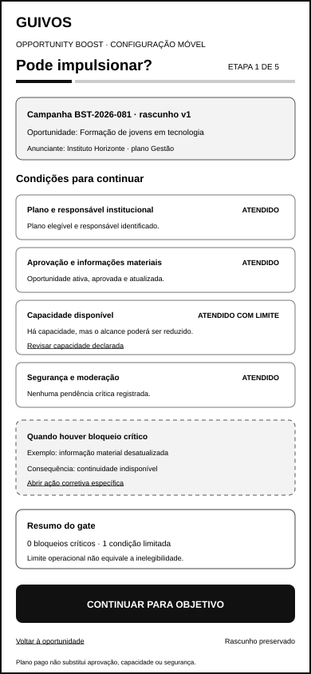
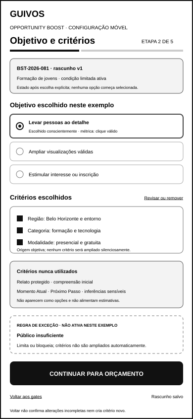
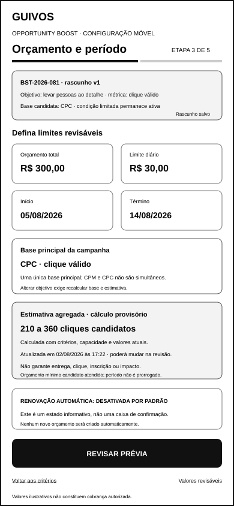
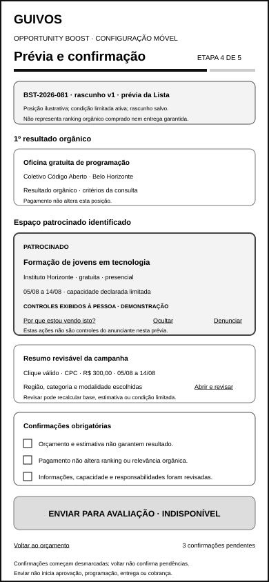
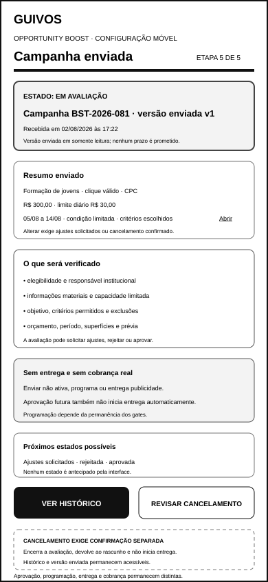

# Wireframes de Baixa Fidelidade da Configuração Móvel do Anunciante do Opportunity Boost

## 1. Finalidade

Este documento materializa a configuração móvel do anunciante do Opportunity Boost em cinco wireframes de baixa fidelidade.

A materialização preserva as responsabilidades já validadas no fluxo para computador, sem presumir responsividade automática, equivalência visual ou implementação compartilhada.

O conjunto móvel representa:

1. elegibilidade e gate de entrada;
2. objetivo e critérios de distribuição;
3. orçamento, duração e estimativa;
4. prévia e confirmação;
5. envio para avaliação.

## 2. Posição no percurso governado

```text
gestão da oportunidade
→ abrir configuração móvel
→ verificar elegibilidade e bloqueios
→ escolher objetivo único
→ escolher e revisar critérios permitidos
→ revisar critérios proibidos
→ definir orçamento, duração e limite diário
→ revisar base principal e estimativa
→ visualizar primeiro resultado orgânico e unidade patrocinada
→ confirmar responsabilidades
→ enviar para avaliação
```

Configurar, confirmar ou enviar não inicia entrega, cobrança, programação ou campanha ativa.

## 3. Canal e dimensão

- canal: aplicativo móvel;
- largura de referência: 390 pixels;
- altura de referência: 844 pixels;
- orientação: retrato;
- fidelidade: baixa;
- contexto: painel móvel de Organização ou Coletivo;
- estado: materialização ainda não validada funcionalmente.

## 4. Princípios estruturais móveis

A versão móvel utiliza:

- uma responsabilidade principal por tela;
- progresso explícito de cinco etapas;
- identidade resumida da campanha em todas as etapas;
- revelação progressiva de detalhes;
- resumos expansíveis para conteúdo secundário;
- ação principal condicionada ao estado da etapa;
- retorno sem perda silenciosa do rascunho;
- nenhuma seleção automática;
- nenhuma ampliação silenciosa de critérios;
- nenhuma promessa de alcance, conversão ou impacto.

A redução de espaço não autoriza remover bloqueios, critérios proibidos, consequências ou confirmações.

## 5. Artefatos visuais

### 5.1 Elegibilidade e gate de entrada



`docs/assets/wireframes/uxa-051-opportunity-boost-eligibility-mobile.svg`

Demonstra:

- oportunidade e anunciante vinculados;
- etapa 1 de 5;
- estados `Atendido`, `Atendido com limite` e `Bloqueado`;
- quantidade de bloqueios críticos;
- limite operacional sem confusão com inelegibilidade;
- ações corretivas específicas;
- continuidade somente quando nenhum bloqueio crítico permanecer;
- resumo persistente da campanha.

### 5.2 Objetivo e critérios de distribuição



`docs/assets/wireframes/uxa-051-opportunity-boost-objective-audience-mobile.svg`

Demonstra:

- etapa 2 de 5;
- objetivo único escolhido por ação explícita;
- aviso de que nenhuma opção começa selecionada;
- métrica principal derivada do objetivo;
- critérios permitidos escolhidos e revisáveis;
- origem objetiva dos critérios;
- critérios protegidos e contextos pessoais excluídos;
- público insuficiente sem expansão automática;
- ação principal condicionada à escolha válida.

### 5.3 Orçamento, duração e estimativa



`docs/assets/wireframes/uxa-051-opportunity-boost-budget-schedule-mobile.svg`

Demonstra:

- etapa 3 de 5;
- objetivo e métrica principal preservados;
- orçamento total e limite diário;
- início e término;
- uma única base principal coerente com o objetivo;
- proibição de cobrança simultânea por CPM e CPC;
- ausência de renovação automática;
- estimativa agregada sem garantia;
- orçamento mínimo candidato;
- ação para revisar valores antes de avançar.

### 5.4 Prévia e confirmação



`docs/assets/wireframes/uxa-051-opportunity-boost-preview-confirmation-mobile.svg`

Demonstra:

- etapa 4 de 5;
- primeiro resultado orgânico anterior ao espaço patrocinado;
- natureza patrocinada anterior ao conteúdo;
- anunciante e oportunidade visíveis;
- ação `Por que estou vendo isto?`;
- controles de ocultação e denúncia;
- resumo expansível de objetivo, critérios, orçamento e período;
- confirmações afirmativas inicialmente desmarcadas;
- envio indisponível enquanto as confirmações não forem concluídas.

### 5.5 Envio para avaliação



`docs/assets/wireframes/uxa-051-opportunity-boost-submission-mobile.svg`

Demonstra:

- etapa 5 de 5;
- estado `Em avaliação`;
- identificador da campanha e versão enviada;
- itens que serão verificados;
- ausência de entrega antes da aprovação e programação válida;
- ausência de cobrança real neste artefato;
- acesso ao resumo e histórico;
- cancelamento com consequência explícita;
- próximos estados possíveis sem promessa de prazo ou aprovação.

## 6. Continuidade entre as etapas

O conjunto preserva a mesma campanha em todas as telas por meio de:

- identificador da campanha;
- oportunidade vinculada;
- anunciante responsável;
- objetivo principal após a escolha;
- versão candidata do rascunho;
- orçamento e período após a definição;
- estado atual da configuração.

Voltar uma etapa permite revisar o rascunho. Nenhuma revisão altera silenciosamente critérios, base, orçamento ou período.

## 7. Semântica dos gates

```text
Atendido
→ permite continuidade

Atendido com limite
→ permite continuidade com alcance ou entrega limitada

Bloqueado
→ impede continuidade até correção
```

A interface móvel não converte condição limitada em bloqueio e não permite que contratação de plano substitua aprovação, segurança, atualização, capacidade ou responsabilidade institucional.

## 8. Seleções e confirmações

- objetivo utiliza escolha única;
- critérios permitidos utilizam escolhas revisáveis;
- critérios proibidos não aparecem como opções selecionáveis;
- nenhuma opção começa selecionada;
- resumo permanece acessível antes da confirmação;
- confirmações finais exigem ações afirmativas independentes;
- abandonar ou voltar não confirma escolhas pendentes;
- o envio somente ocorre após revisão completa.

## 9. Proteções preservadas

- pagamento não altera relevância orgânica;
- primeiro resultado orgânico permanece orgânico;
- contexto protegido não alimenta publicidade;
- critério novo não é adicionado silenciosamente;
- público insuficiente limita ou bloqueia, sem expansão automática;
- CPM e CPC não são cobrados simultaneamente;
- orçamento não garante entrega ou resultado;
- renovação automática permanece desativada por padrão;
- prévia não representa posição orgânica comprada;
- envio não inicia entrega ou cobrança;
- anunciante não recebe lista de pessoas;
- nenhum texto cria urgência, culpa ou escassez artificial;
- configuração móvel não autoriza gestão móvel, protótipo ou desenvolvimento.

## 10. Perguntas para validação funcional posterior

A validação especializada deverá verificar:

- a pessoa anunciante compreende a etapa atual e o que permanece pendente?
- a identidade da campanha permanece reconhecível nas cinco telas?
- estados atendido, limitado e bloqueado são distinguíveis sem depender de cor?
- ações corretivas permanecem acessíveis em tela pequena?
- objetivo único começa sem seleção?
- critérios escolhidos e proibidos não parecem equivalentes?
- conteúdo protegido permanece claramente excluído?
- orçamento, limite diário, período e base principal são compreensíveis?
- estimativa permanece distinguível de garantia?
- o primeiro resultado orgânico continua anterior ao anúncio?
- confirmações permanecem inicialmente desmarcadas?
- envio continua separado de aprovação, programação, entrega e cobrança?
- cancelar envio apresenta consequência proporcional e preserva histórico?
- voltar entre etapas preserva o rascunho sem confirmar escolhas incompletas?

## 11. Estado funcional

`materialized_not_functionally_validated — five low-fidelity mobile advertiser configuration wireframes created; mobile hierarchy, progressive disclosure, gate visibility, review and submission require specialized functional validation`.

## 12. Limites

Este incremento não cria:

- validação funcional dos cinco artefatos móveis;
- gestão móvel da campanha ativa;
- estados completos de erro técnico;
- experiência operacional de inventário insuficiente;
- experiência detalhada de preferências publicitárias;
- design visual final;
- responsividade implementada;
- acessibilidade técnica;
- protótipo navegável;
- teste com Organizações ou Coletivos;
- política final de preços, publicidade, atribuição ou reconciliação;
- algoritmo, checkout, cobrança, campanha real ou Engenharia de Produto.

## 13. Próximos atos governados

Após integração e nova autorização, poderão ocorrer separadamente:

1. validar funcionalmente e reformular os cinco wireframes móveis da UXA-051;
2. criar gestão móvel da campanha ativa;
3. criar estados de erro, inventário insuficiente e preferência publicitária;
4. definir protocolo de protótipo de baixa ou média fidelidade;
5. preparar plano de teste com Organizações e Coletivos.

Nenhum ato é iniciado automaticamente.
