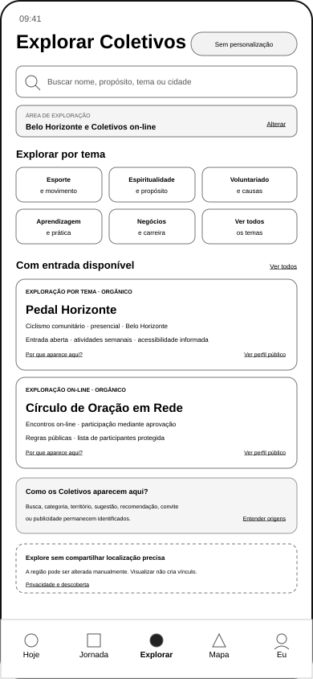
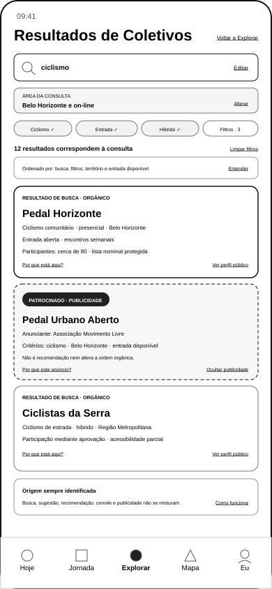
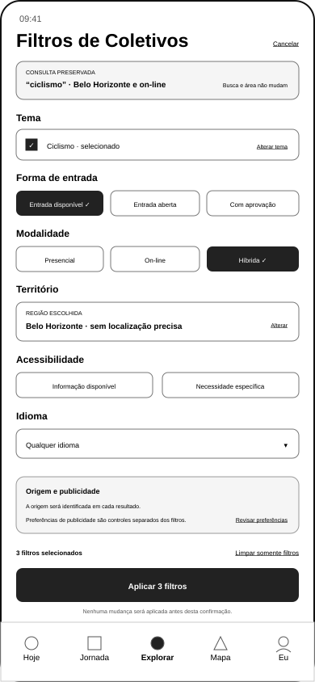
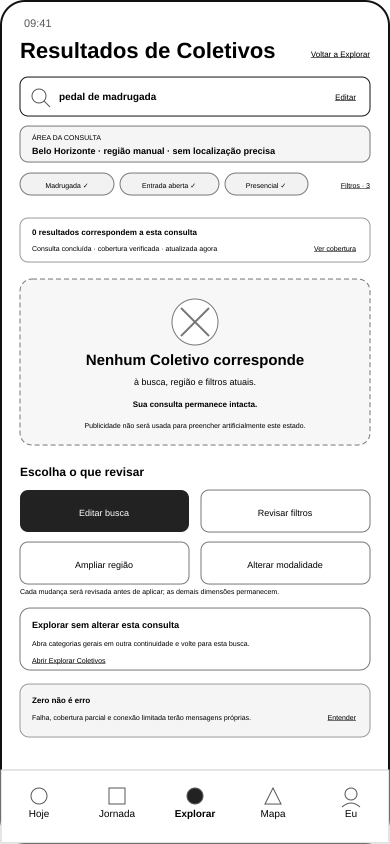
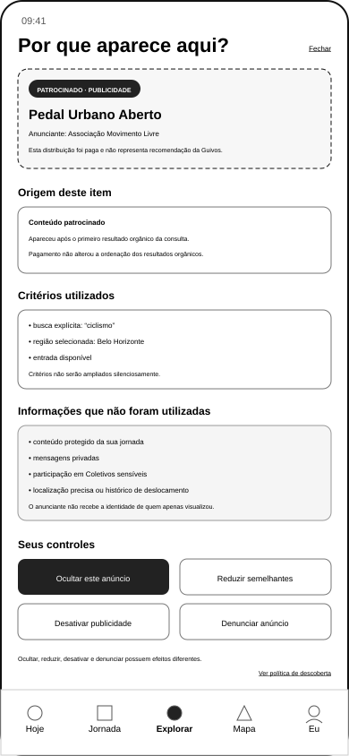

# Wireframes Móveis de Explorar Coletivos e Resultados de Busca

## 1. Finalidade

Este documento materializa a primeira família de wireframes do programa UXA-059 para a descoberta de Coletivos.

O incremento cria referências móveis de baixa fidelidade para:

1. Explorar Coletivos;
2. resultados de busca;
3. filtros da busca;
4. busca concluída sem resultados;
5. explicação da origem de descoberta e da publicidade.

Os artefatos verificam hierarquia, conteúdo, distinção de origem, preservação da consulta, privacidade territorial, publicidade identificada e continuidade para o futuro Perfil Público do Coletivo.

Eles não representam design visual final, dados reais, algoritmo, protótipo navegável, teste com pessoas ou implementação.

## 2. Posição no programa

A UXA-059 estabeleceu a sequência P0A, P0B, P1 e P2.

Este incremento inicia a P0A e antecipa somente os estados P0B indispensáveis para compreender a própria busca:

```text
Explorar Coletivos
→ buscar ou escolher tema
→ comparar resultados
→ revisar filtros
→ compreender a origem
→ abrir o futuro Perfil Público
```

A busca sem resultados é materializada agora porque altera a ação principal e exige recuperação própria. Ela não autoriza a criação das demais superfícies P0B.

## 3. Cenário canônico

A família utiliza um cenário único:

- tema principal: ciclismo;
- área: Belo Horizonte e Coletivos on-line;
- localização precisa: não utilizada;
- personalização: desativada no estado de exploração;
- Coletivo orgânico principal: `Pedal Horizonte`;
- segundo resultado orgânico: `Ciclistas da Serra`;
- conteúdo patrocinado ilustrativo: `Pedal Urbano Aberto`;
- anunciante identificado: `Associação Movimento Livre`;
- continuidade futura: Perfil Público do Coletivo.

Nomes, contagens e condições são dados fictícios para validação estrutural.

## 4. Artefatos visuais

### 4.1 Explorar Coletivos



Arquivo:

`docs/assets/wireframes/uxa-060-collective-explore-mobile.svg`

### 4.2 Resultados de busca



Arquivo:

`docs/assets/wireframes/uxa-060-collective-search-results-mobile.svg`

### 4.3 Filtros da busca



Arquivo:

`docs/assets/wireframes/uxa-060-collective-search-filters-mobile.svg`

### 4.4 Busca sem resultados



Arquivo:

`docs/assets/wireframes/uxa-060-collective-search-no-results-mobile.svg`

### 4.5 Origem da descoberta



Arquivo:

`docs/assets/wireframes/uxa-060-collective-discovery-origin-mobile.svg`

## 5. Dimensões e canal

Todos os artefatos possuem:

- canal: aplicativo móvel;
- largura: 390 pixels;
- altura: 844 pixels;
- fidelidade: baixa;
- navegação recorrente: `Hoje | Jornada | Explorar | Mapa | Eu`;
- item ativo: `Explorar`.

A referência para computador não é criada porque o programa prioriza a experiência pessoal móvel e ainda não foi demonstrada mudança material de hierarquia.

## 6. Hierarquia da exploração

A superfície `Explorar Coletivos` utiliza:

```text
título e estado de personalização
→ busca direta
→ área de exploração editável
→ categorias e temas
→ Coletivos com entrada disponível
→ origem identificada em cada cartão
→ explicação geral das origens
→ privacidade territorial
→ navegação recorrente
```

A tela não depende de conteúdo da Jornada para ser útil.

## 7. Busca direta

O campo de busca admite intenção por:

- nome;
- propósito;
- tema;
- categoria;
- cidade ou região;
- modalidade;
- atividade;
- Organização relacionada;
- disponibilidade de entrada.

A ação não cria participação, acompanhamento, contato, recomendação ou personalização.

## 8. Exploração por tema

O estado principal apresenta categorias ilustrativas:

- Esporte e movimento;
- Espiritualidade e propósito;
- Voluntariado e causas;
- Aprendizagem e prática;
- Negócios e carreira.

A seleção de categoria deverá permanecer identificada como `exploração por tema`, não como recomendação pessoal.

Coletivos sensíveis, privados, protegidos ou não listados não serão expostos pela exploração geral.

## 9. Área e localização

O exemplo utiliza:

> **Belo Horizonte e Coletivos on-line**

A pessoa poderá alterar a área manualmente. Localização precisa não é requisito.

A exploração deverá distinguir:

- cidade ou região informada;
- localização aproximada autorizada;
- localização precisa temporária, quando aplicável;
- modalidade on-line;
- ausência de território.

Visualizar resultados não autoriza histórico de deslocamento, rastreamento contínuo ou uso publicitário de localização precisa.

## 10. Resultados de busca

A hierarquia da Lista será:

```text
consulta preservada
→ área da consulta
→ filtros ativos
→ quantidade de resultados
→ ordenação explicável
→ primeiro resultado orgânico
→ publicidade identificada, quando aplicável
→ resultados orgânicos seguintes
→ explicação das origens
→ continuidade para o Perfil Público
```

O primeiro resultado permanece orgânico.

## 11. Campos dos cartões

Cada cartão poderá apresentar, quando disponível e permitido:

- origem;
- nome;
- propósito ou categoria;
- território e modalidade;
- modelo de entrada;
- funcionamento atual;
- acessibilidade;
- contagem governada de participantes;
- proteção da lista nominal;
- relação comercial;
- ação de explicação;
- ação para abrir o Perfil Público.

Informação ausente deverá ser declarada como não informada ou indisponível. Não será completada por inferência.

## 12. Ordenação orgânica

O estado ilustrado declara:

> **Ordenado por: busca, filtros, território e entrada disponível**

A ordenação poderá considerar os fatores autorizados pela UXA-056, incluindo correspondência, modalidade, atualidade, acessibilidade e confiabilidade.

Não poderão dominar a ordem:

- quantidade de participantes;
- volume de mensagens;
- popularidade;
- tempo na plataforma;
- plano contratado;
- publicidade;
- avaliação isolada.

Sem gate de personalização, a interface não utilizará `melhor para você`, `ideal para seu momento` ou formulação equivalente.

## 13. Contagens

O exemplo utiliza:

> **Participantes: cerca de 80 · lista nominal protegida**

A contagem:

- é aproximada no cenário;
- não mistura seguidores, participantes, presença em atividade ou moderadores;
- não cria ranking;
- não prova qualidade ou impacto;
- não torna a lista nominal pública.

## 14. Publicidade identificada

O resultado patrocinado apresenta antes do conteúdo:

> **PATROCINADO · PUBLICIDADE**

E declara:

- anunciante;
- critérios utilizados;
- distinção de recomendação;
- ausência de alteração da ordem orgânica;
- ação `Por que este anúncio?`;
- ação para ocultar publicidade.

Publicidade não será usada para preencher artificialmente o estado sem resultados.

O artefato não aprova uma política final de publicidade para Coletivos. Ele demonstra somente o comportamento funcional exigido caso a distribuição seja autorizada por contrato econômico e política própria.

## 15. Origem da descoberta

Cada item deverá distinguir:

- resultado de busca;
- exploração por tema;
- resultado territorial;
- sugestão da Guivos;
- recomendação pessoal;
- convite;
- link compartilhado;
- publicidade.

Uma origem não poderá ser apresentada como outra.

A pessoa poderá abrir `Por que aparece aqui?` para compreender a origem e os critérios materiais.

## 16. Explicação patrocinada

O wireframe de origem utiliza um item patrocinado para demonstrar o caso de maior risco de confusão.

A explicação apresenta:

- natureza comercial;
- anunciante;
- posição após o primeiro resultado orgânico;
- critérios objetivos;
- ausência de ampliação silenciosa;
- informações não utilizadas;
- ausência de entrega da identidade ao anunciante;
- controles separados.

O conteúdo protegido da Jornada, mensagens privadas, participação em grupos sensíveis, localização precisa e histórico de deslocamento permanecem excluídos.

## 17. Controles de publicidade

O estado demonstra:

- ocultar este anúncio;
- reduzir semelhantes;
- desativar publicidade;
- denunciar anúncio.

Essas ações possuem escopos diferentes e não serão combinadas em um controle genérico.

A preferência publicitária permanece separada dos filtros da busca.

## 18. Filtros

O painel preserva consulta e área antes de qualquer mudança.

As dimensões demonstradas são:

- tema;
- forma de entrada;
- modalidade;
- território;
- acessibilidade;
- idioma.

O exemplo possui três filtros selecionados.

Nenhuma mudança é aplicada antes da ação consciente:

> **Aplicar 3 filtros**

## 19. Limpeza e cancelamento

`Cancelar` fecha o painel sem alterar a consulta.

`Limpar seleções` remove somente as escolhas do painel. Não apaga automaticamente:

- texto pesquisado;
- área;
- histórico de navegação necessário ao retorno;
- preferência de publicidade;
- autorização de localização.

## 20. Estado sem resultados

O estado somente será apresentado quando:

- a consulta tiver sido concluída;
- busca, área e filtros forem conhecidos;
- a cobertura aplicável tiver sido verificada;
- não existir falha material ativa;
- o total real for zero naquele momento.

A mensagem é:

> **0 resultados correspondem a esta consulta**

> **Sua consulta permanece intacta.**

Ela não afirma que não existem Coletivos na cidade, no tema ou na plataforma inteira.

## 21. Recuperação do zero

A pessoa poderá escolher separadamente:

- editar busca;
- revisar filtros;
- ampliar região;
- alterar modalidade;
- explorar sem alterar a consulta.

Nenhuma ação remove filtros, amplia território, ativa localização, troca modalidade ou insere publicidade sem confirmação.

## 22. Zero, erro e cobertura parcial

Permanecem condições distintas:

| Condição | Tratamento |
|---|---|
| zero confirmado | preservar consulta e oferecer revisão consciente |
| falha de fonte | declarar impossibilidade de verificar todas as fontes |
| carregamento | manter estrutura e informar atualização |
| baixa conectividade | declarar possível desatualização |
| cobertura parcial | limitar a conclusão às fontes disponíveis |
| indisponibilidade temporária | oferecer nova tentativa sem declarar zero |

Este incremento materializa somente o zero confirmado. Os demais estados continuam pendentes.

## 23. Continuidade para Perfil Público

`Ver perfil público` será a ação de continuidade dos resultados.

O futuro Perfil Público deverá receber, quando tecnicamente possível e compatível com privacidade:

- origem da navegação;
- consulta;
- área;
- filtros;
- posição do resultado;
- relação comercial;
- estado de personalização.

Ao retornar, a pessoa deverá reencontrar o contexto da busca.

O Perfil Público não é criado neste incremento.

## 24. Acessibilidade

Os artefatos utilizam:

- títulos textuais;
- rótulos anteriores ao conteúdo;
- estados que não dependem apenas de cor;
- ações nomeadas;
- ordem funcional linear;
- textos alternativos por `title` e `desc` nos SVGs;
- declaração textual do total zero;
- distinção textual entre orgânico e patrocinado.

A materialização não conclui conformidade técnica ou teste com tecnologia assistiva.

## 25. Privacidade e proteção

A família preserva:

- exploração sem personalização;
- área manual;
- localização precisa opcional;
- lista nominal protegida;
- ausência de vínculo após visualização;
- ausência de contato automático;
- conteúdo protegido fora da publicidade;
- identidade do visualizador não entregue ao Coletivo ou anunciante;
- Coletivos protegidos fora da busca geral;
- origem e relação comercial explicáveis.

## 26. Matriz de cobertura

| Estado contratual | Artefato | Situação |
|---|---|---|
| busca e exploração com resultados | Explorar; Resultados | materializado |
| busca sem resultados | Sem resultados | materializado |
| filtros | Filtros | materializado |
| origem da descoberta | Explorar; Resultados; Origem | materializado |
| resultado patrocinado identificado | Resultados; Origem | materializado condicionalmente |
| localização precisa não exigida | Explorar; Filtros | materializado |
| consulta preservada | Resultados; Filtros; Sem resultados | materializado |
| continuidade para Perfil Público | Explorar; Resultados | ponto de saída materializado; destino pendente |
| falha de busca com orgânico preservado | — | pendente |
| localização desativada como estado especializado | — | pendente quando alterar a hierarquia |

## 27. Contagem de artefatos

Este incremento cria:

- 5 SVGs móveis;
- 1 documento de materialização;
- 0 validações funcionais especializadas;
- 0 protótipos;
- 0 componentes técnicos.

A cobertura visual passa a ser registrada separadamente:

- Opportunity Boost: 46 wireframes;
- Coletivos — descoberta e busca: 5 wireframes pendentes de validação;
- demais famílias de Coletivos: não iniciadas.

## 28. Critérios para validação posterior

A futura validação deverá verificar se:

1. Explorar é útil sem personalização;
2. busca, categoria, território e origem permanecem distintos;
3. o primeiro resultado é orgânico;
4. publicidade é identificada antes do conteúdo;
5. publicidade não altera a ordem orgânica;
6. contagem não funciona como ranking;
7. filtros preservam consulta e área;
8. preferência publicitária não se confunde com filtro;
9. zero confirmado não se confunde com erro;
10. a recuperação não altera a consulta silenciosamente;
11. Coletivos protegidos permanecem fora da busca geral;
12. localização precisa não é exigida;
13. visualizar não cria vínculo;
14. origem pode ser compreendida e contestada;
15. continuidade para Perfil Público preserva contexto;
16. os cinco SVGs permanecem suficientes, sem divisão prematura.

## 29. Estado de validação

Os cinco wireframes estão **materializados e aguardando validação funcional especializada**.

A integração deste documento não os declara:

- funcionalmente válidos;
- testados com pessoas;
- prontos para protótipo;
- aprovados para design;
- especificados para desenvolvimento.

## 30. Limites

Este incremento não:

- cria Perfil Público;
- cria participação ou acompanhamento;
- cria `Meus Coletivos`;
- cria Central de Atualizações;
- cria gestão do responsável;
- define algoritmo de busca;
- define política final de categorias;
- autoriza publicidade comercial real;
- define inventário, orçamento ou frequência;
- cria localização ou mapas;
- define tecnologia;
- cria responsividade para computador ou tablet;
- executa teste;
- inicia Engenharia de Produto;
- altera os 46 wireframes do Opportunity Boost.

## 31. Próximo ato recomendado

Após integração e nova autorização, o próximo pacote recomendado será:

> **UXA-061 — Validação Funcional dos Wireframes Móveis de Explorar Coletivos e Resultados de Busca**

Somente após essa validação deverá ser decidido entre:

1. reformular esta família;
2. avançar para o Perfil Público do Coletivo;
3. materializar estados críticos adicionais de busca.

Nenhum ato posterior é iniciado automaticamente.
