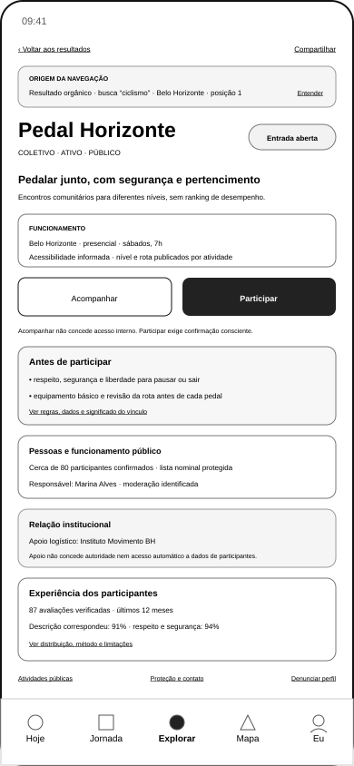
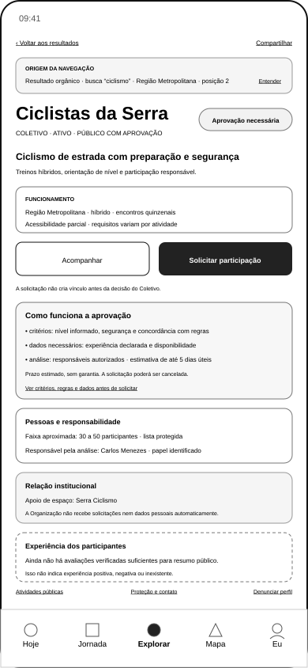
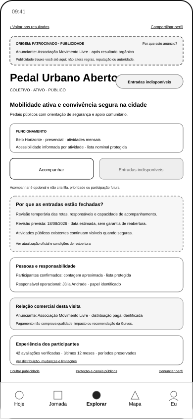
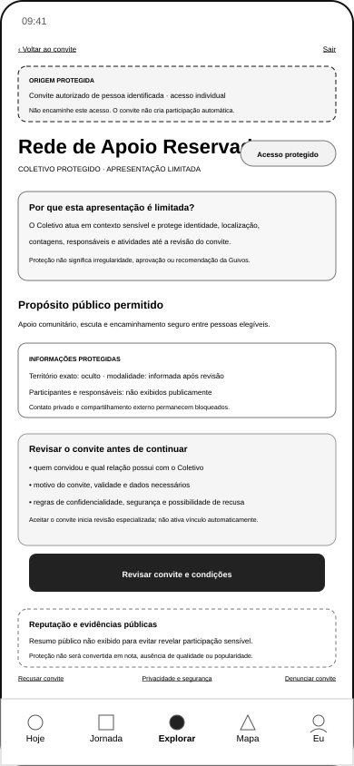

# Wireframes Móveis do Perfil Público do Coletivo

## 1. Finalidade

Este documento governa a terceira referência P0A do programa UXA-059: o Perfil Público móvel do Coletivo.

A família permite que uma pessoa compreenda, antes de qualquer vínculo:

- identidade, propósito e situação do Coletivo;
- origem da navegação;
- território, modalidade e acessibilidade permitidos;
- modelo de entrada;
- regras e dados que antecedem participação;
- contagens governadas;
- responsáveis e relações institucionais;
- reputação contextual disponível ou suprimida;
- caminhos de compartilhamento, proteção, canais públicos e denúncia.

Os artefatos são wireframes móveis de baixa fidelidade. Não representam design final, protótipo, política jurídica, algoritmo ou implementação.

## 2. Estado da família

Após a UXA-063:

- quatro SVGs materializados;
- quatro SVGs reformulados;
- quatro SVGs funcionalmente validados;
- zero SVG pendente nesta família;
- nenhum novo SVG criado pela validação.

## 3. Artefatos

### 3.1 Entrada aberta



`docs/assets/wireframes/uxa-062-collective-public-profile-open-entry-mobile.svg`

### 3.2 Entrada mediante aprovação



`docs/assets/wireframes/uxa-062-collective-public-profile-approval-entry-mobile.svg`

### 3.3 Entradas temporariamente indisponíveis



`docs/assets/wireframes/uxa-062-collective-public-profile-closed-entry-mobile.svg`

### 3.4 Apresentação protegida



`docs/assets/wireframes/uxa-062-collective-public-profile-protected-mobile.svg`

## 4. Canal e dimensões

Todos os artefatos possuem:

- canal inicial: aplicativo móvel;
- largura: 390 pixels;
- altura: 844 pixels;
- fidelidade: baixa;
- navegação global: `Hoje | Jornada | Explorar | Mapa | Eu`.

Nos três perfis públicos, `Explorar` aparece como origem ativa. Na apresentação protegida, nenhum item aparece ativo porque a superfície foi aberta por convite e não pertence à descoberta pública.

A versão para computador não foi criada porque ainda não há mudança material de hierarquia.

## 5. Cenários canônicos

| Estado | Coletivo | Origem | Decisão principal |
|---|---|---|---|
| entrada aberta | Pedal Horizonte | resultado orgânico | acompanhar ou participar |
| aprovação | Ciclistas da Serra | resultado orgânico | acompanhar ou solicitar participação |
| entradas indisponíveis | Pedal Urbano Aberto | publicidade identificada | acompanhar ou compreender o fechamento |
| protegido | Rede de Apoio Reservada | convite autorizado | revisar convite e condições |

Nomes, datas, contagens e percentuais são fictícios e servem à validação estrutural.

## 6. Hierarquia validada

```text
retorno e compartilhamento permitido
→ origem da navegação
→ identidade, classificação e situação
→ propósito e descrição
→ funcionamento e acessibilidade
→ acompanhar, participar, solicitar ou aguardar
→ regras, dados e condições
→ participantes em contagem governada
→ responsáveis e relações institucionais
→ reputação contextual
→ atividades, proteção, canais públicos e denúncia
```

A apresentação protegida reduz blocos quando a exposição aumentar risco.

## 7. Origem e retorno

As origens demonstradas são:

- resultado orgânico de busca;
- publicidade identificada;
- convite autorizado.

O retorno deverá preservar, conforme necessidade e proteção:

- consulta;
- região;
- posição do resultado;
- natureza orgânica ou comercial;
- convite e acesso individual.

A visualização não entrega a identidade da pessoa ao Coletivo, à Organização apoiadora ou ao anunciante.

Nos estados orgânicos, `Ver origem` explica a descoberta. No patrocinado, `Por que este anúncio?` mantém a explicação comercial. No protegido, remetente, autoridade e motivo aparecem antes da continuidade.

## 8. Entrada aberta

O estado apresenta:

- condição `Entrada aberta`;
- ações independentes `Acompanhar` e `Participar`;
- regras essenciais antes da confirmação;
- ausência de acesso interno por acompanhamento;
- contagem governada e lista nominal protegida;
- responsável e relação institucional identificados;
- reputação com base suficiente.

`Participar` encaminhará futuramente à revisão de vínculo, dados, regras e confirmações vazias. O perfil não ativa participação.

## 9. Entrada mediante aprovação

O estado apresenta:

- condição `Aprovação necessária`;
- ação `Solicitar participação`;
- critérios legítimos;
- dados necessários;
- responsável autorizado;
- prazo estimado sem garantia;
- cancelamento futuro;
- reputação com amostra insuficiente.

Somente dados revisados serão enviados pela futura superfície de solicitação. O envio não cria vínculo nem acesso interno.

## 10. Entradas temporariamente indisponíveis

O estado apresenta:

- participação indisponível;
- motivo do fechamento;
- revisão estimada sem garantia;
- acompanhamento opcional sem fila ou prioridade;
- atividades públicas mantidas somente quando seguras;
- responsável operacional separado do anunciante;
- reputação preservada por período;
- publicidade identificada e explicável.

Fechamento não altera automaticamente reputação. Publicidade não compra qualidade, legitimidade, autoridade ou recomendação.

## 11. Apresentação protegida

O estado apresenta somente informação proporcional:

- identidade reduzida permitida;
- propósito público mínimo;
- motivo da limitação;
- remetente, autoridade e motivo do convite;
- informações ocultas por proteção;
- revisão de condições antes da continuidade;
- recusa e denúncia;
- reputação pública suprimida quando sua exibição revelar participação sensível.

Território, contagens, lista, responsáveis, atividades, compartilhamento externo e contato privado permanecem protegidos.

Aceitar o convite inicia revisão especializada; não cria participação automática. A superfície não aparece como item ativo de `Explorar`.

## 12. Acompanhar, participar e compartilhar

`Acompanhar` poderá permitir atualizações públicas escolhidas. Não concede:

- participação;
- acesso interno;
- presença em lista;
- papel ou autoridade;
- contato privado;
- compartilhamento automático de dados.

`Participar` e `Solicitar participação` iniciam fluxos futuros e conscientes. Nenhuma confirmação começa selecionada.

`Compartilhar perfil` distribui referência permitida e não equivale a recomendação. O perfil protegido não permite compartilhamento externo.

## 13. Contagens, pessoas e autoridade

A família separa:

- participantes confirmados;
- acompanhamento público, quando permitido;
- responsáveis e moderadores;
- participantes de atividade específica.

Solicitações, suspensões, convites, seguidores e presença em atividade não entram em contagem genérica.

A lista nominal permanece protegida. Em contexto sensível, até a contagem é ocultada.

Apoio, anúncio, financiamento ou parceria não concedem automaticamente:

- autoridade sobre participantes;
- acesso a solicitações;
- acesso a contatos;
- acesso a avaliações individuais;
- acesso à Jornada;
- direito de comunicação comercial.

No estado patrocinado, responsável operacional e anunciante aparecem em blocos distintos.

## 14. Reputação contextual

Quando houver base suficiente, o perfil apresenta:

- quantidade de avaliações verificadas;
- período;
- dimensão;
- percentual;
- denominador por dimensão;
- caminho para distribuição, método e limitações.

Quando a base for insuficiente, declara:

> **Ainda não há avaliações verificadas suficientes para apresentar um resumo público.**

A ausência de resumo não representa nota zero, aprovação, reprovação ou inexistência de experiências.

Em contexto protegido, o resumo pode ser suprimido para não revelar participação sensível.

A primeira versão não utiliza estrelas ou nota universal como representação principal.

## 15. Proteção, canais públicos e denúncia

A família reserva caminhos para:

- política de proteção;
- canais públicos autorizados;
- denúncia do perfil;
- denúncia do convite;
- explicação e ocultação de publicidade;
- privacidade e segurança;
- revisão de regras.

Canal público não autoriza mensagem privada nem exposição de telefone ou e-mail pessoais. Denúncia não é avaliação negativa.

## 16. Acessibilidade

Os SVGs utilizam:

- títulos e descrições acessíveis;
- rótulos textuais;
- estados que não dependem apenas de cor;
- ações nomeadas;
- ordem linear;
- natureza comercial anterior ao conteúdo;
- estado indisponível explicitado por texto;
- amostra insuficiente explicada;
- proteção descrita por linguagem, não apenas ícones.

A materialização não conclui teste com tecnologia assistiva ou conformidade técnica final.

## 17. Reformulações da UXA-063

Foram corrigidos:

1. denominadores por dimensão na reputação suficiente;
2. `Compartilhar perfil` em vez de ação genérica;
3. `Proteção e canais públicos` em vez de contato ambíguo;
4. envio apenas de dados revisados no fluxo de aprovação;
5. separação entre anunciante e responsável operacional;
6. acesso `Por que este anúncio?` no perfil patrocinado;
7. quantidade e período na reputação do estado fechado;
8. remetente, autoridade e motivo no convite protegido;
9. ausência de item `Explorar` ativo no perfil protegido;
10. `Fechar apresentação` como saída explícita.

A evidência completa está em UXA-063.

## 18. Matriz de cobertura

| Estado contratual | Artefato | Situação |
|---|---|---|
| perfil com entrada aberta | entrada aberta | validado |
| perfil com aprovação | aprovação | validado |
| entradas temporariamente fechadas | indisponível | validado |
| Coletivo protegido | protegido | validado |
| origem orgânica preservada | aberta; aprovação | validado |
| origem patrocinada explicada | indisponível | validado |
| convite com proveniência | protegido | validado |
| acompanhar separado de participar | pública | validado |
| contagem governada | pública | validado |
| contagem ocultada por risco | protegido | validado |
| relação institucional limitada | pública | validado |
| reputação suficiente com denominadores | aberta | validado |
| reputação insuficiente | aprovação | validado |
| reputação suprimida | protegido | validado |
| proteção e denúncia | quatro artefatos | validado |
| fluxo completo de participação | não criado | próximo pacote |
| Coletivo encerrado | não criado | P0B posterior |
| reputação detalhada | não criada | P2 |

## 19. Limites

Não são iniciados:

- revisão e confirmação de entrada;
- solicitação mediante aprovação;
- revisão especializada do convite;
- Solicitação Pendente;
- `Meus Coletivos`;
- Central de Atualizações;
- Início do Participante;
- gestão do responsável;
- avaliação completa;
- recomendação completa;
- mensagem privada;
- algoritmo;
- política jurídica;
- protótipo;
- teste com pessoas;
- identidade visual;
- Engenharia de Produto.

## 20. Próxima transição

A família está apta a fornecer contexto à:

**UXA-064 — Wireframes Móveis da Revisão e Solicitação de Participação em Coletivos.**

A UXA-064 dependerá de autorização separada.
