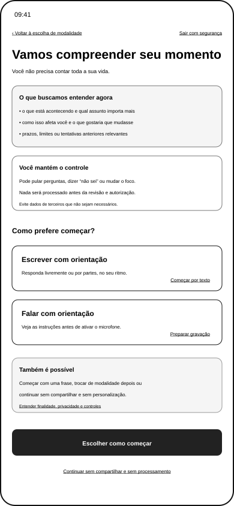
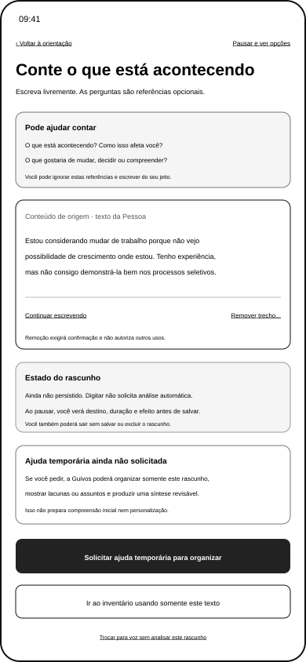
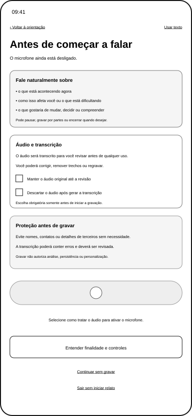
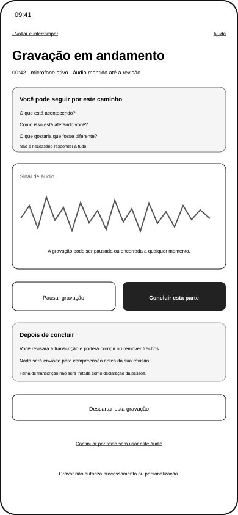
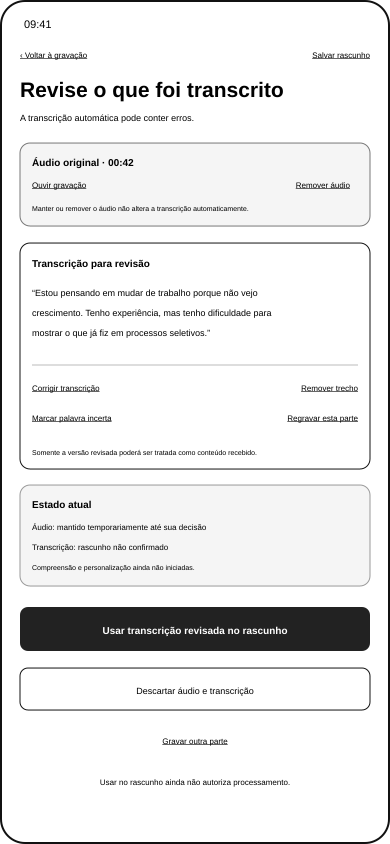
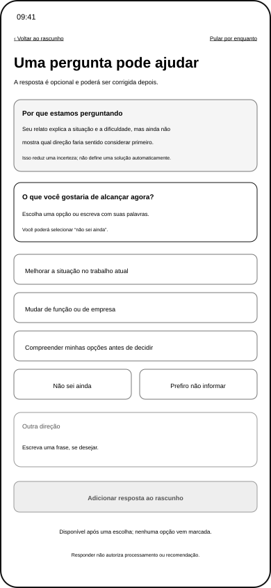
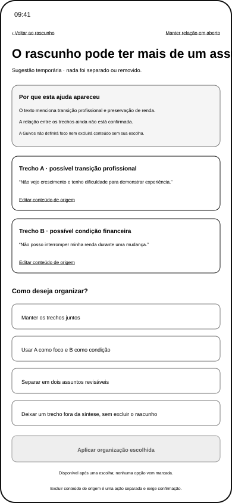
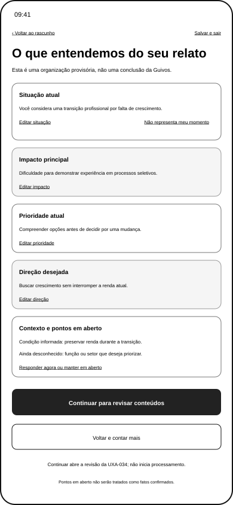

# Wireframes Móveis da Expressão Guiada do Momento Atual por Texto e Voz

## 1. Finalidade

Esta família ajuda a Pessoa a expressar seu **Momento Atual** de forma proporcional, corrigível e compreensível antes da preparação da compreensão inicial da Guivos.

A UXA-068 complementa a escolha genérica de modalidade da UXA-034 sem transformar a jornada em questionário obrigatório, diagnóstico ou coleta excessiva.

A UXA-069 validou e reformulou os oito estados da família.

> **Resultado vigente: oito estados materializados, oito reformulados e oito funcionalmente validados.**

## 2. Posição na experiência

```text
Home pública
→ início protegido
→ escolha de modalidade na UXA-034
→ orientação comum da UXA-068
→ conteúdo de origem por texto ou voz
→ revisão da transcrição, quando aplicável
→ ajuda temporária, somente quando solicitada
→ pergunta ou separação, somente quando materialmente útil
→ síntese temporária e revisável
→ decisão sobre usar somente origens ou incluir síntese derivada
→ inventário e autorização específica da UXA-034
→ processamento visível da UXA-036
→ compreensão inicial revisável
```

A Pessoa poderá seguir do conteúdo de origem diretamente ao inventário sem solicitar pergunta, separação ou síntese.

## 3. Camadas funcionais

A experiência distingue quatro camadas.

| Camada | Exemplo | Regra |
|---|---|---|
| conteúdo de origem | texto digitado ou versão revisada da transcrição | permanece distinguível e corrigível |
| ajuda temporária solicitada | organização, pergunta, separação ou síntese | não prepara compreensão inicial e não personaliza |
| preparação da compreensão inicial | uso de itens revisados para formar hipótese temporária | exige inventário e autorização específica |
| persistência e personalização | manutenção da compreensão e adaptação futura | bloqueadas até o gate da UXA-036 e UXA-037 |

Digitar não solicita análise automática. Gravar autoriza somente a gravação e a transcrição apresentadas. Nenhuma dessas ações autoriza automaticamente as camadas posteriores.

## 4. Dimensões de referência

A orientação poderá apoiar cinco dimensões, sem obrigatoriedade por padrão.

| Dimensão | Pergunta de referência | Proteção |
|---|---|---|
| situação | o que está acontecendo agora? | não exigir biografia completa |
| impacto | o que isso dificulta, causa ou modifica? | não pressupor sofrimento |
| prioridade | o que importa compreender ou tratar agora? | aceitar múltiplas prioridades |
| direção | o que gostaria que mudasse, fosse decidido ou construído? | aceitar `não sei ainda` |
| contexto | quais prazos, limites, recursos ou tentativas são relevantes? | solicitar somente quando reduzir incerteza material |

Uma dimensão poderá permanecer em aberto sem bloquear exploração geral.

## 5. Inventário visual validado

| Estado | Arquivo | Resultado validado |
|---|---|---|
| orientação comum | `uxa-068-guided-current-moment-orientation-mobile.svg` | texto e voz equivalentes; relato separado da ajuda temporária |
| rascunho por texto | `uxa-068-guided-current-moment-text-draft-mobile.svg` | conteúdo de origem sem análise automática ou salvamento inventado |
| preparação para voz | `uxa-068-guided-current-moment-voice-preparation-mobile.svg` | escolha única sobre áudio e autorização limitada |
| gravação em andamento | `uxa-068-guided-current-moment-voice-recording-mobile.svg` | pausa, interrupção, transcrição e descarte com efeitos conhecidos |
| revisão da transcrição | `uxa-068-guided-current-moment-voice-transcription-review-mobile.svg` | áudio, transcrição automática e versão revisada separados |
| esclarecimento adaptativo | `uxa-068-guided-current-moment-adaptive-clarification-mobile.svg` | lacuna e razão visíveis; opções não são recomendações |
| separação de focos | `uxa-068-guided-current-moment-focus-separation-mobile.svg` | organização sugerida e aplicada somente após escolha explícita |
| síntese estruturada | `uxa-068-guided-current-moment-structured-summary-mobile.svg` | natureza, origem, estado e uso da síntese derivados explícitos |

## 6. Artefatos visuais

### 6.1 Orientação comum



### 6.2 Rascunho guiado por texto



### 6.3 Preparação para voz



### 6.4 Gravação em andamento



### 6.5 Revisão da transcrição



### 6.6 Pergunta adaptativa



### 6.7 Separação de focos



### 6.8 Síntese estruturada



Todos os arquivos permanecem em baixa fidelidade, com referência móvel de 390 × 844 pixels.

## 7. Orientação e escolha de modalidade

A orientação:

- explica o que poderá ajudar a contar;
- declara que a Pessoa poderá começar com pouco;
- mantém texto e voz com finalidade equivalente;
- remove ação genérica duplicada;
- explica que ajuda temporária depende de solicitação consciente;
- bloqueia preparação da compreensão inicial antes do inventário e da autorização;
- mantém saída sem compartilhar e sem iniciar compreensão.

## 8. Texto e rascunho

O estado de texto:

- mantém campo livre;
- não apresenta organização automática durante a digitação;
- declara `Rascunho ainda não persistido` enquanto destino e retenção não forem definidos;
- apresenta pausa como acesso a opções de rascunho, não como salvamento implícito;
- permite solicitar ajuda temporária ou seguir usando somente o texto de origem;
- mantém remoção destrutiva sujeita a confirmação futura;
- permite troca para voz sem analisar silenciosamente o rascunho.

## 9. Voz, áudio e transcrição

Antes da gravação, a Pessoa escolhe uma alternativa mutuamente exclusiva:

- manter o áudio somente até decidir após revisar;
- apagar o áudio quando a transcrição estiver disponível.

Nenhuma opção vem selecionada.

A ação explícita autoriza somente:

- ativar o microfone;
- registrar a parte falada;
- gerar transcrição para revisão.

Durante a gravação:

- o estado do microfone permanece textual;
- pausa não conclui nem transcreve;
- conclusão encerra e gera transcrição;
- interrupção abre decisão sobre a parte atual;
- descarte exige confirmação futura;
- mudança para texto não causa perda silenciosa.

Na revisão:

- áudio original, transcrição automática e versão revisada permanecem separados;
- correções não são perdidas ao voltar sem aviso;
- remover áudio não apaga automaticamente a transcrição;
- usar a versão revisada apenas a adiciona ao rascunho;
- falhas automáticas não se tornam fatos sobre a Pessoa.

## 10. Ajuda temporária

A ajuda temporária poderá:

- localizar uma dimensão ainda não informada;
- sugerir uma pergunta opcional;
- indicar que trechos podem representar assuntos diferentes;
- organizar uma síntese revisável.

Ela somente ocorre após ação consciente da Pessoa e utiliza o rascunho atual para a finalidade apresentada.

Ela não poderá:

- iniciar compreensão inicial;
- produzir recomendação;
- persistir compreensão;
- personalizar superfícies;
- separar assuntos automaticamente;
- excluir conteúdo de origem;
- transformar desconhecido em fato.

## 11. Pergunta adaptativa

A pergunta demonstra:

- lacuna identificada;
- razão e utilidade;
- alternativas tratadas como exemplos, não recomendações;
- ausência de seleção padrão;
- texto livre;
- `não sei ainda`;
- `prefiro não informar`;
- possibilidade de manter a dimensão em aberto;
- remoção da ajuda temporária;
- ausência de autorização para compreensão ou recomendação.

## 12. Separação de assuntos

A experiência utiliza linguagem de possibilidade, não conclusão.

A Pessoa poderá:

- manter a relação em aberto;
- manter trechos juntos;
- definir foco e condição;
- separar em assuntos revisáveis;
- retirar trecho somente da síntese;
- editar o conteúdo de origem.

A organização somente é aplicada após escolha explícita. Excluir o conteúdo de origem permanece ação separada.

## 13. Síntese estruturada

A síntese é apresentada como **organização derivada**, não como compreensão da Guivos.

Cada bloco identifica:

- natureza;
- origem;
- estado;
- ações de edição, manutenção em aberto ou remoção da síntese.

A Pessoa poderá:

1. seguir ao inventário usando somente os conteúdos de origem;
2. revisar e adicionar a síntese como item derivado;
3. voltar ao rascunho;
4. descartar somente a síntese.

A síntese não substitui fontes e não será utilizada automaticamente.

## 14. Base insuficiente

Quando houver pouco conteúdo, a experiência poderá:

- manter desconhecidos explícitos;
- oferecer pergunta opcional;
- permitir seguir somente com as fontes;
- permitir continuar sem personalização;
- permitir pausar ou encerrar.

Ela não completará lacunas por suposição nem produzirá Próximo Passo pessoal nesta família.

## 15. Cobertura visual validada

| Família da jornada pessoal | Materializados | Validados | Pendentes |
|---|---:|---:|---:|
| Início protegido geral — UXA-034 | 4 | 4 | 0 |
| Compreensão inicial — UXA-036 | 5 | 5 | 0 |
| Expressão Guiada — UXA-068 e UXA-069 | 8 | 8 | 0 |
| **Subtotal relacionado** | **17** | **17** | **0** |

Essa contagem permanece separada de Coletivos e Opportunity Boost.

## 16. Proteções confirmadas

- compartilhar pouco é legítimo;
- nenhuma pergunta é obrigatória por padrão;
- nenhuma modalidade é favorecida;
- o microfone não inicia automaticamente;
- nenhuma escolha vem marcada;
- tempo de fala não mede qualidade;
- transcrição não confirma conteúdo;
- ajuda temporária não cria compreensão;
- síntese não substitui fonte;
- desconhecido não é fato;
- remover da síntese não exclui o rascunho;
- conteúdo de terceiros não é solicitado;
- continuidade sem personalização permanece disponível;
- digitar, gravar ou revisar não autoriza processamento material.

## 17. Limites

A família validada não:

- define modelo de IA ou algoritmo adaptativo;
- define armazenamento local ou remoto;
- implementa gravação, transcrição, exclusão ou persistência;
- define política jurídica final;
- cria protocolo clínico ou emergencial;
- materializa envio guiado de arquivos;
- cria protótipo ou teste;
- conclui acessibilidade técnica;
- inicia Engenharia de Produto;
- cria ambiente de simulação;
- inicia `Meus Coletivos`.

## 18. Próxima transição

A expressão guiada está materializada e funcionalmente validada.

A escolha da próxima frente dependerá de autorização separada e não iniciará automaticamente protótipo, simulador, Engenharia ou continuidade de Coletivos.
