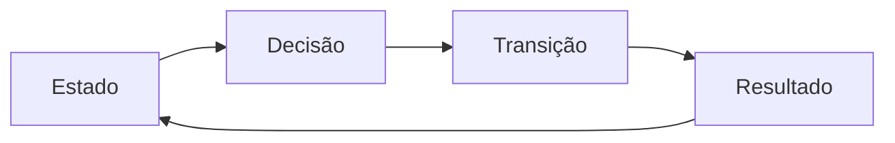

# Quatro Naturezas Fundamentais

## Definição

O Modelo Fundamental da Guivos organiza seus elementos em quatro naturezas semânticas: Estado, Decisão, Transição e Resultado.

Essas naturezas não são entidades da plataforma. Elas descrevem a função exercida por cada conceito no processo de evolução.

## Diagrama oficial

## 1. Estado

Estado representa a condição presente do participante.

Responde à pergunta:

> Onde o participante está agora?

Pertencem a esta natureza:

- Participante;
- Momento Atual;
- Objetivos.

O Estado descreve a realidade a partir da qual uma decisão pode ser tomada.

## 2. Decisão

Decisão representa a escolha ou hipótese de evolução mais relevante para o momento atual.

Responde à pergunta:

> Qual mudança faz mais sentido agora?

No núcleo do Modelo Fundamental, essa função é exercida pelo Próximo Passo.

## 3. Transição

Transição representa os meios e a vivência por meio dos quais a decisão é executada.

Responde à pergunta:

> Como essa mudança será realizada e vivida?

Pertencem a esta natureza:

- Oportunidades Compatíveis;
- Experiência.

As oportunidades viabilizam a execução. A experiência é a vivência efetiva do participante.

## 4. Resultado

Resultado representa aquilo que permanece ou muda após a experiência.

Responde à pergunta:

> O que mudou?

Pertencem a esta natureza:

- Evidências de Evolução;
- Novo Momento Atual.

O Resultado encerra um ciclo e estabelece o Estado inicial do ciclo seguinte.

## Aplicação ao Modelo Fundamental

| Natureza | Elementos |
|---|---|
| Estado | Participante, Momento Atual, Objetivos |
| Decisão | Próximo Passo |
| Transição | Oportunidades Compatíveis, Experiência |
| Resultado | Evidências de Evolução, Novo Momento Atual |

## Regras arquiteturais

### RA-FM-001 — Classificação funcional

Todo conceito incorporado ao núcleo da jornada deve possuir uma função semanticamente identificável.

### RA-FM-002 — Separação de responsabilidades

Estado, Decisão, Transição e Resultado possuem responsabilidades distintas e não devem ser tratados como sinônimos.

### RA-FM-003 — Próximo Passo e Oportunidade

O Próximo Passo pertence à natureza Decisão. A Oportunidade pertence à natureza Transição.

Uma oportunidade não substitui o Próximo Passo; ela constitui um mecanismo para realizá-lo.

### RA-FM-004 — Experiência e evolução

A oportunidade contém potencial. A experiência permite que esse potencial seja vivido e gere resultados.

### RA-FM-005 — Ciclo contínuo

O Novo Momento Atual torna-se o Estado do ciclo seguinte, preservando a continuidade da jornada.

## Consequência

As quatro naturezas formam a gramática conceitual do Modelo Fundamental e devem orientar a construção dos modelos derivados da Guivos.
