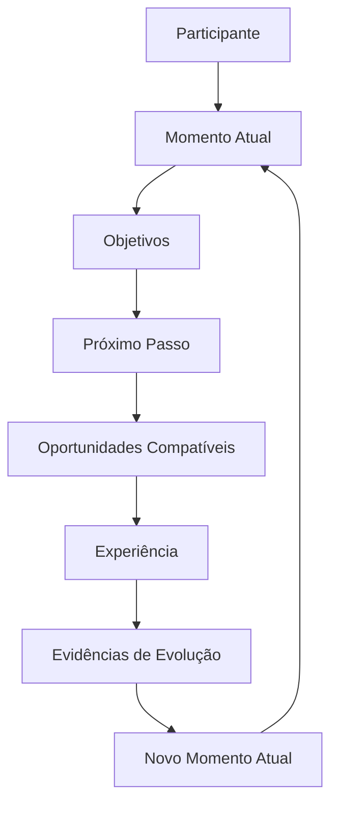

# Modelo Fundamental da Jornada

## Definição

O Modelo Fundamental da Jornada descreve como ocorre a evolução de um participante dentro do ecossistema Guivos.

Ele não representa uma sequência de telas ou funcionalidades. Representa o comportamento permanente do ecossistema.

## Fluxo canônico

## Elementos do modelo

### Participante

É a entidade que percorre a jornada. Pode ser uma pessoa, organização ou coletivo.

### Momento Atual

Representa a condição presente do participante, incluindo contexto, histórico, necessidades, capacidades, relações e demais elementos relevantes.

### Objetivos

Representam aquilo que o participante deseja alcançar e orientam a direção da evolução.

### Próximo Passo

É a decisão ou hipótese de evolução mais relevante para o momento atual.

O Próximo Passo não é uma oportunidade. Ele define a mudança a ser buscada; as oportunidades são mecanismos concretos para executá-la.

### Oportunidades Compatíveis

São mecanismos concretos capazes de apoiar a execução do Próximo Passo.

### Experiência

É a vivência efetiva de uma oportunidade pelo participante.

### Evidências de Evolução

São resultados, sinais ou mudanças produzidos pela experiência.

### Novo Momento Atual

É o estado resultante após a incorporação das evidências de evolução. Ele reinicia o ciclo.

## Invariantes

1. Todo participante possui um Momento Atual.
2. O Momento Atual e os Objetivos orientam a identificação do Próximo Passo.
3. O Próximo Passo antecede a seleção de oportunidades.
4. Uma ou mais oportunidades podem apoiar o mesmo Próximo Passo.
5. A oportunidade possui potencial; a experiência realiza esse potencial.
6. A experiência pode produzir evidências de evolução.
7. As evidências alteram o Momento Atual.
8. A jornada é contínua e cíclica.

## Papel da inteligência artificial

A inteligência artificial pode apoiar a compreensão do contexto, a identificação do Próximo Passo e o encontro de oportunidades compatíveis.

Ela não determina o destino do participante e não substitui sua decisão.

## Consequências arquiteturais

Este modelo orienta:

- arquitetura da plataforma;
- mecanismos de recomendação;
- inteligência artificial;
- comunidade;
- marketplace;
- conteúdos;
- indicadores de evolução;
- modelos de experiência e relacionamento.
