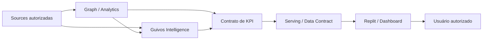

# Dashboards, KPIs e Analytics — Documento Mestre de Especificação para Construção

## 1. Finalidade

Este documento é a **porta de entrada governada para a especificação de dashboards, KPIs e superfícies analíticas da Guivos**.

Ele existe para organizar o que deverá ser entregue futuramente a uma superfície de construção — inicialmente indicada como **Replit** — sem obrigar Engenharia, Design ou fornecedores a reconstruir definições a partir de conversas, tabelas isoladas ou inferências.

Regra de consumo:

> **Para construir um dashboard ou KPI da Guivos, comece por este documento e pelos contratos específicos de métricas que vierem a ser aprovados. A ferramenta de construção materializa a especificação; ela não define a verdade do indicador.**

Este master:

- registra, como **input não canônico**, o inventário candidato de dashboards indicado pela tabela fornecida para esta frente;
- classifica esses dashboards, campos e recortes como **candidatos/provisórios e não aprovados** até adjudicação pelas autoridades de domínio aplicáveis;
- define a separação entre fonte de verdade, cálculo, analytics, serving e visualização;
- define um envelope mínimo transversal de contrato de KPI antes de sua implementação, sem substituir contratos canônicos de domínio aplicáveis;
- preserva as autoridades de produto, Intelligence, Graph, Platform, Privacidade, Economia e Governança;
- prepara um pacote de handoff utilizável no Replit ou em outra ferramenta futura;
- **não autoriza**, por si só, uso de dados reais, integração física, backend, persistência, produção ou publicação.

A tabela recebida nesta frente é **proveniência de trabalho**, não autoridade canônica do GKR. Em qualquer conflito, prevalece a autoridade corrente do domínio correspondente.

---

## 2. Estado e limite desta especificação

```text
DOCUMENTO MESTRE
→ ACTIVE
→ PRE-IMPLEMENTATION SPECIFICATION
→ NÃO NORMATIVO SOBRE FÓRMULAS AINDA NÃO ADJUDICADAS

INVENTÁRIO DE DASHBOARDS
→ CANDIDATE / PROVISIONAL INPUT
→ UNAPPROVED UNTIL DOMAIN ADJUDICATION
→ NÃO DEFINE SUPERFÍCIE, ESCOPO DE PRODUTO OU CAMPO POR INFERÊNCIA
→ NÃO SOBRESCREVE AUTORIDADES DE ESTADO CORRENTES

CONTRATOS MATEMÁTICOS DE KPIs
→ AINDA DEVEM SER DEFINIDOS INDIVIDUALMENTE
→ DEVEM COMPOR COM CONTRATOS CANÔNICOS DE DOMÍNIO QUANDO APLICÁVEIS

REPLIT
→ TARGET INICIAL DE MATERIALIZAÇÃO / CONSTRUÇÃO
→ NÃO SOURCE OF TRUTH

REAL DATA / REAL INTEGRATIONS / PRODUCTION
→ NÃO AUTORIZADOS POR ESTE DOCUMENTO
```

A presença de uma ferramenta ou tecnologia neste documento indica **papel pretendido, candidato ou de referência**, conforme o caso. Não constitui prova de provisionamento, integração, operação ou produção.

Regra de precedência adicional:

```text
AUTORIDADE CORRENTE DO DOMÍNIO
→ PREVALECE

INVENTÁRIO CANDIDATO DESTE MASTER
→ NÃO PODE PROMOVER COMO DEFINIDO O QUE A AUTORIDADE CORRENTE MANTÉM NÃO DEFINIDO
```

---

## 3. Princípio arquitetural

A cadeia de autoridade deve permanecer:

```text
GKR / PRODUTO / GOVERNANÇA
→ define significado, finalidade, autoridade e limites

CONTRATO DO KPI
→ define pergunta, fórmula, população, unidade, granularidade e fonte autorizada

DADOS / GRAPH / INTELLIGENCE / ANALYTICS
→ produzem ou disponibilizam inputs e outputs autorizados

SERVING / API / DATA CONTRACT
→ entrega o resultado na forma autorizada

REPLIT / OUTRA SUPERFÍCIE
→ materializa dashboard, componentes, filtros e visualizações

USUÁRIO AUTORIZADO
→ consome a leitura pertinente à sua autoridade
```

Invariantes:

```text
DASHBOARD ≠ SOURCE OF TRUTH
VISUALIZAÇÃO ≠ DEFINIÇÃO DO KPI
FERRAMENTA ≠ PRODUTO
FERRAMENTA ≠ AUTORIDADE
OUTPUT AUTORIZADO ≠ DATASET DE ORIGEM
AGREGADO ≠ AUTOMATICAMENTE SEGURO
AUTORIDADE PARA PERSONALIZAR ≠ AUTORIDADE PARA COMPARTILHAR
CORRELAÇÃO ≠ CAUSALIDADE
INFERÊNCIA ≠ FATO
```

---

## 4. Inventário candidato inicial de dashboards

A tabela fornecida para esta frente identifica seis necessidades/superfícies candidatas de análise. Ela não possui, neste master, identificador governado próprio e **não é elevada a autoridade canônica**. Os itens abaixo são somente **escopos candidatos de trabalho**, ainda não aprovados como superfície, escopo de produto ou contrato matemático.

Estado transversal desta seção:

```text
SURFACES / FIELDS BELOW
→ CANDIDATE
→ PROVISIONAL
→ UNAPPROVED
→ TBD PENDING DOMAIN ADJUDICATION

LISTED HERE
≠ DEFINED
≠ APPROVED PRODUCT SCOPE
≠ AUTHORIZED IMPLEMENTATION
```

Quando uma autoridade corrente de domínio mantiver uma superfície como não definida, este master preserva esse estado. Em particular, `GKR-UX-ORGCOL-UX-STATE-001` estabelece que **dashboard da Organização**, **Home autenticada da Organização** e **Home autenticada do Coletivo** não podem ser inferidos como definidos. Este documento não altera essa conclusão.

### 4.1 Dashboard Guivos

**Finalidade candidata:** visão transversal do ecossistema e da empresa Guivos.

Estado:

```text
CANDIDATE SCOPE
→ UNAPPROVED
→ TBD PENDING DOMAIN ADJUDICATION
```

Escopo candidato indicado:

- quantidade de Pessoas;
- quantidade de Coletivos;
- quantidade de Organizações;
- escolhas ou declarações estáticas registradas das Pessoas, quando legitimamente aplicáveis;
- oportunidades;
- dados demográficos;
- dados geográficos;
- quantidades de vendas de cada plano;
- cadastros ativos e inativos;
- demais indicadores transversais que venham a ser formalmente aprovados.

Limite:

> **Acesso interno da Guivos não equivale a autorização irrestrita para exposição ou combinação de dados individuais.**

### 4.2 Dashboard Guivos Business

**Finalidade candidata:** disponibilizar KPIs do Guivos Business de acordo com a população legitimamente abrangida por cada relação Business.

Estado:

```text
CANDIDATE SCOPE
→ UNAPPROVED
→ TBD PENDING BUSINESS / DATA / PRIVACY ADJUDICATION
```

Escopo candidato indicado:

- KPIs populacionais autorizados;
- tendências;
- evolução temporal;
- distribuições e comparações permitidas;
- leituras agregadas e protegidas pertinentes ao domínio Business.

Regra estrutural:

```text
BUSINESS
→ consome leitura populacional autorizada
→ não recebe por padrão um "Intelligence por pessoa"
→ não herda automaticamente acesso ao contexto privado individual
```

### 4.3 Dashboard Organizações

**Finalidade candidata:** oferecer à Organização leitura quantitativa de sua atuação e da população sob autoridade aplicável.

Estado governado nesta versão:

```text
CANDIDATE SCOPE
→ UNAPPROVED
→ TBD PENDING DOMAIN ADJUDICATION

CURRENT O/C AUTHORITY
→ DASHBOARD DA ORGANIZAÇÃO = NÃO DEFINIDO
→ ESTE MASTER NÃO ALTERA ESSE ESTADO
```

Escopo candidato indicado:

- quantidade de Pessoas relacionadas dentro do escopo autorizado;
- oportunidades;
- dados demográficos;
- dados geográficos;
- quantidade de vendas de oportunidades;
- cadastros ativos e inativos;
- evolução temporal desses indicadores quando houver contrato aprovado.

### 4.4 Dashboard Coletivos

**Finalidade candidata:** oferecer ao Coletivo leitura quantitativa de sua atuação e participação.

Estado:

```text
CANDIDATE SCOPE
→ UNAPPROVED
→ TBD PENDING DOMAIN ADJUDICATION
→ NÃO MATERIALIZA HOME AUTENTICADA DO COLETIVO
```

Escopo candidato indicado:

- quantidade de Pessoas relacionadas dentro do escopo autorizado;
- oportunidades;
- dados demográficos;
- dados geográficos;
- quantidade de vendas de oportunidades;
- inscrições ou participações;
- reputação, somente quando o conceito, cálculo e autoridade estiverem formalmente definidos;
- cadastros ativos e inativos;
- evolução temporal desses indicadores quando houver contrato aprovado.

### 4.5 Dashboard Pessoa

**Finalidade candidata:** oferecer compreensão individual autorizada sobre a própria trajetória da Pessoa.

Estado:

```text
CANDIDATE SCOPE
→ UNAPPROVED
→ TBD PENDING PERSON / JOURNEY / INTELLIGENCE ADJUDICATION
```

Escopo candidato indicado:

- históricos;
- contextos;
- evolução;
- participações;
- relações e eventos pertinentes;
- outputs analíticos ou de Graph Analytics quando legitimamente autorizados e explicáveis.

O dashboard da Pessoa não deve promover inferência a fato nem ocultar proveniência quando a natureza do resultado exigir explicação.

```text
DECLARADO ≠ OBSERVADO ≠ CALCULADO ≠ INFERIDO ≠ PREDITO
```

### 4.6 Ads / Opportunity Boost Analytics

A tabela indica uma necessidade candidata de dashboard para **dados de anúncios e Opportunity Boost do anunciante**, mas mantém a tecnologia correspondente como **A DEFINIR**.

Estado:

```text
NECESSIDADE ANALÍTICA CANDIDATA
→ IDENTIFICADA COMO INPUT
→ NÃO APROVADA COMO ESCOPO CANÔNICO

ESCOPO FUNCIONAL DETALHADO
→ A DEFINIR

KPIs
→ A DEFINIR

TECNOLOGIA / SUPERFÍCIE
→ A DEFINIR
```

Nenhum KPI, fórmula, fonte ou ferramenta deve ser inventado por inferência nesta frente.

---

## 5. Envelope mínimo transversal do contrato de KPI

Nenhum KPI deve ser considerado pronto para implementação somente porque seu nome foi citado em uma tabela, mockup ou conversa.

Os campos abaixo constituem um **envelope mínimo cross-domain**. Eles não substituem contratos canônicos especializados. Quando um KPI pertencer a um domínio que possua contrato próprio, o KPI deverá satisfazer **cumulativamente** este envelope e o contrato de domínio aplicável.

Regra de composição:

```text
CROSS-DOMAIN MINIMUM
+ APPLICABLE DOMAIN CONTRACT
= REQUIRED CONTRACT FOR READINESS

ECONOMIC KPI
→ MUST COMPOSE WITH GEM-009-MEASUREMENT-CONTRACT-001
→ GEM-009 RETAINS ITS OWN STATUS / MATURITY / AUTHORITY

MINIMUM ENVELOPE ALONE
≠ SUFFICIENT WHEN A DOMAIN CONTRACT APPLIES
```

Para indicadores econômicos — incluindo vendas de planos, vendas de oportunidades, receita, sustentabilidade econômica ou métricas equivalentes — `GEM-009-MEASUREMENT-CONTRACT-001` deve ser identificado e composto na versão/status aplicável. Este master não promove `GEM-009-MEASUREMENT-CONTRACT-001` além de seu próprio estado documental.

Cada KPI deverá possuir, no mínimo:

| Campo | Obrigatoriedade | Função |
|---|---|---|
| KPI ID | obrigatória | identificador estável |
| Nome | obrigatória | nome humano do indicador |
| Pergunta que responde | obrigatória | decisão/compreensão suportada |
| Família / tipo | obrigatória | classificação do indicador |
| Dashboard consumidor | obrigatória | superfície onde aparece |
| Público autorizado | obrigatória | quem pode consumir |
| Entidade / população | obrigatória | universo medido |
| Unidade de análise | obrigatória | entidade/evento elementar calculado |
| Fórmula | obrigatória | definição matemática/lógica |
| Numerador | quando aplicável | componente superior |
| Denominador | quando aplicável | base da razão/taxa |
| Unidade | obrigatória | número, %, R$, tempo, índice etc. |
| Direcionalidade | obrigatória quando aplicável | maior/melhor, menor/melhor, faixa, contextual ou guardrail |
| Exclusões | obrigatória | o que explicitamente não entra no cálculo |
| Janela temporal | obrigatória | período de observação |
| Base de comparação | quando aplicável | baseline/período/grupo de referência |
| Granularidade | obrigatória | pessoa, evento, dia, mês, população etc. |
| Dimensões / segmentos | quando aplicável | cortes analíticos permitidos |
| Filtros | quando aplicável | filtros autorizados |
| Fonte de verdade / fontes | obrigatória | origem autorizada do dado |
| Natureza da evidência | obrigatória | direta, declarada, derivada, estimada, proxy, modelada etc. |
| Freshness / atualização | obrigatória | frequência e atraso aceitável |
| Quality checks | obrigatória | verificações mínimas de qualidade |
| Sensibilidade / access class | obrigatória | classificação de proteção e acesso |
| Accountable owner | obrigatória antes de operação | responsável pelo significado/uso |
| Calculation owner | obrigatória antes de operação | responsável pelo cálculo |
| Review cadence | quando aplicável | cadência de revisão do indicador |
| Retention rule | quando aplicável | retenção pertinente |
| Change log | obrigatória quando operacional | rastreabilidade de alterações |
| Regra de agregação | quando aplicável | como compor populações |
| Threshold de proteção | quando aplicável | mínimo para exposição agregada |
| Tratamento de nulos | obrigatória | regra de ausência de dado |
| Proveniência | obrigatória | origem e transformação |
| Claims suportados | obrigatória | interpretações permitidas |
| Claims proibidos | obrigatória | interpretações que o KPI não sustenta |
| Confounders | quando aplicável | fatores que podem distorcer a leitura |
| Incerteza | obrigatória quando material | limites/intervalos/qualificação |
| Validações aplicáveis | obrigatória | conceptual, data, financial, accounting, legal/privacy/security conforme domínio |
| Visualização | obrigatória antes do handoff | forma esperada de exibição |
| Critério de aceite | obrigatória | condição objetiva de validação |
| Status | obrigatória | proposed / defined / source_pending / approved-equivalent conforme autoridade aplicável |
| Contrato(s) de domínio aplicável(is) | obrigatória | autoridades especializadas que devem ser compostas |

Exemplo de lacuna que deve bloquear implementação:

```text
"USUÁRIOS ATIVOS"
→ janela temporal não definida
→ evento de atividade não definido
→ população não definida
→ fórmula não definida
→ fonte de verdade não definida

RESULTADO
→ NÃO IMPLEMENTAR COMO KPI CANÔNICO
```

Exemplo econômico:

```text
"VENDAS DE PLANOS"
→ NOME PRESENTE NO INVENTÁRIO CANDIDATO
→ GEM-009-MEASUREMENT-CONTRACT-001 APLICÁVEL

SE directionality / exclusions / owners / claims / confounders / uncertainty / validation states NÃO ESTÃO RESOLVIDOS
→ KPI NÃO ESTÁ READY
```

---

## 6. Requisitos transversais dos dashboards

### 6.1 Temporalidade

Todo KPI temporal deve explicitar período e janela de cálculo.

```text
TOTAL ATUAL
≠ ATIVOS 7D
≠ ATIVOS 30D
≠ MÊS CORRENTE
≠ ACUMULADO HISTÓRICO
```

### 6.2 Granularidade

A visualização deve usar a menor granularidade necessária para a finalidade autorizada, não a maior granularidade tecnicamente disponível.

### 6.3 Proveniência

O usuário e os responsáveis pela operação devem conseguir distinguir, conforme aplicável:

- dado declarado;
- dado observado;
- dado operacional;
- dado calculado;
- inferência;
- predição;
- agregado;
- conhecimento externo;
- dado governado.

### 6.4 Privacidade e disclosure

A capacidade técnica de cruzar dados não cria autorização para fazê-lo.

Especialmente para Business, Organizações e Coletivos, devem ser definidos antes de produção:

- population scope;
- thresholds mínimos;
- supressão de células pequenas;
- regras de segmentação;
- controles de acesso;
- retenção;
- rastreabilidade;
- finalidade legítima de uso.

### 6.5 Explicabilidade

Quanto maior o impacto potencial de uma leitura, recomendação, score, tendência ou inferência, maior deve ser a explicabilidade exigida.

---

## 7. Mapa de ferramentas — leitura governada da tabela de arquitetura

Este quadro preserva os papéis indicados na tabela de entrada **como input não canônico de arquitetura**, sem promovê-los indevidamente a implementação comprovada ou decisão final de stack.

| Ferramenta / família | Papel indicado | Estado governado neste master |
|---|---|---|
| Neo4j | banco de dados grafo / memória; Graph Analytics | tecnologia primária de referência para grafo; não prova provisionamento ou produção |
| GPT | IA e inteligência do ecossistema | candidato de provedor/modelo; não selecionado por este documento |
| Anthropic | IA e inteligência do ecossistema | candidato de provedor/modelo; não selecionado por este documento |
| Gemini | IA e inteligência do ecossistema | candidato de provedor/modelo; não selecionado por este documento |
| Replit | construção de fluxos, retorno de compreensão e dashboards | target inicial de materialização; não source of truth |
| Hostinger | armazenamento/bancos operacionais indicados na tabela | papel pretendido sujeito a arquitetura física e contratos de dados futuros |
| Figma | Design System | fonte de Design quando a etapa de Design estiver autorizada; não backend nem fonte de KPI |
| A definir | fontes de pesquisa, central de ajuda e dashboard Ads/Opportunity Boost | decisão futura necessária |

Regras adicionais:

```text
NEO4J = REFERENCE_SELECTED
≠ NEO4J PROVISIONADO
≠ GRAPH ANALYTICS OPERACIONAL

GPT / ANTHROPIC / GEMINI
→ ALTERNATIVAS IDENTIFICADAS
→ PROVEDOR NÃO SELECIONADO NESTE MASTER

HOSTINGER
→ PAPEL INDICADO NA TABELA
→ NÃO SE TORNA AUTOMATICAMENTE SOURCE OF TRUTH DE TODO DADO

FIGMA
→ DESIGN SYSTEM
→ NÃO DEFINE MÉTRICA

REPLIT
→ MATERIALIZA ESPECIFICAÇÃO
→ NÃO INVENTA FÓRMULA, AUTORIDADE OU FONTE DE DADO
```

---

## 8. Pacote de handoff para Replit

Quando a etapa de construção for explicitamente autorizada, o pacote entregue ao Replit deverá conter:

1. este Documento Mestre na versão vigente;
2. contratos aprovados dos KPIs que serão materializados;
3. contratos canônicos de domínio aplicáveis a cada KPI;
4. contrato de dados ou interface autorizada para cada indicador;
5. regras de autenticação, autorização e perfis de acesso;
6. regras de privacidade, agregação e disclosure;
7. Design System e especificações visuais aprovadas quando disponíveis;
8. estados vazios, loading, erro, indisponibilidade e dado insuficiente;
9. critérios objetivos de aceite;
10. indicação clara de dados mock versus dados reais;
11. registro da versão da especificação usada na construção.

### 8.1 Instrução de construção

A ferramenta de construção deverá obedecer:

```text
SE KPI ESTÁ COMPLETO E APROVADO
+ CONTRATOS DE DOMÍNIO APLICÁVEIS ESTÃO SATISFEITOS
→ implementar conforme contrato

SE FÓRMULA ESTÁ AUSENTE
→ marcar como BLOCKED / TBD
→ não inventar

SE SOURCE OF TRUTH ESTÁ AUSENTE
→ marcar como BLOCKED / TBD
→ não selecionar banco por conveniência

SE AUTORIDADE DE ACESSO ESTÁ AUSENTE
→ não expor o dado

SE ESCOPO DE DASHBOARD É APENAS CANDIDATO / UNAPPROVED
→ não tratar como escopo de produto aprovado

SE CONTRATO CANÔNICO DE DOMÍNIO APLICÁVEL NÃO ESTÁ SATISFEITO
→ marcar como BLOCKED / TBD
→ não declarar KPI READY

SE APENAS MOCK DATA ESTÁ AUTORIZADO
→ manter separação explícita entre mock e integração real

SE OUTPUT É INFERIDO / PREDITO
→ preservar natureza, confiança e explicabilidade aplicáveis
```

---

## 9. Arquitetura lógica de consumo



O desenho é lógico. Ele não determina topologia física, banco específico, API, serviço, linguagem ou infraestrutura.

---

## 10. Definition of Ready para materialização de um KPI

Um KPI somente deve avançar para implementação quando:

```text
[ ] KPI ID definido
[ ] pergunta de negócio/compreensão definida
[ ] família / tipo definido
[ ] população e unidade de análise definidas
[ ] fórmula definida
[ ] numerador / denominador definidos quando aplicáveis
[ ] unidade definida
[ ] direcionalidade definida quando aplicável
[ ] exclusões explicitadas
[ ] janela temporal definida
[ ] base de comparação definida quando aplicável
[ ] granularidade definida
[ ] source of truth / fontes definidas e autorizadas
[ ] natureza da evidência definida
[ ] regra de freshness definida
[ ] quality checks definidos
[ ] sensibilidade / access class classificada
[ ] público autorizado definido
[ ] accountable owner definido
[ ] calculation owner definido
[ ] regras de agregação/disclosure definidas
[ ] tratamento de nulos definido
[ ] proveniência definida
[ ] supported claims definidos
[ ] prohibited claims definidos
[ ] confounders registrados quando aplicáveis
[ ] incerteza qualificada quando material
[ ] contrato(s) canônico(s) de domínio aplicável(is) identificado(s)
[ ] requisitos do(s) contrato(s) de domínio aplicável(is) satisfeitos no seu próprio estado de governança
[ ] validações aplicáveis registradas (conceptual / data / financial / accounting / legal-privacy-security conforme domínio)
[ ] visualização aprovada ou suficientemente especificada
[ ] estados de exceção definidos
[ ] critérios de aceite definidos
[ ] superfície consumidora adjudicada / aprovada para o escopo em questão
[ ] implementação explicitamente autorizada pelo gate aplicável
```

Para KPI econômico, a checklist acima **não está completa** sem a composição aplicável com `GEM-009-MEASUREMENT-CONTRACT-001`.

Falha em qualquer item material mantém o KPI em especificação, não em implementação canônica.

---

## 11. Próximas especificações necessárias

Este master cria a estrutura, mas não substitui o trabalho de definição métrica nem a adjudicação das superfícies candidatas.

Próximas famílias possíveis, somente quando individualmente autorizadas e materialmente necessárias:

- adjudicação de cada dashboard candidato por sua autoridade de domínio;
- catálogo/registry de KPIs;
- contratos específicos dos KPIs do Dashboard Guivos;
- contratos específicos dos KPIs do Guivos Business;
- contratos específicos dos KPIs de Organizações;
- contratos específicos dos KPIs de Coletivos;
- contratos específicos das leituras da Pessoa;
- definição funcional e analítica de Ads / Opportunity Boost;
- contratos de dados e serving;
- specification de access control e disclosure;
- specification visual/handoff de Design.

A existência desta lista **não materializa nem autoriza automaticamente** novos documentos, integrações ou etapas.

---

## 12. Estado final desta versão

```text
GKR-INTELLIGENCE-DASHBOARD-KPI-001
→ v0.1.1
→ ACTIVE
→ GOVERNED PRE-IMPLEMENTATION MASTER SPECIFICATION

SOURCE TABLE / ARCHITECTURE INPUT
→ WORKING PROVENANCE ONLY
→ NOT CANONICAL AUTHORITY

DASHBOARD GUIVOS
→ CANDIDATE SCOPE CAPTURED
→ UNAPPROVED / TBD PENDING DOMAIN ADJUDICATION

DASHBOARD GUIVOS BUSINESS
→ CANDIDATE SCOPE CAPTURED
→ UNAPPROVED / TBD PENDING DOMAIN ADJUDICATION

DASHBOARD ORGANIZAÇÕES
→ CANDIDATE SCOPE CAPTURED
→ UNAPPROVED / TBD PENDING DOMAIN ADJUDICATION
→ CURRENT O/C AUTHORITY STILL SAYS DASHBOARD DA ORGANIZAÇÃO = NÃO DEFINIDO

DASHBOARD COLETIVOS
→ CANDIDATE SCOPE CAPTURED
→ UNAPPROVED / TBD PENDING DOMAIN ADJUDICATION
→ DOES NOT MATERIALIZE AUTHENTICATED COLLECTIVE HOME

DASHBOARD PESSOA
→ CANDIDATE SCOPE CAPTURED
→ UNAPPROVED / TBD PENDING DOMAIN ADJUDICATION

ADS / OPPORTUNITY BOOST ANALYTICS
→ CANDIDATE NEED CAPTURED
→ UNAPPROVED
→ DETAILED SCOPE / KPIs / TOOLING TO DEFINE

REPLIT HANDOFF STRUCTURE
→ DEFINED AS PRE-IMPLEMENTATION STRUCTURE

KPI CONTRACT TEMPLATE
→ CROSS-DOMAIN MINIMUM ENVELOPE
→ MUST COMPOSE WITH APPLICABLE DOMAIN CONTRACTS

ECONOMIC KPIs
→ MUST COMPOSE WITH GEM-009-MEASUREMENT-CONTRACT-001 WHEN APPLICABLE
→ THIS MASTER DOES NOT PROMOTE GEM-009 STATUS / MATURITY

KPI FORMULAS
→ NOT DEFINED BY INFERENCE

REAL DATA / PHYSICAL INTEGRATION / BACKEND / PRODUCTION
→ NOT AUTHORIZED BY THIS DOCUMENT

MERGE DA PR #363
→ NOT AUTHORIZED BY THIS DOCUMENT
```