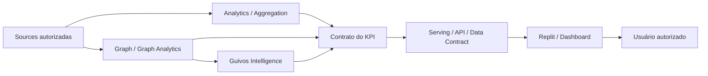

# Dashboards, KPIs e Analytics — Documento Mestre de Especificação para Construção

## 1. Finalidade

Este documento é a **autoridade documental mestre, pré-implementação, para a família de dashboards, KPIs e superfícies analíticas da Guivos**.

Ele organiza o que deverá ser entregue futuramente a uma superfície de construção — inicialmente indicada como **Replit** — sem obrigar Engenharia, Design ou fornecedores a reconstruir significado, fórmulas, acesso ou contexto a partir de conversas, tabelas isoladas ou inferências.

Regra de consumo:

> **Para construir qualquer dashboard da Guivos, comece por este master global e, em seguida, consuma o master especializado correspondente. A ferramenta materializa a especificação; ela não define a verdade do indicador.**

Este master:

- preserva a tabela original desta frente como **proveniência de trabalho**, não como autoridade canônica;
- governa regras comuns à família de dashboards;
- define a arquitetura master global + masters especializados;
- preserva o inventário candidato inicial de necessidades analíticas;
- define o envelope mínimo de contrato de KPI;
- define o modelo transversal de acesso e disclosure;
- define a cadeia lógica de dados, Graph, Intelligence, serving e Replit;
- define requisitos mínimos de handoff, qualidade, exceção e aceite;
- preserva autoridades especializadas de Produto, Journey, Business, Ads, Economia, Privacidade, Graph, Intelligence e Governança;
- **não autoriza**, por si só, dados reais, integração física, backend, persistência, produção, publicação ou acesso irrestrito a dados individuais.

---

## 2. Arquitetura documental da família

```text
GKR-INTELLIGENCE-DASHBOARD-KPI-001
→ MASTER GLOBAL
→ regras comuns
→ inventário / contexto transversal
→ KPI contract envelope
→ access / disclosure
→ integração lógica
→ handoff Replit

MASTERS ESPECIALIZADOS
→ um documento por dashboard / participante / grupo analítico
→ escopo próprio
→ catálogo próprio de KPIs e indicadores
→ filtros / dimensões / drill-down
→ acesso específico
→ fontes e integrações aplicáveis
→ instruções de construção
→ critérios de aceite
```

Regra estrutural:

```text
MASTER GLOBAL
≠ SOMA DOS KPIs DE CADA DASHBOARD

MASTER ESPECIALIZADO
≠ NOVA SOURCE OF TRUTH
≠ AUTORIZAÇÃO AUTOMÁTICA DE IMPLEMENTAÇÃO
```

### 2.1 Registry documental

| Anexo | Documento | Estado nesta versão |
|---|---|---|
| A | `GKR-INTELLIGENCE-DASHBOARD-GUIVOS-001` — Dashboard Guivos | MATERIALIZED DOCUMENTARILY / PRE-IMPLEMENTATION MASTER |
| B | Dashboard Guivos Business | RESERVED / NOT MATERIALIZED |
| C | Dashboard Organização | RESERVED / NOT MATERIALIZED |
| D | Dashboard Coletivo | RESERVED / NOT MATERIALIZED |
| E | Dashboard Pessoa | RESERVED / NOT MATERIALIZED |
| F | Ads / Opportunity Boost Analytics | RESERVED / NOT MATERIALIZED |

`RESERVED` significa somente posição documental planejada. Não cria autoridade, superfície operacional ou implementação.

### 2.2 Inventário candidato preservado da frente original

A tabela fornecida para esta frente identificou seis necessidades analíticas. Elas permanecem **input/proveniência de trabalho** até sua adjudicação individual.

#### Dashboard Guivos

Finalidade candidata original: visão transversal do ecossistema e da empresa Guivos, incluindo, quando legitimamente definidos e disponíveis:

- Pessoas;
- Organizações;
- Coletivos;
- escolhas/declarações das Pessoas;
- oportunidades;
- dados demográficos;
- dados geográficos;
- vendas de planos;
- cadastros ativos/inativos;
- demais indicadores transversais autorizados.

Esse escopo foi aprofundado documentalmente no Anexo A sem autorizar dados reais ou implementação.

#### Dashboard Guivos Business

Finalidade candidata original: KPIs do Guivos Business conforme a população legitimamente abrangida por cada relação Business, incluindo tendências, evolução temporal, distribuições e comparações permitidas.

```text
BUSINESS
→ PODE CONSUMIR LEITURA POPULACIONAL AUTORIZADA
→ NÃO RECEBE POR PADRÃO UM "INTELLIGENCE POR PESSOA"
→ NÃO HERDA CONTEXTO PRIVADO INDIVIDUAL
```

#### Dashboard Organização

Finalidade candidata original: leitura quantitativa da própria atuação da Organização e da população/relações sob autoridade aplicável, incluindo oportunidades, vendas, demografia, geografia e cadastros quando legitimamente definidos.

Estado preservado:

```text
MASTER ESPECIALIZADO
→ RESERVED / NOT MATERIALIZED

DOCUMENTAÇÃO DESTA NECESSIDADE
≠ HOME AUTENTICADA DEFINIDA
≠ DASHBOARD OPERACIONAL IMPLEMENTADO
```

#### Dashboard Coletivo

Finalidade candidata original: leitura quantitativa de participação e atuação do Coletivo, incluindo Pessoas relacionadas, oportunidades, inscrições/participações, demografia, geografia e cadastros quando autorizados.

`Reputação` permanece bloqueada até possuir definição, fórmula, finalidade, autoridade de leitura, contestação e governança próprias.

#### Dashboard Pessoa

Finalidade candidata original: oferecer compreensão individual autorizada da própria trajetória, históricos, contextos, evolução, participações, relações, eventos e outputs de Graph Analytics/Intelligence quando legitimamente autorizados e explicáveis.

```text
DECLARADO ≠ OBSERVADO ≠ CALCULADO ≠ INFERIDO ≠ PREDITO
```

#### Ads / Opportunity Boost Analytics

Necessidade candidata original: dados de anúncios e Opportunity Boost do anunciante.

Nesta versão global:

```text
NECESSIDADE
→ PRESERVADA

MASTER ESPECIALIZADO
→ RESERVED / NOT MATERIALIZED

KPIs / FÓRMULAS / ATTRIBUTION / TOOLING
→ A DEFINIR POR ATO PRÓPRIO
```

---

## 3. Estado e limites

```text
DOCUMENTO MESTRE GLOBAL
→ ACTIVE
→ PRE-IMPLEMENTATION SPECIFICATION
→ NÃO NORMATIVO SOBRE FÓRMULAS NÃO ADJUDICADAS

REPLIT
→ TARGET INICIAL DE MATERIALIZAÇÃO / CONSTRUÇÃO
→ NÃO SOURCE OF TRUTH
→ NÃO DEFINE KPI
→ NÃO DEFINE AUTORIDADE

REAL DATA / REAL INTEGRATIONS / PRODUCTION
→ NÃO AUTORIZADOS POR ESTE DOCUMENTO

DASHBOARD DOCUMENTADO
≠ DASHBOARD IMPLEMENTADO
≠ DASHBOARD PUBLICADO
≠ DADO REAL CONECTADO
```

Quando uma autoridade de domínio mantiver uma superfície, relação, métrica ou capacidade como não definida, este master e seus anexos devem preservar esse estado.

A existência futura dos masters de Organização e Coletivo **não deverá ser interpretada como materialização de Home autenticada, Surface Map, State Map, navegação, wireframe ou implementação desses participantes**.

---

## 4. Princípio arquitetural

```text
GKR / PRODUTO / GOVERNANÇA
→ define significado, finalidade, autoridade e limites

MASTER ESPECIALIZADO DO DASHBOARD
→ define escopo de consumo e catálogo analítico pretendido

CONTRATO DO KPI
→ define pergunta, fórmula, população, unidade, granularidade e fonte autorizada

DADOS / GRAPH / INTELLIGENCE / ANALYTICS
→ produzem ou disponibilizam inputs e outputs autorizados

SERVING / API / DATA CONTRACT
→ entrega o resultado na forma autorizada

REPLIT / OUTRA SUPERFÍCIE
→ materializa componentes, filtros, estados e visualizações

USUÁRIO AUTORIZADO
→ consome somente o recorte permitido por sua autoridade
```

Invariantes:

```text
DASHBOARD ≠ SOURCE OF TRUTH
VISUALIZAÇÃO ≠ DEFINIÇÃO DO KPI
FERRAMENTA ≠ PRODUTO
FERRAMENTA ≠ AUTORIDADE
OUTPUT AUTORIZADO ≠ DATASET DE ORIGEM
AGREGADO ≠ AUTOMATICAMENTE SEGURO
AUTORIDADE PARA PERSONALIZAR ≠ AUTORIDADE PARA COMPARTILHAR
ACESSO INTERNO ≠ ACESSO IRRESTRITO
CORRELAÇÃO ≠ CAUSALIDADE
INFERÊNCIA ≠ FATO
COMPREENDER ≠ DECIDIR
```

---

## 5. Modelo transversal de acesso

O acesso a um dashboard ou métrica não deve ser decidido somente por uma `role` técnica.

```text
IDENTIDADE AUTENTICADA
+
TIPO DE PARTICIPANTE / GRUPO
+
PAPEL FUNCIONAL
+
TENANT / PARTICIPANT SCOPE
+
RELAÇÃO LEGÍTIMA
+
FINALIDADE
+
SENSIBILIDADE DO DADO
+
AUTORIDADE DE DISCLOSURE
=
ESCOPO MÁXIMO DE LEITURA
```

### 5.1 Princípios

- um usuário pode possuir mais de um contexto legítimo, mas cada acesso deve operar no contexto selecionado;
- Organização não herda dados de outra Organização;
- Coletivo não herda dados de outro Coletivo;
- uma relação Business não dá acesso automático ao contexto privado de uma Pessoa;
- acesso interno da Guivos continua sujeito à finalidade, necessidade e classificação do dado;
- service accounts e integrações recebem apenas o mínimo necessário;
- filtros e drill-down respeitam a mesma política de acesso do indicador principal;
- exportação não pode ampliar disclosure.

### 5.2 Classes funcionais de consumo

As classes abaixo são funcionais e **não constituem RBAC técnico implementado**:

| Classe | Escopo conceitual |
|---|---|
| Guivos — visão executiva | visão transversal agregada necessária à governança |
| Guivos — operação/domínio | recorte operacional sob responsabilidade |
| Guivos — Data/Intelligence | dados necessários à finalidade analítica autorizada |
| Guivos — Financeiro/Economia | métricas econômicas autorizadas e auditáveis |
| Business | população e relação Business legitimamente abrangidas |
| Organização | dados próprios e relações sob sua autoridade |
| Coletivo | dados próprios e relações sob sua autoridade |
| Pessoa | próprios dados, Journey, históricos e outputs autorizados |
| Anunciante | próprias campanhas / Opportunity Boost e agregados autorizados |
| Replit / service account | somente payloads necessários à renderização autorizada |

---

## 6. Envelope mínimo do contrato de KPI

Nenhum KPI está pronto para implementação apenas porque seu nome aparece em tabela, conversa, planilha ou mockup.

Cada KPI deverá possuir, no mínimo:

| Campo | Obrigatoriedade | Função |
|---|---|---|
| KPI ID | obrigatória | identificador estável |
| Nome | obrigatória | nome humano |
| Pergunta que responde | obrigatória | compreensão/decisão suportada |
| Família / tipo | obrigatória | classificação |
| Dashboard consumidor | obrigatória | superfície consumidora |
| Público autorizado | obrigatória | quem pode consumir |
| Entidade / população | obrigatória | universo medido |
| Unidade de análise | obrigatória | entidade/evento elementar |
| Fórmula | obrigatória | definição matemática/lógica |
| Numerador | quando aplicável | componente superior |
| Denominador | quando aplicável | base da razão/taxa |
| Unidade | obrigatória | número, %, moeda, tempo, índice etc. |
| Direcionalidade | quando aplicável | maior/melhor, menor/melhor, faixa, contextual ou guardrail |
| Exclusões | obrigatória | o que não entra |
| Janela temporal | obrigatória | período de observação |
| Base de comparação | quando aplicável | baseline / período / grupo |
| Granularidade | obrigatória | pessoa, evento, dia, mês, população etc. |
| Dimensões / segmentos | quando aplicável | cortes autorizados |
| Filtros | quando aplicável | filtros autorizados |
| Fonte de verdade / fontes | obrigatória | origem autorizada |
| Natureza da evidência | obrigatória | declarada, observada, operacional, calculada, inferida, predita, estimada, proxy etc. |
| Freshness / atualização | obrigatória | frequência e atraso aceitável |
| Quality checks | obrigatória | verificações mínimas |
| Sensibilidade / access class | obrigatória | classificação de proteção |
| Accountable owner | obrigatória antes de operação | responsável pelo significado/uso |
| Calculation owner | obrigatória antes de operação | responsável pelo cálculo |
| Review cadence | quando aplicável | cadência de revisão |
| Retention rule | quando aplicável | retenção pertinente |
| Change log | obrigatória quando operacional | rastreabilidade de alterações |
| Regra de agregação | quando aplicável | forma de composição |
| Threshold de proteção | quando aplicável | mínimo para exposição agregada |
| Tratamento de nulos | obrigatória | regra para ausência |
| Proveniência | obrigatória | origem e transformação |
| Claims suportados | obrigatória | interpretações permitidas |
| Claims proibidos | obrigatória | interpretações não sustentadas |
| Confounders | quando aplicável | fatores de distorção |
| Incerteza | quando material | limites / intervalos / qualificação |
| Validações aplicáveis | obrigatória | conceptual, data, financial, accounting, legal/privacy/security conforme domínio |
| Visualização semântica | obrigatória antes do handoff | forma esperada de leitura |
| Critério de aceite | obrigatória | condição objetiva de validação |
| Status | obrigatória | proposed / defined / source_pending / approved-equivalent |
| Contratos de domínio | obrigatória | autoridades especializadas aplicáveis |

Regra de composição:

```text
CROSS-DOMAIN MINIMUM
+ APPLICABLE DOMAIN CONTRACT
= REQUIRED CONTRACT FOR READINESS
```

Indicadores econômicos — incluindo vendas de planos, vendas de oportunidades, receita ou métricas equivalentes — devem compor com `GEM-009-MEASUREMENT-CONTRACT-001` na versão/status aplicável. Este master não promove o estado de `GEM-009`.

Exemplo de bloqueio:

```text
"USUÁRIOS ATIVOS"
→ janela não definida
→ evento qualificante não definido
→ população não definida
→ source of truth não definida

RESULTADO
→ NÃO IMPLEMENTAR COMO KPI CANÔNICO
```

---

## 7. Requisitos transversais de dados e leitura

### 7.1 Temporalidade

```text
TOTAL ATUAL
≠ NOVOS NO PERÍODO
≠ ATIVOS 7D
≠ ATIVOS 30D
≠ MÊS CORRENTE
≠ ACUMULADO HISTÓRICO
```

Cada KPI temporal deve explicitar janela, timezone aplicável e regra de fechamento.

### 7.2 Granularidade

A superfície deve expor a menor granularidade necessária à finalidade autorizada, não a maior disponível tecnicamente.

### 7.3 Proveniência

Quando materialmente relevante, a leitura deve distinguir:

```text
DECLARADO
≠ OBSERVADO
≠ OPERACIONAL
≠ CALCULADO
≠ INFERIDO
≠ PREDITO
≠ AGREGADO
≠ CONHECIMENTO EXTERNO
```

### 7.4 Privacidade e disclosure

Antes de produção devem existir, quando aplicáveis:

- population scope;
- thresholds mínimos;
- supressão de células pequenas;
- regras de segmentação;
- controles de acesso;
- finalidade legítima;
- retenção;
- rastreabilidade;
- regras de exportação;
- regras de drill-down.

### 7.5 Explicabilidade

Quanto maior o impacto potencial de uma leitura, recomendação, score, tendência ou inferência, maior deve ser a explicabilidade exigida.

---

## 8. Arquitetura lógica de integração



O desenho é lógico. Ele não determina topologia física, banco específico, API, serviço, linguagem ou infraestrutura.

### 8.1 Mapa de ferramentas — leitura governada da tabela de arquitetura

| Ferramenta / família | Papel indicado nesta frente | Estado governado |
|---|---|---|
| Neo4j | banco de dados grafo / memória; Graph Analytics | tecnologia primária de referência para grafo; não prova provisionamento/produção |
| GPT | IA/inteligência do ecossistema | candidato de provedor/modelo; não selecionado por este master |
| Anthropic | IA/inteligência do ecossistema | candidato de provedor/modelo; não selecionado por este master |
| Gemini | IA/inteligência do ecossistema | candidato de provedor/modelo; não selecionado por este master |
| Replit | construção de fluxos e dashboards | target inicial de materialização; não source of truth |
| Hostinger | armazenamento/bancos operacionais indicados no input | papel pretendido sujeito a arquitetura física e data contracts futuros |
| Figma | Design System | fonte de Design quando autorizado; não backend nem fonte de KPI |
| A definir | fontes de pesquisa / central de ajuda / elementos adicionais | decisão futura necessária |

```text
NEO4J = REFERENCE_SELECTED
≠ PROVISIONADO
≠ GRAPH ANALYTICS OPERACIONAL

GPT / ANTHROPIC / GEMINI
→ ALTERNATIVAS IDENTIFICADAS
→ NÃO SELECIONADAS POR ESTE MASTER

HOSTINGER
→ PAPEL INDICADO NO INPUT
→ NÃO É AUTOMATICAMENTE SOURCE OF TRUTH DE TODO DADO

REPLIT
→ MATERIALIZA ESPECIFICAÇÃO
→ NÃO INVENTA FÓRMULA, AUTORIDADE OU FONTE
```

---

## 9. Requisitos comuns de um dashboard especializado

Cada master especializado deve definir, quando aplicável:

1. objetivo e público consumidor;
2. escopo e não escopo;
3. catálogo de KPIs/indicadores;
4. entidades e populações;
5. filtros globais e locais;
6. dimensões e segmentações;
7. períodos e comparações;
8. drill-down permitido;
9. exportação permitida/proibida;
10. access/disclosure por grupo;
11. fontes e integrações lógicas;
12. estados de loading, vazio, dado insuficiente, erro e indisponibilidade;
13. qualidade/freshness;
14. semantic visualization contract;
15. critérios de aceite;
16. instruções específicas para o Replit;
17. itens bloqueados/TBD;
18. versão da especificação usada na construção.

---

## 10. Contrato de construção para Replit

Quando uma etapa de construção for explicitamente autorizada, o pacote entregue ao Replit deverá conter:

1. este master global vigente;
2. master especializado correspondente;
3. contratos aprovados/suficientemente definidos dos KPIs selecionados;
4. contratos canônicos de domínio aplicáveis;
5. data/serving contracts autorizados;
6. regras de autenticação, autorização e perfis de acesso;
7. regras de privacidade, agregação e disclosure;
8. Design System/especificações visuais quando autorizados;
9. estados de exceção;
10. critérios de aceite;
11. indicação clara de `mock data` versus `real data`;
12. versão do pacote usado na build.

Instrução obrigatória:

```text
SE KPI ESTÁ COMPLETO E APROVADO
+ CONTRATOS DE DOMÍNIO APLICÁVEIS ESTÃO SATISFEITOS
→ IMPLEMENTAR CONFORME CONTRATO

SE FÓRMULA ESTÁ AUSENTE
→ BLOCKED / TBD
→ NÃO INVENTAR

SE SOURCE OF TRUTH ESTÁ AUSENTE
→ BLOCKED / TBD
→ NÃO ESCOLHER BANCO POR CONVENIÊNCIA

SE AUTORIDADE DE ACESSO ESTÁ AUSENTE
→ NÃO EXPOR

SE ESCOPO AINDA É APENAS CANDIDATO
→ NÃO TRATAR COMO PRODUTO IMPLEMENTADO

SE APENAS MOCK DATA ESTÁ AUTORIZADO
→ SEPARAR MOCK DE INTEGRAÇÃO REAL

SE OUTPUT É INFERIDO / PREDITO
→ PRESERVAR NATUREZA, CONFIANÇA E EXPLICABILIDADE

SE HOUVER DRILL-DOWN
→ NÃO AMPLIAR A AUTORIDADE DO USUÁRIO
```

---

## 11. Definition of Ready de um KPI

```text
[ ] KPI ID definido
[ ] pergunta definida
[ ] família/tipo definido
[ ] população e unidade de análise definidas
[ ] fórmula definida
[ ] numerador/denominador definidos quando aplicáveis
[ ] unidade definida
[ ] direcionalidade definida quando aplicável
[ ] exclusões explicitadas
[ ] janela temporal definida
[ ] base de comparação definida quando aplicável
[ ] granularidade definida
[ ] source of truth / fontes definidas e autorizadas
[ ] natureza da evidência definida
[ ] freshness definida
[ ] quality checks definidos
[ ] sensibilidade / access class definida
[ ] público autorizado definido
[ ] accountable owner definido
[ ] calculation owner definido
[ ] review cadence definida quando aplicável
[ ] retention rule definida quando aplicável
[ ] regra de agregação/disclosure definida quando aplicável
[ ] tratamento de nulos definido
[ ] proveniência definida
[ ] supported / prohibited claims definidos
[ ] confounders registrados quando aplicáveis
[ ] incerteza qualificada quando material
[ ] validações aplicáveis registradas
[ ] contratos de domínio aplicáveis identificados e satisfeitos
[ ] visualização semântica especificada
[ ] estados de exceção definidos
[ ] critérios de aceite definidos
[ ] superfície consumidora documentalmente adjudicada
[ ] implementação explicitamente autorizada pelo gate aplicável
```

Falha material mantém o KPI em especificação, não em implementação canônica.

---

## 12. Handoff entre os masters

```text
MASTER GLOBAL
→ MASTER ESPECIALIZADO
→ KPI CATALOG / CONTRACTS
→ ACCESS + DISCLOSURE
→ DATA / SERVING CONTRACTS
→ DESIGN SPEC, QUANDO AUTORIZADO
→ BUILD HANDOFF
→ IMPLEMENTATION AUTHORIZATION, QUANDO HOUVER
```

Não existe autorização automática entre etapas.

---

## 13. Próximas unidades documentais

```text
ANEXO A — DASHBOARD GUIVOS
→ MATERIALIZED DOCUMENTARILY

ANEXO B — BUSINESS
→ RESERVED / NOT MATERIALIZED

ANEXO C — ORGANIZAÇÃO
→ RESERVED / NOT MATERIALIZED

ANEXO D — COLETIVO
→ RESERVED / NOT MATERIALIZED

ANEXO E — PESSOA
→ RESERVED / NOT MATERIALIZED

ANEXO F — ADS / OPPORTUNITY BOOST
→ RESERVED / NOT MATERIALIZED
```

Cada anexo deve ser construído e revisado individualmente para permitir evolução pontual sem reabrir desnecessariamente os demais.

---

## 14. Estado final desta versão

```text
GKR-INTELLIGENCE-DASHBOARD-KPI-001
→ v0.2.1
→ ACTIVE
→ MULTI-DASHBOARD GOVERNED PRE-IMPLEMENTATION MASTER

KNOWLEDGE FROM v0.1.1
→ PRESERVED / RECONCILED

SOURCE TABLE / ARCHITECTURE INPUT
→ WORKING PROVENANCE
→ NOT CANONICAL AUTHORITY

REPLIT HANDOFF ARCHITECTURE
→ DEFINED DOCUMENTARILY

ACCESS MODEL
→ DEFINED AT FUNCTIONAL / POLICY LEVEL
→ TECHNICAL RBAC NOT IMPLEMENTED

KPI CONTRACT ENVELOPE
→ PRESERVED + EXTENDED

DASHBOARD GUIVOS MASTER
→ GKR-INTELLIGENCE-DASHBOARD-GUIVOS-001
→ MATERIALIZED DOCUMENTARILY AS ANNEX A

OTHER SPECIALIZED MASTERS
→ RESERVED / NOT MATERIALIZED

REAL DATA / PHYSICAL INTEGRATION / BACKEND / PRODUCTION
→ NOT AUTHORIZED

DESIGN / UI IMPLEMENTATION
→ NOT AUTHORIZED BY THIS DOCUMENT
```
