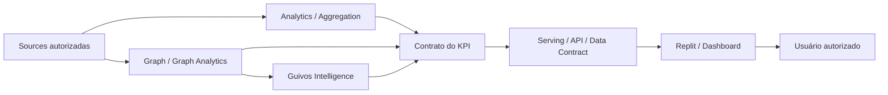

# Dashboards, KPIs e Analytics — Documento Mestre de Especificação para Construção

## 1. Finalidade

Este documento é a **autoridade documental mestre, pré-implementação, para a família de dashboards, KPIs e superfícies analíticas da Guivos**.

Ele existe para garantir que a futura materialização em Replit ou em outra ferramenta autorizada seja conduzida por contratos explícitos de significado, acesso, dados, cálculo e disclosure — e não por inferência da ferramenta de construção.

Regra de consumo:

> **Para construir qualquer dashboard da Guivos, comece por este master global e, em seguida, consuma o master especializado do dashboard correspondente. A ferramenta materializa a especificação; ela não define a verdade do indicador.**

Este master:

- governa regras comuns a toda a família de dashboards;
- define a arquitetura documental master global + masters especializados;
- define o envelope mínimo de contrato de KPI;
- define o modelo transversal de acesso e disclosure;
- define a cadeia lógica de dados, Graph, Intelligence, serving e Replit;
- define o pacote mínimo de handoff para construção;
- preserva autoridades especializadas de Produto, Journey, Business, Ads, Economia, Privacidade, Graph, Intelligence e Governança;
- mantém a tabela original desta frente como proveniência de trabalho, não como autoridade canônica;
- **não autoriza**, por si só, dados reais, integração física, backend, persistência, produção, publicação ou acesso a dados individuais.

---

## 2. Arquitetura documental da família

A família passa a adotar a seguinte estrutura:

```text
GKR-INTELLIGENCE-DASHBOARD-KPI-001
→ MASTER GLOBAL
→ regras comuns
→ KPI contract envelope
→ access/disclosure
→ integração lógica
→ handoff Replit

MASTERS ESPECIALIZADOS
→ um documento por dashboard / participante / grupo analítico
→ escopo próprio
→ catálogo próprio de KPIs e indicadores
→ filtros / dimensões / drill-down
→ acesso específico
→ fontes e integrações aplicáveis
→ instruções de construção
→ critérios de aceite
```

Regra estrutural:

```text
MASTER GLOBAL
≠ SOMA DOS KPIs DE CADA DASHBOARD

MASTER ESPECIALIZADO
≠ NOVA SOURCE OF TRUTH
≠ AUTORIZAÇÃO AUTOMÁTICA DE IMPLEMENTAÇÃO
```

### 2.1 Registry documental

| Anexo | Documento | Estado nesta versão |
|---|---|---|
| A | `GKR-INTELLIGENCE-DASHBOARD-GUIVOS-001` — Dashboard Guivos | MATERIALIZED / PRE-IMPLEMENTATION MASTER |
| B | Dashboard Guivos Business | RESERVED / NOT MATERIALIZED |
| C | Dashboard Organização | RESERVED / NOT MATERIALIZED |
| D | Dashboard Coletivo | RESERVED / NOT MATERIALIZED |
| E | Dashboard Pessoa | RESERVED / NOT MATERIALIZED |
| F | Ads / Opportunity Boost Analytics | RESERVED / NOT MATERIALIZED |

`RESERVED` significa somente posição documental planejada. Não cria autoridade, superfície ou implementação.

---

## 3. Estado e limites

```text
DOCUMENTO MESTRE GLOBAL
→ ACTIVE
→ PRE-IMPLEMENTATION SPECIFICATION
→ NÃO NORMATIVO SOBRE FÓRMULAS NÃO ADJUDICADAS

REPLIT
→ TARGET INICIAL DE MATERIALIZAÇÃO / CONSTRUÇÃO
→ NÃO SOURCE OF TRUTH
→ NÃO DEFINE KPI
→ NÃO DEFINE AUTORIDADE

REAL DATA / REAL INTEGRATIONS / PRODUCTION
→ NÃO AUTORIZADOS POR ESTE DOCUMENTO

DASHBOARD DOCUMENTADO
≠ DASHBOARD IMPLEMENTADO
≠ DASHBOARD PUBLICADO
≠ DADO REAL CONECTADO
```

Quando uma autoridade de domínio mantiver uma superfície, relação, métrica ou capacidade como não definida, este master e seus anexos devem preservar esse estado.

Em especial, a existência futura dos masters de Organização e Coletivo **não deverá ser interpretada como materialização da Home autenticada, Surface Map, State Map ou navegação desses participantes**.

---

## 4. Princípio arquitetural

A cadeia de autoridade permanece:

```text
GKR / PRODUTO / GOVERNANÇA
→ define significado, finalidade, autoridade e limites

MASTER ESPECIALIZADO DO DASHBOARD
→ define escopo de consumo e catálogo analítico pretendido

CONTRATO DO KPI
→ define pergunta, fórmula, população, unidade, granularidade e fonte autorizada

DADOS / GRAPH / INTELLIGENCE / ANALYTICS
→ produzem ou disponibilizam inputs e outputs autorizados

SERVING / API / DATA CONTRACT
→ entrega o resultado na forma autorizada

REPLIT / OUTRA SUPERFÍCIE
→ materializa componentes, filtros, estados e visualizações

USUÁRIO AUTORIZADO
→ consome somente o recorte permitido por sua autoridade
```

Invariantes:

```text
DASHBOARD ≠ SOURCE OF TRUTH
VISUALIZAÇÃO ≠ DEFINIÇÃO DO KPI
FERRAMENTA ≠ PRODUTO
FERRAMENTA ≠ AUTORIDADE
OUTPUT AUTORIZADO ≠ DATASET DE ORIGEM
AGREGADO ≠ AUTOMATICAMENTE SEGURO
AUTORIDADE PARA PERSONALIZAR ≠ AUTORIDADE PARA COMPARTILHAR
ACESSO INTERNO ≠ ACESSO IRRESTRITO
CORRELAÇÃO ≠ CAUSALIDADE
INFERÊNCIA ≠ FATO
COMPREENDER ≠ DECIDIR
```

---

## 5. Modelo transversal de acesso

O acesso a um dashboard ou métrica não deve ser decidido somente por uma `role` técnica.

A decisão lógica deve compor, quando aplicável:

```text
IDENTIDADE AUTENTICADA
+
TIPO DE PARTICIPANTE / GRUPO
+
PAPEL FUNCIONAL
+
TENANT / PARTICIPANT SCOPE
+
RELAÇÃO LEGÍTIMA
+
FINALIDADE
+
SENSIBILIDADE DO DADO
+
AUTORIDADE DE DISCLOSURE
=
ESCOPO MÁXIMO DE LEITURA
```

### 5.1 Princípios

- um usuário pode possuir mais de um contexto legítimo, mas cada acesso deve operar no contexto selecionado;
- Organização não herda dados de outra Organização;
- Coletivo não herda dados de outro Coletivo;
- uma relação Business não dá acesso automático ao contexto privado de uma Pessoa;
- acesso interno da Guivos continua sujeito à finalidade, necessidade e classificação do dado;
- service accounts e integrações recebem apenas o mínimo necessário para o contrato técnico correspondente;
- filtros e drill-down devem respeitar a mesma política de acesso do indicador principal;
- exportação não pode ampliar o disclosure permitido na interface.

### 5.2 Classes funcionais de consumo

As classes abaixo são funcionais e **não constituem RBAC técnico implementado**:

| Classe | Escopo conceitual |
|---|---|
| Guivos — visão executiva | visão transversal agregada necessária à governança |
| Guivos — operação/domínio | recorte operacional do domínio sob responsabilidade |
| Guivos — Data/Intelligence | dados necessários à finalidade analítica autorizada |
| Guivos — Financeiro/Economia | métricas econômicas autorizadas e auditáveis |
| Business | população e relação Business legitimamente abrangidas |
| Organização | dados próprios e relações sob sua autoridade |
| Coletivo | dados próprios e relações sob sua autoridade |
| Pessoa | próprios dados, Journey, históricos e outputs autorizados |
| Anunciante | próprias campanhas / Opportunity Boost e agregados autorizados |
| Replit / service account | somente payloads necessários para renderização autorizada |

---

## 6. Envelope mínimo do contrato de KPI

Nenhum KPI está pronto para implementação apenas porque seu nome aparece em uma tabela, conversa ou mockup.

Cada KPI deve possuir, no mínimo:

| Campo | Obrigatoriedade | Função |
|---|---|---|
| KPI ID | obrigatória | identificador estável |
| Nome | obrigatória | nome humano do indicador |
| Pergunta que responde | obrigatória | compreensão ou decisão suportada |
| Família / tipo | obrigatória | classificação do indicador |
| Dashboard consumidor | obrigatória | superfície consumidora |
| Público autorizado | obrigatória | quem pode consumir |
| Entidade / população | obrigatória | universo medido |
| Unidade de análise | obrigatória | entidade/evento elementar |
| Fórmula | obrigatória | definição matemática/lógica |
| Numerador / denominador | quando aplicável | componentes da razão/taxa |
| Unidade | obrigatória | número, %, R$, tempo, índice etc. |
| Direcionalidade | quando aplicável | maior/melhor, menor/melhor, faixa, contextual ou guardrail |
| Exclusões | obrigatória | o que não entra no cálculo |
| Janela temporal | obrigatória | período de observação |
| Base de comparação | quando aplicável | baseline ou referência |
| Granularidade | obrigatória | pessoa, evento, dia, mês, população etc. |
| Dimensões / segmentos | quando aplicável | cortes autorizados |
| Filtros | quando aplicável | filtros autorizados |
| Fonte de verdade / fontes | obrigatória | origem autorizada |
| Natureza da evidência | obrigatória | declarada, observada, calculada, inferida, predita, proxy etc. |
| Freshness | obrigatória | frequência e atraso aceitável |
| Quality checks | obrigatória | verificações mínimas |
| Sensibilidade / access class | obrigatória | classificação de proteção |
| Accountable owner | obrigatória antes de operação | responsável pelo significado/uso |
| Calculation owner | obrigatória antes de operação | responsável pelo cálculo |
| Regra de agregação | quando aplicável | forma de composição |
| Threshold de proteção | quando aplicável | mínimo para exposição agregada |
| Tratamento de nulos | obrigatória | regra para ausência de dado |
| Proveniência | obrigatória | origem e transformação |
| Claims suportados | obrigatória | interpretações permitidas |
| Claims proibidos | obrigatória | interpretações não sustentadas |
| Confounders | quando aplicável | fatores de distorção |
| Incerteza | quando material | limites e qualificação |
| Visualização semântica | obrigatória antes do handoff | forma de leitura esperada |
| Critério de aceite | obrigatória | condição objetiva de validação |
| Status | obrigatória | proposed / defined / source_pending / approved-equivalent |
| Contratos de domínio | obrigatória | autoridades especializadas aplicáveis |

Regra de composição:

```text
CROSS-DOMAIN MINIMUM
+ APPLICABLE DOMAIN CONTRACT
= REQUIRED CONTRACT FOR READINESS
```

Indicadores econômicos devem compor com `GEM-009-MEASUREMENT-CONTRACT-001` na versão/status aplicável. Este master não promove o estado de `GEM-009`.

---

## 7. Requisitos transversais de dados e leitura

### 7.1 Temporalidade

```text
TOTAL ATUAL
≠ NOVOS NO PERÍODO
≠ ATIVOS 7D
≠ ATIVOS 30D
≠ MÊS CORRENTE
≠ ACUMULADO HISTÓRICO
```

Cada KPI temporal deve explicitar janela, timezone aplicável e regra de fechamento do período.

### 7.2 Granularidade

A superfície deve expor a menor granularidade necessária à finalidade autorizada, e não a maior granularidade tecnicamente disponível.

### 7.3 Proveniência

Quando materialmente relevante, a leitura deve distinguir:

```text
DECLARADO
≠ OBSERVADO
≠ OPERACIONAL
≠ CALCULADO
≠ INFERIDO
≠ PREDITO
≠ AGREGADO
≠ CONHECIMENTO EXTERNO
```

### 7.4 Privacidade e disclosure

Antes de produção devem existir, quando aplicáveis:

- population scope;
- thresholds mínimos;
- supressão de células pequenas;
- regras de segmentação;
- controles de acesso;
- finalidade legítima;
- retenção;
- rastreabilidade;
- regras de exportação;
- regras de drill-down.

### 7.5 Explicabilidade

Quanto maior o impacto potencial de uma leitura, score, inferência ou recomendação, maior deve ser a explicabilidade exigida.

---

## 8. Arquitetura lógica de integração



Este desenho é lógico. Ele não determina topologia física, banco, linguagem, API, serviço ou fornecedor.

### 8.1 Papel das ferramentas citadas nesta frente

| Ferramenta / família | Papel governado |
|---|---|
| Neo4j | tecnologia primária de referência para grafo; Graph Analytics somente quando autorizado e materializado |
| GPT / Anthropic / Gemini | provedores/modelos candidatos; não selecionados por este master |
| Replit | target inicial de construção das superfícies; não source of truth |
| Hostinger | papel de armazenamento indicado como input de arquitetura; sujeito a definição física futura |
| Figma | Design System / Design quando autorizado; não define KPI |
| Fontes externas | somente por contratos de pesquisa/dados autorizados |

---

## 9. Requisitos comuns de uma superfície de dashboard

Cada master especializado deve especificar, quando aplicável:

1. objetivo e público consumidor;
2. escopo e não escopo;
3. catálogo de KPIs e indicadores;
4. entidades e populações;
5. filtros globais e locais;
6. dimensões e segmentações;
7. períodos e comparações;
8. drill-down permitido;
9. exportação permitida/proibida;
10. access/disclosure por grupo;
11. fontes e integrações lógicas;
12. estados de loading, vazio, dado insuficiente, erro e indisponibilidade;
13. qualidade/freshness;
14. semantic visualization contract;
15. critérios de aceite;
16. instruções específicas para o Replit;
17. itens bloqueados/TBD;
18. versão da especificação usada na construção.

---

## 10. Contrato de construção para Replit

Quando uma etapa de construção for explicitamente autorizada, o Replit deverá receber:

- este master global;
- o master especializado correspondente;
- contratos de KPI aprovados ou suficientemente definidos;
- contratos canônicos de domínio aplicáveis;
- data contracts / serving contracts autorizados;
- regras de autenticação e acesso;
- regras de privacidade e disclosure;
- Design System e especificações visuais somente quando autorizados;
- estados de exceção;
- critérios de aceite;
- declaração explícita de `mock data` versus `real data`.

Instrução obrigatória:

```text
SE KPI ESTÁ COMPLETO E APROVADO
+ CONTRATOS DE DOMÍNIO APLICÁVEIS ESTÃO SATISFEITOS
→ implementar conforme contrato

SE FÓRMULA ESTÁ AUSENTE
→ BLOCKED / TBD
→ NÃO INVENTAR

SE SOURCE OF TRUTH ESTÁ AUSENTE
→ BLOCKED / TBD
→ NÃO ESCOLHER BANCO POR CONVENIÊNCIA

SE AUTORIDADE DE ACESSO ESTÁ AUSENTE
→ NÃO EXPOR

SE APENAS MOCK DATA ESTÁ AUTORIZADO
→ SEPARAR EXPLICITAMENTE MOCK DE INTEGRAÇÃO REAL

SE OUTPUT É INFERIDO / PREDITO
→ PRESERVAR NATUREZA, CONFIANÇA E EXPLICABILIDADE

SE UMA VISUALIZAÇÃO PERMITIR DRILL-DOWN
→ O DRILL-DOWN NÃO PODE AMPLIAR A AUTORIDADE DO USUÁRIO
```

---

## 11. Definition of Ready de um KPI

Um KPI somente pode ser considerado pronto para materialização quando, no mínimo:

```text
[ ] KPI ID definido
[ ] pergunta definida
[ ] população e unidade de análise definidas
[ ] fórmula definida
[ ] unidade definida
[ ] exclusões definidas
[ ] janela temporal definida
[ ] granularidade definida
[ ] source of truth / fontes definidas e autorizadas
[ ] natureza da evidência definida
[ ] freshness definida
[ ] quality checks definidos
[ ] sensibilidade / access class definida
[ ] público autorizado definido
[ ] accountable owner definido
[ ] calculation owner definido
[ ] regra de agregação/disclosure definida quando aplicável
[ ] tratamento de nulos definido
[ ] proveniência definida
[ ] supported / prohibited claims definidos
[ ] confounders registrados quando aplicáveis
[ ] incerteza qualificada quando material
[ ] contratos de domínio aplicáveis identificados e satisfeitos
[ ] visualização semântica especificada
[ ] estados de exceção definidos
[ ] critérios de aceite definidos
[ ] superfície consumidora documentalmente adjudicada
[ ] implementação explicitamente autorizada pelo gate aplicável
```

Falha material mantém o KPI em especificação, não em implementação canônica.

---

## 12. Handoff entre os masters

A sequência governada para cada dashboard é:

```text
MASTER GLOBAL
→ MASTER ESPECIALIZADO
→ KPI CATALOG / CONTRACTS
→ ACCESS + DISCLOSURE
→ DATA / SERVING CONTRACTS
→ DESIGN SPEC, QUANDO AUTORIZADO
→ BUILD HANDOFF
→ IMPLEMENTATION AUTHORIZATION, QUANDO HOUVER
```

Não existe autorização automática entre etapas.

---

## 13. Próximas unidades documentais

Estado após esta versão:

```text
ANEXO A — DASHBOARD GUIVOS
→ MATERIALIZED

ANEXO B — BUSINESS
→ RESERVED / NOT MATERIALIZED

ANEXO C — ORGANIZAÇÃO
→ RESERVED / NOT MATERIALIZED

ANEXO D — COLETIVO
→ RESERVED / NOT MATERIALIZED

ANEXO E — PESSOA
→ RESERVED / NOT MATERIALIZED

ANEXO F — ADS / OPPORTUNITY BOOST
→ RESERVED / NOT MATERIALIZED
```

Cada anexo deve ser construído e revisado individualmente para permitir evolução pontual sem reabrir desnecessariamente os demais.

---

## 14. Estado final desta versão

```text
GKR-INTELLIGENCE-DASHBOARD-KPI-001
→ v0.2.0
→ ACTIVE
→ MULTI-DASHBOARD GOVERNED PRE-IMPLEMENTATION MASTER

REPLIT HANDOFF ARCHITECTURE
→ DEFINED DOCUMENTARILY

ACCESS MODEL
→ DEFINED AT FUNCTIONAL / POLICY LEVEL
→ TECHNICAL RBAC NOT IMPLEMENTED

KPI CONTRACT ENVELOPE
→ DEFINED

DASHBOARD GUIVOS MASTER
→ GKR-INTELLIGENCE-DASHBOARD-GUIVOS-001
→ MATERIALIZED AS ANNEX A

OTHER SPECIALIZED MASTERS
→ RESERVED / NOT MATERIALIZED

REAL DATA
→ NOT AUTHORIZED

PHYSICAL INTEGRATION / BACKEND / PRODUCTION
→ NOT AUTHORIZED

DESIGN / UI IMPLEMENTATION
→ NOT AUTHORIZED BY THIS DOCUMENT
```
