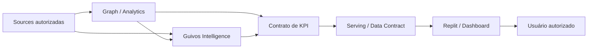

# Dashboards, KPIs e Analytics — Documento Mestre de Especificação para Construção

## 1. Finalidade

Este documento é a **porta de entrada governada para a especificação de dashboards, KPIs e superfícies analíticas da Guivos**.

Ele existe para organizar o que deverá ser entregue futuramente a uma superfície de construção — inicialmente indicada como **Replit** — sem obrigar Engenharia, Design ou fornecedores a reconstruir definições a partir de conversas, tabelas isoladas ou inferências.

Regra de consumo:

> **Para construir um dashboard ou KPI da Guivos, comece por este documento e pelos contratos específicos de métricas que vierem a ser aprovados. A ferramenta de construção materializa a especificação; ela não define a verdade do indicador.**

Este master:

- consolida o inventário inicial de dashboards indicado pela tabela de arquitetura desta frente;
- define a separação entre fonte de verdade, cálculo, analytics, serving e visualização;
- define o contrato mínimo obrigatório de cada KPI antes de sua implementação;
- preserva as autoridades de produto, Intelligence, Graph, Platform, Privacidade e Governança;
- prepara um pacote de handoff utilizável no Replit ou em outra ferramenta futura;
- **não autoriza**, por si só, uso de dados reais, integração física, backend, persistência, produção ou publicação.

---

## 2. Estado e limite desta especificação

```text
DOCUMENTO MESTRE
→ ACTIVE
→ PRE-IMPLEMENTATION SPECIFICATION
→ NÃO NORMATIVO SOBRE FÓRMULAS AINDA NÃO ADJUDICADAS

INVENTÁRIO DE DASHBOARDS
→ BASELINE IDENTIFICADA

CONTRATOS MATEMÁTICOS DE KPIs
→ AINDA DEVEM SER DEFINIDOS INDIVIDUALMENTE

REPLIT
→ TARGET INICIAL DE MATERIALIZAÇÃO / CONSTRUÇÃO
→ NÃO SOURCE OF TRUTH

REAL DATA / REAL INTEGRATIONS / PRODUCTION
→ NÃO AUTORIZADOS POR ESTE DOCUMENTO
```

A presença de uma ferramenta ou tecnologia neste documento indica **papel pretendido, candidato ou de referência**, conforme o caso. Não constitui prova de provisionamento, integração, operação ou produção.

---

## 3. Princípio arquitetural

A cadeia de autoridade deve permanecer:

```text
GKR / PRODUTO / GOVERNANÇA
→ define significado, finalidade, autoridade e limites

CONTRATO DO KPI
→ define pergunta, fórmula, população, unidade, granularidade e fonte autorizada

DADOS / GRAPH / INTELLIGENCE / ANALYTICS
→ produzem ou disponibilizam inputs e outputs autorizados

SERVING / API / DATA CONTRACT
→ entrega o resultado na forma autorizada

REPLIT / OUTRA SUPERFÍCIE
→ materializa dashboard, componentes, filtros e visualizações

USUÁRIO AUTORIZADO
→ consome a leitura pertinente à sua autoridade
```

Invariantes:

```text
DASHBOARD ≠ SOURCE OF TRUTH
VISUALIZAÇÃO ≠ DEFINIÇÃO DO KPI
FERRAMENTA ≠ PRODUTO
FERRAMENTA ≠ AUTORIDADE
OUTPUT AUTORIZADO ≠ DATASET DE ORIGEM
AGREGADO ≠ AUTOMATICAMENTE SEGURO
AUTORIDADE PARA PERSONALIZAR ≠ AUTORIDADE PARA COMPARTILHAR
CORRELAÇÃO ≠ CAUSALIDADE
INFERÊNCIA ≠ FATO
```

---

## 4. Inventário inicial de dashboards

A tabela de arquitetura fornecida para esta frente identifica seis superfícies de análise. Os itens abaixo são **escopos iniciais**, ainda não equivalentes a contratos matemáticos completos.

### 4.1 Dashboard Guivos

**Finalidade inicial:** visão transversal do ecossistema e da empresa Guivos.

Escopo indicado:

- quantidade de Pessoas;
- quantidade de Coletivos;
- quantidade de Organizações;
- escolhas ou declarações estáticas registradas das Pessoas, quando legitimamente aplicáveis;
- oportunidades;
- dados demográficos;
- dados geográficos;
- quantidades de vendas de cada plano;
- cadastros ativos e inativos;
- demais indicadores transversais que venham a ser formalmente aprovados.

Limite:

> **Acesso interno da Guivos não equivale a autorização irrestrita para exposição ou combinação de dados individuais.**

### 4.2 Dashboard Guivos Business

**Finalidade inicial:** disponibilizar KPIs do Guivos Business de acordo com a população legitimamente abrangida por cada relação Business.

Escopo indicado:

- KPIs populacionais autorizados;
- tendências;
- evolução temporal;
- distribuições e comparações permitidas;
- leituras agregadas e protegidas pertinentes ao domínio Business.

Regra estrutural:

```text
BUSINESS
→ consome leitura populacional autorizada
→ não recebe por padrão um "Intelligence por pessoa"
→ não herda automaticamente acesso ao contexto privado individual
```

### 4.3 Dashboard Organizações

**Finalidade inicial:** oferecer à Organização leitura quantitativa de sua atuação e da população sob autoridade aplicável.

Escopo indicado:

- quantidade de Pessoas relacionadas dentro do escopo autorizado;
- oportunidades;
- dados demográficos;
- dados geográficos;
- quantidade de vendas de oportunidades;
- cadastros ativos e inativos;
- evolução temporal desses indicadores quando houver contrato aprovado.

### 4.4 Dashboard Coletivos

**Finalidade inicial:** oferecer ao Coletivo leitura quantitativa de sua atuação e participação.

Escopo indicado:

- quantidade de Pessoas relacionadas dentro do escopo autorizado;
- oportunidades;
- dados demográficos;
- dados geográficos;
- quantidade de vendas de oportunidades;
- inscrições ou participações;
- reputação, somente quando o conceito, cálculo e autoridade estiverem formalmente definidos;
- cadastros ativos e inativos;
- evolução temporal desses indicadores quando houver contrato aprovado.

### 4.5 Dashboard Pessoa

**Finalidade inicial:** oferecer compreensão individual autorizada sobre a própria trajetória da Pessoa.

Escopo indicado:

- históricos;
- contextos;
- evolução;
- participações;
- relações e eventos pertinentes;
- outputs analíticos ou de Graph Analytics quando legitimamente autorizados e explicáveis.

O dashboard da Pessoa não deve promover inferência a fato nem ocultar proveniência quando a natureza do resultado exigir explicação.

```text
DECLARADO ≠ OBSERVADO ≠ CALCULADO ≠ INFERIDO ≠ PREDITO
```

### 4.6 Ads / Opportunity Boost Analytics

A tabela indica uma necessidade de dashboard para **dados de anúncios e Opportunity Boost do anunciante**, mas mantém a tecnologia correspondente como **A DEFINIR**.

Estado:

```text
NECESSIDADE ANALÍTICA
→ IDENTIFICADA

ESCOPO FUNCIONAL DETALHADO
→ A DEFINIR

KPIs
→ A DEFINIR

TECNOLOGIA / SUPERFÍCIE
→ A DEFINIR
```

Nenhum KPI, fórmula, fonte ou ferramenta deve ser inventado por inferência nesta frente.

---

## 5. Contrato obrigatório de cada KPI

Nenhum KPI deve ser considerado pronto para implementação somente porque seu nome foi citado em uma tabela, mockup ou conversa.

Cada KPI deverá possuir, no mínimo:

| Campo | Obrigatoriedade | Função |
|---|---|---|
| KPI ID | obrigatória | identificador estável |
| Nome | obrigatória | nome humano do indicador |
| Pergunta que responde | obrigatória | decisão/compreensão suportada |
| Dashboard consumidor | obrigatória | superfície onde aparece |
| Público autorizado | obrigatória | quem pode consumir |
| Entidade / população | obrigatória | universo medido |
| Fórmula | obrigatória | definição matemática/lógica |
| Numerador | quando aplicável | componente superior |
| Denominador | quando aplicável | base da razão/taxa |
| Unidade | obrigatória | número, %, R$, tempo, índice etc. |
| Janela temporal | obrigatória | período de observação |
| Granularidade | obrigatória | pessoa, evento, dia, mês, população etc. |
| Dimensões | quando aplicável | cortes analíticos permitidos |
| Filtros | quando aplicável | filtros autorizados |
| Fonte de verdade | obrigatória | origem autorizada do dado |
| Freshness / atualização | obrigatória | frequência e atraso aceitável |
| Sensibilidade | obrigatória | classificação de proteção |
| Regra de agregação | quando aplicável | como compor populações |
| Threshold de proteção | quando aplicável | mínimo para exposição agregada |
| Tratamento de nulos | obrigatória | regra de ausência de dado |
| Proveniência | obrigatória | origem e transformação |
| Visualização | obrigatória antes do handoff | forma esperada de exibição |
| Critério de aceite | obrigatória | condição objetiva de validação |
| Status | obrigatória | draft / approved / deprecated etc. |

Exemplo de lacuna que deve bloquear implementação:

```text
"USUÁRIOS ATIVOS"
→ janela temporal não definida
→ evento de atividade não definido
→ população não definida
→ fórmula não definida
→ fonte de verdade não definida

RESULTADO
→ NÃO IMPLEMENTAR COMO KPI CANÔNICO
```

---

## 6. Requisitos transversais dos dashboards

### 6.1 Temporalidade

Todo KPI temporal deve explicitar período e janela de cálculo.

```text
TOTAL ATUAL
≠ ATIVOS 7D
≠ ATIVOS 30D
≠ MÊS CORRENTE
≠ ACUMULADO HISTÓRICO
```

### 6.2 Granularidade

A visualização deve usar a menor granularidade necessária para a finalidade autorizada, não a maior granularidade tecnicamente disponível.

### 6.3 Proveniência

O usuário e os responsáveis pela operação devem conseguir distinguir, conforme aplicável:

- dado declarado;
- dado observado;
- dado operacional;
- dado calculado;
- inferência;
- predição;
- agregado;
- conhecimento externo;
- dado governado.

### 6.4 Privacidade e disclosure

A capacidade técnica de cruzar dados não cria autorização para fazê-lo.

Especialmente para Business, Organizações e Coletivos, devem ser definidos antes de produção:

- population scope;
- thresholds mínimos;
- supressão de células pequenas;
- regras de segmentação;
- controles de acesso;
- retenção;
- rastreabilidade;
- finalidade legítima de uso.

### 6.5 Explicabilidade

Quanto maior o impacto potencial de uma leitura, recomendação, score, tendência ou inferência, maior deve ser a explicabilidade exigida.

---

## 7. Mapa de ferramentas — leitura governada da tabela de arquitetura

Este quadro preserva os papéis indicados na tabela de entrada sem promovê-los indevidamente a implementação comprovada.

| Ferramenta / família | Papel indicado | Estado governado neste master |
|---|---|---|
| Neo4j | banco de dados grafo / memória; Graph Analytics | tecnologia primária de referência para grafo; não prova provisionamento ou produção |
| GPT | IA e inteligência do ecossistema | candidato de provedor/modelo; não selecionado por este documento |
| Anthropic | IA e inteligência do ecossistema | candidato de provedor/modelo; não selecionado por este documento |
| Gemini | IA e inteligência do ecossistema | candidato de provedor/modelo; não selecionado por este documento |
| Replit | construção de fluxos, retorno de compreensão e dashboards | target inicial de materialização; não source of truth |
| Hostinger | armazenamento/bancos operacionais indicados na tabela | papel pretendido sujeito a arquitetura física e contratos de dados futuros |
| Figma | Design System | fonte de Design quando a etapa de Design estiver autorizada; não backend nem fonte de KPI |
| A definir | fontes de pesquisa, central de ajuda e dashboard Ads/Opportunity Boost | decisão futura necessária |

Regras adicionais:

```text
NEO4J = REFERENCE_SELECTED
≠ NEO4J PROVISIONADO
≠ GRAPH ANALYTICS OPERACIONAL

GPT / ANTHROPIC / GEMINI
→ ALTERNATIVAS IDENTIFICADAS
→ PROVEDOR NÃO SELECIONADO NESTE MASTER

HOSTINGER
→ PAPEL INDICADO NA TABELA
→ NÃO SE TORNA AUTOMATICAMENTE SOURCE OF TRUTH DE TODO DADO

FIGMA
→ DESIGN SYSTEM
→ NÃO DEFINE MÉTRICA

REPLIT
→ MATERIALIZA ESPECIFICAÇÃO
→ NÃO INVENTA FÓRMULA, AUTORIDADE OU FONTE DE DADO
```

---

## 8. Pacote de handoff para Replit

Quando a etapa de construção for explicitamente autorizada, o pacote entregue ao Replit deverá conter:

1. este Documento Mestre na versão vigente;
2. contratos aprovados dos KPIs que serão materializados;
3. contrato de dados ou interface autorizada para cada indicador;
4. regras de autenticação, autorização e perfis de acesso;
5. regras de privacidade, agregação e disclosure;
6. Design System e especificações visuais aprovadas quando disponíveis;
7. estados vazios, loading, erro, indisponibilidade e dado insuficiente;
8. critérios objetivos de aceite;
9. indicação clara de dados mock versus dados reais;
10. registro da versão da especificação usada na construção.

### 8.1 Instrução de construção

A ferramenta de construção deverá obedecer:

```text
SE KPI ESTÁ COMPLETO E APROVADO
→ implementar conforme contrato

SE FÓRMULA ESTÁ AUSENTE
→ marcar como BLOCKED / TBD
→ não inventar

SE SOURCE OF TRUTH ESTÁ AUSENTE
→ marcar como BLOCKED / TBD
→ não selecionar banco por conveniência

SE AUTORIDADE DE ACESSO ESTÁ AUSENTE
→ não expor o dado

SE APENAS MOCK DATA ESTÁ AUTORIZADO
→ manter separação explícita entre mock e integração real

SE OUTPUT É INFERIDO / PREDITO
→ preservar natureza, confiança e explicabilidade aplicáveis
```

---

## 9. Arquitetura lógica de consumo



O desenho é lógico. Ele não determina topologia física, banco específico, API, serviço, linguagem ou infraestrutura.

---

## 10. Definition of Ready para materialização de um KPI

Um KPI somente deve avançar para implementação quando:

```text
[ ] KPI ID definido
[ ] pergunta de negócio/compreensão definida
[ ] população definida
[ ] fórmula definida
[ ] unidade definida
[ ] janela temporal definida
[ ] granularidade definida
[ ] source of truth definida e autorizada
[ ] regra de freshness definida
[ ] sensibilidade classificada
[ ] público autorizado definido
[ ] regras de agregação/disclosure definidas
[ ] visualização aprovada ou suficientemente especificada
[ ] estados de exceção definidos
[ ] critérios de aceite definidos
[ ] implementação explicitamente autorizada pelo gate aplicável
```

Falha em qualquer item material mantém o KPI em especificação, não em implementação canônica.

---

## 11. Próximas especificações necessárias

Este master cria a estrutura, mas não substitui o trabalho de definição métrica.

Próximas famílias possíveis, somente quando individualmente autorizadas e materialmente necessárias:

- catálogo/registry de KPIs;
- contratos específicos dos KPIs do Dashboard Guivos;
- contratos específicos dos KPIs do Guivos Business;
- contratos específicos dos KPIs de Organizações;
- contratos específicos dos KPIs de Coletivos;
- contratos específicos das leituras da Pessoa;
- definição funcional e analítica de Ads / Opportunity Boost;
- contratos de dados e serving;
- specification de access control e disclosure;
- specification visual/handoff de Design.

A existência desta lista **não materializa nem autoriza automaticamente** novos documentos, integrações ou etapas.

---

## 12. Estado final desta versão

```text
GKR-INTELLIGENCE-DASHBOARD-KPI-001
→ v0.1.0
→ ACTIVE
→ GOVERNED PRE-IMPLEMENTATION MASTER SPECIFICATION

DASHBOARD GUIVOS
→ INITIAL SCOPE IDENTIFIED

DASHBOARD GUIVOS BUSINESS
→ INITIAL SCOPE IDENTIFIED

DASHBOARD ORGANIZAÇÕES
→ INITIAL SCOPE IDENTIFIED

DASHBOARD COLETIVOS
→ INITIAL SCOPE IDENTIFIED

DASHBOARD PESSOA
→ INITIAL SCOPE IDENTIFIED

ADS / OPPORTUNITY BOOST ANALYTICS
→ NEED IDENTIFIED
→ DETAILED SCOPE / KPIs / TOOLING TO DEFINE

REPLIT HANDOFF STRUCTURE
→ DEFINED

KPI CONTRACT TEMPLATE
→ DEFINED

KPI FORMULAS
→ NOT DEFINED BY INFERENCE

REAL DATA / PHYSICAL INTEGRATION / BACKEND / PRODUCTION
→ NOT AUTHORIZED BY THIS DOCUMENT

MERGE DA PR #363
→ NOT AUTHORIZED BY THIS DOCUMENT
```
