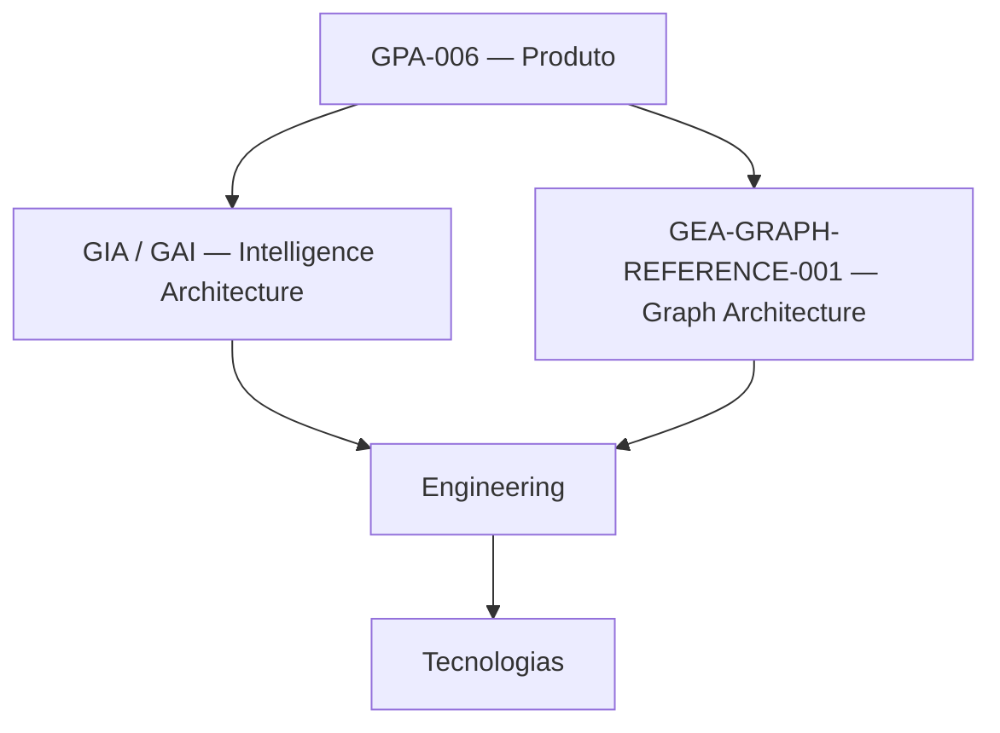
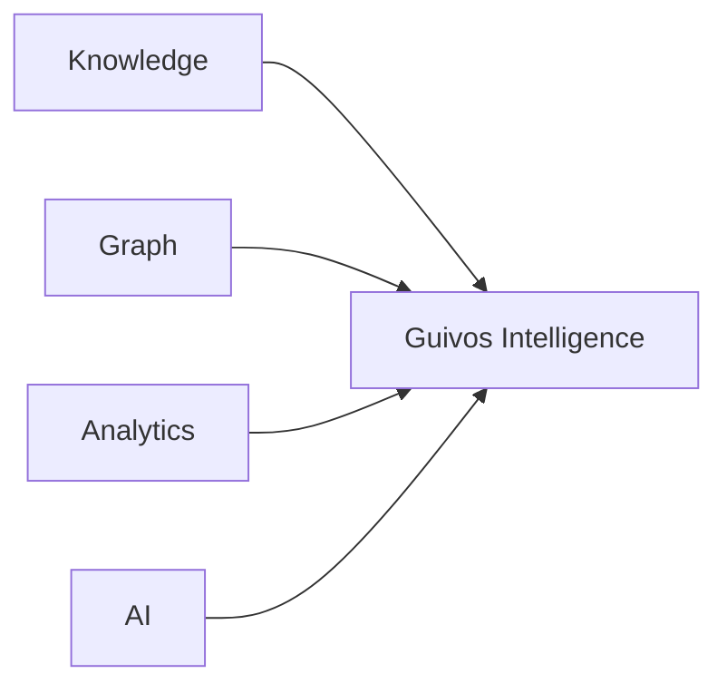

# Guivos Intelligence Architecture

Este domínio reúne os modelos arquiteturais que orientam como a Guivos realiza tecnicamente capacidades necessárias para transformar dados, conhecimento, evidências, contexto e conexões em inteligência útil.

## Documentos do domínio

- [GAI-001 — Guivos Artificial Intelligence Knowledge Model](knowledge-model.md)
- [GAI-002 — Manifesto da Inteligência do Ecossistema Guivos](manifesto.md)

## Expressão oficial

A expressão pública e conceitual preferencial é **Inteligência do Ecossistema Guivos**.

Ela descreve uma inteligência transversal que interpreta um ecossistema vivo de participantes, jornadas, possibilidades, oportunidades, experiências, conhecimentos, relacionamentos e evidências.

## Autoridade entre Produto e Arquitetura

`GPA-006 — Guivos Intelligence 2.0.0` governa a **identidade e a autoridade de produto**.

`GIA-000`, `GAI-001` e `GAI-002` governam princípios e arquiteturas responsáveis por realizar as capacidades do produto sem redefinir seu significado.

`GEA-GRAPH-REFERENCE-001` governa a arquitetura de referência para grafo e tecnologias relacionadas.



Separação obrigatória:

```text
GPA-006
= o que Guivos Intelligence é, entrega, pode fazer e deve preservar

GIA-000 / GAI-001 / GAI-002
= como a Intelligence Architecture organiza contexto, conhecimento,
  aprendizagem, princípios e responsabilidades técnicas

GEA-GRAPH-REFERENCE-001
= arquitetura de referência para grafo e mecanismos relacionados

ENGINEERING
= realização física
```

A tecnologia não pode redefinir autoridade de produto.

## Princípio central

> **A tecnologia amplia a capacidade do Intelligence. Não amplia sua autoridade.**

A Intelligence Architecture deve preservar autonomia humana, finalidade, minimização, proveniência, temporalidade, explicabilidade, incerteza, proteção e autoridade definidos em `GPA-006`.

## Relação com as camadas

A Intelligence Layer serve todo o ecossistema.

- o Journey governa a experiência da Pessoa e pode consumir compreensão, recomendações e explicações;
- o Guivos Intelligence governa a produção de compreensão dentro de sua autoridade;
- Business pode consumir inteligência populacional agregada e protegida;
- Mall, Travel, Media e Ads podem fornecer sinais e consumir outputs dentro de seus contratos próprios;
- a Platform Layer sustenta dados, segurança, permissões, integrações e rastreabilidade;
- Engenharia realiza os mecanismos técnicos sem absorver autoridade de produto.

## Arquitetura funcional versus decomposição técnica

`GPA-006 2.0.0` consolida como responsabilidades funcionais:

1. contexto;
2. conhecimento;
3. relações;
4. compreensão;
5. relevância;
6. descoberta de possibilidades;
7. agregação;
8. insights e tendências;
9. explicabilidade;
10. aprendizado governado;
11. Intelligence Serving como responsabilidade de entrega.

Essas responsabilidades **não devem ser mapeadas mecanicamente 1:1 para serviços, engines ou componentes físicos**.

```text
RESPONSABILIDADE FUNCIONAL
≠ MICROSSERVIÇO
≠ ENGINE OBRIGATÓRIO
```

## Contexto Vivo

Contexto Vivo é o conceito funcional vigente no `PAS-001` para a melhor compreensão disponível que a Guivos mantém sobre a realidade do participante em determinado momento.

Ele não representa verdade absoluta nem perfil fixo.

A representação deve ser contextual, temporal, explicável, revisável e controlável pelo participante dentro das autoridades aplicáveis.

O Contexto Vivo pertence funcionalmente à experiência do Journey, depende de interpretação apoiada pela Intelligence Layer e de persistência governada pela Platform Layer.

## Interpretação do Contexto

Interpretação do Contexto é a responsabilidade de transformar entradas autorizadas em compreensão coerente e utilizável preservando, conforme aplicável:

- natureza da informação;
- proveniência;
- temporalidade;
- confiança;
- finalidade;
- permissões;
- possibilidade de confirmação;
- correção;
- contestação;
- retirada.

```text
DECLARADO ≠ OBSERVADO ≠ INFERIDO ≠ PREDITO
```

A interpretação não deve promover inferência a fato nem alterar silenciosamente informação sob autoridade da Pessoa.

## Context Intelligence Engine — candidato

O `Context Intelligence Engine (CIE)` permanece capacidade candidata da Intelligence Layer para:

- receber entradas multimodais autorizadas;
- interpretar linguagem natural e sinais contextuais;
- identificar elementos explícitos e inferências provisórias;
- propor atualizações do Contexto Vivo;
- registrar proveniência, temporalidade e confiança;
- solicitar confirmação quando necessário;
- preservar explicabilidade e finalidade.

O CIE permanece em Discovery/Engineering e não representa componente técnico obrigatório ou implementação comprovada.

## Família candidata de Intelligence Engines

Continuam identificados para futura modelagem:

- Context Intelligence Engine;
- Recommendation Intelligence Engine;
- Matching Intelligence Engine;
- Learning Intelligence Engine;
- Prediction Intelligence Engine;
- Trust Intelligence Engine;
- Knowledge Intelligence Engine.

Esses nomes representam responsabilidades candidatas, não microserviços obrigatórios.

A decomposição física pode futuramente consolidar, dividir, renomear ou eliminar esses candidatos conforme evidência de Engenharia.

## Living Participant Model — candidato

O `Living Participant Model (LPM)` permanece hipótese de modelo contextual, temporal e continuamente atualizável do participante.

O conceito funcional vigente é **Contexto Vivo**.

A eventual relação entre Contexto Vivo e LPM deverá ser definida somente após validação funcional e técnica suficiente, sem presumir equivalência.

Qualquer evolução deve preservar:

- soberania do participante;
- transparência;
- correção e contestação;
- proveniência;
- confiança;
- minimização;
- limites de uso;
- integração governada com o Grafo Global.

A futura `Guivos Participant Model Architecture (GPMA)` continua dependente de evidência prática, validação de responsabilidade permanente e decisão arquitetural formal.

## Grafo Global da Guivos

O Grafo Global é o modelo/capacidade de relações governadas que pode organizar conexões entre participantes, contextos, objetivos, possibilidades, oportunidades, experiências, conhecimento e evidências.

```text
GRAFO GLOBAL
≠ GUIVOS INTELLIGENCE
≠ NEO4J
```

Sua ontologia lógica completa, modelo físico, implementação e dados reais permanecem dependentes de detalhamento, validação e autoridade própria.

Neo4j permanece tecnologia primária de referência por `ADR-007`, em estado `reference_selected`.

## Knowledge, Graph, Analytics e AI

A realização futura do Intelligence pode combinar:



Nenhuma dessas arquiteturas ou técnicas define isoladamente o produto.

### Knowledge

Preserva fontes, evidências, autoridade, conflitos, atualização e aplicabilidade.

### Graph

Preserva relações governadas, contexto relacional e mecanismos estruturais sem converter medidas técnicas em valor humano.

### Analytics

Mede, compara e identifica padrões, mudanças e tendências; correlação não constitui causalidade.

### AI

Pode apoiar linguagem, classificação, extração, síntese, recomendação e interação, mas sua capacidade técnica não cria autoridade de uso.

## RAG e GraphRAG

RAG e GraphRAG permanecem mecanismos candidatos para recuperação de conhecimento e contexto antes de síntese por modelos.

```text
RAG / GraphRAG
≠ Guivos Intelligence
≠ verdade automática
≠ Canon automático
```

Relações inferidas por modelos devem permanecer distinguíveis de relações observadas, declaradas, curadas ou confirmadas.

## Intelligence Serving

`GPA-006 2.0.0` reconhece Intelligence Serving como responsabilidade de entregar outputs ao consumidor autorizado na granularidade, momento, canal e forma adequados.

A realização técnica de Serving permanece aberta e pode futuramente envolver APIs, eventos, relatórios, alertas, superfícies analíticas, interfaces conversacionais ou outros mecanismos.

```text
OUTPUT PRODUZIDO
≠ OUTPUT AUTORIZADO PARA ENTREGA
```

## Guivos.ai

Guivos.ai permanece possível interface/agente conversacional que pode consumir capacidades do Intelligence.

```text
GUIVOS.AI
= possível superfície

GUIVOS INTELLIGENCE
= Produto Especializado / Intelligence Layer
```

A interface deve herdar as mesmas políticas de autoridade aplicáveis a dashboards, APIs, relatórios e demais superfícies.

## Power BI

Power BI permanece consumidor/superfície analítica possível, não fonte de verdade do Intelligence.

A integração técnica não está selecionada nem implementada.

## Aprendizado governado

Aprendizado contínuo não significa treinamento indiscriminado.

```text
NOVO EVENTO
→ FINALIDADE
→ AUTORIDADE
→ QUALIDADE
→ USO PERMITIDO
→ APRENDIZADO
```

Dado autorizado para personalização, analytics ou serving não está automaticamente autorizado para treinamento de modelo.

## Estado

`GPA-006 2.0.0` consolida a arquitetura de produto dos Checkpoints 1–12. O **Product Source Lock do Guivos Intelligence** está integrado, a **Home Pública do Intelligence v1** possui arquitetura conceitual completa em 11 movimentos e Documento Mestre `GKR-UX-HOME-INTELLIGENCE-MASTER-001 v0.1.1`, e o **Source Lock da Home** existe como `GKR-UX-HOME-INTELLIGENCE-SOURCELOCK-001 v1.0.0`, ativo e normativo.

O Source Lock da Home congela as fontes de autoridade para futura materialização. Ele não constitui, por si só, autorização de Design, materialização visual, implementação ou publicação.

Estado governado durante a Auditoria Integral:

```text
PRODUTO GUIVOS INTELLIGENCE
→ CONSOLIDADO EM GPA-006 v2.0.0

PRODUCT SOURCE LOCK
→ INTEGRADO

HOME PÚBLICA INTELLIGENCE v1
→ ARQUITETURA CONCEITUAL COMPLETA
→ DOCUMENTO MESTRE EXISTENTE

HOME SOURCE LOCK
→ GKR-UX-HOME-INTELLIGENCE-SOURCELOCK-001 v1.0.0
→ ACTIVE / NORMATIVE
→ CONGELA FONTES; NÃO AUTORIZA MATERIALIZAÇÃO POR SI SÓ

WIREFRAME / UI / PROTÓTIPO / DESIGN HANDOFF
→ NÃO AUTORIZADOS DURANTE A AUDITORIA INTEGRAL

UXA-102 / V5
→ NOT_STARTED

PRODUCT ENGINEERING
→ PAUSED BEFORE W0-01
```

Permanecem abertos ou não evidenciados:

- CIE operacional;
- LPM físico;
- GPMA;
- família física de Intelligence Engines;
- ontologia lógica completa;
- ontologia física;
- modelo físico de dados;
- POC de grafo;
- Neo4j provisionado/produção;
- GDS operacional;
- GraphRAG operacional;
- modelo de IA selecionado;
- MLOps;
- serving técnico;
- APIs físicas;
- Power BI integrado;
- thresholds de proteção populacional;
- explicabilidade operacional;
- controles de privacidade operacionais.

A próxima etapa da Home não é automaticamente Design nem implementação. Durante a Auditoria Integral, sua autoridade documental permanece submetida ao `GKR-FULL-CORPUS-AUDIT-001`, ao diagnóstico do Lote F em `GKR-SPECIALIZED-HOMES-AUDIT-001` e ao gate global que mantém materialização visual suspensa.
