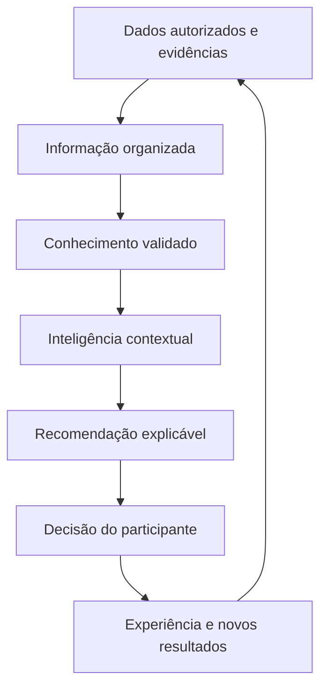
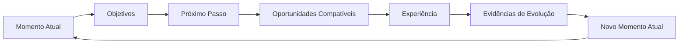

# Guivos Artificial Intelligence Knowledge Model

## 1. Finalidade

O Guivos Artificial Intelligence Knowledge Model define como a inteligência artificial da Guivos deverá aprender, organizar conhecimento, interpretar contexto e produzir recomendações úteis para pessoas e organizações.

A IA não existe para decidir a vida do participante. Seu papel é ampliar compreensão, reduzir a fragmentação das oportunidades e apoiar decisões mais conscientes.

## 2. Fontes de aprendizagem

A inteligência da Guivos deverá aprender a partir de quatro fontes complementares.

### 2.1 Conhecimento científico, técnico e institucional

A Guivos poderá utilizar conhecimento produzido por fontes confiáveis, como:

- universidades;
- instituições de pesquisa;
- organismos públicos e multilaterais;
- centros de referência;
- artigos científicos;
- estudos revisados por pares;
- livros;
- normas técnicas;
- bases públicas e institucionais;
- especialistas qualificados;
- evidências consolidadas em diferentes áreas do conhecimento.

A existência de uma publicação não garante sua incorporação automática. As fontes deverão ser avaliadas quanto a qualidade, atualidade, contexto, limites, possíveis conflitos e aplicabilidade.

### 2.2 Conhecimento produzido pelo ecossistema

A Guivos poderá aprender com experiências, resultados e padrões produzidos dentro do próprio ecossistema, desde que sejam respeitados:

- privacidade;
- consentimento;
- finalidade legítima;
- qualidade dos dados;
- anonimização ou agregação quando necessárias;
- distinção entre correlação e causalidade;
- revisão de possíveis vieses.

Esse aprendizado poderá ajudar a identificar oportunidades pouco conhecidas, jornadas recorrentes, necessidades de comunidades e conexões relevantes entre organizações.

### 2.3 Contexto e movimentação do participante

Com autorização e transparência, a IA poderá aprender com a movimentação da própria pessoa ao longo do tempo.

Essa movimentação pode incluir:

- objetivos informados;
- mudanças de interesse;
- oportunidades visualizadas;
- experiências realizadas;
- conteúdos consumidos;
- grupos e comunidades dos quais participa;
- habilidades desenvolvidas;
- preferências confirmadas ou rejeitadas;
- alterações de disponibilidade, localização ou contexto;
- avaliações e evidências de progresso.

A movimentação não deve ser interpretada como verdade absoluta. Ela fornece sinais contextuais que precisam ser combinados com informações declaradas, evidências e liberdade de escolha.

### 2.4 Aprendizado coletivo e contextual

A Guivos poderá identificar padrões agregados entre jornadas semelhantes sem reduzir pessoas a perfis rígidos.

Esse aprendizado poderá apoiar:

- identificação de oportunidades relevantes;
- melhoria de recomendações;
- descoberta de lacunas de oferta;
- compreensão de necessidades locais;
- análise de resultados recorrentes;
- criação de indicadores e tendências;
- apoio a organizações parceiras.

## 3. Modelo de transformação do conhecimento

A Guivos adota uma estrutura inspirada no fluxo Dados → Informação → Conhecimento → Inteligência Contextual → Recomendação.

### Dados

São registros brutos, sinais, interações, informações declaradas, evidências e fontes disponíveis.

### Informação

É o dado organizado com significado, origem, contexto e finalidade.

### Conhecimento

É a informação interpretada à luz de evidências, estudos, experiência e relações conhecidas.

### Inteligência contextual

É a capacidade de relacionar conhecimento com o momento atual, objetivos, restrições e preferências do participante.

### Recomendação

É uma possibilidade apresentada com clareza, justificativa, limites e liberdade de aceitação ou rejeição.

## 4. Relação com o Ciclo Contínuo de Evolução

A IA acompanha o Ciclo Contínuo de Evolução sem controlá-lo.

A IA poderá apoiar principalmente:

- compreensão do Momento Atual;
- organização de objetivos;
- identificação de possibilidades de Próximo Passo;
- encontro de Oportunidades Compatíveis;
- interpretação de evidências produzidas pela experiência;
- atualização contextual do Novo Momento Atual.

A decisão final permanece com o participante.

## 5. Princípios permanentes

### Evidência antes de afirmação

Recomendações relevantes devem buscar fundamento em evidências disponíveis, distinguindo fatos, hipóteses, inferências e opiniões.

### Contexto antes de recomendação

Uma recomendação não deve ser apresentada como universal quando depende de situação pessoal, cultural, econômica, territorial ou institucional.

### Atualização contínua

Conhecimento, estudos, normas e condições do participante mudam. A inteligência deve ser atualizada e revisável.

### Explicabilidade proporcional

Quanto maior o impacto de uma recomendação, maior deve ser a clareza sobre sua origem, lógica, limites e incertezas.

### Autonomia humana

A IA oferece apoio. Não impõe destino, objetivo, crença, tratamento, carreira ou decisão.

### Privacidade e finalidade

Dados devem ser utilizados apenas para finalidades legítimas, informadas e compatíveis com as regras do ecossistema.

### Não substituição de especialistas

A IA não substitui profissionais qualificados nem instituições responsáveis por decisões especializadas.

### Controle de vieses

Modelos, dados, fontes e resultados devem ser avaliados para reduzir discriminação, distorção e generalizações indevidas.

## 6. O que a IA não deverá fazer

A inteligência artificial da Guivos não deverá:

- definir o que uma pessoa deve querer para sua vida;
- impor objetivos ou caminhos;
- manipular escolhas;
- tratar probabilidades como certezas;
- utilizar uma única fonte como verdade universal;
- substituir médicos, psicólogos, educadores, advogados, consultores financeiros ou outros profissionais especializados;
- inferir atributos sensíveis sem base legítima;
- expor dados pessoais ou institucionais;
- aprender automaticamente com qualquer conteúdo sem avaliação de qualidade;
- otimizar apenas engajamento, venda ou permanência na plataforma em detrimento do participante.

## 7. Exemplo prático

Uma pessoa informa que deseja aumentar sua renda e mudar de área profissional.

A IA poderá combinar:

- informações declaradas pela pessoa;
- experiência e formação já registradas;
- disponibilidade e localização;
- vagas, bolsas, cursos e grupos existentes;
- estudos sobre transição de carreira;
- resultados agregados de jornadas semelhantes;
- preferências demonstradas ao longo do uso.

Com isso, poderá apresentar possibilidades como uma formação introdutória, um grupo de estudos, uma mentoria ou uma vaga compatível.

A recomendação deverá indicar por que parece relevante, quais informações foram consideradas e quais limitações existem. A pessoa poderá aceitar, rejeitar ou corrigir a sugestão.

## 8. Governança do conhecimento

A evolução deste modelo deverá incluir mecanismos para:

- registrar origem e data das fontes;
- classificar níveis de evidência;
- revisar conhecimento desatualizado;
- resolver conflitos entre fontes;
- registrar incertezas;
- proteger dados pessoais e institucionais;
- auditar recomendações de maior impacto;
- permitir correção pelo participante;
- separar conhecimento público, privado, agregado e restrito;
- documentar mudanças relevantes nos modelos.

## 9. Estado de maturidade

Estão consolidados neste documento:

- as fontes superiores de aprendizagem;
- a relação entre dados, conhecimento, inteligência contextual e recomendação;
- a preservação da autonomia;
- o aprendizado contínuo com estudos, evidências, ecossistema e movimentação autorizada do participante;
- os limites superiores de atuação da IA.

Ainda dependem de detalhamento, validação e implementação:

- seleção técnica de modelos;
- arquitetura de dados;
- critérios quantitativos de qualidade de fontes;
- mecanismos de consentimento;
- auditoria algorítmica;
- explicabilidade por tipo de recomendação;
- atualização de bases de conhecimento;
- políticas operacionais específicas por domínio.