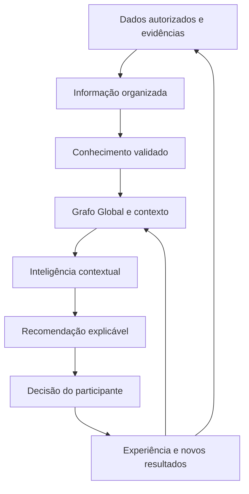
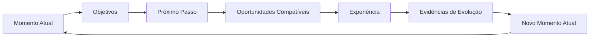

# GAI-001 — Guivos Artificial Intelligence Knowledge Model

## 1. Finalidade

Este modelo define como a **Inteligência do Ecossistema Guivos** deverá aprender, organizar conhecimento, interpretar contexto e produzir recomendações úteis para pessoas e organizações.

A inteligência artificial é um meio técnico dentro dessa inteligência mais ampla. Ela não existe para decidir a vida do participante, mas para ampliar compreensão, reduzir a fragmentação das oportunidades e apoiar decisões mais conscientes.

## 2. Fontes de aprendizagem

A Inteligência do Ecossistema Guivos deverá aprender a partir de quatro fontes complementares.

### 2.1 Conhecimento científico, técnico e institucional

A Guivos poderá utilizar conhecimento produzido por:

- universidades;
- instituições de pesquisa;
- organismos públicos e multilaterais;
- centros de referência;
- artigos científicos;
- estudos revisados por pares;
- livros;
- normas técnicas;
- bases públicas e institucionais;
- especialistas qualificados;
- evidências consolidadas.

A existência de uma publicação não garante incorporação automática. As fontes deverão ser avaliadas quanto a qualidade, atualidade, contexto, limites, conflitos e aplicabilidade.

### 2.2 Conhecimento produzido pelo ecossistema

A Guivos poderá aprender com experiências, resultados e padrões produzidos dentro do próprio ecossistema, respeitando:

- privacidade;
- consentimento;
- finalidade legítima;
- qualidade dos dados;
- anonimização ou agregação quando necessárias;
- distinção entre correlação e causalidade;
- revisão de possíveis vieses.

### 2.3 Contexto e movimentação do participante

Com autorização e transparência, poderá aprender com:

- objetivos informados;
- mudanças de interesse;
- oportunidades visualizadas;
- experiências realizadas;
- conteúdos consumidos;
- grupos e comunidades;
- habilidades desenvolvidas;
- preferências confirmadas ou rejeitadas;
- mudanças de disponibilidade, localização ou contexto;
- avaliações e evidências de progresso.

A movimentação fornece sinais contextuais, não verdades absolutas.

### 2.4 Aprendizado coletivo e contextual

A Guivos poderá identificar padrões agregados entre jornadas semelhantes sem reduzir pessoas a perfis rígidos.

Esse aprendizado poderá apoiar identificação de oportunidades relevantes, melhoria de recomendações, descoberta de lacunas de oferta, compreensão de necessidades locais, análise de resultados recorrentes e criação de indicadores e tendências.

## 3. Modelo de transformação do conhecimento

### Dados

Registros brutos, sinais, interações, informações declaradas, evidências e fontes disponíveis.

### Informação

Dado organizado com significado, origem, contexto e finalidade.

### Conhecimento

Informação interpretada à luz de evidências, estudos, experiência e relações conhecidas.

### Grafo Global e contexto

Estrutura conceitual que conecta participantes, organizações, coletivos, objetivos, oportunidades, experiências, conhecimentos, relacionamentos e evidências.

### Inteligência contextual

Capacidade de relacionar conhecimento e conexões com o Momento Atual, objetivos, restrições e preferências do participante.

### Recomendação

Possibilidade apresentada com justificativa, limites e liberdade de aceitação ou rejeição.

## 4. Relação com o Ciclo Contínuo de Evolução

A Inteligência do Ecossistema acompanha o ciclo sem controlá-lo.

Ela poderá apoiar compreensão do Momento Atual, organização de objetivos, identificação de Próximos Passos, encontro de oportunidades, interpretação de evidências e atualização contextual.

A decisão final permanece com o participante.

## 5. O Grafo Global da Guivos

O Grafo Global da Guivos organiza relações entre entidades e eventos do ecossistema ao longo do tempo.

Ele permite que a inteligência compreenda não apenas conteúdos isolados, mas também:

- quem se relaciona com quem;
- em qual contexto;
- por meio de qual oportunidade;
- qual experiência ocorreu;
- quais resultados e evidências surgiram;
- como o Momento Atual foi alterado.

O grafo representa um patrimônio cumulativo. Sua ontologia formal, modelo lógico, tecnologia e controles técnicos ainda dependem de detalhamento e validação.

## 6. Princípios permanentes

### Evidência antes de afirmação

Recomendações relevantes devem buscar fundamento em evidências disponíveis, distinguindo fatos, hipóteses, inferências e opiniões.

### Contexto antes de recomendação

Uma recomendação não deve ser apresentada como universal quando depende de situação pessoal, cultural, econômica, territorial ou institucional.

### Atualização contínua

Conhecimento, estudos, normas, relações e condições do participante mudam. A inteligência deve ser atualizada e revisável.

### Explicabilidade proporcional

Quanto maior o impacto de uma recomendação, maior deve ser a clareza sobre origem, lógica, relações consideradas, limites e incertezas.

### Autonomia humana

A Inteligência do Ecossistema oferece apoio. Não impõe destino, objetivo, crença, tratamento, carreira ou decisão.

### Privacidade e finalidade

Dados devem ser utilizados apenas para finalidades legítimas, informadas e compatíveis com as regras do ecossistema.

### Não substituição de especialistas

A inteligência não substitui profissionais qualificados nem instituições responsáveis por decisões especializadas.

### Controle de vieses

Modelos, dados, fontes, relações e resultados devem ser avaliados para reduzir discriminação, distorção e generalizações indevidas.

## 7. O que não deverá fazer

A Inteligência do Ecossistema Guivos não deverá:

- definir o que uma pessoa deve querer;
- impor objetivos ou caminhos;
- manipular escolhas;
- tratar probabilidades como certezas;
- utilizar uma única fonte como verdade universal;
- substituir profissionais especializados;
- inferir atributos sensíveis sem base legítima;
- expor dados pessoais ou institucionais;
- aprender automaticamente com qualquer conteúdo sem avaliação de qualidade;
- ocultar oportunidades para favorecer patrocinadores;
- otimizar apenas engajamento, venda ou permanência em prejuízo do participante.

## 8. Exemplo prático

Uma pessoa informa que deseja aumentar sua renda e mudar de área profissional.

A Inteligência do Ecossistema poderá combinar informações declaradas, experiência, formação, disponibilidade, localização, vagas, bolsas, cursos, grupos, estudos sobre transição de carreira, relações presentes no grafo e resultados agregados de jornadas semelhantes.

Poderá apresentar possibilidades como formação introdutória, grupo de estudos, mentoria ou vaga compatível.

A recomendação deverá indicar por que parece relevante, quais informações e relações foram consideradas e quais limitações existem.

## 9. Governança do conhecimento

A evolução deste modelo deverá incluir mecanismos para:

- registrar origem e data das fontes;
- classificar níveis de evidência;
- revisar conhecimento desatualizado;
- resolver conflitos entre fontes;
- registrar incertezas;
- proteger dados pessoais e institucionais;
- auditar recomendações de maior impacto;
- permitir correção pelo participante;
- separar conhecimento público, privado, agregado e restrito;
- documentar mudanças relevantes;
- governar relações e acessos no grafo.

## 10. Relação com GAI-002

`GAI-001` define como dados, informação, conhecimento, grafo, contexto e evidências se transformam em inteligência e recomendação.

`GAI-002 — Manifesto da Inteligência do Ecossistema Guivos` define por que essa inteligência existe, quais princípios a orientam e quais limites não deve ultrapassar.

## 11. Estado de maturidade

Estão consolidados:

- fontes superiores de aprendizagem;
- transformação de dados em conhecimento e inteligência contextual;
- Grafo Global como modelo conceitual de conexões;
- preservação da autonomia;
- aprendizado contínuo;
- limites superiores de atuação.

Ainda dependem de detalhamento, validação e implementação:

- seleção técnica de modelos;
- ontologia formal;
- arquitetura de dados e grafo;
- critérios quantitativos de qualidade;
- mecanismos de consentimento;
- auditoria algorítmica;
- explicabilidade por tipo de recomendação;
- políticas operacionais por domínio.