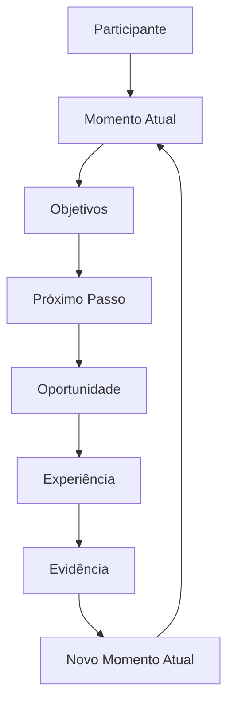
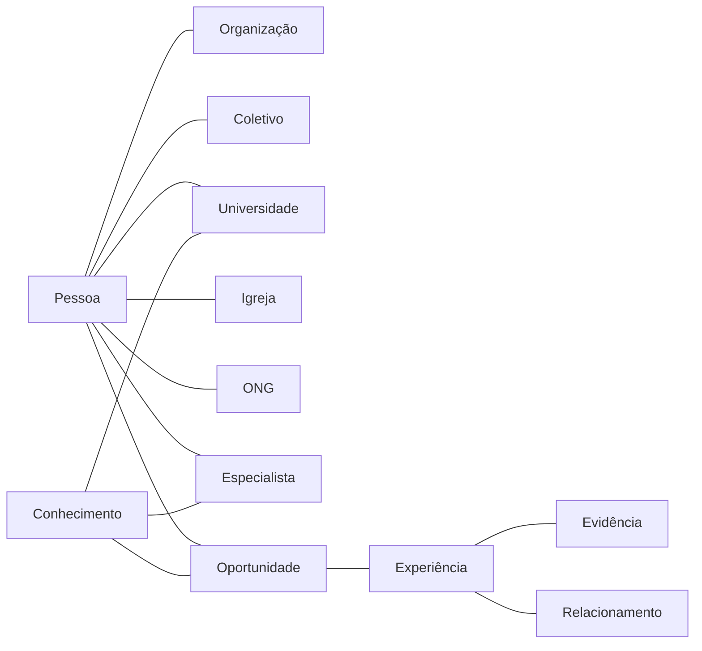

# GAI-002 — Manifesto da Inteligência do Ecossistema Guivos

## 1. Declaração central

A Guivos não concebe sua inteligência apenas como um assistente conversacional ou um mecanismo de recomendação.

A **Inteligência do Ecossistema Guivos** é a capacidade de compreender relações, contextos, jornadas, experiências, conhecimentos e evidências distribuídos por todo o ecossistema, apoiando pessoas e organizações sem substituir sua autonomia.

> A inteligência existe para ampliar a compreensão e revelar próximos passos relevantes, não para controlar escolhas.

## 2. Um meio, não a finalidade

A finalidade da Guivos é apoiar jornadas de evolução.

Modelos de inteligência artificial, bancos de dados, algoritmos, grafos e interfaces são meios subordinados a essa finalidade.

A tecnologia não deve redefinir o que significa evolução, impor objetivos ou substituir relações humanas, especialistas e instituições responsáveis.

## 3. Inteligência de ecossistema

Uma inteligência convencional pode responder a uma pergunta isolada com base em textos, documentos, conversas ou padrões estatísticos.

A Inteligência do Ecossistema Guivos deve compreender um ambiente vivo no qual participam:

- pessoas;
- organizações;
- coletivos;
- objetivos;
- Momentos Atuais;
- Próximos Passos;
- oportunidades;
- experiências;
- conhecimentos;
- relacionamentos;
- resultados;
- evidências de evolução.

Seu objeto não é apenas a informação. Seu objeto é a relação contextual entre esses elementos ao longo do tempo.

## 4. O Grafo Global da Guivos

A Inteligência do Ecossistema organiza conhecimento por meio do **Grafo Global da Guivos**.

O grafo representa entidades, relações, contextos e mudanças produzidas pelas experiências do ecossistema.

O grafo não representa apenas uma sequência linear. Ele conecta simultaneamente participantes, organizações, coletivos, conhecimento, eventos, cursos, especialistas, viagens, oportunidades e relacionamentos.

## 5. Aprendizagem contínua

A Inteligência do Ecossistema aprende com quatro fontes complementares:

1. conhecimento científico, técnico e institucional;
2. conhecimento produzido pelo próprio ecossistema;
3. contexto e movimentação autorizada dos participantes;
4. padrões agregados de jornadas e experiências.

Cada nova experiência pode produzir relações, resultados e evidências que atualizam o grafo.

O aprendizado não transforma correlação em verdade automática. Fontes, padrões e inferências devem ser avaliados quanto a qualidade, contexto, atualidade, limites e possíveis vieses.

## 6. Recomendações contextuais

A Inteligência do Ecossistema não deve recomendar algo apenas porque é popular, rentável ou patrocinado.

Uma recomendação pode considerar:

- Momento Atual;
- objetivos declarados;
- preferências;
- disponibilidade;
- localização;
- histórico de experiências;
- relacionamentos;
- conhecimento disponível;
- evidências acumuladas;
- restrições e limites informados.

Duas pessoas com objetivos semelhantes podem receber recomendações diferentes porque seus contextos são diferentes.

## 7. Autonomia humana

A decisão final pertence ao participante.

A Inteligência do Ecossistema deve permitir aceitação, rejeição, correção e revisão de interpretações.

Ela não deverá:

- definir o que uma pessoa deve querer;
- impor caminhos;
- manipular comportamento;
- ocultar oportunidades para favorecer receita ou patrocinadores;
- substituir profissionais especializados;
- tratar hipóteses como certezas;
- utilizar dados sem finalidade legítima e transparência;
- otimizar apenas tempo de tela, venda ou permanência.

## 8. Explicabilidade e confiança

Quanto maior o impacto potencial de uma recomendação, maior deve ser a clareza sobre:

- informações consideradas;
- fontes utilizadas;
- relações relevantes no grafo;
- incertezas;
- limitações;
- alternativas disponíveis.

A explicabilidade não deve ser apenas técnica. Deve ser compreensível para quem recebe a recomendação.

## 9. Privacidade e governança

O Grafo Global da Guivos não autoriza uso irrestrito de dados.

A arquitetura deve preservar:

- consentimento e finalidade;
- controle do participante;
- segregação de informações;
- níveis de acesso;
- anonimização e agregação quando necessárias;
- rastreabilidade de fontes;
- revisão de vieses;
- auditoria de recomendações relevantes;
- correção e exclusão conforme regras e legislação aplicável.

## 10. Patrimônio cumulativo

O principal patrimônio da Inteligência do Ecossistema Guivos não é apenas o software.

É o conhecimento acumulado nas relações entre jornadas, experiências, organizações, coletivos, oportunidades, resultados e evidências.

Quanto maior a participação responsável no ecossistema, maior pode se tornar a capacidade de compreender contextos e revelar conexões relevantes.

> Replicar funcionalidades é possível. Replicar um ecossistema vivo de conhecimento, relacionamentos, jornadas e evidências construído ao longo do tempo exige reconstruir uma rede inteira de conexões e aprendizado acumulado.

Essa característica cria uma vantagem arquitetural cumulativa. O valor não está apenas no código, mas no grafo vivo, na governança, na qualidade das evidências e na confiança formada entre participantes.

## 11. Relação com GAI-001

`GAI-001 — Guivos Artificial Intelligence Knowledge Model` define como dados, informação, conhecimento, contexto e evidências se transformam em inteligência e recomendação.

`GAI-002 — Manifesto da Inteligência do Ecossistema Guivos` define por que essa inteligência existe, quais princípios a orientam e quais limites não deve ultrapassar.

Os dois documentos são complementares.

## 12. Estado de maturidade

Estão consolidados neste manifesto:

- a expressão Inteligência do Ecossistema Guivos;
- o Grafo Global da Guivos como modelo conceitual de organização das conexões;
- a subordinação da tecnologia ao propósito;
- a autonomia humana;
- a aprendizagem contínua;
- a explicabilidade proporcional;
- os limites éticos superiores;
- o caráter cumulativo do patrimônio de conhecimento.

Continuam pendentes de detalhamento e validação:

- ontologia formal do grafo;
- modelo lógico e físico;
- tecnologias específicas;
- políticas operacionais de consentimento;
- critérios quantitativos de evidência;
- auditoria algorítmica;
- controles técnicos de privacidade e segurança.