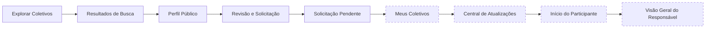
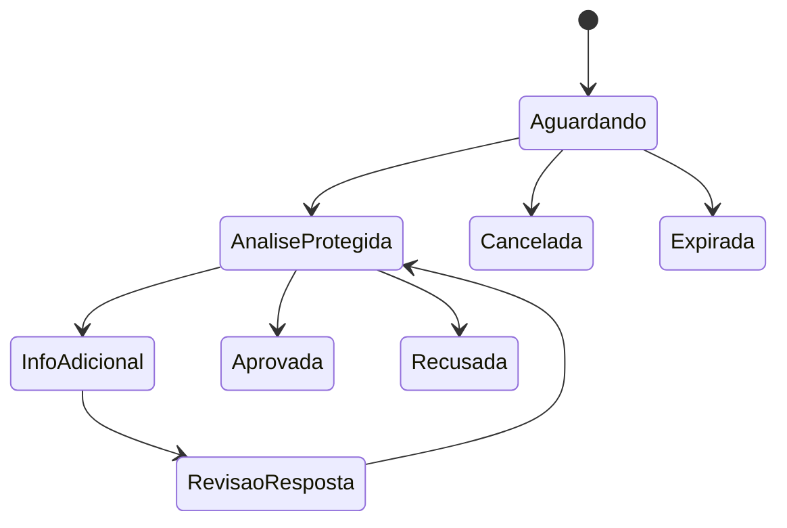

# Jornada Integrada do Coletivo

## 1. Perspectivas

A vista separa Pessoa que descobre ou solicita, participante com vínculo, responsável que atua em nome do Coletivo, autoridade protegida limitada a uma decisão e Coletivo como entidade governada.

## 2. Espinha dorsal P0A



| Ordem | Superfície | Estado |
|---:|---|---|
| 1 | Explorar Coletivos | validada |
| 2 | Resultados de Busca | validada |
| 3 | Perfil Público | validado |
| 4 | Revisão e Solicitação | validada |
| 5 | Solicitação Pendente | validada |
| 6 | Meus Coletivos | não iniciado |
| 7 | Central de Atualizações | não iniciada |
| 8 | Início do Participante | reformulação não iniciada |
| 9 | Visão Geral do Responsável | não iniciada |

## 3. Descoberta e busca — 5

- [Origem da descoberta](../assets/wireframes/uxa-060-collective-discovery-origin-mobile.svg)
- [Explorar](../assets/wireframes/uxa-060-collective-explore-mobile.svg)
- [Filtros](../assets/wireframes/uxa-060-collective-search-filters-mobile.svg)
- [Resultados](../assets/wireframes/uxa-060-collective-search-results-mobile.svg)
- [Sem resultados](../assets/wireframes/uxa-060-collective-search-no-results-mobile.svg)

## 4. Perfil Público — 4

- [Entrada aberta](../assets/wireframes/uxa-062-collective-public-profile-open-entry-mobile.svg)
- [Entrada sujeita a aprovação](../assets/wireframes/uxa-062-collective-public-profile-approval-entry-mobile.svg)
- [Entrada protegida](../assets/wireframes/uxa-062-collective-public-profile-protected-mobile.svg)
- [Entrada fechada](../assets/wireframes/uxa-062-collective-public-profile-closed-entry-mobile.svg)

## 5. Revisão e participação — 5

- [Revisão para entrada aberta](../assets/wireframes/uxa-064-collective-participation-open-entry-review-mobile.svg)
- [Entrada aberta confirmada](../assets/wireframes/uxa-064-collective-participation-open-entry-confirmed-mobile.svg)
- [Revisão para solicitação](../assets/wireframes/uxa-064-collective-participation-approval-request-review-mobile.svg)
- [Comprovante da solicitação](../assets/wireframes/uxa-064-collective-participation-approval-request-receipt-mobile.svg)
- [Revisão de convite protegido](../assets/wireframes/uxa-064-collective-participation-protected-invite-review-mobile.svg)

## 6. Solicitação Pendente — 8



- [Aguardando decisão](../assets/wireframes/uxa-066-collective-pending-request-awaiting-decision-mobile.svg)
- [Análise protegida](../assets/wireframes/uxa-066-collective-pending-request-protected-analysis-mobile.svg)
- [Informação adicional solicitada](../assets/wireframes/uxa-066-collective-pending-request-additional-information-required-mobile.svg)
- [Revisão da informação adicional](../assets/wireframes/uxa-066-collective-pending-request-additional-information-review-mobile.svg)
- [Aprovada](../assets/wireframes/uxa-066-collective-pending-request-approved-mobile.svg)
- [Recusada](../assets/wireframes/uxa-066-collective-pending-request-refused-mobile.svg)
- [Cancelada](../assets/wireframes/uxa-066-collective-pending-request-cancelled-mobile.svg)
- [Expirada](../assets/wireframes/uxa-066-collective-pending-request-expired-mobile.svg)

## 7. Perspectiva do responsável

```text
representação e autoridade
→ momento coletivo
→ solicitações e vínculos
→ comunicação oficial
→ atividades e decisões
→ proteção e moderação
→ relações institucionais
→ evidências e responsabilidades
```

A sequência está programada, mas não possui cobertura visual suficiente. O [wireframe anterior de Início do Coletivo](../assets/wireframes/uxa-016-collective-home-mobile.svg) é referência materializada e validada, com reformulação de continuidade ainda pendente.

## 8. Autoridade e dados

| Evento | Quem inicia | Quem decide | Visibilidade da Organização apoiadora |
|---|---|---|---|
| solicitação | Pessoa | autoridade protegida | nenhum dado individual sem autorização |
| pedido adicional | autoridade protegida | Pessoa decide responder | somente agregado autorizado |
| aprovação | autoridade protegida | Coletivo governa vínculo | estado agregado quando permitido |
| recusa | autoridade protegida | decisão limitada ao processo | nenhum motivo individual por padrão |
| denúncia | Pessoa ou participante | processo de proteção | somente evidência necessária e autorizada |

## 9. Lacunas

As quatro lacunas P0A impedem declarar a jornada de Coletivos completa. Também permanecem pendentes superfícies de moderação, atividades, reputação contextual, comunicação recorrente e relações institucionais.
