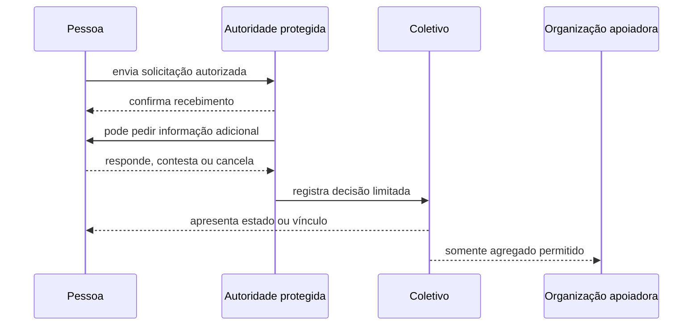

# Handoffs entre Participantes

## 1. Regra

Handoff é a transferência explícita da próxima responsabilidade ou decisão. Ele não transfere identidade, propriedade, autoridade geral nem acesso irrestrito a dados.

## 2. Matriz principal

| Origem | Destino | Evento | Autoridade | Dados que cruzam | Retorno seguro |
|---|---|---|---|---|---|
| visitante público | Pessoa autenticada | entrada protegida | Pessoa | credencial mínima | voltar à página pública |
| Pessoa | autoridade protegida | solicitação | Pessoa autoriza envio | dados declarados para a finalidade | cancelar quando permitido |
| autoridade protegida | Pessoa | pedido adicional | autoridade limitada | pergunta e razão | responder parcialmente, contestar ou cancelar |
| autoridade protegida | Coletivo | aprovação | autoridade do processo | estado e vínculo mínimo | revisão conforme regras |
| Coletivo | Pessoa | comunicação oficial | papel autorizado | conteúdo pertinente ao vínculo | silenciar, contestar ou sair |
| Organização | Coletivo | proposta de relação | representante institucional | finalidade, compromissos e recursos | negociar, recusar ou encerrar |
| Coletivo | Organização | consentimento bilateral | autoridade coletiva legítima | aceite e condições | revisar ou encerrar |
| Organização | Pessoa | oportunidade | Organização identificada | condições públicas | ignorar ou denunciar |
| anunciante | Guivos Ads | campanha | representante autorizado | orçamento, objetivo e criativo | pausar ou encerrar |
| Guivos Ads | Pessoa | exposição patrocinada | contrato comercial | conteúdo identificado | ocultar, reduzir ou denunciar |

## 3. Solicitação de participação

## 4. Visibilidade por perspectiva

| Informação | Pessoa | Coletivo/autoridade | Organização apoiadora |
|---|---|---|---|
| conteúdo da própria solicitação | integral | necessário ao processo | não |
| motivo interno protegido | resumo permitido | conforme papel | não |
| estado da solicitação | sim | sim | apenas agregado, quando autorizado |
| dados de outros solicitantes | não | conforme necessidade operacional | não |
| métricas agregadas | quando aplicável | sim | somente escopo contratado |
| dados pessoais para publicidade | não por padrão | não | não |

## 5. Falhas que esta vista deve revelar

- decisão sem autoridade;
- dado individual atravessando fronteira indevida;
- ação sem retorno ou contestação;
- estado assíncrono sem prazo ou explicação;
- aprovação confundida com função ou poder;
- patrocínio confundido com direção;
- transição necessária sem superfície materializada.
