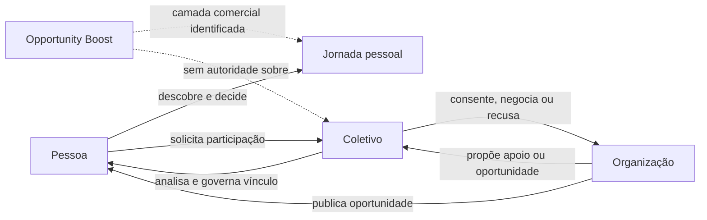

# Jornadas Integradas

## 1. Como usar esta seção

Esta seção é uma camada documental de leitura. Selecione uma perspectiva, percorra o mapa, consulte os artefatos e verifique as lacunas antes de considerar uma jornada completa.

| Perspectiva | Vista |
|---|---|
| Pessoa | [Jornada da Pessoa](person.md) |
| Coletivo e responsável | [Jornada do Coletivo](collective.md) |
| Organização | [Jornada da Organização](organization.md) |
| Troca de responsabilidade | [Handoffs](handoffs.md) |
| Execução documental de situações | [Cenários](scenarios.md) |
| Ausências e falhas de continuidade | [Lacunas](gaps.md) |
| Todos os SVGs existentes | [Catálogo de Telas](screen-catalog.md) |

## 2. Mapa integrado de alto nível

## 3. Estado de cobertura

| Área | Materialização visual | Validação funcional | Lacuna principal |
|---|---:|---:|---|
| continuidade pessoal diretamente relacionada | 17 | 17 | continuidade recorrente completa ainda não mapeada |
| Coletivos | 22 | 22 | `Meus Coletivos` e gestão recorrente |
| Organização | referências parciais | referências validadas | matriz institucional completa |
| Opportunity Boost | 46 | 36 | 10 estados residuais |
| seção integrada | materializada pela UXA-071 | pendente | UXA-072 |

O repositório possui **97 SVGs físicos catalogados**. Esse número não significa que todas as jornadas estejam completas.

## 4. Maturidade

| Estado | Leitura |
|---|---|
| contratado | responsabilidade definida |
| programado | previsto em programa governado |
| materializado | referência específica existente |
| validado | referência examinada funcionalmente |
| reformulação pendente | referência existente com correção necessária |
| não iniciado | responsabilidade conhecida sem materialização |
| bloqueado | dependência ou decisão impede avanço |
| supersedido | substituído por referência posterior |
| arquivado | mantido somente como histórico |
| indeterminado | evidência insuficiente |

## 5. Regra de autoridade

O mapa não é fonte canônica. Em caso de divergência, prevalecem contratos funcionais, programas governados, wireframes de origem, validações funcionais e o Registro do Estado Atual.

Nenhuma seta é válida apenas por proximidade visual ou sequência numérica.

## 6. Limite da simulação

Nesta seção, simular significa percorrer uma sequência documental, alternar perspectivas e localizar decisões, gates e lacunas.

Não significa executar produto, testar usabilidade, gerar comportamento por IA ou preencher ausências por inferência.
