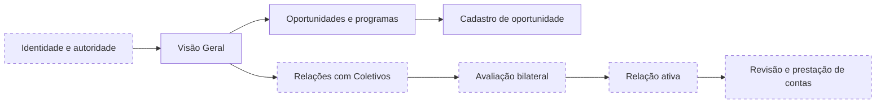

# Jornada Integrada da Organização

## 1. Perspectivas

A Organização é uma entidade institucional. A Pessoa que a representa exerce somente a autoridade do papel, da unidade e da finalidade apresentados.

## 2. Mapa institucional atual



A Visão Geral e o cadastro de oportunidade possuem referências. Os demais nós permanecem contratuais, programados ou sem materialização suficiente.

## 3. Referências existentes

- [Visão Geral da Organização](../assets/wireframes/uxa-015-organization-overview-desktop.svg) — materializada e validada por UXA-015 e UXA-017.
- [Cadastro de oportunidade](../assets/wireframes/uxa-008-organization-opportunity-registration-desktop.svg) — materializado e validado por UXA-008 e UXA-013.

## 4. Relação Organização–Coletivo

```text
rascunho
→ proposta
→ avaliação bilateral
→ negociação
→ aprovação pelas duas autoridades
→ relação ativa
→ revisão
→ renovação, ajuste, pausa ou encerramento
```

Cada transição deve registrar finalidade, compromissos, recursos, dados compartilhados, autoridades, autonomia, contestação, reversibilidade e saída.

A relação não concede propriedade, direção do Coletivo ou acesso automático a dados de Pessoas.

## 5. Oportunidades

A Organização pode criar uma oportunidade, mas publicação não garante distribuição, conversão ou avanço humano.

Handoffs mínimos:

1. representante institucional confirma autoridade;
2. Organização registra finalidade, público e condições;
3. oportunidade passa por validações aplicáveis;
4. Pessoa visualiza origem e condições;
5. eventual candidatura ou participação segue contrato próprio.

## 6. Opportunity Boost

Opportunity Boost é uma sobreposição comercial identificada operada economicamente pela Guivos Ads. A Organização anunciante pode financiar exposição, mas não pode comprar relevância orgânica, reputação, legitimidade, aprovação de participação ou autoridade sobre Pessoas e Coletivos.

## 7. Cobertura e lacunas

| Área institucional | Estado |
|---|---|
| Visão Geral | materializada e validada |
| cadastro de oportunidade | materializado e validado |
| identidade, unidade e autoridade | parcialmente contratada; mapa visual incompleto |
| relação bilateral com Coletivo | contratada; fluxo visual ausente |
| campanhas e patrocínios | cobertura parcial pelo Opportunity Boost |
| dados agregados e resultados | cobertura parcial; fronteiras precisam ser verificadas |
| prestação de contas | não possui jornada visual completa |
| saída e encerramento | contratados em princípio; materialização ausente |

Não há evidência para declarar cobertura visual institucional completa.
