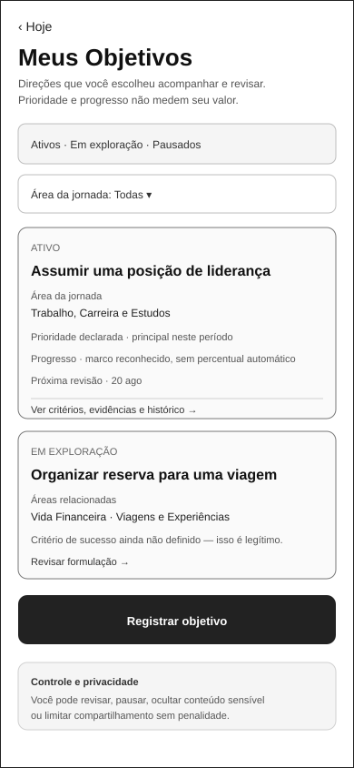
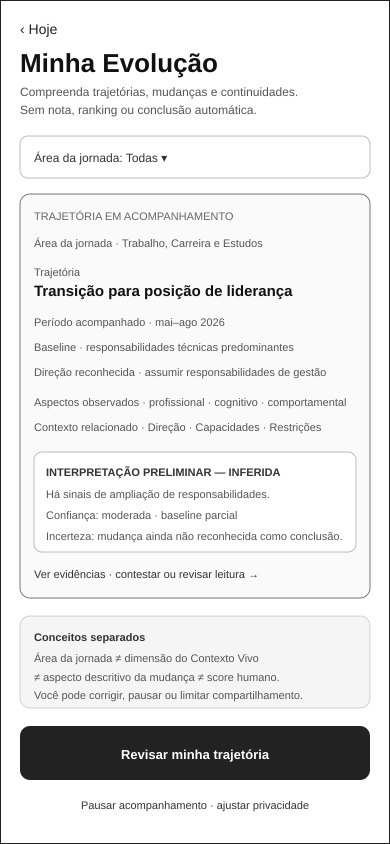

# Jornada Integrada da Pessoa

## 1. Início protegido e compreensão inicial

```text
Home pública
→ entrada protegida
→ escolha de modalidade
→ expressão guiada
→ inventário e autorização
→ processamento visível
→ compreensão inicial revisável
→ TRN-007 integralmente validada
→ primeira Tela Hoje
→ experiência recorrente e continuidades autorizadas
```

A UXA-097 valida integralmente `PER-007 → PER-008`. A primeira variante de Hoje não presume avanço, mudança anterior, urgência ou conteúdo comercial e usa somente condição confirmada, autorizada e vigente.

A jornada completa permanece `draft`: `TRN-001`, `TRN-003`, `TRN-004` e `TRN-005` ainda não estão validadas ponta a ponta.

## 2. Eixo de Domínios de Evolução

A D4 propaga para esta vista o vocabulário canônico de `PAS-001-DOMAIN-MODEL-001` e a reconciliação de `PAS-001-DOMAIN-RECON-001`.

A Jornada da Pessoa é lida em dois eixos simultâneos:

```text
como a jornada acontece
×
sobre qual área da vida/evolução a jornada está tratando
```

| ID | Domínio | Exemplos de contexto da Pessoa |
|---|---|---|
| `JED-001` | Saúde e Bem-estar | hábitos, atividade física, sono, alimentação, autocuidado, prevenção, qualidade de vida |
| `JED-002` | Trabalho, Carreira e Estudos | emprego, recolocação, carreira, cursos, estudos, competências, certificações, liderança |
| `JED-003` | Vida Financeira | orçamento, reserva, renda, dívida, planejamento e organização financeira |
| `JED-004` | Empreendedorismo e Projetos | ideia, negócio, projeto pessoal, validação, parceiros e execução |
| `JED-005` | Relacionamentos e Vida Social | família, amizades, convivência, pertencimento e novas conexões |
| `JED-006` | Espiritualidade, Propósito e Valores | fé, espiritualidade, propósito, valores, reflexão e comunidade escolhida |
| `JED-007` | Viagens, Lazer, Cultura e Novas Experiências | viagens, hobbies, cultura, lazer, eventos e experiências desejadas |
| `JED-008` | Causas, Voluntariado e Contribuição | voluntariado, causas, participação comunitária, contribuição e serviço |
| `JED-009` | Organização e Equilíbrio da Vida | rotina, prioridades, tempo, equilíbrio e reorganização após mudanças |

Uma leitura semântica possível é:

```text
Pessoa
→ Momento Atual
→ domínio declarado/candidato
→ Direção
→ Objetivo
→ Próximo Passo
→ Oportunidades compatíveis e relevantes
→ Experiência
→ Evidências legítimas
→ Evolução reconhecida pelo participante
```

O domínio pode aparecer antes, durante ou depois da formulação de um Objetivo. A Pessoa não deverá ser obrigada a classificar seu relato para continuar quando a capacidade aplicável não exigir essa classificação.

Multidomínio é legítimo. `Ainda estou descobrindo` permanece estado legítimo de exploração e não constitui `JED-010`; `other_unmapped` preserva área ainda não representada adequadamente.

Regras desta vista:

- `domain_link` pode ser `0..n`, temporal e revisável;
- domínio candidato não equivale a domínio confirmado;
- domínio não é identidade permanente, diagnóstico, score, prioridade humana ou prova de evolução;
- saúde, espiritualidade, finanças e outros contextos sensíveis preservam finalidade, autoridade e proteção próprias;
- plano pago, patrocínio ou oferta comercial não altera domínio nem relevância funcional;
- D5-A e D5-B materializam o eixo em superfícies existentes;
- D5-C1 contrata Objetivos, Próximos Passos e Evolução;
- D5-C2 materializa um estado-base low-fidelity para cada uma dessas três responsabilidades;
- D5-C3 reforma e valida funcionalmente esses três estados-base no limite local, sem promover seus handoffs.

## 3. Direção, movimento e evolução a partir de Hoje

A estrutura governada é:

```text
PER-008 — Hoje
├── TRN-008 → PER-010 — Meus Objetivos
│   └── TRN-009 → PER-008
├── TRN-010 → PER-011 — Meus Próximos Passos
│   └── TRN-011 → PER-008
└── TRN-012 → PER-012 — Minha Evolução
    └── TRN-013 → PER-008
```

A D5-C2 materializa e a D5-C3 reforma/valida localmente:

- `PER-010` em `d5-c2-person-objectives-mobile.svg`;
- `PER-011` em `d5-c2-person-next-steps-mobile.svg`;
- `PER-012` em `d5-c2-person-evolution-mobile.svg`.

As três superfícies possuem **validação funcional local vigente** e `TRN-008..013` permanecem **contratadas**.

### 3.1 PER-010 — Meus Objetivos

`PER-010` governa compreensão, organização e controle dos objetivos da Pessoa. Após D5-C3, o estado-base explicita estado funcional, prioridade declarada, Área da jornada, progresso qualitativo, revisão, critérios/evidências e controles de privacidade, sem percentual automático de progresso.

```text
Domínio de Evolução
≠ Objetivo
≠ prioridade
≠ critério de sucesso
≠ progresso
```

Área da jornada permanece distinta de dimensão estrutural do Contexto Vivo. Prioridade declarada não representa valor humano, obrigação ou urgência automática.



### 3.2 PER-011 — Meus Próximos Passos

`PER-011` governa movimentos contextuais, não uma lista coercitiva de tarefas. Após D5-C3, o estado-base distingue `PRONTO` de `PROPOSTO`, explicita prontidão/dependência e origem da proposta, e utiliza ações coerentes com cada estado.

```text
domínio relacionado
≠ obrigação
≠ urgência
≠ prontidão
≠ execução
≠ prova de evolução
```

Uma sugestão da Guivos não constitui decisão da Pessoa. Períodos sem Próximos Passos ativos são legítimos.


### 3.3 PER-012 — Minha Evolução

`PER-012` governa compreensão e controle de trajetórias, mudanças, continuidades, evidências, confiança, incerteza, interpretações e contestações.

Após D5-C3, o estado-base torna explícitos período, baseline, direção, natureza inferida da interpretação, confiança, incerteza e possibilidade de contestação/revisão.

```text
Domínio de Evolução
≠ dimensão estrutural do Contexto Vivo
≠ aspecto descritivo da mudança
≠ trajetória
≠ score
```

`Minha Evolução` não é roda da vida obrigatória, ranking, percentual global da Pessoa, diagnóstico ou avaliação espiritual. Inferência permanece visualmente distinta de fato confirmado.



### 3.4 Papel de Hoje

`PER-008` permanece síntese recorrente, não dashboard completo das três capacidades.

```text
Hoje sintetiza
→ direção atual, quando relevante
→ movimento atual, quando relevante
→ mudança ou continuidade relevante, quando legítima

superfícies especializadas
→ aprofundam e oferecem controle
```

A existência e validação local dos três SVGs não exige três cards permanentes em Hoje e não autoriza exposição sensível por padrão.

### 3.5 Handoffs não contratados e não validados

Não existem handoffs diretos governados entre `PER-010`, `PER-011` e `PER-012`. Relação semântica entre Objetivo, Próximo Passo e Evolução não é evidência suficiente de necessidade de navegação direta.

`TRN-008..013` permanecem contratadas. O rótulo `‹ Hoje` não valida payload/contexto, retorno, interrupção, concorrência, idempotência ou revalidação de autorização.

## 4. Descoberta de oportunidades e saída consciente

A UXA-098 fecha a continuidade entre descoberta territorial e Detalhe; a UXA-101 fecha V4 até a fronteira externa:

```text
PER-201 — Mapa
↔ TRN-210 — mesma consulta
→ PER-202 — Lista territorial

PER-201 → TRN-204 → PER-203 — Detalhe
PER-202 → TRN-211 → PER-203 — Detalhe

PER-203
→ “Ver como participar”
→ estado de revisão de saída em PER-203
→ confirmar destino/responsável/dados e limites
→ TRN-205
→ BND-001 — autoridade externa
```

Regras integradas:

- Mapa e Lista preservam contexto, busca, filtros, seleção e permissões aplicáveis;
- Mapa e Lista conduzem à mesma oportunidade lógica em `PER-203`;
- abrir Detalhe não equivale a interesse, inscrição, recomendação ou evolução;
- `Ver como participar` abre revisão dentro de `PER-203` antes da saída;
- continuar exige ação afirmativa e revalidação do destino conhecido/autorizado;
- `Voltar ao detalhe` é caminho legítimo sem penalidade;
- alcançar `BND-001` transfere autoridade ao terceiro; a Guivos não presume resultado externo.

Referência visual revalidada pela UXA-101:


## 5. Planos como etapa transversal canônica

A UXA-100-A3 registra Planos e a UXA-100-A4 fecha a identidade documental da origem voluntária:

```text
PER-009 — Conta e configurações
├── TRN-406 → PER-301 — Planos e comparação
│   ├── TRN-401 → PER-302 — revisão de contratação
│   │   └── TRN-402 → PER-304 — resultado/recuperação
│   │       └── TRN-405 → PER-301
│   ├── TRN-403 → PER-303 — downgrade/cancelamento
│   │   └── TRN-404 → PER-304
│   │       └── TRN-405 → PER-301
│   └── TRN-407 → PER-009 — retorno sem alteração de plano
```

`TRN-401..405` permanecem localmente validadas. `TRN-406/407` permanecem contratadas porque `PER-009` ainda não possui materialização visual própria.

Abrir Planos não seleciona plano, inicia cobrança, consome cota ou amplia consentimento. Pagamento não altera relevância, confiança, posição orgânica nem garantia de evolução.

## 6. Pessoa em Coletivos

```text
Explorar Coletivos
→ Resultados de Busca
→ Perfil Público
→ Revisão e Solicitação
→ Solicitação Pendente
→ resultado aprovado
→ Meus Coletivos
→ Central de Atualizações
→ Início do Participante
```

| Etapa | Maturidade | Referência | Continuidade integrada |
|---|---|---|---|
| descoberta e busca | validado | UXA-060/061 | parcial |
| Perfil Público | validado | UXA-062/063 | parcial |
| revisão e solicitação | validado | UXA-064/065 | parcial |
| Solicitação Pendente | validado | UXA-066/067/092 | TRN-105/106/107/109; TRN-108 |
| Meus Coletivos | validado | UXA-091/092/094 | TRN-108 e TRN-110 integrais |
| Central de Atualizações | validado | UXA-093/094/095/096 | TRN-110 e TRN-111 integrais |
| Início do Participante | validado | UXA-095/096 | TRN-111 integral |

## 7. Proteções preservadas

- conclusão da compreensão inicial não equivale a avanço humano;
- personalização não é condição para acessar Hoje;
- abrir Meus Objetivos não cria, confirma ou prioriza objetivo;
- abrir Meus Próximos Passos não inicia, aceita ou conclui movimento;
- abrir Minha Evolução não presume mudança, progresso ou evolução reconhecida;
- conteúdo sensível nas três superfícies especializadas exige minimização e controle;
- oportunidade publicada não é automaticamente recomendada;
- proximidade não equivale a relevância;
- patrocínio e plano pago não compram relevância funcional;
- abrir Planos voluntariamente não cria intenção de compra;
- sair para ambiente externo não amplia consentimento nem transfere a jornada pessoal por padrão;
- compartilhar pouco permanece legítimo;
- mesmo domínio entre Pessoa, Coletivo e Organização não cria match, recomendação ou compartilhamento automático.

## 8. Estado da vista

Esta vista permanece `draft` porque:

- `TRN-001`, `TRN-003`, `TRN-004` e `TRN-005` ainda são parciais;
- `PER-010`, `PER-011` e `PER-012` estão validados localmente, mas `TRN-008..013` permanecem contratadas;
- as transições comerciais internas de Planos são locais e não representam cobrança ponta a ponta;
- `PER-009` ainda não possui materialização própria e `TRN-406/407` permanecem contratadas;
- estados P0B adicionais permanecem separados;
- áreas internas especializadas a partir de `PER-108` não foram validadas como conjunto;
- outras continuidades da jornada pessoal ainda não foram examinadas ponta a ponta.

`TRN-205` não é motivo de `draft`: a UXA-101 a valida integralmente até `BND-001`, sem validar o processo externo posterior.

## 9. Estado atual

V1, V2, V3 e V4 estão encerradas nos respectivos limites documentais. D4 torna `JED-001..JED-009`, multidomínio, `Ainda estou descobrindo` e `other_unmapped` explícitos nesta vista. D5-A/B materializam o eixo em superfícies existentes; D5-C1 contrata `PER-010..012` e `TRN-008..013`; D5-C2 materializa as três superfícies em low-fidelity; D5-C3 reforma e valida localmente os três SVGs, mantendo os seis handoffs como gate posterior separado.

V5/UXA-102, D6, D7 e Engenharia de Produto não foram iniciados automaticamente.