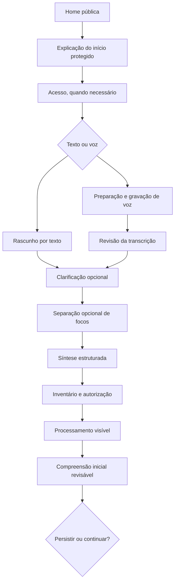
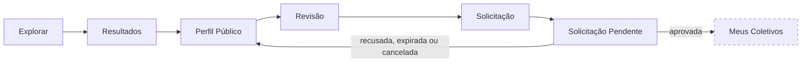

# Jornada Integrada da Pessoa

## 1. Perspectivas

A Pessoa pode aparecer como visitante público, pessoa autenticada, solicitante, participante de Coletivo ou representante autorizado. A mudança de papel não cria outra identidade nem concede autoridade automática.

## 2. Início protegido e compreensão

### 2.1 Nós principais

| Nó | Maturidade | Autoridade | Gate |
|---|---|---|---|
| Home pública | materializado e validado | UXA-020 a UXA-022 | nenhum |
| início protegido | materializado e validado | UXA-023; UXA-034; UXA-035 | acesso quando necessário |
| expressão guiada | materializada e validada | UXA-068; UXA-069 | escolha consciente |
| inventário e autorização | materializado e validado | UXA-034; UXA-035 | autorização específica |
| processamento | materializado e validado | UXA-036; UXA-037 | base suficiente |
| compreensão inicial | materializada e validada | UXA-036; UXA-037 | revisão pela Pessoa |
| Tela Hoje | materializada e validada | UXA-002; UXA-006; UXA-010 | continuidade autorizada |

### 2.2 Artefatos diretamente relacionados

#### Início protegido — 4

- [Explicação](../assets/wireframes/uxa-034-protected-entry-explanation-mobile.svg)
- [Acesso](../assets/wireframes/uxa-034-protected-entry-access-mobile.svg)
- [Revisão](../assets/wireframes/uxa-034-protected-entry-review-mobile.svg)
- [Compartilhamento e autorização](../assets/wireframes/uxa-034-protected-entry-sharing-mobile.svg)

#### Expressão guiada — 8

- [Orientação](../assets/wireframes/uxa-068-guided-current-moment-orientation-mobile.svg)
- [Rascunho por texto](../assets/wireframes/uxa-068-guided-current-moment-text-draft-mobile.svg)
- [Preparação para voz](../assets/wireframes/uxa-068-guided-current-moment-voice-preparation-mobile.svg)
- [Gravação](../assets/wireframes/uxa-068-guided-current-moment-voice-recording-mobile.svg)
- [Revisão da transcrição](../assets/wireframes/uxa-068-guided-current-moment-voice-transcription-review-mobile.svg)
- [Clarificação adaptativa](../assets/wireframes/uxa-068-guided-current-moment-adaptive-clarification-mobile.svg)
- [Separação de focos](../assets/wireframes/uxa-068-guided-current-moment-focus-separation-mobile.svg)
- [Síntese estruturada](../assets/wireframes/uxa-068-guided-current-moment-structured-summary-mobile.svg)

#### Compreensão inicial — 5

- [Processamento](../assets/wireframes/uxa-036-initial-understanding-processing-mobile.svg)
- [Apresentação](../assets/wireframes/uxa-036-initial-understanding-presentation-mobile.svg)
- [Revisão](../assets/wireframes/uxa-036-initial-understanding-review-mobile.svg)
- [Base insuficiente](../assets/wireframes/uxa-036-initial-understanding-insufficient-basis-mobile.svg)
- [Decisão](../assets/wireframes/uxa-036-initial-understanding-decision-mobile.svg)

### 2.3 Âncoras

- [Home pública](../assets/wireframes/uxa-022-public-home-desktop.svg)
- [Tela Hoje](../assets/wireframes/uxa-006-hoje-mobile.svg)

## 3. Pessoa em Coletivos

`Meus Coletivos` é uma lacuna conhecida. A seta representa necessidade contratada, não tela existente.

## 4. Proteções

- compartilhar pouco não é falha;
- digitar não solicita análise;
- gravar autoriza apenas a operação apresentada;
- transcrição automática não é declaração confirmada;
- pergunta adicional é opcional;
- síntese não substitui fonte;
- solicitação não é aprovação;
- aprovação não concede função ou autoridade automática;
- cancelamento, recusa e expiração são eventos distintos.

## 5. Lacunas da perspectiva da Pessoa

| Lacuna | Impacto |
|---|---|
| `Meus Coletivos` | impede continuidade após aprovação |
| Central de Atualizações | fragmenta comunicações e mudanças relevantes |
| Início do Participante | deixa o vínculo sem entrada recorrente reformulada |
| continuidade após compreensão inicial | requer mapa mais amplo entre Tela Hoje, oportunidades e jornadas |
| preferências e saída | precisam aparecer de forma consistente em todas as famílias |
